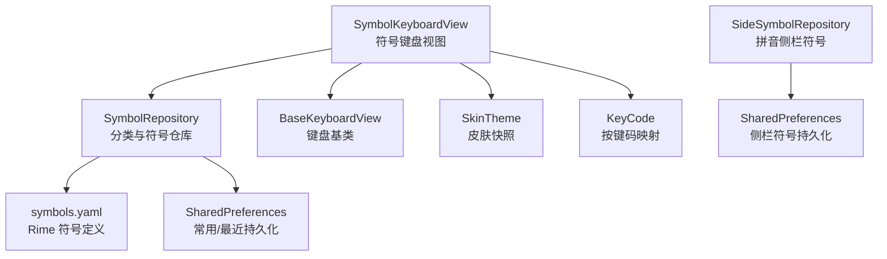
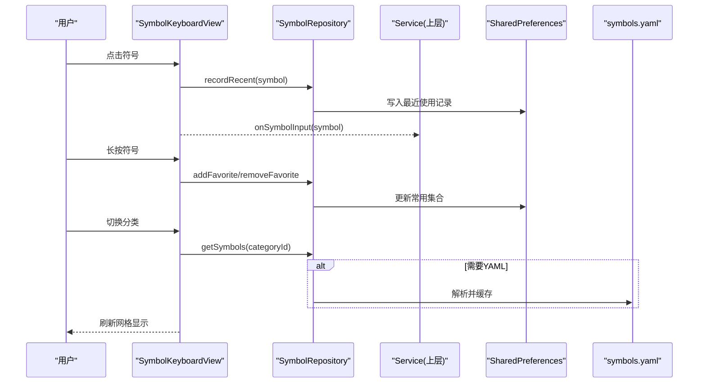
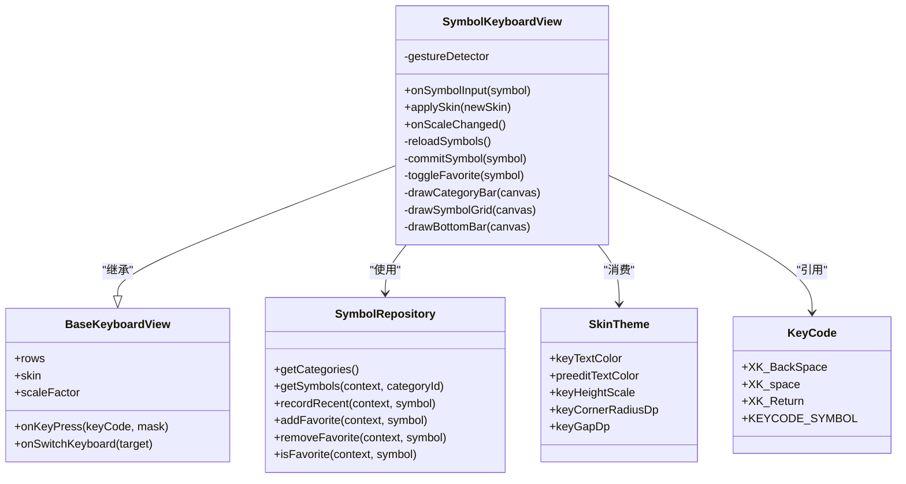
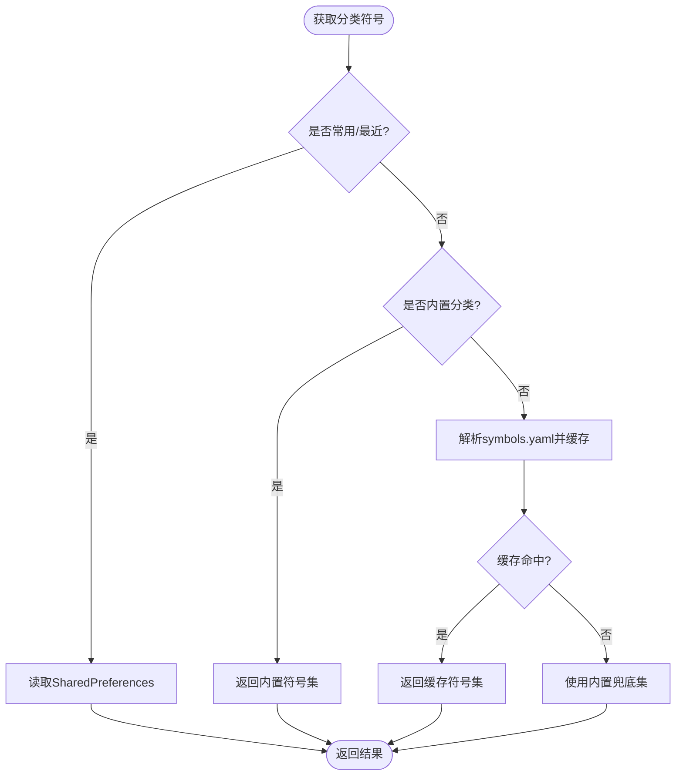
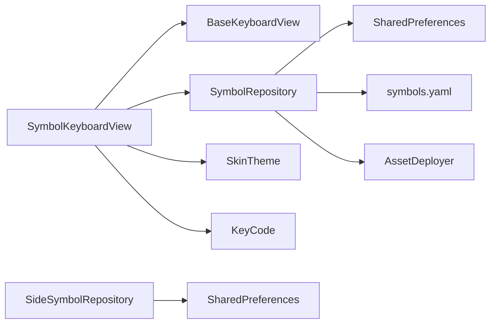

# 符号键盘

<cite>
**本文引用的文件**   
- [SymbolKeyboardView.kt](file://app/src/main/java/com/ziyou/ime/ime/SymbolKeyboardView.kt)
- [SymbolCategory.kt](file://app/src/main/java/com/ziyou/ime/data/SymbolCategory.kt)
- [SideSymbol.kt](file://app/src/main/java/com/ziyou/ime/data/SideSymbol.kt)
- [symbols.yaml](file://app/src/main/assets/rime/symbols.yaml)
- [BaseKeyboardView.kt](file://app/src/main/java/com/ziyou/ime/ime/BaseKeyboardView.kt)
- [SkinTheme.kt](file://app/src/main/java/com/ziyou/ime/skin/SkinTheme.kt)
- [KeyCode.kt](file://app/src/main/java/com/ziyou/ime/ime/KeyCode.kt)
</cite>

## 目录
1. [引言](#引言)
2. [项目结构](#项目结构)
3. [核心组件](#核心组件)
4. [架构总览](#架构总览)
5. [详细组件分析](#详细组件分析)
6. [依赖关系分析](#依赖关系分析)
7. [性能考量](#性能考量)
8. [故障排查指南](#故障排查指南)
9. [结论](#结论)
10. [附录：扩展与使用示例](#附录扩展与使用示例)

## 引言
本技术文档围绕“符号键盘”展开，系统性阐述 SymbolKeyboardView 的设计与实现，包括符号分类体系、SideSymbol 数据模型、SymbolCategory 分类管理、布局设计（常用/最近/中文/英文/括号及 YAML 驱动的分类）、交互流程（点击上屏、长按收藏、返回键切换、退格长按连续删除）、主题适配与触摸优化。同时给出导入导出机制、批量操作思路与用户偏好设置建议，并提供添加新分类、自定义符号面板与管理符号库文件的实践指引。

## 项目结构
符号键盘相关代码主要分布在以下位置：
- 视图层：SymbolKeyboardView.kt（符号键盘主视图）
- 数据层：SymbolCategory.kt（分类与仓库）、SideSymbol.kt（侧栏符号仓库）
- 资源层：symbols.yaml（Rime 符号定义）
- 基类与主题：BaseKeyboardView.kt（键盘基类）、SkinTheme.kt（皮肤快照）
- 按键码映射：KeyCode.kt（X11 keysym 与软键盘自定义码）

图表来源
- [SymbolKeyboardView.kt:1-120](file://app/src/main/java/com/ziyou/ime/ime/SymbolKeyboardView.kt#L1-L120)
- [SymbolCategory.kt:35-180](file://app/src/main/java/com/ziyou/ime/data/SymbolCategory.kt#L35-L180)
- [SideSymbol.kt:27-94](file://app/src/main/java/com/ziyou/ime/data/SideSymbol.kt#L27-L94)
- [BaseKeyboardView.kt:43-120](file://app/src/main/java/com/ziyou/ime/ime/BaseKeyboardView.kt#L43-L120)
- [SkinTheme.kt:21-110](file://app/src/main/java/com/ziyou/ime/skin/SkinTheme.kt#L21-L110)
- [KeyCode.kt:13-110](file://app/src/main/java/com/ziyou/ime/ime/KeyCode.kt#L13-L110)

章节来源
- [SymbolKeyboardView.kt:1-120](file://app/src/main/java/com/ziyou/ime/ime/SymbolKeyboardView.kt#L1-L120)
- [SymbolCategory.kt:35-180](file://app/src/main/java/com/ziyou/ime/data/SymbolCategory.kt#L35-L180)
- [SideSymbol.kt:27-94](file://app/src/main/java/com/ziyou/ime/data/SideSymbol.kt#L27-L94)
- [BaseKeyboardView.kt:43-120](file://app/src/main/java/com/ziyou/ime/ime/BaseKeyboardView.kt#L43-L120)
- [SkinTheme.kt:21-110](file://app/src/main/java/com/ziyou/ime/skin/SkinTheme.kt#L21-L110)
- [KeyCode.kt:13-110](file://app/src/main/java/com/ziyou/ime/ime/KeyCode.kt#L13-L110)

## 核心组件
- SymbolKeyboardView：符号键盘视图，纯 Canvas 绘制，左侧分类栏 + 右侧网格区 + 底部功能栏；支持滚动、点击上屏、长按收藏、退格长按连续删除。
- SymbolRepository：分类与符号数据仓库，提供「常用」「最近」与内置分类（中文/英文/括号），以及从 symbols.yaml 解析的数学/序号/箭头/货币/星号/几何/单位等分类；YAML 仅首次解析并缓存。
- SideSymbolRepository：拼音侧栏符号仓库，基于 SharedPreferences + JSON 持久化，提供默认集合与增删改查。
- BaseKeyboardView：键盘视图基类，统一绘制、触摸、皮肤、缩放、按键回调等能力。
- SkinTheme：运行时皮肤快照，集中颜色、尺寸、字体、阴影等参数，供各键盘视图消费。
- KeyCode：Android KeyEvent 到 Rime X11 keysym 的映射，以及软键盘自定义码定义。

章节来源
- [SymbolKeyboardView.kt:17-120](file://app/src/main/java/com/ziyou/ime/ime/SymbolKeyboardView.kt#L17-L120)
- [SymbolCategory.kt:35-180](file://app/src/main/java/com/ziyou/ime/data/SymbolCategory.kt#L35-L180)
- [SideSymbol.kt:27-94](file://app/src/main/java/com/ziyou/ime/data/SideSymbol.kt#L27-L94)
- [BaseKeyboardView.kt:43-120](file://app/src/main/java/com/ziyou/ime/ime/BaseKeyboardView.kt#L43-L120)
- [SkinTheme.kt:21-110](file://app/src/main/java/com/ziyou/ime/skin/SkinTheme.kt#L21-L110)
- [KeyCode.kt:13-110](file://app/src/main/java/com/ziyou/ime/ime/KeyCode.kt#L13-L110)

## 架构总览
符号键盘采用“视图 - 数据仓库 - 资源”三层解耦：
- 视图层：SymbolKeyboardView 负责布局、绘制、手势与交互，通过回调将符号提交给上层 Service。
- 数据层：SymbolRepository 提供分类与符号列表，读取用户偏好（常用/最近）与 YAML 配置；SideSymbolRepository 管理侧栏符号。
- 资源层：symbols.yaml 作为符号源之一，被按需解析并缓存。

图表来源
- [SymbolKeyboardView.kt:496-517](file://app/src/main/java/com/ziyou/ime/ime/SymbolKeyboardView.kt#L496-L517)
- [SymbolCategory.kt:163-179](file://app/src/main/java/com/ziyou/ime/data/SymbolCategory.kt#L163-L179)
- [SymbolCategory.kt:234-279](file://app/src/main/java/com/ziyou/ime/data/SymbolCategory.kt#L234-L279)

## 详细组件分析

### SymbolKeyboardView 设计与实现
- 布局模型：左侧分类栏（可滚动）+ 右侧符号网格（5列，竖向滚动）+ 底部功能栏（返回/空格/退格/回车）。
- 绘制策略：仅绘制可见区域，命中检测通过坐标反算行列，避免逐格矩形缓存，降低内存压力。
- 交互逻辑：
  - 点击符号：记录最近使用并通过 onSymbolInput 回调提交。
  - 长按符号：在「常用」内移除，在其他分类加入「常用」。
  - 点击分类：切换网格内容并回到顶部。
  - 返回键：发送 KEYCODE_SYMBOL，由 Service 恢复进入前的键盘布局。
  - 退格长按：连续删除，节奏与基类一致。
- 主题适配：继承 BaseKeyboardView，复用皮肤画笔与缩放因子；自身画笔在 applySymbolPaints 中同步颜色与字号。
- 性能优化：网格只绘制可见行，文字自动缩放以适配单元宽度；数据经 SymbolRepository 内存缓存供给。

图表来源
- [SymbolKeyboardView.kt:47-120](file://app/src/main/java/com/ziyou/ime/ime/SymbolKeyboardView.kt#L47-L120)
- [BaseKeyboardView.kt:43-120](file://app/src/main/java/com/ziyou/ime/ime/BaseKeyboardView.kt#L43-L120)
- [SymbolCategory.kt:35-180](file://app/src/main/java/com/ziyou/ime/data/SymbolCategory.kt#L35-L180)
- [SkinTheme.kt:21-110](file://app/src/main/java/com/ziyou/ime/skin/SkinTheme.kt#L21-L110)
- [KeyCode.kt:13-110](file://app/src/main/java/com/ziyou/ime/ime/KeyCode.kt#L13-L110)

章节来源
- [SymbolKeyboardView.kt:17-120](file://app/src/main/java/com/ziyou/ime/ime/SymbolKeyboardView.kt#L17-L120)
- [SymbolKeyboardView.kt:257-351](file://app/src/main/java/com/ziyou/ime/ime/SymbolKeyboardView.kt#L257-L351)
- [SymbolKeyboardView.kt:353-467](file://app/src/main/java/com/ziyou/ime/ime/SymbolKeyboardView.kt#L353-L467)
- [SymbolKeyboardView.kt:496-517](file://app/src/main/java/com/ziyou/ime/ime/SymbolKeyboardView.kt#L496-L517)

### SymbolCategory 分类管理与数据仓库
- 分类体系：包含「常用」「最近」与内置分类（中文/英文/括号），以及 YAML 驱动的数学/序号/箭头/货币/星号/几何/单位等分类。
- 数据源优先级：
  - 用户数据：常用/最近，SharedPreferences 持久化。
  - 内置分类：高频标点，零加载成本。
  - YAML 分类：首次解析并全量缓存，失败回退内置兜底集。
- 性能：YAML 仅在首次访问时整体解析一次并缓存，之后零 IO。

图表来源
- [SymbolCategory.kt:163-179](file://app/src/main/java/com/ziyou/ime/data/SymbolCategory.kt#L163-L179)
- [SymbolCategory.kt:234-279](file://app/src/main/java/com/ziyou/ime/data/SymbolCategory.kt#L234-L279)

章节来源
- [SymbolCategory.kt:35-180](file://app/src/main/java/com/ziyou/ime/data/SymbolCategory.kt#L35-L180)
- [SymbolCategory.kt:234-279](file://app/src/main/java/com/ziyou/ime/data/SymbolCategory.kt#L234-L279)

### SideSymbol 数据模型与侧栏符号管理
- 数据模型：SideSymbol(display, value)，display 为展示文本，value 为上屏内容。
- 持久化：SharedPreferences + JSON 存储，提供默认集合与增删改查。
- 使用场景：九宫格拼音侧栏在无候选拼音时展示，便于快速上屏常用标点或短语。

章节来源
- [SideSymbol.kt:16-94](file://app/src/main/java/com/ziyou/ime/data/SideSymbol.kt#L16-L94)

### 符号资源 symbols.yaml
- 作用：Rime 符号定义，包含大量符号分类（如数学、序号、箭头、货币、星号、几何、单位等）。
- 解析方式：按单行数组匹配提取，无需完整 YAML 解析器；优先读取已部署目录，缺失时回退 assets。
- 兜底策略：单个分类解析失败不影响其他分类，整体失败使用内置兜底集。

章节来源
- [symbols.yaml:72-186](file://app/src/main/assets/rime/symbols.yaml#L72-L186)
- [SymbolCategory.kt:234-279](file://app/src/main/java/com/ziyou/ime/data/SymbolCategory.kt#L234-L279)

### 主题适配与触摸优化
- 主题适配：SkinTheme 提供颜色、尺寸、字体、阴影等参数；SymbolKeyboardView 在 applySymbolPaints 中同步画笔属性。
- 触摸优化：
  - 手势处理：GestureDetector 区分分类栏、网格区、底部功能栏。
  - 命中检测：坐标反算行列，不缓存逐格矩形，减少内存占用。
  - 视觉反馈：按下高亮、触觉反馈（HapticFeedbackConstants.KEYBOARD_TAP/LONG_PRESS）。
  - 长按连续：退格键长按重复触发，间隔与基类一致。

章节来源
- [SkinTheme.kt:21-110](file://app/src/main/java/com/ziyou/ime/skin/SkinTheme.kt#L21-L110)
- [SymbolKeyboardView.kt:353-467](file://app/src/main/java/com/ziyou/ime/ime/SymbolKeyboardView.kt#L353-L467)
- [BaseKeyboardView.kt:173-200](file://app/src/main/java/com/ziyou/ime/ime/BaseKeyboardView.kt#L173-L200)

## 依赖关系分析
- SymbolKeyboardView 依赖：
  - BaseKeyboardView：提供键盘基类能力（绘制、触摸、皮肤、缩放、回调）。
  - SymbolRepository：提供分类与符号数据、用户偏好读写。
  - SkinTheme：提供皮肤参数。
  - KeyCode：提供按键码常量。
- SymbolRepository 依赖：
  - SharedPreferences：常用/最近持久化。
  - symbols.yaml：符号资源解析。
  - AssetDeployer：读取已部署目录。
- SideSymbolRepository 依赖：
  - SharedPreferences：侧栏符号持久化。

图表来源
- [SymbolKeyboardView.kt:1-120](file://app/src/main/java/com/ziyou/ime/ime/SymbolKeyboardView.kt#L1-L120)
- [SymbolCategory.kt:35-180](file://app/src/main/java/com/ziyou/ime/data/SymbolCategory.kt#L35-L180)
- [SideSymbol.kt:27-94](file://app/src/main/java/com/ziyou/ime/data/SideSymbol.kt#L27-L94)

章节来源
- [SymbolKeyboardView.kt:1-120](file://app/src/main/java/com/ziyou/ime/ime/SymbolKeyboardView.kt#L1-L120)
- [SymbolCategory.kt:35-180](file://app/src/main/java/com/ziyou/ime/data/SymbolCategory.kt#L35-L180)
- [SideSymbol.kt:27-94](file://app/src/main/java/com/ziyou/ime/data/SideSymbol.kt#L27-L94)

## 性能考量
- 渲染性能：网格仅绘制可见行，命中检测通过坐标反算，避免逐格矩形缓存。
- 数据缓存：YAML 分类首次解析后全量缓存，后续访问零 IO。
- 内存占用：符号数据经仓库内存缓存，视图层不持有冗余对象。
- 输入响应：手势处理与绘制分离，按下高亮与触觉反馈即时反馈。

[本节为通用性能讨论，不直接分析具体文件]

## 故障排查指南
- YAML 解析失败：查看日志输出，确认 symbols.yaml 是否存在于已部署目录或 assets；若失败将回退内置兜底集。
- 常用/最近未生效：检查 SharedPreferences 读写是否正常，确保调用 addFavorite/recordRecent 成功。
- 触摸无响应：确认手势区域划分正确，检查 pressedCategory/pressedCell/pressedBottomKey 状态重置逻辑。
- 主题不生效：确认 applySymbolPaints 被调用，SkinTheme 参数是否正确传递。

章节来源
- [SymbolCategory.kt:234-279](file://app/src/main/java/com/ziyou/ime/data/SymbolCategory.kt#L234-L279)
- [SymbolKeyboardView.kt:353-467](file://app/src/main/java/com/ziyou/ime/ime/SymbolKeyboardView.kt#L353-L467)
- [SymbolKeyboardView.kt:154-173](file://app/src/main/java/com/ziyou/ime/ime/SymbolKeyboardView.kt#L154-L173)

## 结论
符号键盘通过清晰的三层架构与高效的渲染策略，实现了稳定、流畅的符号输入体验。SymbolRepository 统一管理分类与数据源，SymbolKeyboardView 专注交互与绘制，SkinTheme 提供主题适配，整体设计具备良好的可扩展性与维护性。

[本节为总结性内容，不直接分析具体文件]

## 附录：扩展与使用示例

### 添加新的符号分类
- 步骤：
  1. 在 SymbolRepository 的 CATEGORIES 中添加新分类项（id 与 label）。
  2. 在 YAML_KEYS 中映射分类 id 与 symbols.yaml 中的编码键（如 '/sx'）。
  3. 如需内置兜底，可在 YAML_FALLBACK 中添加对应分类的符号集。
  4. 可选：在 preload 中预热解析，提升首次访问速度。
- 参考路径：
  - [SymbolCategory.kt:55-79](file://app/src/main/java/com/ziyou/ime/data/SymbolCategory.kt#L55-L79)
  - [SymbolCategory.kt:116-146](file://app/src/main/java/com/ziyou/ime/data/SymbolCategory.kt#L116-L146)
  - [SymbolCategory.kt:176-178](file://app/src/main/java/com/ziyou/ime/data/SymbolCategory.kt#L176-L178)

### 实现自定义符号面板
- 思路：
  - 继承 BaseKeyboardView，实现 rows 与 handleKeyUp。
  - 复用 SymbolRepository 的数据接口，提供分类与符号列表。
  - 使用 SkinTheme 进行主题适配，确保颜色与尺寸一致。
- 参考路径：
  - [BaseKeyboardView.kt:43-120](file://app/src/main/java/com/ziyou/ime/ime/BaseKeyboardView.kt#L43-L120)
  - [SymbolKeyboardView.kt:47-120](file://app/src/main/java/com/ziyou/ime/ime/SymbolKeyboardView.kt#L47-L120)

### 管理符号库文件（symbols.yaml）
- 操作：
  - 编辑 symbols.yaml 的 punctuator/symbols 段，新增或修改分类条目。
  - 确保分类键与 SymbolRepository.YAML_KEYS 映射一致。
  - 重新部署配置，使变更生效。
- 参考路径：
  - [symbols.yaml:72-186](file://app/src/main/assets/rime/symbols.yaml#L72-L186)
  - [SymbolCategory.kt:234-279](file://app/src/main/java/com/ziyou/ime/data/SymbolCategory.kt#L234-L279)

### 导入导出机制与批量操作
- 现状：当前实现使用 SharedPreferences 持久化常用/最近与侧栏符号，未提供显式导入导出 API。
- 建议：
  - 导出：将 SharedPreferences 中的 JSON 字符串导出为文件或剪贴板。
  - 导入：解析外部文件（JSON/YAML），合并到现有集合，去重并保存。
  - 批量操作：提供 addAll/removeAll/resetToDefault 等方法，简化用户操作。
- 参考路径：
  - [SymbolCategory.kt:302-318](file://app/src/main/java/com/ziyou/ime/data/SymbolCategory.kt#L302-L318)
  - [SideSymbol.kt:72-94](file://app/src/main/java/com/ziyou/ime/data/SideSymbol.kt#L72-L94)

### 用户偏好设置
- 常用符号管理：支持在设置页或键盘内长按收藏/移除，实时同步。
- 最近使用：自动记录，限制条数，按使用时间倒序。
- 侧栏符号：支持默认集合与自定义管理。
- 参考路径：
  - [SymbolCategory.kt:183-232](file://app/src/main/java/com/ziyou/ime/data/SymbolCategory.kt#L183-L232)
  - [SideSymbol.kt:44-68](file://app/src/main/java/com/ziyou/ime/data/SideSymbol.kt#L44-L68)