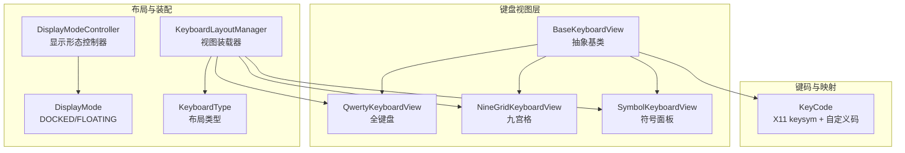
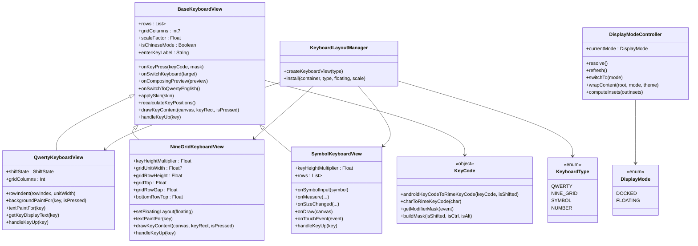
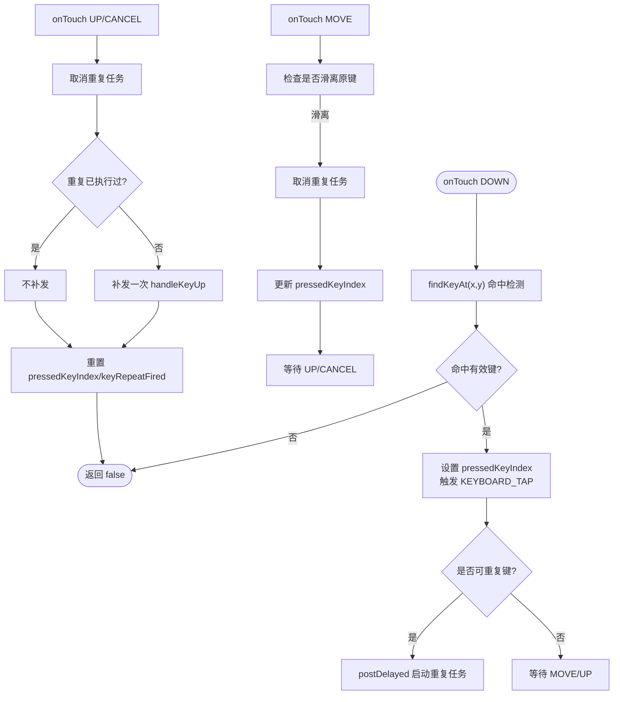
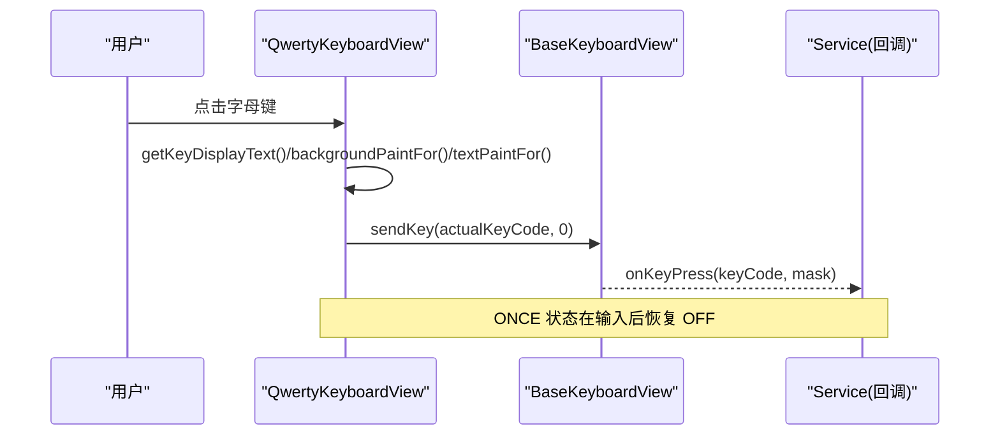
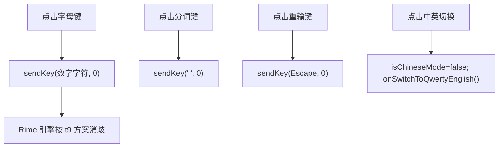
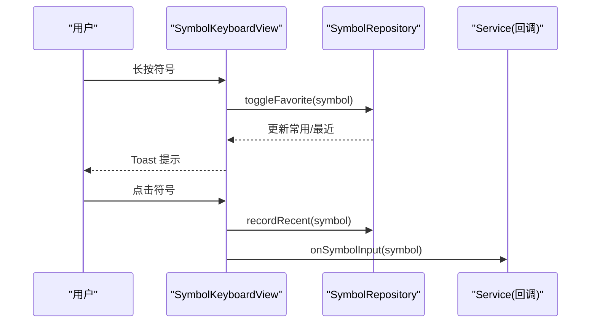
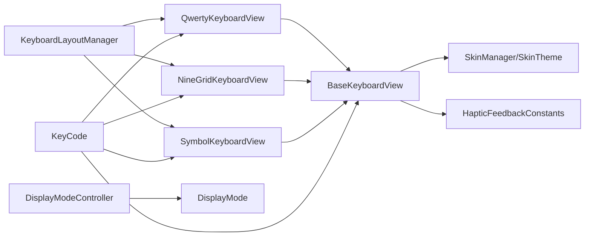

# 键盘基础框架

<cite>
**本文引用的文件**   
- [BaseKeyboardView.kt](file://app/src/main/java/com/ziyou/ime/ime/BaseKeyboardView.kt)
- [KeyCode.kt](file://app/src/main/java/com/ziyou/ime/ime/KeyCode.kt)
- [QwertyKeyboardView.kt](file://app/src/main/java/com/ziyou/ime/ime/QwertyKeyboardView.kt)
- [NineGridKeyboardView.kt](file://app/src/main/java/com/ziyou/ime/ime/NineGridKeyboardView.kt)
- [SymbolKeyboardView.kt](file://app/src/main/java/com/ziyou/ime/ime/SymbolKeyboardView.kt)
- [KeyboardLayoutManager.kt](file://app/src/main/java/com/ziyou/ime/ime/KeyboardLayoutManager.kt)
- [DisplayModeController.kt](file://app/src/main/java/com/ziyou/ime/ime/DisplayModeController.kt)
- [DisplayMode.kt](file://app/src/main/java/com/ziyou/ime/ime/DisplayMode.kt)
- [KeyboardType.kt](file://app/src/main/java/com/ziyou/ime/ime/KeyboardType.kt)
</cite>

## 目录
1. [简介](#简介)
2. [项目结构](#项目结构)
3. [核心组件](#核心组件)
4. [架构总览](#架构总览)
5. [详细组件分析](#详细组件分析)
6. [依赖关系分析](#依赖关系分析)
7. [性能考量](#性能考量)
8. [故障排查指南](#故障排查指南)
9. [结论](#结论)
10. [附录：自定义键盘开发示例](#附录自定义键盘开发示例)

## 简介
本技术文档围绕输入法项目的「键盘基础框架」展开，重点解析 BaseKeyboardView 抽象基类的设计与实现，包括基于「行 × 相对宽度」的布局模型、Canvas 绘制优化策略、触摸事件处理机制与触觉反馈系统。同时详细说明 Key 数据模型（按键坐标计算、高亮状态管理、主题着色系统与响应式布局适配）、KeyCode 枚举定义与键码映射机制，并覆盖键盘视图生命周期管理、性能优化技巧与可访问性支持。文末提供继承 BaseKeyboardView 创建自定义键盘布局的实践指引，涵盖绘制流程、事件处理与样式定制。

## 项目结构
键盘基础框架位于 ime 包下，核心由以下文件组成：
- BaseKeyboardView：抽象基类，统一布局、绘制、触摸、皮肤与回调
- QwertyKeyboardView：全键盘布局实现
- NineGridKeyboardView：九宫格布局实现
- SymbolKeyboardView：符号面板实现（自绘网格）
- KeyCode：键码常量与映射工具
- KeyboardLayoutManager：键盘视图装载与装配
- DisplayModeController / DisplayMode：停靠/悬浮显示形态控制
- KeyboardType：键盘布局类型枚举

**图表来源** 
- [BaseKeyboardView.kt](file://app/src/main/java/com/ziyou/ime/ime/BaseKeyboardView.kt)
- [QwertyKeyboardView.kt](file://app/src/main/java/com/ziyou/ime/ime/QwertyKeyboardView.kt)
- [NineGridKeyboardView.kt](file://app/src/main/java/com/ziyou/ime/ime/NineGridKeyboardView.kt)
- [SymbolKeyboardView.kt](file://app/src/main/java/com/ziyou/ime/ime/SymbolKeyboardView.kt)
- [KeyboardLayoutManager.kt](file://app/src/main/java/com/ziyou/ime/ime/KeyboardLayoutManager.kt)
- [DisplayModeController.kt](file://app/src/main/java/com/ziyou/ime/ime/DisplayModeController.kt)
- [DisplayMode.kt](file://app/src/main/java/com/ziyou/ime/ime/DisplayMode.kt)
- [KeyboardType.kt](file://app/src/main/java/com/ziyou/ime/ime/KeyboardType.kt)
- [KeyCode.kt](file://app/src/main/java/com/ziyou/ime/ime/KeyCode.kt)

**章节来源**
- [BaseKeyboardView.kt](file://app/src/main/java/com/ziyou/ime/ime/BaseKeyboardView.kt)
- [KeyboardLayoutManager.kt](file://app/src/main/java/com/ziyou/ime/ime/KeyboardLayoutManager.kt)
- [DisplayModeController.kt](file://app/src/main/java/com/ziyou/ime/ime/DisplayModeController.kt)
- [DisplayMode.kt](file://app/src/main/java/com/ziyou/ime/ime/DisplayMode.kt)
- [KeyboardType.kt](file://app/src/main/java/com/ziyou/ime/ime/KeyboardType.kt)

## 核心组件
- BaseKeyboardView：抽象基类，封装通用能力
  - 布局模型：「行 × 相对宽度」与可选「列网格」模式
  - Canvas 绘制：背景、圆角、阴影、文字；按皮肤 keyStyle 分支（填充/描边/扁平）
  - 触摸与长按：按下高亮、滑动切换按压键、连续触发（退格等）
  - 触觉反馈：KEYBOARD_TAP/LONG_PRESS
  - 皮肤集成：applySkin/rebuildPaints，尺寸与画笔随缩放因子自动更新
  - 回调接口：onKeyPress、onSwitchKeyboard、onComposingPreview、onSwitchToQwertyEnglish
  - 生命周期：onDetachedFromWindow/onWindowFocusChanged 清理按压状态
- QwertyKeyboardView：全键盘布局，Shift 大小写循环、中英文切换、数字键盘入口
- NineGridKeyboardView：九宫格布局，字母键发送数字字符，T9 方案消歧；底行根据悬浮/停靠动态变化
- SymbolKeyboardView：符号面板，分类导航 + 网格滚动，长按收藏/移除，退格长按连续删除
- KeyCode：X11 keysym 常量与 Android KeyEvent → Rime keysym 映射，修饰掩码构建
- KeyboardLayoutManager：创建并安装键盘视图，绑定回调，组装侧栏与网格
- DisplayModeController/DisplayMode：停靠/悬浮形态解析、切换与 insets 裁剪
- KeyboardType：布局类型枚举，强制方案绑定与选择面板过滤

**章节来源**
- [BaseKeyboardView.kt](file://app/src/main/java/com/ziyou/ime/ime/BaseKeyboardView.kt)
- [QwertyKeyboardView.kt](file://app/src/main/java/com/ziyou/ime/ime/QwertyKeyboardView.kt)
- [NineGridKeyboardView.kt](file://app/src/main/java/com/ziyou/ime/ime/NineGridKeyboardView.kt)
- [SymbolKeyboardView.kt](file://app/src/main/java/com/ziyou/ime/ime/SymbolKeyboardView.kt)
- [KeyCode.kt](file://app/src/main/java/com/ziyou/ime/ime/KeyCode.kt)
- [KeyboardLayoutManager.kt](file://app/src/main/java/com/ziyou/ime/ime/KeyboardLayoutManager.kt)
- [DisplayModeController.kt](file://app/src/main/java/com/ziyou/ime/ime/DisplayModeController.kt)
- [DisplayMode.kt](file://app/src/main/java/com/ziyou/ime/ime/DisplayMode.kt)
- [KeyboardType.kt](file://app/src/main/java/com/ziyou/ime/ime/KeyboardType.kt)

## 架构总览
键盘基础框架采用「基类抽象 + 具体布局实现 + 视图装载器 + 形态控制器」的分层设计。基类负责通用绘制、布局与交互；具体布局仅声明 rows 与 handleKeyUp；装载器负责实例化、回调绑定与容器组装；形态控制器决定停靠或悬浮展示方式，并在悬浮模式下裁剪触摸区域。

**图表来源** 
- [BaseKeyboardView.kt](file://app/src/main/java/com/ziyou/ime/ime/BaseKeyboardView.kt)
- [QwertyKeyboardView.kt](file://app/src/main/java/com/ziyou/ime/ime/QwertyKeyboardView.kt)
- [NineGridKeyboardView.kt](file://app/src/main/java/com/ziyou/ime/ime/NineGridKeyboardView.kt)
- [SymbolKeyboardView.kt](file://app/src/main/java/com/ziyou/ime/ime/SymbolKeyboardView.kt)
- [KeyCode.kt](file://app/src/main/java/com/ziyou/ime/ime/KeyCode.kt)
- [KeyboardLayoutManager.kt](file://app/src/main/java/com/ziyou/ime/ime/KeyboardLayoutManager.kt)
- [DisplayModeController.kt](file://app/src/main/java/com/ziyou/ime/ime/DisplayModeController.kt)
- [DisplayMode.kt](file://app/src/main/java/com/ziyou/ime/ime/DisplayMode.kt)
- [KeyboardType.kt](file://app/src/main/java/com/ziyou/ime/ime/KeyboardType.kt)

## 详细组件分析

### BaseKeyboardView 抽象基类
- 布局模型
  - 「行 × 相对宽度」：每行由若干 Key 组成，width 表示相对权重；可用宽度扣除间距后按权重均摊
  - 可选「列网格」：gridColumns > 0 时启用，各行共用同一套列宽，Key.width 语义变为跨列数，严格对齐
  - recalculateKeyPositions 计算每个 Key 的 RectF，缓存于 keyRects，供绘制与触摸复用
- Canvas 绘制优化
  - onDraw 先绘制板背景，再遍历 keyRects 调用 drawKey；drawKey 按 skin.keyStyle 分支（FILLED/OUTLINE/FLAT）
  - 阴影使用 BlurMaskFilter，API < 28 硬件加速画布自动退化
  - 文本居中绘制，文字大小与字体来自皮肤快照
- 触摸与长按
  - onTouchEvent 使用 actionMasked 处理多指场景；ACTION_DOWN 记录 pressedKeyIndex 并触发触觉反馈
  - ACTION_MOVE 滑离原键则取消重复任务并更新按压态
  - ACTION_UP/CANCEL 清理重复任务，必要时补发一次按键（避免长按重复导致多删）
  - 长按连续触发：对 isRepeatableKey（默认退格）启动周期性任务，间隔 REPEAT_INTERVAL_MS
- 皮肤与缩放
  - applySkin 重建画笔颜色与字体，刷新尺寸与布局；rebuildPaints 派生所有画笔颜色
  - scaleFactor 影响 dp2px/sp2px 换算，悬浮模式整体缩放生效
- 回调与状态
  - onKeyPress/onSwitchKeyboard/onComposingPreview/onSwitchToQwertyEnglish 暴露给上层
  - isChineseMode/enterKeyLabel/scaleFactor 变更触发 invalidate/requestLayout
- 生命周期
  - onDetachedFromWindow/onWindowFocusChanged 清理按压状态与重复任务，防止残留

**图表来源** 
- [BaseKeyboardView.kt](file://app/src/main/java/com/ziyou/ime/ime/BaseKeyboardView.kt)

**章节来源**
- [BaseKeyboardView.kt](file://app/src/main/java/com/ziyou/ime/ime/BaseKeyboardView.kt)

### QwertyKeyboardView 全键盘
- 布局：10 列网格，第二行半列缩进居中；功能键两侧各跨 1.5 列，通过 insetGapStart/End 让出分隔
- Shift 状态：OFF/ONCE/LOCKED 循环切换；ONCE 输入一个字母后恢复
- 显示文本：Shift 图标、中英文切换文案、逗号全角/半角、字母大小写
- 按键处理：Shift 切换状态；数字键盘入口；普通字母根据 Shift 调整大小写；其他功能键走 handleCommonKey

**图表来源** 
- [QwertyKeyboardView.kt](file://app/src/main/java/com/ziyou/ime/ime/QwertyKeyboardView.kt)
- [BaseKeyboardView.kt](file://app/src/main/java/com/ziyou/ime/ime/BaseKeyboardView.kt)

**章节来源**
- [QwertyKeyboardView.kt](file://app/src/main/java/com/ziyou/ime/ime/QwertyKeyboardView.kt)

### NineGridKeyboardView 九宫格
- 布局：前三行为标准 T9 键网格（3×3），右侧功能列；第 4 行根据悬浮/停靠动态变化
- 输入逻辑：字母键直接发送对应数字字符（2-9），由 t9.schema.yaml 派生拼音并消歧
- 特殊键：分词键发送 '；重输发送 Escape；换行跨 2 行；中英切换强制英文并切回全键盘
- 几何同步：gridUnitWidth/gridRowHeight/gridTop/gridRowGap/bottomRowTop 供左侧栏对齐

**图表来源** 
- [NineGridKeyboardView.kt](file://app/src/main/java/com/ziyou/ime/ime/NineGridKeyboardView.kt)

**章节来源**
- [NineGridKeyboardView.kt](file://app/src/main/java/com/ziyou/ime/ime/NineGridKeyboardView.kt)

### SymbolKeyboardView 符号面板
- 布局：左侧分类栏 + 右侧符号网格（5 列，竖向滚动）+ 底部功能栏（返回/空格/退格/回车）
- 交互：点击上屏并记入「最近」；长按加入常用/常用内移除；分类点击切换内容并回到顶部
- 性能：只绘制可见行，命中检测用坐标反算行列，不缓存逐格矩形；退格长按连续删除
- 主题与缩放：自有画笔同步皮肤颜色与字号；onScaleChanged 更新文字大小

**图表来源** 
- [SymbolKeyboardView.kt](file://app/src/main/java/com/ziyou/ime/ime/SymbolKeyboardView.kt)

**章节来源**
- [SymbolKeyboardView.kt](file://app/src/main/java/com/ziyou/ime/ime/SymbolKeyboardView.kt)

### KeyCode 键码映射
- X11 keysym 常量：BackSpace、Return、Escape、方向键、修饰键等
- Android KeyEvent → Rime keysym：字母/数字/功能键映射，Shift 影响大小写
- 修饰掩码：kShiftMask/kControlMask/kAltMask/kLockMask/kReleaseMask
- 软键盘自定义 keyCode：-100~-116 用于内部标识（如中英文切换、符号键盘、悬浮切换等）

**章节来源**
- [KeyCode.kt](file://app/src/main/java/com/ziyou/ime/ime/KeyCode.kt)

### KeyboardLayoutManager 视图装载器
- createKeyboardView：根据 KeyboardType 创建对应视图
- install：绑定回调（onKeyPress/onSwitchKeyboard/onComposingPreview 等），应用皮肤与缩放
- 九宫格停靠形态：挂载 PinyinSideBarView，横向 LinearLayout 权重 1.8 : 8.2；布局完成后同步网格几何
- 悬浮形态：不挂侧栏，九宫格底行自带「符」键保留符号入口

**章节来源**
- [KeyboardLayoutManager.kt](file://app/src/main/java/com/ziyou/ime/ime/KeyboardLayoutManager.kt)

### DisplayModeController 显示形态控制器
- resolve：优先级手动覆盖 > 悬浮总开关 > 横屏自动悬浮
- switchTo：持久化开关，回调 Host.beforeModeSwitch/onModeSwitched 重建视图
- wrapContent：悬浮模式包裹 FloatingPanelContainer，停靠模式返回根视图
- computeInsets：悬浮模式下计算触摸区域与 contentTopInset，确保游戏画面不被顶起

**章节来源**
- [DisplayModeController.kt](file://app/src/main/java/com/ziyou/ime/ime/DisplayModeController.kt)
- [DisplayMode.kt](file://app/src/main/java/com/ziyou/ime/ime/DisplayMode.kt)

### KeyboardType 布局类型
- 枚举项：QWERTY/NINE_GRID/SYMBOL/NUMBER
- forcedSchemaId：NINE_GRID 强制绑定 t9；allowsSchemaChoice：QWERTY 允许自选方案
- PICKER_TYPES：筛选可持久化的主键盘（非 null 的 pickerLabel）

**章节来源**
- [KeyboardType.kt](file://app/src/main/java/com/ziyou/ime/ime/KeyboardType.kt)

## 依赖关系分析
- BaseKeyboardView 依赖 SkinManager/SkinTheme（主题与尺寸参数）、HapticFeedbackConstants（触觉反馈）、Android View 生命周期
- Qwerty/NineGrid/Symbol 继承 BaseKeyboardView，覆写布局与绘制细节
- KeyboardLayoutManager 依赖 KeyboardType 与具体视图类，负责装配与回调绑定
- DisplayModeController 依赖 DisplayModeManager 与 FloatingPanelGeometry，处理悬浮 insets
- KeyCode 独立工具类，被各键盘视图与 Service 层共同使用

**图表来源** 
- [BaseKeyboardView.kt](file://app/src/main/java/com/ziyou/ime/ime/BaseKeyboardView.kt)
- [QwertyKeyboardView.kt](file://app/src/main/java/com/ziyou/ime/ime/QwertyKeyboardView.kt)
- [NineGridKeyboardView.kt](file://app/src/main/java/com/ziyou/ime/ime/NineGridKeyboardView.kt)
- [SymbolKeyboardView.kt](file://app/src/main/java/com/ziyou/ime/ime/SymbolKeyboardView.kt)
- [KeyboardLayoutManager.kt](file://app/src/main/java/com/ziyou/ime/ime/KeyboardLayoutManager.kt)
- [DisplayModeController.kt](file://app/src/main/java/com/ziyou/ime/ime/DisplayModeController.kt)
- [DisplayMode.kt](file://app/src/main/java/com/ziyou/ime/ime/DisplayMode.kt)
- [KeyCode.kt](file://app/src/main/java/com/ziyou/ime/ime/KeyCode.kt)

**章节来源**
- [BaseKeyboardView.kt](file://app/src/main/java/com/ziyou/ime/ime/BaseKeyboardView.kt)
- [KeyboardLayoutManager.kt](file://app/src/main/java/com/ziyou/ime/ime/KeyboardLayoutManager.kt)
- [DisplayModeController.kt](file://app/src/main/java/com/ziyou/ime/ime/DisplayModeController.kt)
- [KeyCode.kt](file://app/src/main/java/com/ziyou/ime/ime/KeyCode.kt)

## 性能考量
- 布局与测量
  - onMeasure 按行数与 keyHeight 计算总高度，避免多余子视图
  - recalculateKeyPositions 缓存 keyRects，绘制与触摸复用，O(n) 遍历
- Canvas 绘制
  - 按 skin.keyStyle 分支减少不必要的阴影/描边绘制
  - 符号面板只绘制可见行，命中检测用坐标反算，避免大量 RectF 对象
- 触摸与重复任务
  - 使用 actionMasked 处理多指，避免指针索引错误
  - 长按重复任务仅在可重复键上启动，及时 cancelKeyRepeat 释放资源
- 皮肤与缩放
  - 尺寸与画笔随皮肤快照重建，scaleFactor 统一缩放，避免多次 dp2px/sp2px 计算
- 内存与 GC
  - 符号面板不缓存逐格矩形，降低内存占用
  - 九宫格 gridUnitWidth 等几何信息按需计算，避免冗余

[本节为通用指导，无需特定文件引用]

## 故障排查指南
- 触摸状态残留
  - 现象：手指滑离后仍高亮，后续点击无响应
  - 排查：确认 onTouchEvent 中 ACTION_MOVE 更新 pressedKeyIndex，ACTION_UP/CANCEL 清理 keyRepeatFired
  - 参考：BaseKeyboardView 触摸处理与 clearPressedState
- 长按重复多删
  - 现象：长按退格多删一个字符
  - 排查：确认 ACTION_UP 时 keyRepeatFired 为 true 则不补发；检查 isRepeatableKey 扩展是否正确
- 悬浮模式触摸穿透
  - 现象：悬浮面板外触摸未被下层应用接收
  - 排查：确认 DisplayModeController.computeInsets 正确设置 touchableRegion 与 contentTopInset
- 皮肤切换后布局错位
  - 现象：切换皮肤后按键位置异常
  - 排查：确认 applySkin 调用 rebuildPaints 与 recalculateKeyPositions，并 requestLayout/invalidate

**章节来源**
- [BaseKeyboardView.kt](file://app/src/main/java/com/ziyou/ime/ime/BaseKeyboardView.kt)
- [DisplayModeController.kt](file://app/src/main/java/com/ziyou/ime/ime/DisplayModeController.kt)

## 结论
BaseKeyboardView 以「行 × 相对宽度」与可选「列网格」为核心布局模型，结合 Canvas 绘制优化、触摸事件处理与触觉反馈，提供了统一的键盘基础能力。通过 Key 数据模型与 KeyCode 映射，实现了灵活的按键表达与键码转换。配合 KeyboardLayoutManager 与 DisplayModeController，支撑了多种键盘布局与停靠/悬浮形态的灵活装配。该框架具备良好的可扩展性与性能表现，便于快速实现自定义键盘布局。

[本节为总结，无需特定文件引用]

## 附录：自定义键盘开发示例
- 步骤概览
  1. 继承 BaseKeyboardView，声明 rows（List<List<Key>>）与必要属性（如 gridColumns）
  2. 覆写 handleKeyUp 实现按键逻辑，必要时覆写 backgroundPaintFor/textPaintFor/getKeyDisplayText
  3. 如需自定义绘制，覆写 drawKeyContent；如需缩放同步，覆写 onScaleChanged
  4. 在 KeyboardLayoutManager.createKeyboardView 中登记新布局类型
  5. 若需停靠/悬浮差异，参考 NineGridKeyboardView.setFloatingLayout 动态切换布局
- 关键要点
  - 布局：优先使用 rows + width 权重；复杂对齐使用 gridColumns
  - 绘制：复用基类背景/文字画笔，按皮肤 keyStyle 分支
  - 触摸：利用 findKeyAt 与 keyRects 缓存；长按重复键扩展 isRepeatableKey
  - 回调：通过 onKeyPress/onSwitchKeyboard 等与 Service 层通信
  - 主题：applySkin 后确保自有画笔同步颜色与字号
- 参考路径
  - 全键盘示例：QwertyKeyboardView.rows/handleKeyUp/backgroundPaintFor/textPaintFor/getKeyDisplayText
  - 九宫格示例：NineGridKeyboardView.rows/setFloatingLayout/drawKeyContent/handleKeyUp
  - 符号面板示例：SymbolKeyboardView.onMeasure/onSizeChanged/onDraw/onTouchEvent/handleKeyUp

**章节来源**
- [BaseKeyboardView.kt](file://app/src/main/java/com/ziyou/ime/ime/BaseKeyboardView.kt)
- [QwertyKeyboardView.kt](file://app/src/main/java/com/ziyou/ime/ime/QwertyKeyboardView.kt)
- [NineGridKeyboardView.kt](file://app/src/main/java/com/ziyou/ime/ime/NineGridKeyboardView.kt)
- [SymbolKeyboardView.kt](file://app/src/main/java/com/ziyou/ime/ime/SymbolKeyboardView.kt)
- [KeyboardLayoutManager.kt](file://app/src/main/java/com/ziyou/ime/ime/KeyboardLayoutManager.kt)