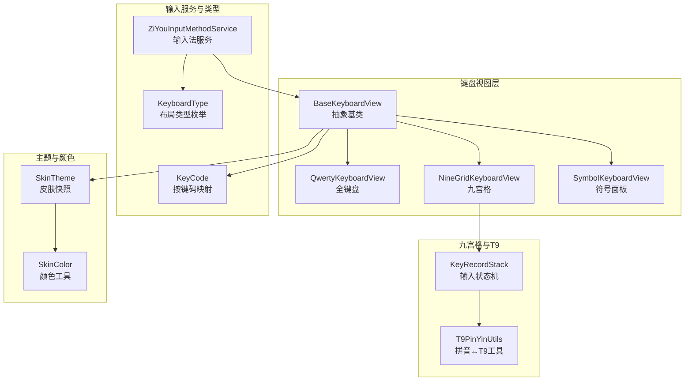
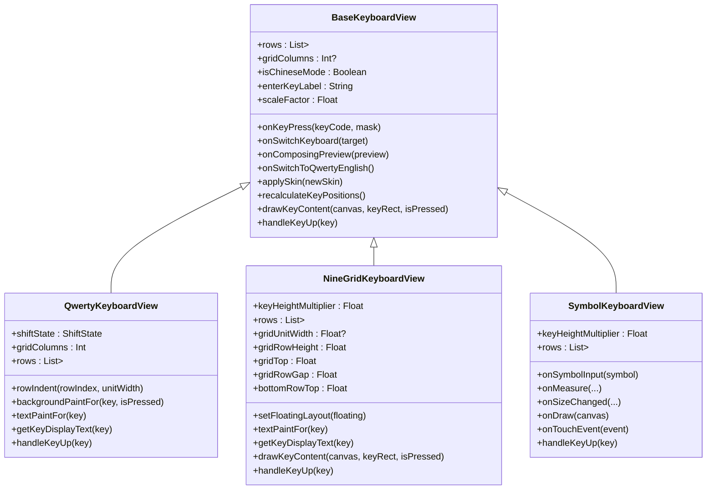
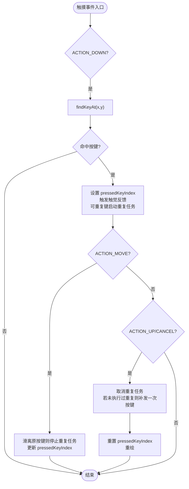
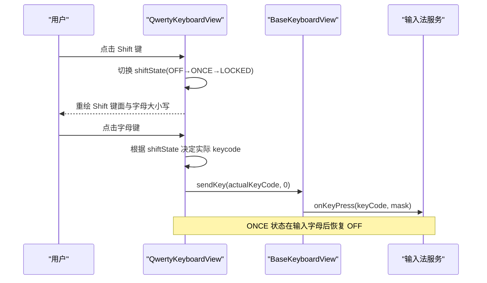
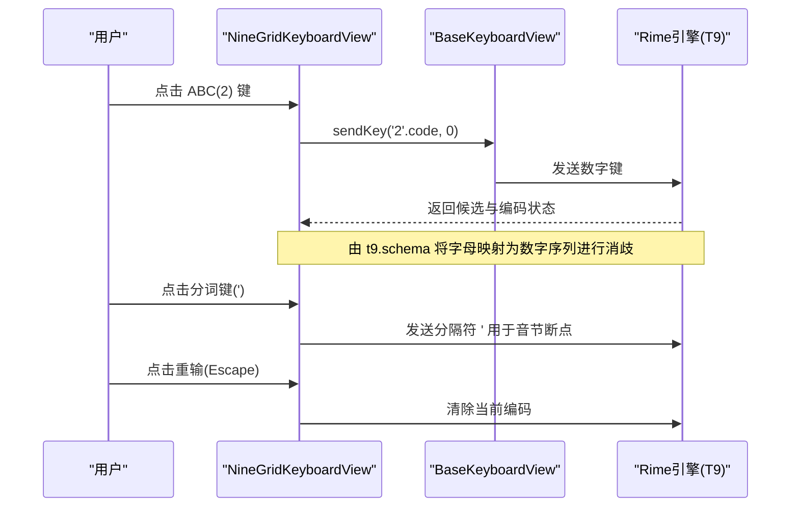
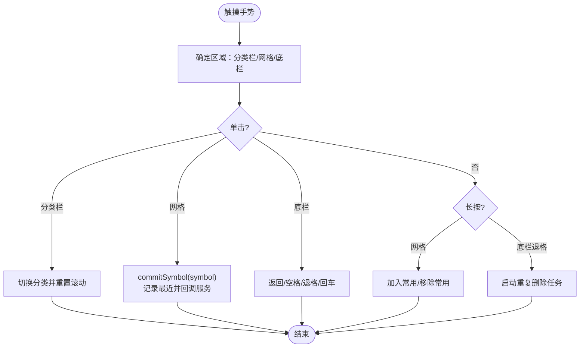
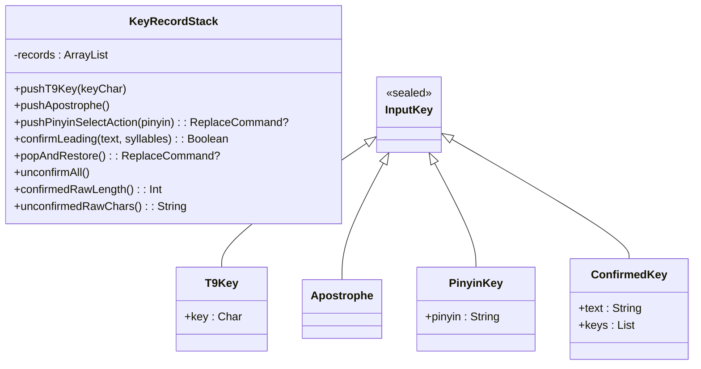
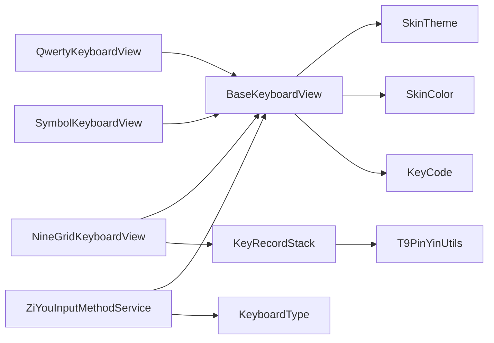

# 键盘系统

<cite>
**本文引用的文件**   
- [BaseKeyboardView.kt](file://app/src/main/java/com/ziyou/ime/ime/BaseKeyboardView.kt)
- [QwertyKeyboardView.kt](file://app/src/main/java/com/ziyou/ime/ime/QwertyKeyboardView.kt)
- [NineGridKeyboardView.kt](file://app/src/main/java/com/ziyou/ime/ime/NineGridKeyboardView.kt)
- [SymbolKeyboardView.kt](file://app/src/main/java/com/ziyou/ime/ime/SymbolKeyboardView.kt)
- [KeyboardType.kt](file://app/src/main/java/com/ziyou/ime/ime/KeyboardType.kt)
- [KeyCode.kt](file://app/src/main/java/com/ziyou/ime/ime/KeyCode.kt)
- [KeyRecordStack.kt](file://core-logic/src/main/java/com/ziyou/ime/core/t9/KeyRecordStack.kt)
- [T9PinYinUtils.kt](file://core-logic/src/main/java/com/ziyou/ime/util/T9PinYinUtils.kt)
- [SkinTheme.kt](file://app/src/main/java/com/ziyou/ime/skin/SkinTheme.kt)
- [SkinColor.kt](file://core-logic/src/main/java/com/ziyou/ime/core/skin/SkinColor.kt)
- [ZiYouInputMethodService.kt](file://app/src/main/java/com/ziyou/ime/ime/ZiYouInputMethodService.kt)
</cite>

## 目录
1. [简介](#简介)
2. [项目结构](#项目结构)
3. [核心组件](#核心组件)
4. [架构总览](#架构总览)
5. [详细组件分析](#详细组件分析)
6. [依赖关系分析](#依赖关系分析)
7. [性能考量](#性能考量)
8. [故障排查指南](#故障排查指南)
9. [结论](#结论)
10. [附录：扩展新键盘布局示例](#附录：扩展新键盘布局示例)

## 简介
本技术文档围绕输入法键盘系统展开，系统性阐述 BaseKeyboardView 抽象基类的设计与实现、QwertyKeyboardView 全键盘、NineGridKeyboardView 九宫格以及 SymbolKeyboardView 符号键盘的交互与绘制机制。重点覆盖「行 × 相对宽度」布局模型、Canvas 绘制、触摸高亮与触觉反馈、Shift 三态切换、Rime T9 消歧处理、主题着色、响应式布局与可访问性支持，并提供继承 BaseKeyboardView 创建新键盘布局的实践指引。

## 项目结构
键盘系统位于 ime 包下，以 BaseKeyboardView 为统一基类，派生出多种键盘视图；配合 KeyCode、KeyboardType 等工具与枚举完成按键码映射与布局类型管理；九宫格输入状态机与 T9 工具类位于 core-logic 模块；皮肤主题由 SkinTheme 与 SkinColor 提供运行时快照与颜色工具。

**图表来源** 
- [BaseKeyboardView.kt](file://app/src/main/java/com/ziyou/ime/ime/BaseKeyboardView.kt)
- [QwertyKeyboardView.kt](file://app/src/main/java/com/ziyou/ime/ime/QwertyKeyboardView.kt)
- [NineGridKeyboardView.kt](file://app/src/main/java/com/ziyou/ime/ime/NineGridKeyboardView.kt)
- [SymbolKeyboardView.kt](file://app/src/main/java/com/ziyou/ime/ime/SymbolKeyboardView.kt)
- [KeyboardType.kt](file://app/src/main/java/com/ziyou/ime/ime/KeyboardType.kt)
- [KeyCode.kt](file://app/src/main/java/com/ziyou/ime/ime/KeyCode.kt)
- [KeyRecordStack.kt](file://core-logic/src/main/java/com/ziyou/ime/core/t9/KeyRecordStack.kt)
- [T9PinYinUtils.kt](file://core-logic/src/main/java/com/ziyou/ime/util/T9PinYinUtils.kt)
- [SkinTheme.kt](file://app/src/main/java/com/ziyou/ime/skin/SkinTheme.kt)
- [SkinColor.kt](file://core-logic/src/main/java/com/ziyou/ime/core/skin/SkinColor.kt)
- [ZiYouInputMethodService.kt](file://app/src/main/java/com/ziyou/ime/ime/ZiYouInputMethodService.kt)

**章节来源**
- [BaseKeyboardView.kt](file://app/src/main/java/com/ziyou/ime/ime/BaseKeyboardView.kt)
- [QwertyKeyboardView.kt](file://app/src/main/java/com/ziyou/ime/ime/QwertyKeyboardView.kt)
- [NineGridKeyboardView.kt](file://app/src/main/java/com/ziyou/ime/ime/NineGridKeyboardView.kt)
- [SymbolKeyboardView.kt](file://app/src/main/java/com/ziyou/ime/ime/SymbolKeyboardView.kt)
- [KeyboardType.kt](file://app/src/main/java/com/ziyou/ime/ime/KeyboardType.kt)
- [KeyCode.kt](file://app/src/main/java/com/ziyou/ime/ime/KeyCode.kt)
- [KeyRecordStack.kt](file://core-logic/src/main/java/com/ziyou/ime/core/t9/KeyRecordStack.kt)
- [T9PinYinUtils.kt](file://core-logic/src/main/java/com/ziyou/ime/util/T9PinYinUtils.kt)
- [SkinTheme.kt](file://app/src/main/java/com/ziyou/ime/skin/SkinTheme.kt)
- [SkinColor.kt](file://core-logic/src/main/java/com/ziyou/ime/core/skin/SkinColor.kt)
- [ZiYouInputMethodService.kt](file://app/src/main/java/com/ziyou/ime/ime/ZiYouInputMethodService.kt)

## 核心组件
- BaseKeyboardView：抽象基类，封装通用布局、绘制、触摸、皮肤与回调能力。
- QwertyKeyboardView：标准全键盘，支持 Shift 三态大小写切换与键盘类型转换。
- NineGridKeyboardView：九宫格（T9）输入，数字键网格 + 右侧功能列，字母键映射到 Rime T9 方案。
- SymbolKeyboardView：符号面板，分类导航 + 符号网格，长按收藏与最近记录。
- KeyboardType：布局类型枚举，定义布局与引擎方案的绑定关系。
- KeyCode：Android KeyEvent 与 Rime keysym 的映射与修饰掩码构建。
- KeyRecordStack：九宫格输入状态机，维护编码串逻辑顺序与退格还原。
- T9PinYinUtils：拼音与 T9 数字序列的双向映射工具。
- SkinTheme / SkinColor：皮肤运行时快照与颜色工具，驱动主题着色。

**章节来源**
- [BaseKeyboardView.kt](file://app/src/main/java/com/ziyou/ime/ime/BaseKeyboardView.kt)
- [QwertyKeyboardView.kt](file://app/src/main/java/com/ziyou/ime/ime/QwertyKeyboardView.kt)
- [NineGridKeyboardView.kt](file://app/src/main/java/com/ziyou/ime/ime/NineGridKeyboardView.kt)
- [SymbolKeyboardView.kt](file://app/src/main/java/com/ziyou/ime/ime/SymbolKeyboardView.kt)
- [KeyboardType.kt](file://app/src/main/java/com/ziyou/ime/ime/KeyboardType.kt)
- [KeyCode.kt](file://app/src/main/java/com/ziyou/ime/ime/KeyCode.kt)
- [KeyRecordStack.kt](file://core-logic/src/main/java/com/ziyou/ime/core/t9/KeyRecordStack.kt)
- [T9PinYinUtils.kt](file://core-logic/src/main/java/com/ziyou/ime/util/T9PinYinUtils.kt)
- [SkinTheme.kt](file://app/src/main/java/com/ziyou/ime/skin/SkinTheme.kt)
- [SkinColor.kt](file://core-logic/src/main/java/com/ziyou/ime/core/skin/SkinColor.kt)

## 架构总览
键盘系统采用“基类抽象 + 具体布局实现”的分层设计。BaseKeyboardView 提供统一的布局测量、位置计算、Canvas 绘制、触摸事件与皮肤应用；各具体键盘仅声明 rows 布局与 handleKeyUp 行为。输入法服务负责生命周期、视图容器管理与引擎同步。

**图表来源** 
- [BaseKeyboardView.kt](file://app/src/main/java/com/ziyou/ime/ime/BaseKeyboardView.kt)
- [QwertyKeyboardView.kt](file://app/src/main/java/com/ziyou/ime/ime/QwertyKeyboardView.kt)
- [NineGridKeyboardView.kt](file://app/src/main/java/com/ziyou/ime/ime/NineGridKeyboardView.kt)
- [SymbolKeyboardView.kt](file://app/src/main/java/com/ziyou/ime/ime/SymbolKeyboardView.kt)

## 详细组件分析

### BaseKeyboardView 抽象基类
- 布局模型
  - 「行 × 相对宽度」：每行 Key.width 表示相对权重，按可用宽度均摊。
  - 可选「列网格」模式：通过 gridColumns 启用，各行共用同一套列宽，Key.width 表示跨列数，确保严格对齐（如 QWERTY 第二行半列缩进）。
  - 支持行缩进 rowIndent 与行单元宽度 rowUnitWidth 覆写，适配特殊布局。
- Canvas 绘制
  - 背景板与按键矩形缓存 keyRects，按皮肤 keyStyle（填充/描边/扁平）分支绘制。
  - 阴影、圆角、边框、文字均由皮肤参数化；按下态跳过投影以模拟深度变化。
  - drawKeyContent 默认居中绘制 getKeyDisplayText，子类可覆写多段文字渲染。
- 触摸与反馈
  - ACTION_DOWN/MOVE/UP/CANCEL 处理按压高亮与手指滑离清理。
  - 长按连续触发：退格键默认支持，延迟启动与周期重复，避免误删。
  - 触觉反馈：按键点击与长按使用 HapticFeedbackConstants.KEYBOARD_TAP/LONG_PRESS。
- 皮肤与缩放
  - applySkin 重建画笔并刷新布局；dp/sp 换算叠加 scaleFactor，悬浮缩放自动生效。
  - 颜色按 backgroundAlpha 调制，保证背景图透出或悬浮半透明场景一致性。
- 回调与状态
  - onKeyPress/onSwitchKeyboard/onComposingPreview/onSwitchToQwertyEnglish 暴露给上层。
  - isChineseMode/enterKeyLabel/scaleFactor 变更触发重绘与布局。

**图表来源** 
- [BaseKeyboardView.kt](file://app/src/main/java/com/ziyou/ime/ime/BaseKeyboardView.kt)

**章节来源**
- [BaseKeyboardView.kt](file://app/src/main/java/com/ziyou/ime/ime/BaseKeyboardView.kt)

### QwertyKeyboardView 全键盘
- 布局：基于 10 列网格，四行标准 QWERTY；第二行右移半列居中；两侧功能键跨 1.5 列并向字母区让出间距。
- Shift 三态：OFF → ONCE → LOCKED，ONCE 输入一个字母后恢复 OFF。
- 显示文本：Shift 键图标随状态变化；中英文键文案随 isChineseMode 切换；逗号随模式展示全角/半角；字母根据 Shift 状态大小写。
- 按键处理：Shift 循环切换；数字键盘切换；普通字母根据 Shift 调整 keycode；其他功能键走 handleCommonKey。

**图表来源** 
- [QwertyKeyboardView.kt](file://app/src/main/java/com/ziyou/ime/ime/QwertyKeyboardView.kt)
- [BaseKeyboardView.kt](file://app/src/main/java/com/ziyou/ime/ime/BaseKeyboardView.kt)

**章节来源**
- [QwertyKeyboardView.kt](file://app/src/main/java/com/ziyou/ime/ime/QwertyKeyboardView.kt)
- [BaseKeyboardView.kt](file://app/src/main/java/com/ziyou/ime/ime/BaseKeyboardView.kt)

### NineGridKeyboardView 九宫格输入
- 布局：3×3 字母键网格 + 右侧功能列 + 底行（停靠/悬浮形态不同）；换行键纵向跨第 3~4 行。
- 输入逻辑：字母键单击发送对应数字键（2-9），由 t9.schema.yaml 的 speller/algebra 将拼音派生为数字写法，引擎消歧。
- 功能键：分词键发送撇号 ' 手动分隔音节；重输发送 Escape 清除编码；中英切换强制英文并切回 26 键全键盘（不走异步路径）。
- 绘制与尺寸：自定义 letter/separator/bottomText 画笔；keyHeightMultiplier 适度加高；gridUnitWidth/gridRowHeight/gridTop/gridRowGap/bottomRowTop 供侧栏对齐。
- 悬浮/停靠：setFloatingLayout 切换底行变体，保持与上方三列严格对齐。

**图表来源** 
- [NineGridKeyboardView.kt](file://app/src/main/java/com/ziyou/ime/ime/NineGridKeyboardView.kt)
- [BaseKeyboardView.kt](file://app/src/main/java/com/ziyou/ime/ime/BaseKeyboardView.kt)

**章节来源**
- [NineGridKeyboardView.kt](file://app/src/main/java/com/ziyou/ime/ime/NineGridKeyboardView.kt)
- [BaseKeyboardView.kt](file://app/src/main/java/com/ziyou/ime/ime/BaseKeyboardView.kt)

### SymbolKeyboardView 符号面板
- 布局：左侧分类栏（常用/最近/中文/英文/数学等）+ 右侧符号网格（5 列，竖向滚动）+ 底部功能栏（返回/空格/退格/回车）。
- 交互：点击符号上屏并记入「最近」；长按加入「常用」或在「常用」内移除；分类点击切换内容并回到顶部；退格长按连续删除。
- 数据：SymbolRepository 提供分类与符号列表，YAML 解析缓存，SharedPreferences 持久化常用/最近。
- 绘制：仅绘制可见区域，坐标反算行列命中检测，避免逐格矩形缓存；空态提示友好。

**图表来源** 
- [SymbolKeyboardView.kt](file://app/src/main/java/com/ziyou/ime/ime/SymbolKeyboardView.kt)

**章节来源**
- [SymbolKeyboardView.kt](file://app/src/main/java/com/ziyou/ime/ime/SymbolKeyboardView.kt)
- [SymbolCategory.kt](file://app/src/main/java/com/ziyou/ime/data/SymbolCategory.kt)

### 九宫格输入状态机与 T9 工具
- KeyRecordStack：维护 T9 按键、分词符、已锁定拼音与已确认段的原始记录，保证与 Rime 编码串逻辑顺序一致；支持 pushT9Key/pushApostrophe/pushPinyinSelectAction/confirmLeading/popAndRestore/unconfirmAll 等操作。
- T9PinYinUtils：提供 pinyin2Key/t9KeyToPinyin/pinyin2T9Key/getT9Composition 等工具，内部以组代表字母为中间表示，确保数字键序列与拼音双向映射 O(1)。

**图表来源** 
- [KeyRecordStack.kt](file://core-logic/src/main/java/com/ziyou/ime/core/t9/KeyRecordStack.kt)

**章节来源**
- [KeyRecordStack.kt](file://core-logic/src/main/java/com/ziyou/ime/core/t9/KeyRecordStack.kt)
- [T9PinYinUtils.kt](file://core-logic/src/main/java/com/ziyou/ime/util/T9PinYinUtils.kt)

### 主题与颜色
- SkinTheme：运行时不可变快照，包含颜色、尺寸（dp/sp）、字体、阴影、样式等；createBackgroundDrawable 生成带压暗的背景 Drawable。
- SkinColor：纯函数工具，解析色值、混合颜色、缩放 alpha，驱动功能键底色派生与整体透明度调制。

**章节来源**
- [SkinTheme.kt](file://app/src/main/java/com/ziyou/ime/skin/SkinTheme.kt)
- [SkinColor.kt](file://core-logic/src/main/java/com/ziyou/ime/core/skin/SkinColor.kt)

## 依赖关系分析
- BaseKeyboardView 依赖 SkinTheme/SkinColor 进行主题着色与颜色运算；依赖 KeyCode 进行按键码映射；依赖 Android 框架 View/HapticFeedback/MotionEvent。
- QwertyKeyboardView/NineGridKeyboardView/SymbolKeyboardView 继承 BaseKeyboardView，复用布局/绘制/触摸/皮肤能力，仅实现自身布局与按键处理。
- NineGridKeyboardView 与 KeyRecordStack/T9PinYinUtils 协作完成 T9 输入与消歧。
- ZiYouInputMethodService 管理键盘容器与布局切换，调用 onKeyPress/onSwitchKeyboard 等回调与引擎同步。

**图表来源** 
- [BaseKeyboardView.kt](file://app/src/main/java/com/ziyou/ime/ime/BaseKeyboardView.kt)
- [QwertyKeyboardView.kt](file://app/src/main/java/com/ziyou/ime/ime/QwertyKeyboardView.kt)
- [NineGridKeyboardView.kt](file://app/src/main/java/com/ziyou/ime/ime/NineGridKeyboardView.kt)
- [SymbolKeyboardView.kt](file://app/src/main/java/com/ziyou/ime/ime/SymbolKeyboardView.kt)
- [KeyRecordStack.kt](file://core-logic/src/main/java/com/ziyou/ime/core/t9/KeyRecordStack.kt)
- [T9PinYinUtils.kt](file://core-logic/src/main/java/com/ziyou/ime/util/T9PinYinUtils.kt)
- [SkinTheme.kt](file://app/src/main/java/com/ziyou/ime/skin/SkinTheme.kt)
- [SkinColor.kt](file://core-logic/src/main/java/com/ziyou/ime/core/skin/SkinColor.kt)
- [KeyboardType.kt](file://app/src/main/java/com/ziyou/ime/ime/KeyboardType.kt)
- [ZiYouInputMethodService.kt](file://app/src/main/java/com/ziyou/ime/ime/ZiYouInputMethodService.kt)

**章节来源**
- [BaseKeyboardView.kt](file://app/src/main/java/com/ziyou/ime/ime/BaseKeyboardView.kt)
- [QwertyKeyboardView.kt](file://app/src/main/java/com/ziyou/ime/ime/QwertyKeyboardView.kt)
- [NineGridKeyboardView.kt](file://app/src/main/java/com/ziyou/ime/ime/NineGridKeyboardView.kt)
- [SymbolKeyboardView.kt](file://app/src/main/java/com/ziyou/ime/ime/SymbolKeyboardView.kt)
- [KeyRecordStack.kt](file://core-logic/src/main/java/com/ziyou/ime/core/t9/KeyRecordStack.kt)
- [T9PinYinUtils.kt](file://core-logic/src/main/java/com/ziyou/ime/util/T9PinYinUtils.kt)
- [SkinTheme.kt](file://app/src/main/java/com/ziyou/ime/skin/SkinTheme.kt)
- [SkinColor.kt](file://core-logic/src/main/java/com/ziyou/ime/core/skin/SkinColor.kt)
- [KeyboardType.kt](file://app/src/main/java/com/ziyou/ime/ime/KeyboardType.kt)
- [ZiYouInputMethodService.kt](file://app/src/main/java/com/ziyou/ime/ime/ZiYouInputMethodService.kt)

## 性能考量
- 绘制优化
  - BaseKeyboardView 缓存 keyRects，避免重复计算；SymbolKeyboardView 仅绘制可见区域并按坐标反算命中，不缓存逐格矩形。
  - 阴影仅在非按下态绘制，减少不必要的 BlurMaskFilter 开销。
- 数据缓存
  - SymbolRepository 对 YAML 分类一次性解析并缓存；常用/最近数据 SharedPreferences 读写轻量。
  - SkinTheme 为不可变快照，绘制帧内零解析、零 IO。
- 触摸与反馈
  - 长按重复任务使用 postDelayed，间隔合理（REPEAT_INTERVAL_MS=60ms），避免频繁调度。
- 响应式布局
  - scaleFactor 统一缩放 dp/sp，悬浮模式自适应；gridColumns 与 rowUnitWidth 保障对齐与自适应。

[本节为通用指导，无需特定文件引用]

## 故障排查指南
- 触摸残留/按键无响应
  - 检查 onDetachedFromWindow/onWindowFocusChanged 是否清理 pressedKeyIndex 与重复任务。
  - 多指触摸需使用 actionMasked，避免漏掉 ACTION_POINTER_* 事件。
- 布局错位/对齐异常
  - 确认 gridColumns 与 rowIndent/rowUnitWidth 是否正确；九宫格底行需沿用上方三列 unitWidth。
- 主题不生效/颜色异常
  - applySkin 是否被调用；SkinTheme 字段与 SkinColor 工具是否正确使用；backgroundAlpha 是否影响预期。
- 九宫格消歧错误
  - 检查 t9.schema.yaml 的 speller/algebra/delimiter 配置；KeyRecordStack 的 confirmLeading/popAndRestore 是否匹配。
- 符号面板卡顿
  - 确认 SymbolRepository.preload 是否在后台预热；YAML 解析失败是否回退内置集合。

**章节来源**
- [BaseKeyboardView.kt](file://app/src/main/java/com/ziyou/ime/ime/BaseKeyboardView.kt)
- [NineGridKeyboardView.kt](file://app/src/main/java/com/ziyou/ime/ime/NineGridKeyboardView.kt)
- [SymbolKeyboardView.kt](file://app/src/main/java/com/ziyou/ime/ime/SymbolKeyboardView.kt)
- [KeyRecordStack.kt](file://core-logic/src/main/java/com/ziyou/ime/core/t9/KeyRecordStack.kt)
- [SkinTheme.kt](file://app/src/main/java/com/ziyou/ime/skin/SkinTheme.kt)

## 结论
键盘系统以 BaseKeyboardView 为核心抽象，统一了布局、绘制、触摸与主题能力，使新增键盘布局只需关注 rows 与 handleKeyUp。QwertyKeyboardView/NineGridKeyboardView/SymbolKeyboardView 分别实现全键盘、九宫格与符号面板的典型交互。结合 KeyboardType、KeyCode、KeyRecordStack、T9PinYinUtils 与 SkinTheme/SkinColor，系统具备良好的可扩展性、性能与可定制性。

[本节为总结，无需特定文件引用]

## 附录：扩展新键盘布局示例
- 步骤
  1. 在 KeyboardType 中追加新布局项（如需专用方案，设置 forcedSchemaId）。
  2. 新建类继承 BaseKeyboardView，实现 rows（List<List<Key>>）与 handleKeyUp。
  3. 按需覆写：
     - gridColumns：启用列网格模式，Key.width 表示跨列数。
     - rowIndent/rowUnitWidth：控制行缩进与单元宽度。
     - backgroundPaintFor/textPaintFor/getKeyDisplayText：定制配色与显示文本。
     - onScaleChanged：同步自有画笔文字大小。
  4. 在 ZiYouInputMethodService.createKeyboardView 中登记新布局。
- 参考路径
  - 基类与回调：BaseKeyboardView
  - 布局枚举：KeyboardType
  - 按键码映射：KeyCode
  - 九宫格状态机：KeyRecordStack/T9PinYinUtils
  - 主题：SkinTheme/SkinColor

**章节来源**
- [BaseKeyboardView.kt](file://app/src/main/java/com/ziyou/ime/ime/BaseKeyboardView.kt)
- [KeyboardType.kt](file://app/src/main/java/com/ziyou/ime/ime/KeyboardType.kt)
- [KeyCode.kt](file://app/src/main/java/com/ziyou/ime/ime/KeyCode.kt)
- [KeyRecordStack.kt](file://core-logic/src/main/java/com/ziyou/ime/core/t9/KeyRecordStack.kt)
- [T9PinYinUtils.kt](file://core-logic/src/main/java/com/ziyou/ime/util/T9PinYinUtils.kt)
- [SkinTheme.kt](file://app/src/main/java/com/ziyou/ime/skin/SkinTheme.kt)
- [SkinColor.kt](file://core-logic/src/main/java/com/ziyou/ime/core/skin/SkinColor.kt)
- [ZiYouInputMethodService.kt](file://app/src/main/java/com/ziyou/ime/ime/ZiYouInputMethodService.kt)