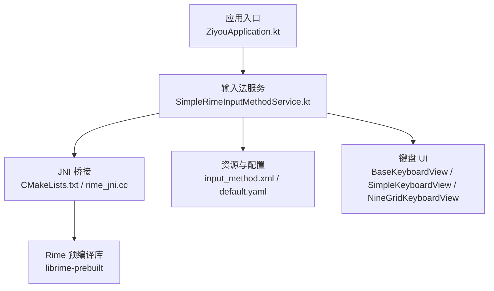
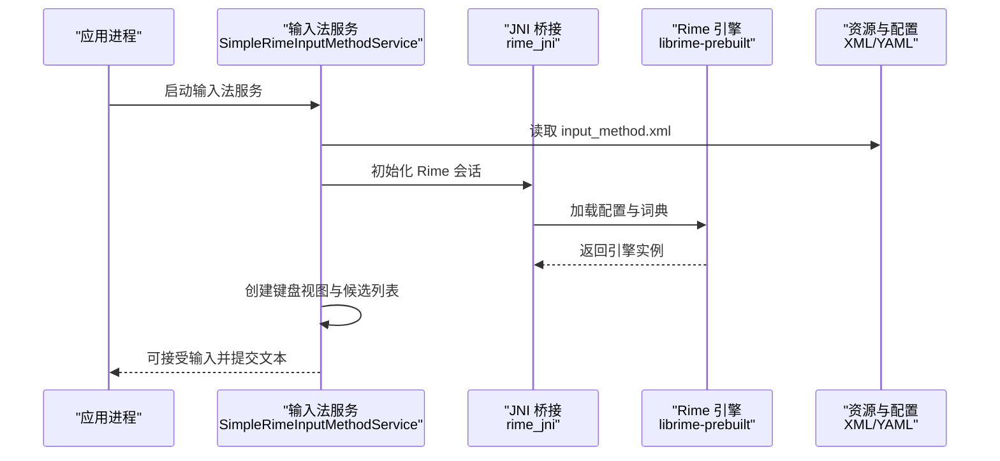
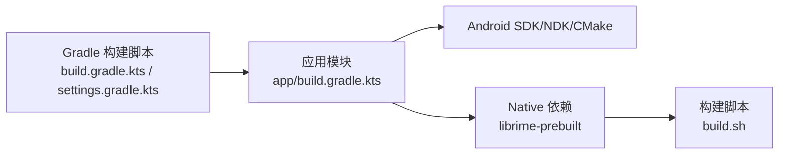

# 快速开始

<cite>
**本文引用的文件**   
- [README.md](file://README.md)
- [ARCHITECTURE.md](file://ARCHITECTURE.md)
- [build.gradle.kts](file://build.gradle.kts)
- [settings.gradle.kts](file://settings.gradle.kts)
- [gradle.properties](file://gradle.properties)
- [app/build.gradle.kts](file://app/build.gradle.kts)
- [app/src/main/AndroidManifest.xml](file://app/src/main/AndroidManifest.xml)
- [app/src/main/java/com/ziyou/ime/ZiyouApplication.kt](file://app/src/main/java/com/ziyou/ime/ZiyouApplication.kt)
- [app/src/main/java/com/ziyou/ime/ime/SimpleRimeInputMethodService.kt](file://app/src/main/java/com/ziyou/ime/ime/SimpleRimeInputMethodService.kt)
- [app/src/main/res/xml/input_method.xml](file://app/src/main/res/xml/input_method.xml)
- [app/src/main/assets/rime/default.yaml](file://app/src/main/assets/rime/default.yaml)
- [app/src/main/jni/librime_jni/CMakeLists.txt](file://app/src/main/jni/librime_jni/CMakeLists.txt)
- [librime-prebuilt/build.sh](file://librime-prebuilt/build.sh)
- [gradle/wrapper/gradle-wrapper.properties](file://gradle/wrapper/gradle-wrapper.properties)
</cite>

## 目录
1. [简介](#简介)
2. [项目结构](#项目结构)
3. [核心组件](#核心组件)
4. [架构总览](#架构总览)
5. [详细组件分析](#详细组件分析)
6. [依赖分析](#依赖分析)
7. [性能注意事项](#性能注意事项)
8. [故障排查指南](#故障排查指南)
9. [结论](#结论)
10. [附录](#附录)

## 简介
本快速开始指南面向首次接触 ziyou-ime 的开发者，目标是帮助你在最短时间内完成环境搭建、工程导入与首次构建，并成功运行输入法体验基础功能。内容涵盖 Android Studio 配置、SDK 要求、依赖下载、克隆与导入步骤、首次构建与运行、调试要点，以及常见初始配置问题的解决方案。

## 项目结构
ziyou-ime 是一个基于 Rime 引擎的 Android 输入法应用，采用 Kotlin + JNI（C++）混合实现，核心输入逻辑通过 librime 提供，UI 层由自定义键盘视图组成。

图表来源
- [app/src/main/java/com/ziyou/ime/ZiyouApplication.kt](file://app/src/main/java/com/ziyou/ime/ZiyouApplication.kt)
- [app/src/main/java/com/ziyou/ime/ime/SimpleRimeInputMethodService.kt](file://app/src/main/java/com/ziyou/ime/ime/SimpleRimeInputMethodService.kt)
- [app/src/main/jni/librime_jni/CMakeLists.txt](file://app/src/main/jni/librime_jni/CMakeLists.txt)
- [librime-prebuilt/build.sh](file://librime-prebuilt/build.sh)
- [app/src/main/res/xml/input_method.xml](file://app/src/main/res/xml/input_method.xml)
- [app/src/main/assets/rime/default.yaml](file://app/src/main/assets/rime/default.yaml)

章节来源
- [README.md](file://README.md)
- [ARCHITECTURE.md](file://ARCHITECTURE.md)
- [build.gradle.kts](file://build.gradle.kts)
- [settings.gradle.kts](file://settings.gradle.kts)
- [gradle.properties](file://gradle.properties)
- [app/build.gradle.kts](file://app/build.gradle.kts)
- [app/src/main/AndroidManifest.xml](file://app/src/main/AndroidManifest.xml)

## 核心组件
- 应用入口：负责初始化全局状态与必要资源。
- 输入法服务：继承系统 InputMethodService，处理按键事件、候选词展示与文本提交。
- JNI 桥接：封装对 librime 的调用，包括会话管理、配置加载与消息分发。
- 资源与配置：定义输入法元数据、默认方案与主题等。
- 键盘 UI：提供标准键盘、九宫格与侧边栏等交互视图。

章节来源
- [app/src/main/java/com/ziyou/ime/ZiyouApplication.kt](file://app/src/main/java/com/ziyou/ime/ZiyouApplication.kt)
- [app/src/main/java/com/ziyou/ime/ime/SimpleRimeInputMethodService.kt](file://app/src/main/java/com/ziyou/ime/ime/SimpleRimeInputMethodService.kt)
- [app/src/main/jni/librime_jni/CMakeLists.txt](file://app/src/main/jni/librime_jni/CMakeLists.txt)
- [app/src/main/res/xml/input_method.xml](file://app/src/main/res/xml/input_method.xml)
- [app/src/main/assets/rime/default.yaml](file://app/src/main/assets/rime/default.yaml)

## 架构总览
下图展示了从应用启动到输入法服务的调用链路与关键依赖关系。

图表来源
- [app/src/main/java/com/ziyou/ime/ime/SimpleRimeInputMethodService.kt](file://app/src/main/java/com/ziyou/ime/ime/SimpleRimeInputMethodService.kt)
- [app/src/main/jni/librime_jni/CMakeLists.txt](file://app/src/main/jni/librime_jni/CMakeLists.txt)
- [librime-prebuilt/build.sh](file://librime-prebuilt/build.sh)
- [app/src/main/res/xml/input_method.xml](file://app/src/main/res/xml/input_method.xml)
- [app/src/main/assets/rime/default.yaml](file://app/src/main/assets/rime/default.yaml)

## 详细组件分析

### 环境与工具准备
- Android Studio：建议使用最新稳定版。
- JDK：根据 Gradle Wrapper 版本匹配对应 JDK（通常 Android Studio 自带）。
- Android SDK：确保已安装目标平台与构建工具。
- NDK/CMake：由于包含 JNI 模块，需安装 NDK 与 CMake 以支持 C++ 构建。

章节来源
- [gradle/wrapper/gradle-wrapper.properties](file://gradle/wrapper/gradle-wrapper.properties)
- [app/src/main/jni/librime_jni/CMakeLists.txt](file://app/src/main/jni/librime_jni/CMakeLists.txt)

### 克隆与导入工程
- 使用 Git 克隆仓库至本地。
- 打开 Android Studio，选择“Open an existing project”，指向仓库根目录。
- 等待 Gradle 同步完成；如提示缺失组件，按提示安装或更新。

章节来源
- [build.gradle.kts](file://build.gradle.kts)
- [settings.gradle.kts](file://settings.gradle.kts)
- [gradle.properties](file://gradle.properties)

### 首次构建与运行
- 连接设备或启动模拟器（API 级别需满足 app 最低要求）。
- 在 Android Studio 中点击运行按钮，选择目标设备。
- 首次运行将自动安装 APK 并完成资源部署。

章节来源
- [app/build.gradle.kts](file://app/build.gradle.kts)
- [app/src/main/AndroidManifest.xml](file://app/src/main/AndroidManifest.xml)

### 启用输入法与切换方案
- 在系统设置中启用 ziyou-ime 为当前输入法。
- 进入应用设置页，选择或切换输入方案（如拼音、仓颉、T9 等）。
- 在任意文本框中调出键盘，即可进行输入与候选词选择。

章节来源
- [app/src/main/res/xml/input_method.xml](file://app/src/main/res/xml/input_method.xml)
- [app/src/main/assets/rime/default.yaml](file://app/src/main/assets/rime/default.yaml)

### 调试与日志
- 使用 Logcat 过滤包名查看运行时日志。
- 针对 JNI 问题，可在 CMake 构建输出中定位错误信息。
- 若出现崩溃，优先检查 NDK/CMake 版本与 ABI 配置是否匹配。

章节来源
- [app/src/main/jni/librime_jni/CMakeLists.txt](file://app/src/main/jni/librime_jni/CMakeLists.txt)

## 依赖分析
ziyou-ime 的依赖主要由三部分组成：Gradle 构建依赖、Android 平台依赖与 Native 依赖（librime）。

图表来源
- [build.gradle.kts](file://build.gradle.kts)
- [settings.gradle.kts](file://settings.gradle.kts)
- [app/build.gradle.kts](file://app/build.gradle.kts)
- [librime-prebuilt/build.sh](file://librime-prebuilt/build.sh)

章节来源
- [build.gradle.kts](file://build.gradle.kts)
- [settings.gradle.kts](file://settings.gradle.kts)
- [app/build.gradle.kts](file://app/build.gradle.kts)
- [librime-prebuilt/build.sh](file://librime-prebuilt/build.sh)

## 性能注意事项
- 首次启动时 Rime 会加载配置与词典，建议避免在主线程执行耗时操作。
- 合理控制候选词数量与键盘渲染频率，减少 UI 卡顿。
- 对于频繁输入场景，复用 Rime 会话对象以减少初始化开销。

[本节为通用指导，不直接分析具体文件]

## 故障排查指南
- 无法找到 NDK/CMake：在 Android Studio 的 SDK Manager 中安装相应组件，或在 gradle.properties 中指定路径。
- 构建失败（ABI 不匹配）：确认目标设备的 ABI 与构建产物一致（arm64-v8a 等）。
- 输入法未显示：检查 input_method.xml 是否正确声明服务，并在系统设置中启用。
- 配置未生效：确认 assets/rime/default.yaml 与 schema 文件存在且格式正确。
- 崩溃或无响应：查看 Logcat 与 CMake 构建日志，定位 JNI 调用栈与异常信息。

章节来源
- [app/src/main/res/xml/input_method.xml](file://app/src/main/res/xml/input_method.xml)
- [app/src/main/assets/rime/default.yaml](file://app/src/main/assets/rime/default.yaml)
- [app/src/main/jni/librime_jni/CMakeLists.txt](file://app/src/main/jni/librime_jni/CMakeLists.txt)

## 结论
通过以上步骤，你应能顺利完成 ziyou-ime 的环境搭建、导入与首次运行，并在设备上启用输入法体验基础功能。若遇到问题，请优先检查 NDK/CMake 与 ABI 配置，以及输入法 XML 与 Rime 配置文件是否正确。

[本节为总结性内容，不直接分析具体文件]

## 附录
- 常用命令
  - 清理构建：./gradlew clean
  - 构建 Debug：./gradlew assembleDebug
  - 构建 Release：./gradlew assembleRelease
- 参考文档
  - README 与 ARCHITECTURE 文件用于了解项目背景与整体设计思路。

章节来源
- [README.md](file://README.md)
- [ARCHITECTURE.md](file://ARCHITECTURE.md)
- [gradle.properties](file://gradle.properties)