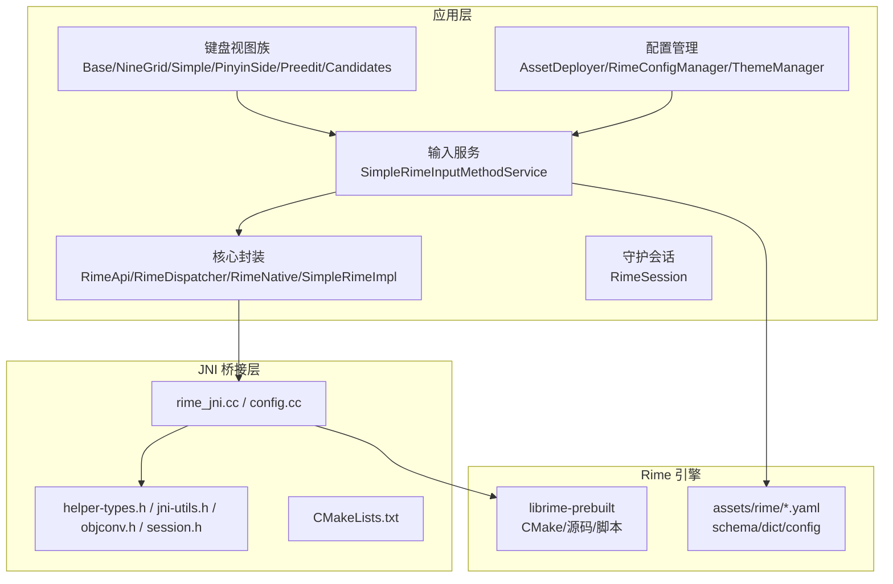
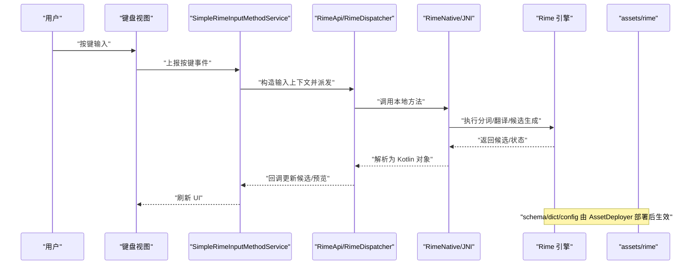
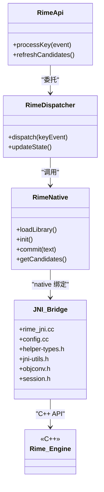
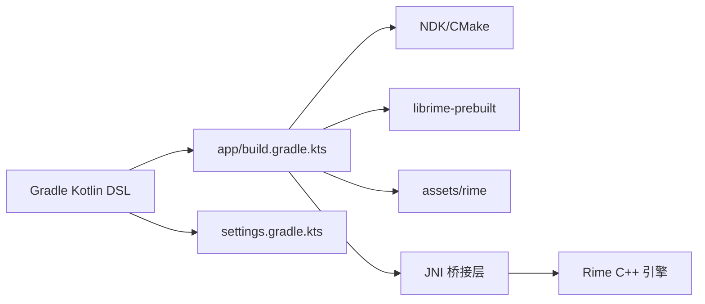

# 技术栈与依赖

<cite>
**本文引用的文件**   
- [build.gradle.kts](file://build.gradle.kts)
- [settings.gradle.kts](file://settings.gradle.kts)
- [gradle.properties](file://gradle.properties)
- [app/build.gradle.kts](file://app/build.gradle.kts)
- [AndroidManifest.xml](file://app/src/main/AndroidManifest.xml)
- [SimpleRimeInputMethodService.kt](file://app/src/main/java/com/ziyou/ime/ime/SimpleRimeInputMethodService.kt)
- [BaseKeyboardView.kt](file://app/src/main/java/com/ziyou/ime/ime/BaseKeyboardView.kt)
- [NineGridKeyboardView.kt](file://app/src/main/java/com/ziyou/ime/ime/NineGridKeyboardView.kt)
- [SimpleKeyboardView.kt](file://app/src/main/java/com/ziyou/ime/ime/SimpleKeyboardView.kt)
- [PinyinSideBarView.kt](file://app/src/main/java/com/ziyou/ime/ime/PinyinSideBarView.kt)
- [PreeditOverlayView.kt](file://app/src/main/java/com/ziyou/ime/ime/PreeditOverlayView.kt)
- [SimpleCandidatesView.kt](file://app/src/main/java/com/ziyou/ime/ime/SimpleCandidatesView.kt)
- [KeyCode.kt](file://app/src/main/java/com/ziyou/ime/ime/KeyCode.kt)
- [KeyboardType.kt](file://app/src/main/java/com/ziyou/ime/ime/KeyboardType.kt)
- [ZiyouApplication.kt](file://app/src/main/java/com/ziyou/ime/ZiyouApplication.kt)
- [AssetDeployer.kt](file://app/src/main/java/com/ziyou/ime/config/AssetDeployer.kt)
- [RimeConfigManager.kt](file://app/src/main/java/com/ziyou/ime/config/RimeConfigManager.kt)
- [ThemeManager.kt](file://app/src/main/java/com/ziyou/ime/config/ThemeManager.kt)
- [RimeApi.kt](file://app/src/main/java/com/ziyou/ime/core/RimeApi.kt)
- [RimeDispatcher.kt](file://app/src/main/java/com/ziyou/ime/core/RimeDispatcher.kt)
- [RimeMessage.kt](file://app/src/main/java/com/ziyou/ime/core/RimeMessage.kt)
- [RimeNative.kt](file://app/src/main/java/com/ziyou/ime/core/RimeNative.kt)
- [SimpleRimeImpl.kt](file://app/src/main/java/com/ziyou/ime/core/SimpleRimeImpl.kt)
- [ProtoTypes.kt](file://app/src/main/java/com/ziyou/ime/core/ProtoTypes.kt)
- [RimeSession.kt](file://app/src/main/java/com/ziyou/ime/daemon/RimeSession.kt)
- [KeyRecordStack.kt](file://app/src/main/java/com/ziyou/ime/data/KeyRecordStack.kt)
- [SideSymbol.kt](file://app/src/main/java/com/ziyou/ime/data/SideSymbol.kt)
- [T9PinYinUtils.kt](file://app/src/main/java/com/ziyou/ime/util/T9PinYinUtils.kt)
- [rime_jni.cc](file://app/src/main/jni/librime_jni/rime_jni.cc)
- [config.cc](file://app/src/main/jni/librime_jni/config.cc)
- [helper-types.h](file://app/src/main/jni/librime_jni/helper-types.h)
- [jni-utils.h](file://app/src/main/jni/librime_jni/jni-utils.h)
- [objconv.h](file://app/src/main/jni/librime_jni/objconv.h)
- [session.h](file://app/src/main/jni/librime_jni/session.h)
- [CMakeLists.txt](file://app/src/main/jni/librime_jni/CMakeLists.txt)
- [input_method.xml](file://app/src/main/res/xml/input_method.xml)
- [default.yaml](file://app/src/main/assets/rime/default.yaml)
- [luna_pinyin.schema.yaml](file://app/src/main/assets/rime/luna_pinyin.schema.yaml)
- [cangjie5.schema.yaml](file://app/src/main/assets/rime/cangjie5.schema.yaml)
- [t9.schema.yaml](file://app/src/main/assets/rime/t9.schema.yaml)
- [luna_pinyin.dict.yaml](file://app/src/main/assets/rime/luna_pinyin.dict.yaml)
- [symbols.yaml](file://app/src/main/assets/rime/symbols.yaml)
- [librime-prebuilt/README.md](file://librime-prebuilt/README.md)
- [librime-prebuilt/build.sh](file://librime-prebuilt/build.sh)
- [ARCHITECTURE.md](file://ARCHITECTURE.md)
- [README.md](file://README.md)
</cite>

## 目录
1. [简介](#简介)
2. [项目结构](#项目结构)
3. [核心组件](#核心组件)
4. [架构总览](#架构总览)
5. [详细组件分析](#详细组件分析)
6. [依赖关系分析](#依赖关系分析)
7. [性能考量](#性能考量)
8. [故障排查指南](#故障排查指南)
9. [结论](#结论)
10. [附录](#附录)

## 简介
本技术栈文档面向 ziyou-ime 项目的开发者与维护者，系统阐述该项目在 Android 输入法（IME）场景下的技术选型与实现要点。重点覆盖：
- Kotlin 作为主要开发语言及 Android IME API 的使用方式
- Rime C++ 引擎的集成路径、JNI 桥接层设计与数据流
- Gradle Kotlin DSL 构建配置与第三方依赖管理
- 预编译 Rime 库与插件生态的使用策略
- 开发环境要求、工具链与版本兼容性说明
- 技术选型的理由与优势，帮助理解架构决策

## 项目结构
项目采用多模块组织，顶层包含应用模块 app、核心逻辑 core-logic（当前为空占位）、以及 librime-prebuilt（Rime 预构建产物与脚本）。关键目录职责如下：
- app/src/main/java/com/ziyou/ime：Kotlin 业务代码，包含 IME 服务、键盘视图、配置管理、核心 Rime 封装、守护会话等
- app/src/main/jni/librime_jni：JNI 桥接层，负责将 Kotlin 调用映射到 Rime C++ API
- app/src/main/assets/rime：Rime 配置文件与词库资源，随应用安装部署
- app/src/main/res/xml/input_method.xml：IME 声明与能力描述
- app/build.gradle.kts：应用模块构建脚本，定义依赖、NDK、CMake、资源打包等
- build.gradle.kts/settings.gradle.kts：顶层构建与模块编排
- gradle.properties：Gradle 与 NDK 相关全局属性
- librime-prebuilt：Rime 源码与预构建脚本，用于生成平台适配的静态/动态库

图表来源 
- [SimpleRimeInputMethodService.kt:1-200](file://app/src/main/java/com/ziyou/ime/ime/SimpleRimeInputMethodService.kt#L1-L200)
- [BaseKeyboardView.kt:1-200](file://app/src/main/java/com/ziyou/ime/ime/BaseKeyboardView.kt#L1-L200)
- [RimeApi.kt:1-200](file://app/src/main/java/com/ziyou/ime/core/RimeApi.kt#L1-L200)
- [rime_jni.cc:1-200](file://app/src/main/jni/librime_jni/rime_jni.cc#L1-L200)
- [CMakeLists.txt:1-200](file://app/src/main/jni/librime_jni/CMakeLists.txt#L1-L200)
- [default.yaml:1-200](file://app/src/main/assets/rime/default.yaml#L1-L200)

章节来源
- [README.md:1-200](file://README.md#L1-L200)
- [ARCHITECTURE.md:1-200](file://ARCHITECTURE.md#L1-L200)
- [app/build.gradle.kts:1-200](file://app/build.gradle.kts#L1-L200)
- [build.gradle.kts:1-200](file://build.gradle.kts#L1-L200)
- [settings.gradle.kts:1-200](file://settings.gradle.kts#L1-L200)
- [gradle.properties:1-200](file://gradle.properties#L1-L200)

## 核心组件
- 输入法服务与 UI
  - SimpleRimeInputMethodService：继承 Android InputMethodService，处理焦点、软键盘显示、事件分发与候选更新
  - 键盘视图族：BaseKeyboardView 抽象基类，NineGridKeyboardView（九宫格）、SimpleKeyboardView（全键）、PinyinSideBarView（拼音侧边栏）、PreeditOverlayView（编辑预览）、SimpleCandidatesView（候选列表）
- Rime 核心封装
  - RimeApi：对外暴露的 Kotlin 接口，屏蔽 JNI 细节
  - RimeDispatcher：消息派发与状态同步
  - RimeNative：JNI 方法声明与本地库加载
  - SimpleRimeImpl：基于 Rime 的轻量实现
  - ProtoTypes：跨进程/线程通信的数据模型
- 配置与资源
  - AssetDeployer：将 assets/rime 中的 schema/dict/config 部署到运行时目录
  - RimeConfigManager：读写 Rime 配置项
  - ThemeManager：主题切换与样式管理
- 守护会话
  - RimeSession：生命周期管理与会话隔离，避免多线程竞争
- 工具与数据
  - KeyRecordStack：按键历史栈
  - SideSymbol：侧边符号表
  - T9PinYinUtils：九宫格拼音辅助算法

章节来源
- [SimpleRimeInputMethodService.kt:1-200](file://app/src/main/java/com/ziyou/ime/ime/SimpleRimeInputMethodService.kt#L1-L200)
- [BaseKeyboardView.kt:1-200](file://app/src/main/java/com/ziyou/ime/ime/BaseKeyboardView.kt#L1-L200)
- [NineGridKeyboardView.kt:1-200](file://app/src/main/java/com/ziyou/ime/ime/NineGridKeyboardView.kt#L1-L200)
- [SimpleKeyboardView.kt:1-200](file://app/src/main/java/com/ziyou/ime/ime/SimpleKeyboardView.kt#L1-L200)
- [PinyinSideBarView.kt:1-200](file://app/src/main/java/com/ziyou/ime/ime/PinyinSideBarView.kt#L1-L200)
- [PreeditOverlayView.kt:1-200](file://app/src/main/java/com/ziyou/ime/ime/PreeditOverlayView.kt#L1-L200)
- [SimpleCandidatesView.kt:1-200](file://app/src/main/java/com/ziyou/ime/ime/SimpleCandidatesView.kt#L1-L200)
- [RimeApi.kt:1-200](file://app/src/main/java/com/ziyou/ime/core/RimeApi.kt#L1-L200)
- [RimeDispatcher.kt:1-200](file://app/src/main/java/com/ziyou/ime/core/RimeDispatcher.kt#L1-L200)
- [RimeNative.kt:1-200](file://app/src/main/java/com/ziyou/ime/core/RimeNative.kt#L1-L200)
- [SimpleRimeImpl.kt:1-200](file://app/src/main/java/com/ziyou/ime/core/SimpleRimeImpl.kt#L1-L200)
- [RimeSession.kt:1-200](file://app/src/main/java/com/ziyou/ime/daemon/RimeSession.kt#L1-L200)
- [AssetDeployer.kt:1-200](file://app/src/main/java/com/ziyou/ime/config/AssetDeployer.kt#L1-L200)
- [RimeConfigManager.kt:1-200](file://app/src/main/java/com/ziyou/ime/config/RimeConfigManager.kt#L1-L200)
- [ThemeManager.kt:1-200](file://app/src/main/java/com/ziyou/ime/config/ThemeManager.kt#L1-L200)
- [KeyRecordStack.kt:1-200](file://app/src/main/java/com/ziyou/ime/data/KeyRecordStack.kt#L1-L200)
- [SideSymbol.kt:1-200](file://app/src/main/java/com/ziyou/ime/data/SideSymbol.kt#L1-L200)
- [T9PinYinUtils.kt:1-200](file://app/src/main/java/com/ziyou/ime/util/T9PinYinUtils.kt#L1-L200)

## 架构总览
整体架构遵循“UI 层 -> IME 服务 -> 核心封装 -> JNI 桥接 -> Rime 引擎”的分层设计，确保关注点分离与可测试性。

图表来源 
- [SimpleRimeInputMethodService.kt:1-200](file://app/src/main/java/com/ziyou/ime/ime/SimpleRimeInputMethodService.kt#L1-L200)
- [RimeApi.kt:1-200](file://app/src/main/java/com/ziyou/ime/core/RimeApi.kt#L1-L200)
- [RimeNative.kt:1-200](file://app/src/main/java/com/ziyou/ime/core/RimeNative.kt#L1-L200)
- [rime_jni.cc:1-200](file://app/src/main/jni/librime_jni/rime_jni.cc#L1-L200)
- [default.yaml:1-200](file://app/src/main/assets/rime/default.yaml#L1-L200)

## 详细组件分析

### Kotlin + Android IME API
- 使用 InputMethodService 作为入口，结合自定义 View 实现灵活的键盘布局与交互
- 通过 BaseKeyboardView 抽象出通用行为，派生出多种键盘类型以适配不同输入模式
- 使用 XML 声明 IME 能力与软键盘布局，便于配置化扩展

章节来源
- [SimpleRimeInputMethodService.kt:1-200](file://app/src/main/java/com/ziyou/ime/ime/SimpleRimeInputMethodService.kt#L1-L200)
- [BaseKeyboardView.kt:1-200](file://app/src/main/java/com/ziyou/ime/ime/BaseKeyboardView.kt#L1-L200)
- [NineGridKeyboardView.kt:1-200](file://app/src/main/java/com/ziyou/ime/ime/NineGridKeyboardView.kt#L1-L200)
- [SimpleKeyboardView.kt:1-200](file://app/src/main/java/com/ziyou/ime/ime/SimpleKeyboardView.kt#L1-L200)
- [PinyinSideBarView.kt:1-200](file://app/src/main/java/com/ziyou/ime/ime/PinyinSideBarView.kt#L1-L200)
- [PreeditOverlayView.kt:1-200](file://app/src/main/java/com/ziyou/ime/ime/PreeditOverlayView.kt#L1-L200)
- [SimpleCandidatesView.kt:1-200](file://app/src/main/java/com/ziyou/ime/ime/SimpleCandidatesView.kt#L1-L200)
- [input_method.xml:1-200](file://app/src/main/res/xml/input_method.xml#L1-L200)

### Rime 引擎集成与 JNI 桥接
- RimeNative 声明 native 方法，RimeDispatcher 负责消息派发与状态同步
- rime_jni.cc 与 config.cc 实现 JNI 绑定，调用 Rime C++ API 完成分词、翻译、候选生成
- helper-types.h、jni-utils.h、objconv.h、session.h 提供类型转换、工具函数与会话管理
- CMakeLists.txt 定义 JNI 模块构建规则与链接目标

图表来源 
- [RimeApi.kt:1-200](file://app/src/main/java/com/ziyou/ime/core/RimeApi.kt#L1-L200)
- [RimeDispatcher.kt:1-200](file://app/src/main/java/com/ziyou/ime/core/RimeDispatcher.kt#L1-L200)
- [RimeNative.kt:1-200](file://app/src/main/java/com/ziyou/ime/core/RimeNative.kt#L1-L200)
- [rime_jni.cc:1-200](file://app/src/main/jni/librime_jni/rime_jni.cc#L1-L200)
- [config.cc:1-200](file://app/src/main/jni/librime_jni/config.cc#L1-L200)
- [helper-types.h:1-200](file://app/src/main/jni/librime_jni/helper-types.h#L1-L200)
- [jni-utils.h:1-200](file://app/src/main/jni/librime_jni/jni-utils.h#L1-L200)
- [objconv.h:1-200](file://app/src/main/jni/librime_jni/objconv.h#L1-L200)
- [session.h:1-200](file://app/src/main/jni/librime_jni/session.h#L1-L200)

章节来源
- [RimeApi.kt:1-200](file://app/src/main/java/com/ziyou/ime/core/RimeApi.kt#L1-L200)
- [RimeDispatcher.kt:1-200](file://app/src/main/java/com/ziyou/ime/core/RimeDispatcher.kt#L1-L200)
- [RimeNative.kt:1-200](file://app/src/main/java/com/ziyou/ime/core/RimeNative.kt#L1-L200)
- [SimpleRimeImpl.kt:1-200](file://app/src/main/java/com/ziyou/ime/core/SimpleRimeImpl.kt#L1-L200)
- [ProtoTypes.kt:1-200](file://app/src/main/java/com/ziyou/ime/core/ProtoTypes.kt#L1-L200)
- [rime_jni.cc:1-200](file://app/src/main/jni/librime_jni/rime_jni.cc#L1-L200)
- [config.cc:1-200](file://app/src/main/jni/librime_jni/config.cc#L1-L200)
- [CMakeLists.txt:1-200](file://app/src/main/jni/librime_jni/CMakeLists.txt#L1-L200)

### 配置与资源管理
- AssetDeployer：将 assets/rime 中的 schema、dict、config 部署至运行时目录，确保 Rime 正确加载
- RimeConfigManager：读取/写入 Rime 配置项，支持热更新
- ThemeManager：统一管理主题资源与样式切换

章节来源
- [AssetDeployer.kt:1-200](file://app/src/main/java/com/ziyou/ime/config/AssetDeployer.kt#L1-L200)
- [RimeConfigManager.kt:1-200](file://app/src/main/java/com/ziyou/ime/config/RimeConfigManager.kt#L1-L200)
- [ThemeManager.kt:1-200](file://app/src/main/java/com/ziyou/ime/config/ThemeManager.kt#L1-L200)
- [default.yaml:1-200](file://app/src/main/assets/rime/default.yaml#L1-L200)
- [luna_pinyin.schema.yaml:1-200](file://app/src/main/assets/rime/luna_pinyin.schema.yaml#L1-L200)
- [cangjie5.schema.yaml:1-200](file://app/src/main/assets/rime/cangjie5.schema.yaml#L1-L200)
- [t9.schema.yaml:1-200](file://app/src/main/assets/rime/t9.schema.yaml#L1-L200)
- [luna_pinyin.dict.yaml:1-200](file://app/src/main/assets/rime/luna_pinyin.dict.yaml#L1-L200)
- [symbols.yaml:1-200](file://app/src/main/assets/rime/symbols.yaml#L1-L200)

### 守护会话与会话隔离
- RimeSession：封装 Rime 引擎的生命周期，提供会话创建、销毁与并发控制
- 通过会话隔离避免多线程竞争，提升稳定性与响应速度

章节来源
- [RimeSession.kt:1-200](file://app/src/main/java/com/ziyou/ime/daemon/RimeSession.kt#L1-L200)

### 工具与数据模型
- KeyRecordStack：维护按键历史，支持撤销/重做
- SideSymbol：侧边符号表，提升输入效率
- T9PinYinUtils：九宫格拼音辅助算法，优化候选排序

章节来源
- [KeyRecordStack.kt:1-200](file://app/src/main/java/com/ziyou/ime/data/KeyRecordStack.kt#L1-L200)
- [SideSymbol.kt:1-200](file://app/src/main/java/com/ziyou/ime/data/SideSymbol.kt#L1-L200)
- [T9PinYinUtils.kt:1-200](file://app/src/main/java/com/ziyou/ime/util/T9PinYinUtils.kt#L1-L200)

## 依赖关系分析
- 构建系统
  - Gradle Kotlin DSL：顶层 build.gradle.kts 与 settings.gradle.kts 统一编排模块
  - app/build.gradle.kts：定义 NDK、CMake、依赖库、资源打包
  - gradle.properties：设置 NDK 路径、编译参数等
- 第三方依赖
  - Rime 预构建库：librime-prebuilt 提供 CMake 脚本与构建产物，便于跨平台集成
  - JNI 桥接：rime_jni.cc 与头文件构成桥接层，屏蔽 C++ 复杂度
- 资源依赖
  - assets/rime：schema/dict/config 决定输入法行为与候选质量

图表来源 
- [build.gradle.kts:1-200](file://build.gradle.kts#L1-L200)
- [settings.gradle.kts:1-200](file://settings.gradle.kts#L1-L200)
- [app/build.gradle.kts:1-200](file://app/build.gradle.kts#L1-L200)
- [gradle.properties:1-200](file://gradle.properties#L1-L200)
- [librime-prebuilt/README.md:1-200](file://librime-prebuilt/README.md#L1-L200)
- [librime-prebuilt/build.sh:1-200](file://librime-prebuilt/build.sh#L1-L200)

章节来源
- [build.gradle.kts:1-200](file://build.gradle.kts#L1-L200)
- [settings.gradle.kts:1-200](file://settings.gradle.kts#L1-L200)
- [app/build.gradle.kts:1-200](file://app/build.gradle.kts#L1-L200)
- [gradle.properties:1-200](file://gradle.properties#L1-L200)
- [librime-prebuilt/README.md:1-200](file://librime-prebuilt/README.md#L1-L200)
- [librime-prebuilt/build.sh:1-200](file://librime-prebuilt/build.sh#L1-L200)

## 性能考量
- JNI 调用开销：尽量减少频繁往返，批量处理输入事件
- 内存管理：合理分配与释放 Rime 会话，避免泄漏
- 候选生成：利用缓存与异步计算，降低主线程阻塞
- 资源加载：按需加载 schema/dict，减少启动时间
- 渲染优化：键盘视图复用与懒加载，减少重绘

[本节为通用指导，不直接分析具体文件]

## 故障排查指南
- 常见问题
  - 无法加载 Rime 库：检查 NDK/CMake 配置与 ABI 匹配
  - 配置未生效：确认 AssetDeployer 部署路径与权限
  - 候选异常：校验 schema/dict 语法与依赖关系
  - 崩溃与 ANR：定位 JNI 异常与主线程耗时操作
- 调试建议
  - 启用 Rime 日志，观察分词与翻译过程
  - 使用 Android Studio 调试器附加 Native 进程
  - 逐步验证配置项与资源路径

章节来源
- [AndroidManifest.xml:1-200](file://app/src/main/AndroidManifest.xml#L1-L200)
- [CMakeLists.txt:1-200](file://app/src/main/jni/librime_jni/CMakeLists.txt#L1-L200)
- [rime_jni.cc:1-200](file://app/src/main/jni/librime_jni/rime_jni.cc#L1-L200)
- [AssetDeployer.kt:1-200](file://app/src/main/java/com/ziyou/ime/config/AssetDeployer.kt#L1-L200)

## 结论
ziyou-ime 通过 Kotlin + Android IME API 与 Rime C++ 引擎的深度集成，实现了高性能、可扩展的输入法方案。分层清晰的架构、完善的 JNI 桥接与灵活的配置管理，使项目具备良好的可维护性与可移植性。借助 Gradle Kotlin DSL 与预构建 Rime 库，开发者可以快速搭建与迭代输入法功能。

[本节为总结，不直接分析具体文件]

## 附录
- 开发环境要求
  - Android Studio 最新稳定版
  - NDK 与 CMake 版本与 gradle.properties 一致
  - JDK 版本满足 Gradle 要求
- 工具链配置
  - 使用 librime-prebuilt 构建脚本生成平台适配库
  - 通过 CMakeLists.txt 定制 JNI 模块与依赖
- 版本兼容性
  - 保持 Rime 版本与 schema/dict 兼容
  - 定期升级 Gradle/NDK 以获得安全与性能改进

[本节为补充信息，不直接分析具体文件]