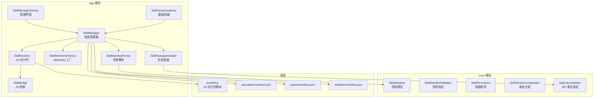
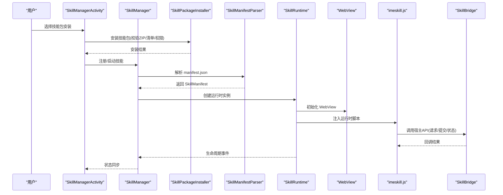
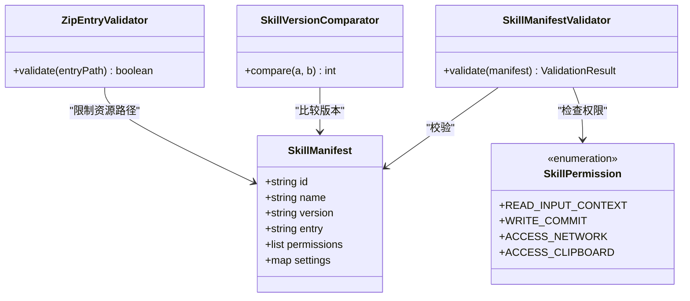
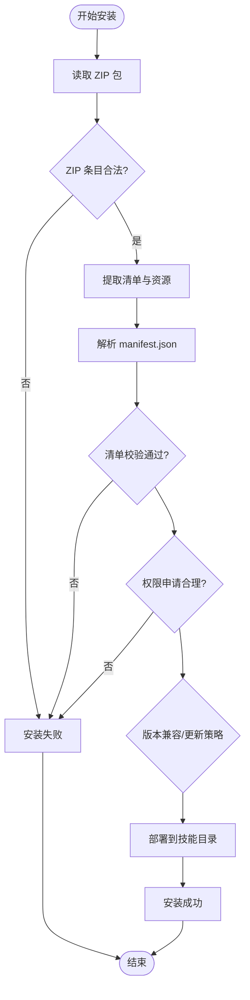
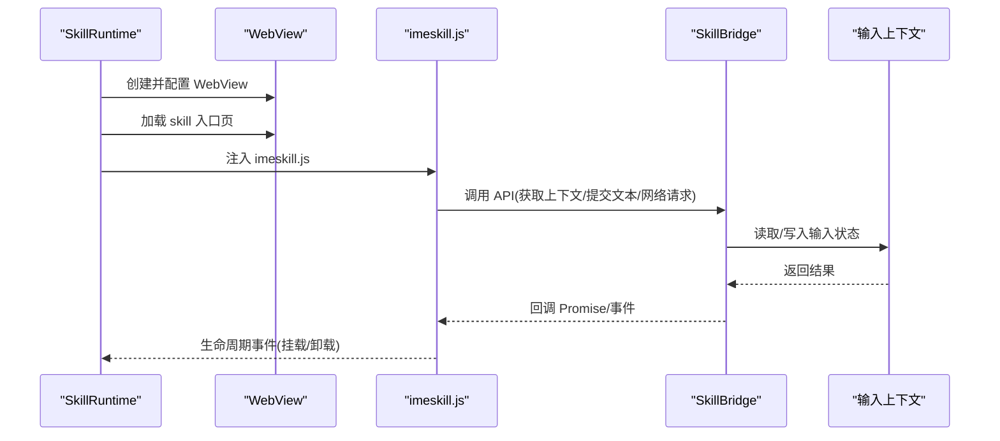
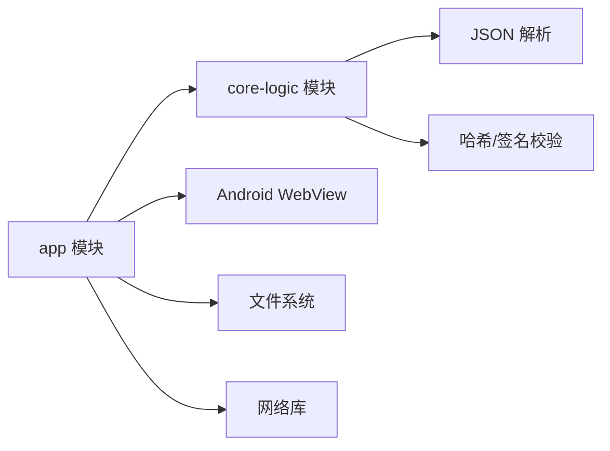

# 技能开发指南

<cite>
**本文引用的文件**   
- [app/src/main/assets/skills/calculator/manifest.json](file://app/src/main/assets/skills/calculator/manifest.json)
- [app/src/main/assets/skills/quote/manifest.json](file://app/src/main/assets/skills/quote/manifest.json)
- [app/src/main/assets/skills/weather/manifest.json](file://app/src/main/assets/skills/weather/manifest.json)
- [app/src/main/assets/skill_runtime/imeskill.js](file://app/src/main/assets/skill_runtime/imeskill.js)
- [app/src/main/java/com/ziyou/ime/skill/SkillManager.kt](file://app/src/main/java/com/ziyou/ime/skill/SkillManager.kt)
- [app/src/main/java/com/ziyou/ime/skill/SkillRuntime.kt](file://app/src/main/java/com/ziyou/ime/skill/SkillRuntime.kt)
- [app/src/main/java/com/ziyou/ime/skill/SkillBridge.kt](file://app/src/main/java/com/ziyou/ime/skill/SkillBridge.kt)
- [app/src/main/java/com/ziyou/ime/skill/SkillWebViewFactory.kt](file://app/src/main/java/com/ziyou/ime/skill/SkillWebViewFactory.kt)
- [app/src/main/java/com/ziyou/ime/skill/SkillManifestParser.kt](file://app/src/main/java/com/ziyou/ime/skill/SkillManifestParser.kt)
- [app/src/main/java/com/ziyou/ime/skill/SkillPackageInstaller.kt](file://app/src/main/java/com/ziyou/ime/skill/SkillPackageInstaller.kt)
- [core-logic/src/main/java/com/ziyou/ime/core/skill/SkillManifest.kt](file://core-logic/src/main/java/com/ziyou/ime/core/skill/SkillManifest.kt)
- [core-logic/src/main/java/com/ziyou/ime/core/skill/SkillManifestValidator.kt](file://core-logic/src/main/java/com/ziyou/ime/core/skill/SkillManifestValidator.kt)
- [core-logic/src/main/java/com/ziyou/ime/core/skill/SkillPermission.kt](file://core-logic/src/main/java/com/ziyou/ime/core/skill/SkillPermission.kt)
- [core-logic/src/main/java/com/ziyou/ime/core/skill/SkillVersionComparator.kt](file://core-logic/src/main/java/com/ziyou/ime/core/skill/SkillVersionComparator.kt)
- [core-logic/src/main/java/com/ziyou/ime/core/skill/ZipEntryValidator.kt](file://core-logic/src/main/java/com/ziyou/ime/core/skill/ZipEntryValidator.kt)
- [app/src/main/java/com/ziyou/ime/ime/SkillPanelContainer.kt](file://app/src/main/java/com/ziyou/ime/ime/SkillPanelContainer.kt)
- [app/src/main/java/com/ziyou/ime/ui/SkillManagerActivity.kt](file://app/src/main/java/com/ziyou/ime/ui/SkillManagerActivity.kt)
</cite>

## 目录
1. [简介](#简介)
2. [项目结构](#项目结构)
3. [核心组件](#核心组件)
4. [架构总览](#架构总览)
5. [详细组件分析](#详细组件分析)
6. [依赖分析](#依赖分析)
7. [性能考虑](#性能考虑)
8. [故障排查指南](#故障排查指南)
9. [结论](#结论)
10. [附录](#附录)

## 简介
本指南面向希望为输入法应用开发“技能插件”的开发者。技能是以 Web 技术（HTML/JS）实现的轻量扩展，通过统一的运行时与桥接机制与输入法主进程通信，提供如计算器、天气查询、引用插入等增强能力。本文从系统架构、数据流、安全校验、安装部署到调试排错，给出循序渐进的开发指引。

## 项目结构
技能相关代码分布在两个模块：
- app 模块：负责技能运行时的 WebView 容器、JavaScript 桥接、技能包安装与 UI 管理。
- core-logic 模块：定义技能清单模型、权限、版本比较与打包校验等通用逻辑。

图表来源
- [app/src/main/java/com/ziyou/ime/skill/SkillManager.kt](file://app/src/main/java/com/ziyou/ime/skill/SkillManager.kt)
- [app/src/main/java/com/ziyou/ime/skill/SkillRuntime.kt](file://app/src/main/java/com/ziyou/ime/skill/SkillRuntime.kt)
- [app/src/main/java/com/ziyou/ime/skill/SkillBridge.kt](file://app/src/main/java/com/ziyou/ime/skill/SkillBridge.kt)
- [app/src/main/java/com/ziyou/ime/skill/SkillWebViewFactory.kt](file://app/src/main/java/com/ziyou/ime/skill/SkillWebViewFactory.kt)
- [app/src/main/java/com/ziyou/ime/skill/SkillManifestParser.kt](file://app/src/main/java/com/ziyou/ime/skill/SkillManifestParser.kt)
- [app/src/main/java/com/ziyou/ime/skill/SkillPackageInstaller.kt](file://app/src/main/java/com/ziyou/ime/skill/SkillPackageInstaller.kt)
- [core-logic/src/main/java/com/ziyou/ime/core/skill/SkillManifest.kt](file://core-logic/src/main/java/com/ziyou/ime/core/skill/SkillManifest.kt)
- [core-logic/src/main/java/com/ziyou/ime/core/skill/SkillManifestValidator.kt](file://core-logic/src/main/java/com/ziyou/ime/core/skill/SkillManifestValidator.kt)
- [core-logic/src/main/java/com/ziyou/ime/core/skill/SkillPermission.kt](file://core-logic/src/main/java/com/ziyou/ime/core/skill/SkillPermission.kt)
- [core-logic/src/main/java/com/ziyou/ime/core/skill/SkillVersionComparator.kt](file://core-logic/src/main/java/com/ziyou/ime/core/skill/SkillVersionComparator.kt)
- [core-logic/src/main/java/com/ziyou/ime/core/skill/ZipEntryValidator.kt](file://core-logic/src/main/java/com/ziyou/ime/core/skill/ZipEntryValidator.kt)
- [app/src/main/assets/skill_runtime/imeskill.js](file://app/src/main/assets/skill_runtime/imeskill.js)
- [app/src/main/assets/skills/calculator/manifest.json](file://app/src/main/assets/skills/calculator/manifest.json)
- [app/src/main/assets/skills/quote/manifest.json](file://app/src/main/assets/skills/quote/manifest.json)
- [app/src/main/assets/skills/weather/manifest.json](file://app/src/main/assets/skills/weather/manifest.json)

章节来源
- [app/src/main/java/com/ziyou/ime/skill/SkillManager.kt](file://app/src/main/java/com/ziyou/ime/skill/SkillManager.kt)
- [core-logic/src/main/java/com/ziyou/ime/core/skill/SkillManifest.kt](file://core-logic/src/main/java/com/ziyou/ime/core/skill/SkillManifest.kt)

## 核心组件
- 技能管理器（SkillManager）：统一注册、加载、启停技能，协调安装、解析与生命周期。
- 运行时（SkillRuntime）：创建并维护 WebView，注入 imeskill.js，处理 JS 与 Kotlin 的双向调用。
- 桥接层（SkillBridge）：暴露给技能的 API 集合，封装输入上下文、候选项、剪贴板、网络等能力。
- 清单解析（SkillManifestParser）：读取 manifest.json，构建 SkillManifest 模型。
- 包安装器（SkillPackageInstaller）：校验 ZIP 结构、白名单、签名与版本，完成技能包部署。
- 面板容器（SkillPanelContainer）：在输入法 UI 中承载技能页面，控制显示与交互。
- 管理界面（SkillManagerActivity）：用户视角的技能列表、安装、启用/禁用与更新。

章节来源
- [app/src/main/java/com/ziyou/ime/skill/SkillManager.kt](file://app/src/main/java/com/ziyou/ime/skill/SkillManager.kt)
- [app/src/main/java/com/ziyou/ime/skill/SkillRuntime.kt](file://app/src/main/java/com/ziyou/ime/skill/SkillRuntime.kt)
- [app/src/main/java/com/ziyou/ime/skill/SkillBridge.kt](file://app/src/main/java/com/ziyou/ime/skill/SkillBridge.kt)
- [app/src/main/java/com/ziyou/ime/skill/SkillManifestParser.kt](file://app/src/main/java/com/ziyou/ime/skill/SkillManifestParser.kt)
- [app/src/main/java/com/ziyou/ime/skill/SkillPackageInstaller.kt](file://app/src/main/java/com/ziyou/ime/skill/SkillPackageInstaller.kt)
- [app/src/main/java/com/ziyou/ime/ime/SkillPanelContainer.kt](file://app/src/main/java/com/ziyou/ime/ime/SkillPanelContainer.kt)
- [app/src/main/java/com/ziyou/ime/ui/SkillManagerActivity.kt](file://app/src/main/java/com/ziyou/ime/ui/SkillManagerActivity.kt)

## 架构总览
技能系统采用“宿主 + 插件”模式：宿主负责安全边界、生命周期与资源调度；插件以 Web 形式实现业务逻辑，通过标准化 JS API 与宿主通信。

图表来源
- [app/src/main/java/com/ziyou/ime/ui/SkillManagerActivity.kt](file://app/src/main/java/com/ziyou/ime/ui/SkillManagerActivity.kt)
- [app/src/main/java/com/ziyou/ime/skill/SkillManager.kt](file://app/src/main/java/com/ziyou/ime/skill/SkillManager.kt)
- [app/src/main/java/com/ziyou/ime/skill/SkillPackageInstaller.kt](file://app/src/main/java/com/ziyou/ime/skill/SkillPackageInstaller.kt)
- [app/src/main/java/com/ziyou/ime/skill/SkillManifestParser.kt](file://app/src/main/java/com/ziyou/ime/skill/SkillManifestParser.kt)
- [app/src/main/java/com/ziyou/ime/skill/SkillRuntime.kt](file://app/src/main/java/com/ziyou/ime/skill/SkillRuntime.kt)
- [app/src/main/assets/skill_runtime/imeskill.js](file://app/src/main/assets/skill_runtime/imeskill.js)
- [app/src/main/java/com/ziyou/ime/skill/SkillBridge.kt](file://app/src/main/java/com/ziyou/ime/skill/SkillBridge.kt)

## 详细组件分析

### 技能清单与模型
- 清单模型（SkillManifest）：描述技能 ID、名称、版本、入口、权限、兼容性等元数据。
- 清单校验（SkillManifestValidator）：校验必填字段、格式、权限合法性与冲突。
- 权限枚举（SkillPermission）：限定技能可访问的能力集，最小化授权。
- 版本比较（SkillVersionComparator）：语义化版本比较，用于更新策略。
- ZIP 条目校验（ZipEntryValidator）：限制可解压路径、防止越权访问。

图表来源
- [core-logic/src/main/java/com/ziyou/ime/core/skill/SkillManifest.kt](file://core-logic/src/main/java/com/ziyou/ime/core/skill/SkillManifest.kt)
- [core-logic/src/main/java/com/ziyou/ime/core/skill/SkillManifestValidator.kt](file://core-logic/src/main/java/com/ziyou/ime/core/skill/SkillManifestValidator.kt)
- [core-logic/src/main/java/com/ziyou/ime/core/skill/SkillPermission.kt](file://core-logic/src/main/java/com/ziyou/ime/core/skill/SkillPermission.kt)
- [core-logic/src/main/java/com/ziyou/ime/core/skill/SkillVersionComparator.kt](file://core-logic/src/main/java/com/ziyou/ime/core/skill/SkillVersionComparator.kt)
- [core-logic/src/main/java/com/ziyou/ime/core/skill/ZipEntryValidator.kt](file://core-logic/src/main/java/com/ziyou/ime/core/skill/ZipEntryValidator.kt)

章节来源
- [core-logic/src/main/java/com/ziyou/ime/core/skill/SkillManifest.kt](file://core-logic/src/main/java/com/ziyou/ime/core/skill/SkillManifest.kt)
- [core-logic/src/main/java/com/ziyou/ime/core/skill/SkillManifestValidator.kt](file://core-logic/src/main/java/com/ziyou/ime/core/skill/SkillManifestValidator.kt)
- [core-logic/src/main/java/com/ziyou/ime/core/skill/SkillPermission.kt](file://core-logic/src/main/java/com/ziyou/ime/core/skill/SkillPermission.kt)
- [core-logic/src/main/java/com/ziyou/ime/core/skill/SkillVersionComparator.kt](file://core-logic/src/main/java/com/ziyou/ime/core/skill/SkillVersionComparator.kt)
- [core-logic/src/main/java/com/ziyou/ime/core/skill/ZipEntryValidator.kt](file://core-logic/src/main/java/com/ziyou/ime/core/skill/ZipEntryValidator.kt)

### 技能包安装流程
安装器对技能包进行严格校验，确保安全性与一致性。

图表来源
- [app/src/main/java/com/ziyou/ime/skill/SkillPackageInstaller.kt](file://app/src/main/java/com/ziyou/ime/skill/SkillPackageInstaller.kt)
- [core-logic/src/main/java/com/ziyou/ime/core/skill/ZipEntryValidator.kt](file://core-logic/src/main/java/com/ziyou/ime/core/skill/ZipEntryValidator.kt)
- [core-logic/src/main/java/com/ziyou/ime/core/skill/SkillManifestValidator.kt](file://core-logic/src/main/java/com/ziyou/ime/core/skill/SkillManifestValidator.kt)
- [core-logic/src/main/java/com/ziyou/ime/core/skill/SkillVersionComparator.kt](file://core-logic/src/main/java/com/ziyou/ime/core/skill/SkillVersionComparator.kt)

章节来源
- [app/src/main/java/com/ziyou/ime/skill/SkillPackageInstaller.kt](file://app/src/main/java/com/ziyou/ime/skill/SkillPackageInstaller.kt)

### 运行时与桥接
运行时负责 WebView 生命周期与 JS 环境注入；桥接层将宿主能力暴露给技能。

图表来源
- [app/src/main/java/com/ziyou/ime/skill/SkillRuntime.kt](file://app/src/main/java/com/ziyou/ime/skill/SkillRuntime.kt)
- [app/src/main/java/com/ziyou/ime/skill/SkillBridge.kt](file://app/src/main/java/com/ziyou/ime/skill/SkillBridge.kt)
- [app/src/main/assets/skill_runtime/imeskill.js](file://app/src/main/assets/skill_runtime/imeskill.js)

章节来源
- [app/src/main/java/com/ziyou/ime/skill/SkillRuntime.kt](file://app/src/main/java/com/ziyou/ime/skill/SkillRuntime.kt)
- [app/src/main/java/com/ziyou/ime/skill/SkillBridge.kt](file://app/src/main/java/com/ziyou/ime/skill/SkillBridge.kt)
- [app/src/main/assets/skill_runtime/imeskill.js](file://app/src/main/assets/skill_runtime/imeskill.js)

### 面板容器与管理界面
- 面板容器（SkillPanelContainer）：在输入法上方或侧边展示技能页面，支持手势与焦点管理。
- 管理界面（SkillManagerActivity）：展示已安装技能、安装新技能、启用/禁用、查看详情。

章节来源
- [app/src/main/java/com/ziyou/ime/ime/SkillPanelContainer.kt](file://app/src/main/java/com/ziyou/ime/ime/SkillPanelContainer.kt)
- [app/src/main/java/com/ziyou/ime/ui/SkillManagerActivity.kt](file://app/src/main/java/com/ziyou/ime/ui/SkillManagerActivity.kt)

## 依赖分析
- 组件内聚性：SkillManager 作为门面聚合安装、解析、运行时与 UI 操作，降低外部耦合。
- 跨模块依赖：app 模块依赖 core-logic 的清单模型与校验工具，保证一致性与复用。
- 外部依赖：WebView、文件系统、网络库由宿主统一管理，技能仅通过桥接 API 使用。

图表来源
- [app/src/main/java/com/ziyou/ime/skill/SkillManager.kt](file://app/src/main/java/com/ziyou/ime/skill/SkillManager.kt)
- [core-logic/src/main/java/com/ziyou/ime/core/skill/SkillManifest.kt](file://core-logic/src/main/java/com/ziyou/ime/core/skill/SkillManifest.kt)

章节来源
- [app/src/main/java/com/ziyou/ime/skill/SkillManager.kt](file://app/src/main/java/com/ziyou/ime/skill/SkillManager.kt)
- [core-logic/src/main/java/com/ziyou/ime/core/skill/SkillManifest.kt](file://core-logic/src/main/java/com/ziyou/ime/core/skill/SkillManifest.kt)

## 性能考虑
- WebView 复用：避免频繁创建销毁，按需懒加载与缓存实例。
- 资源体积：压缩静态资源，按需加载首屏，延迟加载非关键资源。
- 通信开销：批量消息、节流与去抖，减少桥接调用频率。
- 内存占用：及时释放不再使用的视图与监听器，避免泄漏。
- 网络请求：合并请求、缓存响应、离线降级。

[本节为通用指导，不直接分析具体文件]

## 故障排查指南
- 安装失败
  - 检查 ZIP 结构与白名单路径是否合规。
  - 核对 manifest.json 必填字段与权限声明。
  - 确认版本兼容性与签名校验结果。
- 运行时异常
  - 确认 imeskill.js 正确注入且无语法错误。
  - 检查桥接 API 调用参数与权限是否满足。
  - 观察 WebView 日志与 JS Console 输出。
- 显示问题
  - 验证入口页面路径与资源路径是否正确。
  - 检查面板容器的尺寸与布局约束。
- 常见定位手段
  - 启用调试模式，打印安装与解析日志。
  - 使用设备日志过滤关键词（如“skill”、“manifest”）。
  - 逐步缩小范围：先验证清单，再验证资源，最后验证运行时。

章节来源
- [app/src/main/java/com/ziyou/ime/skill/SkillPackageInstaller.kt](file://app/src/main/java/com/ziyou/ime/skill/SkillPackageInstaller.kt)
- [app/src/main/java/com/ziyou/ime/skill/SkillManifestParser.kt](file://app/src/main/java/com/ziyou/ime/skill/SkillManifestParser.kt)
- [app/src/main/java/com/ziyou/ime/skill/SkillRuntime.kt](file://app/src/main/java/com/ziyou/ime/skill/SkillRuntime.kt)

## 结论
技能系统通过清晰的职责划分与安全边界，使 Web 技能能够以最小成本接入输入法生态。遵循清单规范、权限最小化与严格的安装校验，可显著提升稳定性与安全性。建议在新技能开发中优先完善清单与权限设计，再进行功能实现与联调。

[本节为总结性内容，不直接分析具体文件]

## 附录

### 技能清单示例与最佳实践
- 基础字段：id、name、version、entry、permissions。
- 版本策略：使用语义化版本，明确兼容范围。
- 权限原则：仅申请必要权限，避免过度授权。
- 资源组织：入口页与静态资源分离，便于缓存与更新。

章节来源
- [app/src/main/assets/skills/calculator/manifest.json](file://app/src/main/assets/skills/calculator/manifest.json)
- [app/src/main/assets/skills/quote/manifest.json](file://app/src/main/assets/skills/quote/manifest.json)
- [app/src/main/assets/skills/weather/manifest.json](file://app/src/main/assets/skills/weather/manifest.json)

### 快速上手步骤
- 准备技能包：包含 index.html、静态资源与 manifest.json。
- 编写清单：填写必要字段与权限。
- 本地调试：通过管理界面安装并启用技能。
- 联调测试：使用桥接 API 与输入上下文交互，验证功能与性能。

章节来源
- [app/src/main/java/com/ziyou/ime/ui/SkillManagerActivity.kt](file://app/src/main/java/com/ziyou/ime/ui/SkillManagerActivity.kt)
- [app/src/main/java/com/ziyou/ime/skill/SkillManager.kt](file://app/src/main/java/com/ziyou/ime/skill/SkillManager.kt)
- [app/src/main/assets/skill_runtime/imeskill.js](file://app/src/main/assets/skill_runtime/imeskill.js)