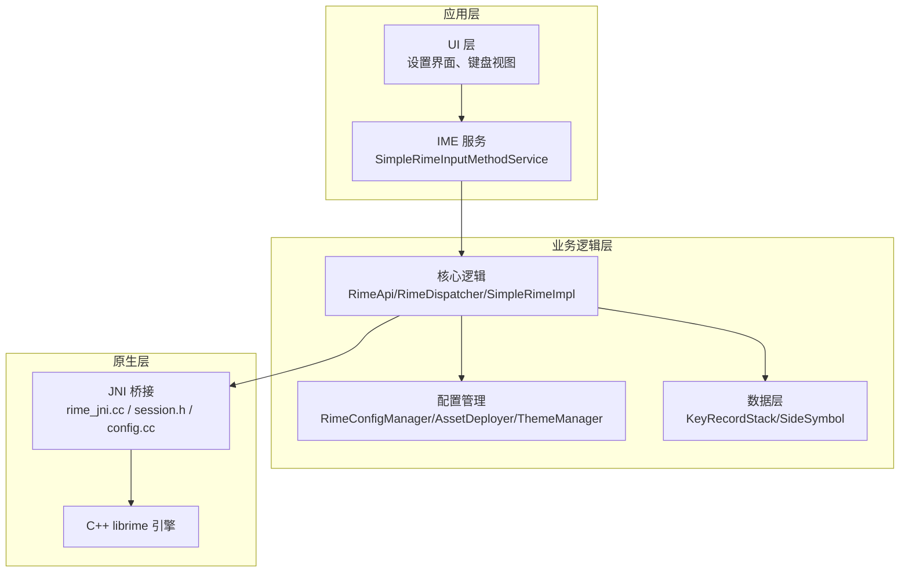
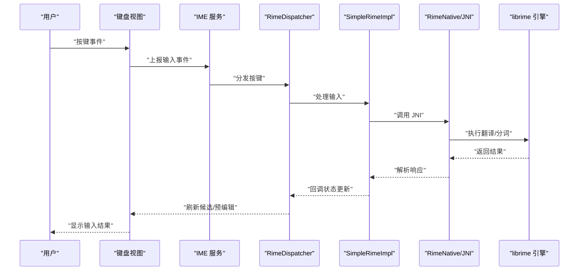
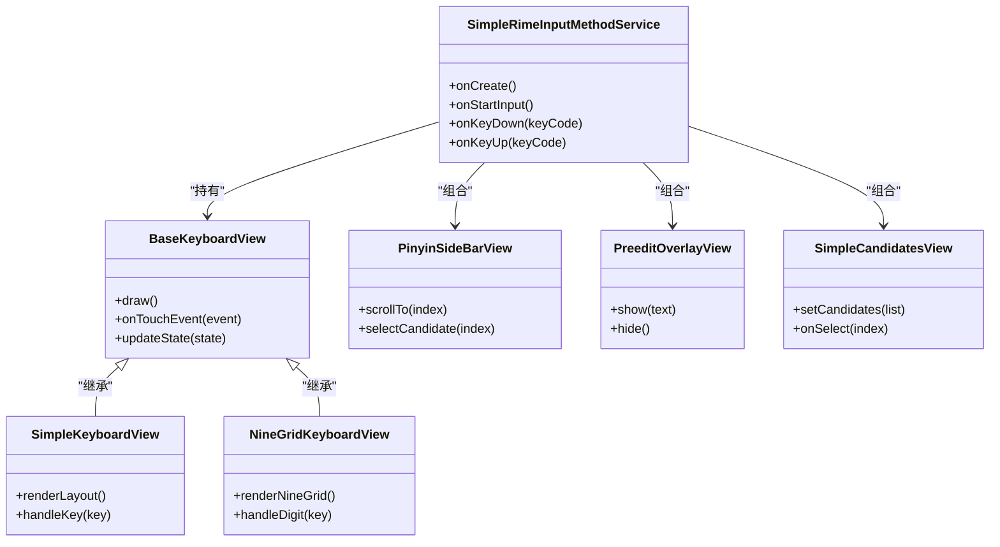
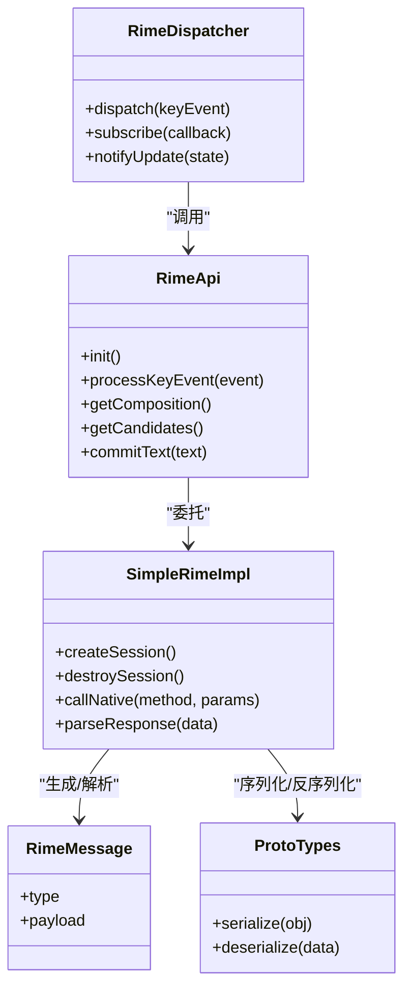
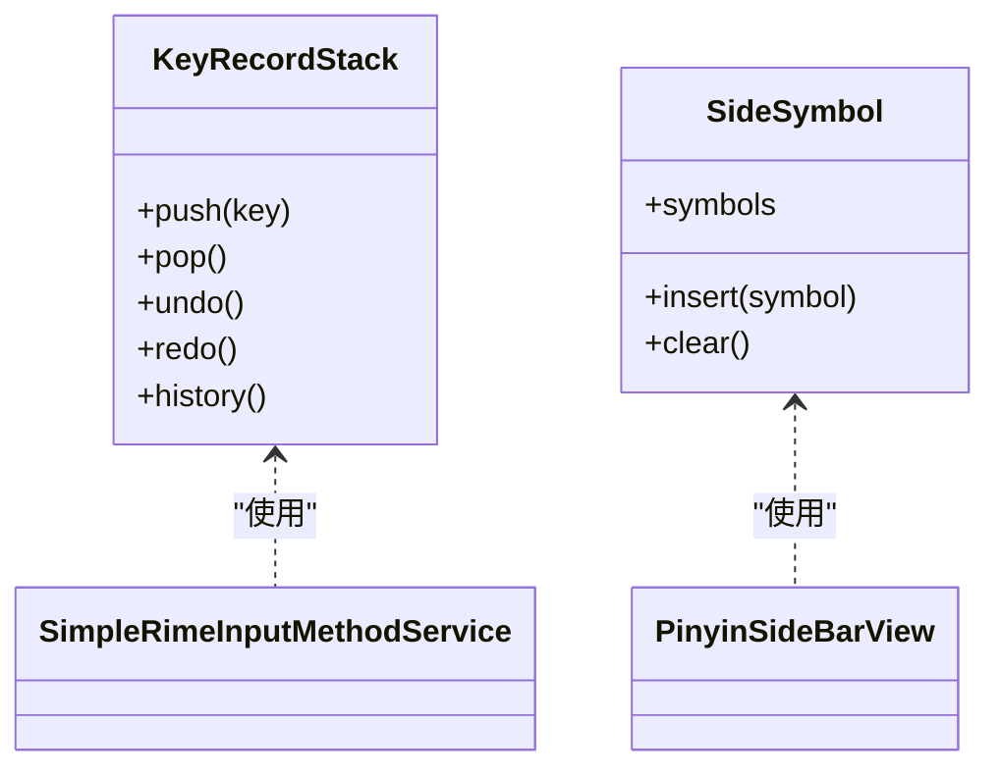
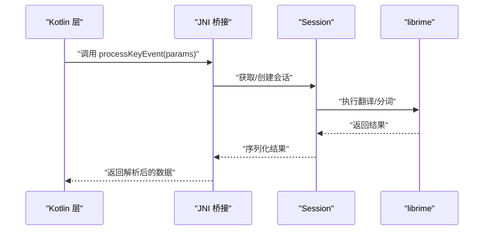
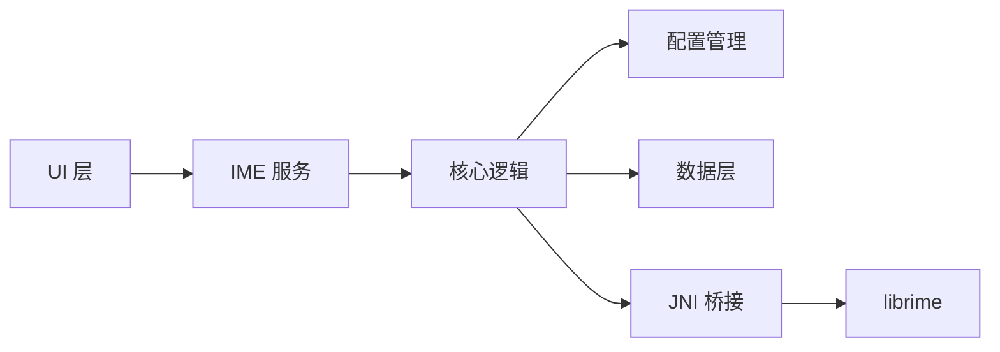

# 架构概览

<cite>
**本文引用的文件**   
- [app/src/main/java/com/ziyou/ime/ZiyouApplication.kt](file://app/src/main/java/com/ziyou/ime/ZiyouApplication.kt)
- [app/src/main/java/com/ziyou/ime/ime/SimpleRimeInputMethodService.kt](file://app/src/main/java/com/ziyou/ime/ime/SimpleRimeInputMethodService.kt)
- [app/src/main/java/com/ziyou/ime/ime/BaseKeyboardView.kt](file://app/src/main/java/com/ziyou/ime/ime/BaseKeyboardView.kt)
- [app/src/main/java/com/ziyou/ime/ime/SimpleKeyboardView.kt](file://app/src/main/java/com/ziyou/ime/ime/SimpleKeyboardView.kt)
- [app/src/main/java/com/ziyou/ime/ime/NineGridKeyboardView.kt](file://app/src/main/java/com/ziyou/ime/ime/NineGridKeyboardView.kt)
- [app/src/main/java/com/ziyou/ime/ime/PinyinSideBarView.kt](file://app/src/main/java/com/ziyou/ime/ime/PinyinSideBarView.kt)
- [app/src/main/java/com/ziyou/ime/ime/PreeditOverlayView.kt](file://app/src/main/java/com/ziyou/ime/ime/PreeditOverlayView.kt)
- [app/src/main/java/com/ziyou/ime/ime/SimpleCandidatesView.kt](file://app/src/main/java/com/ziyou/ime/ime/SimpleCandidatesView.kt)
- [app/src/main/java/com/ziyou/ime/ime/KeyboardType.kt](file://app/src/main/java/com/ziyou/ime/ime/KeyboardType.kt)
- [app/src/main/java/com/ziyou/ime/ime/KeyCode.kt](file://app/src/main/java/com/ziyou/ime/ime/KeyCode.kt)
- [app/src/main/java/com/ziyou/ime/core/RimeApi.kt](file://app/src/main/java/com/ziyou/ime/core/RimeApi.kt)
- [app/src/main/java/com/ziyou/ime/core/RimeDispatcher.kt](file://app/src/main/java/com/ziyou/ime/core/RimeDispatcher.kt)
- [app/src/main/java/com/ziyou/ime/core/RimeNative.kt](file://app/src/main/java/com/ziyou/ime/core/RimeNative.kt)
- [app/src/main/java/com/ziyou/ime/core/SimpleRimeImpl.kt](file://app/src/main/java/com/ziyou/ime/core/SimpleRimeImpl.kt)
- [app/src/main/java/com/ziyou/ime/core/RimeMessage.kt](file://app/src/main/java/com/ziyou/ime/core/RimeMessage.kt)
- [app/src/main/java/com/ziyou/ime/core/ProtoTypes.kt](file://app/src/main/java/com/ziyou/ime/core/ProtoTypes.kt)
- [app/src/main/java/com/ziyou/ime/daemon/RimeSession.kt](file://app/src/main/java/com/ziyou/ime/daemon/RimeSession.kt)
- [app/src/main/java/com/ziyou/ime/config/RimeConfigManager.kt](file://app/src/main/java/com/ziyou/ime/config/RimeConfigManager.kt)
- [app/src/main/java/com/ziyou/ime/config/AssetDeployer.kt](file://app/src/main/java/com/ziyou/ime/config/AssetDeployer.kt)
- [app/src/main/java/com/ziyou/ime/config/ThemeManager.kt](file://app/src/main/java/com/ziyou/ime/config/ThemeManager.kt)
- [app/src/main/java/com/ziyou/ime/data/KeyRecordStack.kt](file://app/src/main/java/com/ziyou/ime/data/KeyRecordStack.kt)
- [app/src/main/java/com/ziyou/ime/data/SideSymbol.kt](file://app/src/main/java/com/ziyou/ime/data/SideSymbol.kt)
- [app/src/main/java/com/ziyou/ime/ui/SettingsActivity.kt](file://app/src/main/java/com/ziyou/ime/ui/SettingsActivity.kt)
- [app/src/main/jni/librime_jni/rime_jni.cc](file://app/src/main/jni/librime_jni/rime_jni.cc)
- [app/src/main/jni/librime_jni/session.h](file://app/src/main/jni/librime_jni/session.h)
- [app/src/main/jni/librime_jni/config.cc](file://app/src/main/jni/librime_jni/config.cc)
- [app/src/main/jni/librime_jni/helper-types.h](file://app/src/main/jni/librime_jni/helper-types.h)
- [app/src/main/jni/librime_jni/jni-utils.h](file://app/src/main/jni/librime_jni/jni-utils.h)
- [app/src/main/jni/librime_jni/objconv.h](file://app/src/main/jni/librime_jni/objconv.h)
- [app/src/main/assets/rime/default.yaml](file://app/src/main/assets/rime/default.yaml)
- [app/src/main/assets/rime/luna_pinyin.schema.yaml](file://app/src/main/assets/rime/luna_pinyin.schema.yaml)
- [app/src/main/assets/rime/cangjie5.schema.yaml](file://app/src/main/assets/rime/cangjie5.schema.yaml)
- [app/src/main/assets/rime/t9.schema.yaml](file://app/src/main/assets/rime/t9.schema.yaml)
- [app/src/main/res/xml/input_method.xml](file://app/src/main/res/xml/input_method.xml)
</cite>

## 目录
1. [简介](#简介)
2. [项目结构](#项目结构)
3. [核心组件](#核心组件)
4. [架构总览](#架构总览)
5. [详细组件分析](#详细组件分析)
6. [依赖分析](#依赖分析)
7. [性能考量](#性能考量)
8. [故障排查指南](#故障排查指南)
9. [结论](#结论)
10. [附录](#附录)

## 简介
本文件为 ziyou-ime 输入法项目的架构概览文档，面向开发者与产品工程师，帮助快速理解系统整体结构与关键设计决策。项目采用分层架构与模块化设计：UI 层负责键盘视图与设置界面；业务逻辑层封装 Rime 引擎、调度消息与配置管理；数据层提供键位记录栈与侧边符号等轻量数据结构；原生层通过 JNI 桥接 C++ 的 librime，实现高性能输入处理。文档包含架构图、组件关系图、关键流程时序图与流程图，并说明扩展点与自定义机制。

## 项目结构
项目按功能域划分模块，主要目录职责如下：
- app/src/main/java/com/ziyou/ime：Android 应用主体，包含 IME 服务、UI 视图、核心逻辑、配置与数据模块
- app/src/main/jni/librime_jni：JNI 桥接代码，封装 librime C++ API
- app/src/main/assets/rime：Rime 资源（模式、词典、默认配置）
- app/src/main/res/xml：输入法声明与入口
- core-logic：纯 Java/Kotlin 逻辑库（当前为空或预留）
- librime-prebuilt：librime 源码与构建脚本（静态库集成参考）

**图表来源** 
- [app/src/main/java/com/ziyou/ime/ime/SimpleRimeInputMethodService.kt](file://app/src/main/java/com/ziyou/ime/ime/SimpleRimeInputMethodService.kt)
- [app/src/main/java/com/ziyou/ime/core/RimeApi.kt](file://app/src/main/java/com/ziyou/ime/core/RimeApi.kt)
- [app/src/main/java/com/ziyou/ime/core/RimeDispatcher.kt](file://app/src/main/java/com/ziyou/ime/core/RimeDispatcher.kt)
- [app/src/main/java/com/ziyou/ime/core/SimpleRimeImpl.kt](file://app/src/main/java/com/ziyou/ime/core/SimpleRimeImpl.kt)
- [app/src/main/java/com/ziyou/ime/config/RimeConfigManager.kt](file://app/src/main/java/com/ziyou/ime/config/RimeConfigManager.kt)
- [app/src/main/java/com/ziyou/ime/config/AssetDeployer.kt](file://app/src/main/java/com/ziyou/ime/config/AssetDeployer.kt)
- [app/src/main/java/com/ziyou/ime/data/KeyRecordStack.kt](file://app/src/main/java/com/ziyou/ime/data/KeyRecordStack.kt)
- [app/src/main/java/com/ziyou/ime/data/SideSymbol.kt](file://app/src/main/java/com/ziyou/ime/data/SideSymbol.kt)
- [app/src/main/jni/librime_jni/rime_jni.cc](file://app/src/main/jni/librime_jni/rime_jni.cc)
- [app/src/main/jni/librime_jni/session.h](file://app/src/main/jni/librime_jni/session.h)
- [app/src/main/jni/librime_jni/config.cc](file://app/src/main/jni/librime_jni/config.cc)

**章节来源**
- [app/src/main/res/xml/input_method.xml](file://app/src/main/res/xml/input_method.xml)
- [app/src/main/assets/rime/default.yaml](file://app/src/main/assets/rime/default.yaml)

## 核心组件
- IME 服务与 UI 视图
  - SimpleRimeInputMethodService：输入法服务入口，协调键盘视图与核心逻辑
  - BaseKeyboardView/SimpleKeyboardView/NineGridKeyboardView：基础键盘与九宫格键盘视图
  - PinyinSideBarView：拼音侧边栏，辅助选词与导航
  - PreeditOverlayView：预编辑文本覆盖层
  - SimpleCandidatesView：候选项展示
- 核心逻辑
  - RimeApi：对外暴露的 Rime 能力接口
  - RimeDispatcher：消息分发器，统一处理按键事件与状态更新
  - SimpleRimeImpl：Rime 的具体实现，封装会话生命周期与调用
  - RimeMessage/ProtoTypes：消息与协议类型定义
- 配置与资源
  - RimeConfigManager：Rime 配置加载与热更新
  - AssetDeployer：assets 中 rime 资源的部署与校验
  - ThemeManager：主题与样式管理
- 数据层
  - KeyRecordStack：按键历史栈，支持撤销/重做与统计
  - SideSymbol：侧边栏符号集合与映射
- 原生层
  - rime_jni.cc / session.h / config.cc：JNI 桥接，封装 librime 会话、配置与序列化

**章节来源**
- [app/src/main/java/com/ziyou/ime/ime/SimpleRimeInputMethodService.kt](file://app/src/main/java/com/ziyou/ime/ime/SimpleRimeInputMethodService.kt)
- [app/src/main/java/com/ziyou/ime/ime/BaseKeyboardView.kt](file://app/src/main/java/com/ziyou/ime/ime/BaseKeyboardView.kt)
- [app/src/main/java/com/ziyou/ime/ime/SimpleKeyboardView.kt](file://app/src/main/java/com/ziyou/ime/ime/SimpleKeyboardView.kt)
- [app/src/main/java/com/ziyou/ime/ime/NineGridKeyboardView.kt](file://app/src/main/java/com/ziyou/ime/ime/NineGridKeyboardView.kt)
- [app/src/main/java/com/ziyou/ime/ime/PinyinSideBarView.kt](file://app/src/main/java/com/ziyou/ime/ime/PinyinSideBarView.kt)
- [app/src/main/java/com/ziyou/ime/ime/PreeditOverlayView.kt](file://app/src/main/java/com/ziyou/ime/ime/PreeditOverlayView.kt)
- [app/src/main/java/com/ziyou/ime/ime/SimpleCandidatesView.kt](file://app/src/main/java/com/ziyou/ime/ime/SimpleCandidatesView.kt)
- [app/src/main/java/com/ziyou/ime/core/RimeApi.kt](file://app/src/main/java/com/ziyou/ime/core/RimeApi.kt)
- [app/src/main/java/com/ziyou/ime/core/RimeDispatcher.kt](file://app/src/main/java/com/ziyou/ime/core/RimeDispatcher.kt)
- [app/src/main/java/com/ziyou/ime/core/SimpleRimeImpl.kt](file://app/src/main/java/com/ziyou/ime/core/SimpleRimeImpl.kt)
- [app/src/main/java/com/ziyou/ime/core/RimeMessage.kt](file://app/src/main/java/com/ziyou/ime/core/RimeMessage.kt)
- [app/src/main/java/com/ziyou/ime/core/ProtoTypes.kt](file://app/src/main/java/com/ziyou/ime/core/ProtoTypes.kt)
- [app/src/main/java/com/ziyou/ime/config/RimeConfigManager.kt](file://app/src/main/java/com/ziyou/ime/config/RimeConfigManager.kt)
- [app/src/main/java/com/ziyou/ime/config/AssetDeployer.kt](file://app/src/main/java/com/ziyou/ime/config/AssetDeployer.kt)
- [app/src/main/java/com/ziyou/ime/config/ThemeManager.kt](file://app/src/main/java/com/ziyou/ime/config/ThemeManager.kt)
- [app/src/main/java/com/ziyou/ime/data/KeyRecordStack.kt](file://app/src/main/java/com/ziyou/ime/data/KeyRecordStack.kt)
- [app/src/main/java/com/ziyou/ime/data/SideSymbol.kt](file://app/src/main/java/com/ziyou/ime/data/SideSymbol.kt)

## 架构总览
系统采用“UI 层 → 业务逻辑层 → 数据层 → 原生层”的分层架构，配合模块化设计，确保高内聚低耦合。关键交互路径：
- 用户输入事件由 IME 服务接收，分发给键盘视图
- 键盘视图将按键事件交给 RimeDispatcher
- RimeDispatcher 调用 RimeApi/SimpleRimeImpl 进行输入处理
- SimpleRimeImpl 通过 RimeNative/JNI 调用 librime 引擎
- 结果回传至 UI 层渲染候选与预编辑文本
- 配置与主题由配置管理层统一维护，资源由 AssetDeployer 部署

**图表来源** 
- [app/src/main/java/com/ziyou/ime/ime/SimpleRimeInputMethodService.kt](file://app/src/main/java/com/ziyou/ime/ime/SimpleRimeInputMethodService.kt)
- [app/src/main/java/com/ziyou/ime/ime/BaseKeyboardView.kt](file://app/src/main/java/com/ziyou/ime/ime/BaseKeyboardView.kt)
- [app/src/main/java/com/ziyou/ime/core/RimeDispatcher.kt](file://app/src/main/java/com/ziyou/ime/core/RimeDispatcher.kt)
- [app/src/main/java/com/ziyou/ime/core/SimpleRimeImpl.kt](file://app/src/main/java/com/ziyou/ime/core/SimpleRimeImpl.kt)
- [app/src/main/java/com/ziyou/ime/core/RimeNative.kt](file://app/src/main/java/com/ziyou/ime/core/RimeNative.kt)
- [app/src/main/jni/librime_jni/rime_jni.cc](file://app/src/main/jni/librime_jni/rime_jni.cc)

## 详细组件分析

### IME 服务与键盘视图
- SimpleRimeInputMethodService：作为输入法服务，负责生命周期管理与事件路由
- BaseKeyboardView：抽象键盘基类，定义通用绘制与事件处理
- SimpleKeyboardView/NineGridKeyboardView：具体键盘布局实现，适配不同输入场景
- PinyinSideBarView：提供拼音导航与快速选词
- PreeditOverlayView：在候选上方显示预编辑文本
- SimpleCandidatesView：候选列表渲染与选择反馈

**图表来源** 
- [app/src/main/java/com/ziyou/ime/ime/SimpleRimeInputMethodService.kt](file://app/src/main/java/com/ziyou/ime/ime/SimpleRimeInputMethodService.kt)
- [app/src/main/java/com/ziyou/ime/ime/BaseKeyboardView.kt](file://app/src/main/java/com/ziyou/ime/ime/BaseKeyboardView.kt)
- [app/src/main/java/com/ziyou/ime/ime/SimpleKeyboardView.kt](file://app/src/main/java/com/ziyou/ime/ime/SimpleKeyboardView.kt)
- [app/src/main/java/com/ziyou/ime/ime/NineGridKeyboardView.kt](file://app/src/main/java/com/ziyou/ime/ime/NineGridKeyboardView.kt)
- [app/src/main/java/com/ziyou/ime/ime/PinyinSideBarView.kt](file://app/src/main/java/com/ziyou/ime/ime/PinyinSideBarView.kt)
- [app/src/main/java/com/ziyou/ime/ime/PreeditOverlayView.kt](file://app/src/main/java/com/ziyou/ime/ime/PreeditOverlayView.kt)
- [app/src/main/java/com/ziyou/ime/ime/SimpleCandidatesView.kt](file://app/src/main/java/com/ziyou/ime/ime/SimpleCandidatesView.kt)

**章节来源**
- [app/src/main/java/com/ziyou/ime/ime/KeyboardType.kt](file://app/src/main/java/com/ziyou/ime/ime/KeyboardType.kt)
- [app/src/main/java/com/ziyou/ime/ime/KeyCode.kt](file://app/src/main/java/com/ziyou/ime/ime/KeyCode.kt)

### 核心逻辑层（Rime 封装与调度）
- RimeApi：对外接口，屏蔽底层实现细节
- RimeDispatcher：统一调度按键事件、状态变更与回调
- SimpleRimeImpl：具体实现，管理会话、调用 JNI、解析响应
- RimeMessage/ProtoTypes：消息结构与协议类型，保证跨层一致性

**图表来源** 
- [app/src/main/java/com/ziyou/ime/core/RimeApi.kt](file://app/src/main/java/com/ziyou/ime/core/RimeApi.kt)
- [app/src/main/java/com/ziyou/ime/core/RimeDispatcher.kt](file://app/src/main/java/com/ziyou/ime/core/RimeDispatcher.kt)
- [app/src/main/java/com/ziyou/ime/core/SimpleRimeImpl.kt](file://app/src/main/java/com/ziyou/ime/core/SimpleRimeImpl.kt)
- [app/src/main/java/com/ziyou/ime/core/RimeMessage.kt](file://app/src/main/java/com/ziyou/ime/core/RimeMessage.kt)
- [app/src/main/java/com/ziyou/ime/core/ProtoTypes.kt](file://app/src/main/java/com/ziyou/ime/core/ProtoTypes.kt)

**章节来源**
- [app/src/main/java/com/ziyou/ime/core/RimeNative.kt](file://app/src/main/java/com/ziyou/ime/core/RimeNative.kt)

### 配置与资源管理
- RimeConfigManager：加载与合并配置，支持运行时切换
- AssetDeployer：从 assets 部署 rime 资源到可写目录，确保版本一致
- ThemeManager：主题样式与颜色管理，影响 UI 渲染

**图表来源** 
- [app/src/main/java/com/ziyou/ime/config/AssetDeployer.kt](file://app/src/main/java/com/ziyou/ime/config/AssetDeployer.kt)
- [app/src/main/java/com/ziyou/ime/config/RimeConfigManager.kt](file://app/src/main/java/com/ziyou/ime/config/RimeConfigManager.kt)
- [app/src/main/java/com/ziyou/ime/config/ThemeManager.kt](file://app/src/main/java/com/ziyou/ime/config/ThemeManager.kt)

**章节来源**
- [app/src/main/assets/rime/default.yaml](file://app/src/main/assets/rime/default.yaml)
- [app/src/main/assets/rime/luna_pinyin.schema.yaml](file://app/src/main/assets/rime/luna_pinyin.schema.yaml)
- [app/src/main/assets/rime/cangjie5.schema.yaml](file://app/src/main/assets/rime/cangjie5.schema.yaml)
- [app/src/main/assets/rime/t9.schema.yaml](file://app/src/main/assets/rime/t9.schema.yaml)

### 数据层
- KeyRecordStack：按键历史记录栈，支持撤销/重做与统计
- SideSymbol：侧边栏符号集合，用于快速插入特殊字符

**图表来源** 
- [app/src/main/java/com/ziyou/ime/data/KeyRecordStack.kt](file://app/src/main/java/com/ziyou/ime/data/KeyRecordStack.kt)
- [app/src/main/java/com/ziyou/ime/data/SideSymbol.kt](file://app/src/main/java/com/ziyou/ime/data/SideSymbol.kt)

**章节来源**
- [app/src/main/java/com/ziyou/ime/data/KeyRecordStack.kt](file://app/src/main/java/com/ziyou/ime/data/KeyRecordStack.kt)
- [app/src/main/java/com/ziyou/ime/data/SideSymbol.kt](file://app/src/main/java/com/ziyou/ime/data/SideSymbol.kt)

### 原生层（JNI 桥接）
- rime_jni.cc：JNI 入口，导出方法供 Kotlin 调用
- session.h：会话对象封装，管理 librime 上下文
- config.cc：配置读取与写入
- helper-types.h/jni-utils.h/objconv.h：类型转换与工具函数

**图表来源** 
- [app/src/main/jni/librime_jni/rime_jni.cc](file://app/src/main/jni/librime_jni/rime_jni.cc)
- [app/src/main/jni/librime_jni/session.h](file://app/src/main/jni/librime_jni/session.h)
- [app/src/main/jni/librime_jni/config.cc](file://app/src/main/jni/librime_jni/config.cc)
- [app/src/main/jni/librime_jni/helper-types.h](file://app/src/main/jni/librime_jni/helper-types.h)
- [app/src/main/jni/librime_jni/jni-utils.h](file://app/src/main/jni/librime_jni/jni-utils.h)
- [app/src/main/jni/librime_jni/objconv.h](file://app/src/main/jni/librime_jni/objconv.h)

**章节来源**
- [app/src/main/jni/librime_jni/rime_jni.cc](file://app/src/main/jni/librime_jni/rime_jni.cc)
- [app/src/main/jni/librime_jni/session.h](file://app/src/main/jni/librime_jni/session.h)
- [app/src/main/jni/librime_jni/config.cc](file://app/src/main/jni/librime_jni/config.cc)

## 依赖分析
- 组件耦合
  - UI 层仅依赖 IME 服务与核心逻辑接口，避免直接访问原生层
  - 核心逻辑层通过 RimeApi 解耦实现，便于替换或扩展
  - 配置管理层独立于 UI 与核心逻辑，支持热更新
- 外部依赖
  - librime：C++ 引擎，通过 JNI 调用
  - Android IME 框架：输入法服务与视图生命周期管理
- 潜在循环依赖
  - 通过接口与消息传递避免 UI 与核心逻辑的直接耦合

**图表来源** 
- [app/src/main/java/com/ziyou/ime/ime/SimpleRimeInputMethodService.kt](file://app/src/main/java/com/ziyou/ime/ime/SimpleRimeInputMethodService.kt)
- [app/src/main/java/com/ziyou/ime/core/RimeApi.kt](file://app/src/main/java/com/ziyou/ime/core/RimeApi.kt)
- [app/src/main/java/com/ziyou/ime/config/RimeConfigManager.kt](file://app/src/main/java/com/ziyou/ime/config/RimeConfigManager.kt)
- [app/src/main/java/com/ziyou/ime/data/KeyRecordStack.kt](file://app/src/main/java/com/ziyou/ime/data/KeyRecordStack.kt)
- [app/src/main/jni/librime_jni/rime_jni.cc](file://app/src/main/jni/librime_jni/rime_jni.cc)

**章节来源**
- [app/src/main/res/xml/input_method.xml](file://app/src/main/res/xml/input_method.xml)

## 性能考量
- JNI 调用开销：批量处理按键事件，减少跨层调用次数
- 内存管理：会话生命周期与缓存策略，避免频繁创建销毁
- 渲染优化：视图按需更新，减少不必要的重绘
- 配置加载：延迟加载与增量更新，降低启动时间

[本节为通用指导，不直接分析具体文件]

## 故障排查指南
- 常见问题
  - 资源部署失败：检查 assets 路径与权限
  - 配置加载错误：验证 YAML 格式与依赖引用
  - JNI 崩溃：检查参数序列化与空指针
  - 候选渲染异常：确认消息结构与 UI 绑定
- 调试建议
  - 启用日志输出，定位关键节点
  - 使用模拟器与真机对比，排除平台差异
  - 逐步隔离问题，缩小范围

**章节来源**
- [app/src/main/java/com/ziyou/ime/config/AssetDeployer.kt](file://app/src/main/java/com/ziyou/ime/config/AssetDeployer.kt)
- [app/src/main/java/com/ziyou/ime/config/RimeConfigManager.kt](file://app/src/main/java/com/ziyou/ime/config/RimeConfigManager.kt)
- [app/src/main/jni/librime_jni/rime_jni.cc](file://app/src/main/jni/librime_jni/rime_jni.cc)

## 结论
ziyou-ime 采用清晰的分层架构与模块化设计，UI 层专注交互，核心逻辑封装 Rime 引擎，数据层提供轻量结构，原生层保障高性能。通过接口与消息传递实现松耦合，便于扩展与维护。建议在后续迭代中继续强化配置热更新、渲染优化与错误恢复机制。

[本节为总结性内容，不直接分析具体文件]

## 附录
- 扩展点与自定义机制
  - 键盘布局：通过继承 BaseKeyboardView 实现自定义布局
  - 输入模式：扩展 KeyboardType 与 KeyCode 支持新方案
  - 配置插件：在 RimeConfigManager 中注册自定义配置处理器
  - 主题扩展：在 ThemeManager 中添加新样式集
  - 原生扩展：在 rime_jni.cc 中新增 JNI 方法，暴露 librime 能力

[本节为概念性内容，不直接分析具体文件]