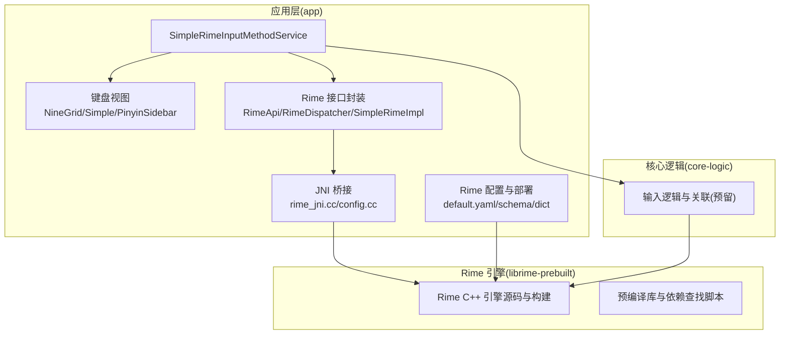
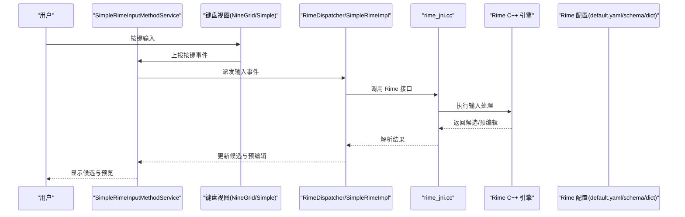
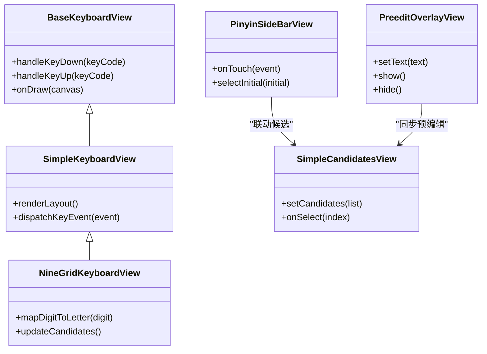
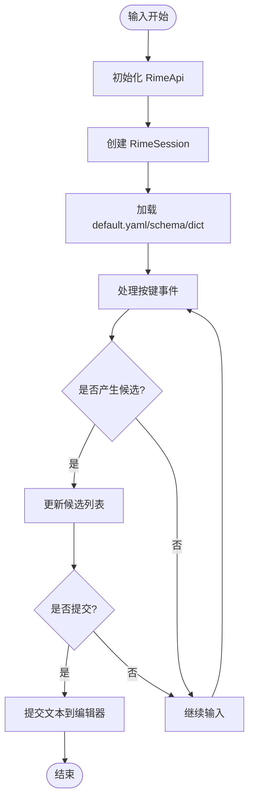
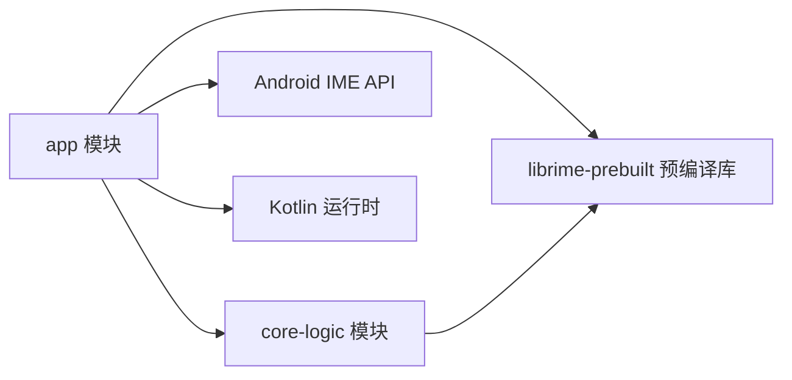

# 项目概览

<cite>
**本文引用的文件**   
- [README.md](file://README.md)
- [ARCHITECTURE.md](file://ARCHITECTURE.md)
- [build.gradle.kts](file://build.gradle.kts)
- [settings.gradle.kts](file://settings.gradle.kts)
- [app/build.gradle.kts](file://app/build.gradle.kts)
- [AndroidManifest.xml](file://app/src/main/AndroidManifest.xml)
- [SimpleRimeInputMethodService.kt](file://app/src/main/java/com/ziyou/ime/ime/SimpleRimeInputMethodService.kt)
- [NineGridKeyboardView.kt](file://app/src/main/java/com/ziyou/ime/ime/NineGridKeyboardView.kt)
- [SimpleKeyboardView.kt](file://app/src/main/java/com/ziyou/ime/ime/SimpleKeyboardView.kt)
- [BaseKeyboardView.kt](file://app/src/main/java/com/ziyou/ime/ime/BaseKeyboardView.kt)
- [PinyinSideBarView.kt](file://app/src/main/java/com/ziyou/ime/ime/PinyinSideBarView.kt)
- [PreeditOverlayView.kt](file://app/src/main/java/com/ziyou/ime/ime/PreeditOverlayView.kt)
- [SimpleCandidatesView.kt](file://app/src/main/java/com/ziyou/ime/ime/SimpleCandidatesView.kt)
- [RimeApi.kt](file://app/src/main/java/com/ziyou/ime/core/RimeApi.kt)
- [RimeDispatcher.kt](file://app/src/main/java/com/ziyou/ime/core/RimeDispatcher.kt)
- [RimeNative.kt](file://app/src/main/java/com/ziyou/ime/core/RimeNative.kt)
- [SimpleRimeImpl.kt](file://app/src/main/java/com/ziyou/ime/core/SimpleRimeImpl.kt)
- [RimeSession.kt](file://app/src/main/java/com/ziyou/ime/daemon/RimeSession.kt)
- [config.cc](file://app/src/main/jni/librime_jni/config.cc)
- [rime_jni.cc](file://app/src/main/jni/librime_jni/rime_jni.cc)
- [CMakeLists.txt](file://app/src/main/jni/librime_jni/CMakeLists.txt)
- [default.yaml](file://app/src/main/assets/rime/default.yaml)
- [luna_pinyin.schema.yaml](file://app/src/main/assets/rime/luna_pinyin.schema.yaml)
- [luna_pinyin.dict.yaml](file://app/src/main/assets/rime/luna_pinyin.dict.yaml)
- [cangjie5.schema.yaml](file://app/src/main/assets/rime/cangjie5.schema.yaml)
- [cangjie5.dict.yaml](file://app/src/main/assets/rime/cangjie5.dict.yaml)
- [t9.schema.yaml](file://app/src/main/assets/rime/t9.schema.yaml)
- [symbols.yaml](file://app/src/main/assets/rime/symbols.yaml)
- [T9PinYinUtils.kt](file://app/src/main/java/com/ziyou/ime/util/T9PinYinUtils.kt)
- [KeyRecordStack.kt](file://app/src/main/java/com/ziyou/ime/data/KeyRecordStack.kt)
- [ThemeManager.kt](file://app/src/main/java/com/ziyou/ime/config/ThemeManager.kt)
- [RimeConfigManager.kt](file://app/src/main/java/com/ziyou/ime/config/RimeConfigManager.kt)
- [AssetDeployer.kt](file://app/src/main/java/com/ziyou/ime/config/AssetDeployer.kt)
- [ZiyouApplication.kt](file://app/src/main/java/com/ziyou/ime/ZiyouApplication.kt)
</cite>

## 目录
1. [简介](#简介)
2. [项目结构](#项目结构)
3. [核心组件](#核心组件)
4. [架构总览](#架构总览)
5. [详细组件分析](#详细组件分析)
6. [依赖关系分析](#依赖关系分析)
7. [性能考量](#性能考量)
8. [故障排查指南](#故障排查指南)
9. [结论](#结论)
10. [附录](#附录)

## 简介
本文件为 ziyou-ime Android 输入法项目的全面概览，面向开发者与使用者。项目基于 Rime 引擎实现中文输入体验，提供九宫格键盘、拼音输入、仓颉输入等核心能力；技术栈以 Kotlin 为主，结合 Android IME API 与 Rime C++ 引擎（通过 JNI 调用）。整体采用模块化设计：app 层负责 UI 与 IME 服务集成，core-logic 层承载输入逻辑与状态管理，librime-prebuilt 提供 Rime 的预编译库与构建脚本。文档将帮助读者快速理解代码组织方式、关键流程与扩展点，并提供安装配置与使用示例，确保新用户可快速上手。

## 项目结构
项目采用多模块结构，便于职责分离与独立演进：
- app：Android 应用层，包含输入法服务、键盘视图、Rime 配置与资源、JNI 桥接与 CMake 构建脚本。
- core-logic：纯 Java/Kotlin 逻辑模块（当前为空壳，预留扩展空间）。
- librime-prebuilt：Rime 引擎源码与构建脚本，提供预编译产物与依赖查找脚本。
- libs：本地库头文件与 ABI 目录。
- gradle 配置文件：顶层与模块级构建脚本定义依赖与打包策略。

图表来源
- [SimpleRimeInputMethodService.kt:1-200](file://app/src/main/java/com/ziyou/ime/ime/SimpleRimeInputMethodService.kt#L1-L200)
- [NineGridKeyboardView.kt:1-200](file://app/src/main/java/com/ziyou/ime/ime/NineGridKeyboardView.kt#L1-L200)
- [RimeApi.kt:1-200](file://app/src/main/java/com/ziyou/ime/core/RimeApi.kt#L1-L200)
- [rime_jni.cc:1-200](file://app/src/main/jni/librime_jni/rime_jni.cc#L1-L200)
- [default.yaml:1-200](file://app/src/main/assets/rime/default.yaml#L1-L200)

章节来源
- [README.md:1-200](file://README.md#L1-L200)
- [ARCHITECTURE.md:1-200](file://ARCHITECTURE.md#L1-L200)
- [build.gradle.kts:1-200](file://build.gradle.kts#L1-L200)
- [settings.gradle.kts:1-200](file://settings.gradle.kts#L1-L200)
- [app/build.gradle.kts:1-200](file://app/build.gradle.kts#L1-L200)

## 核心组件
- 输入法服务与键盘视图
  - SimpleRimeInputMethodService：继承 Android InputMethodService，负责生命周期、软键盘显示/隐藏、候选区与编辑区交互。
  - NineGridKeyboardView：九宫格键盘视图，支持数字键映射到拼音首字母，配合 T9 方案进行输入。
  - SimpleKeyboardView：通用键盘视图基类，封装按键事件分发与布局绘制。
  - PinyinSideBarView：拼音侧边栏，用于快速选择声母或切换模式。
  - PreeditOverlayView：预编辑文本覆盖层，展示正在输入的拼音或编码。
  - SimpleCandidatesView：候选项列表视图，支持翻页与选中提交。

- Rime 引擎集成
  - RimeApi：对外暴露的 Rime 操作接口，统一封装初始化、会话创建、输入处理与结果获取。
  - RimeDispatcher：消息派发器，将键盘事件转换为 Rime 输入事件并调度处理。
  - SimpleRimeImpl：RimeApi 的具体实现，协调 Session、Engine 与数据源。
  - RimeSession：Rime 会话封装，维护上下文、选词历史与用户词典。
  - JNI 桥接：rime_jni.cc 与 config.cc 提供 C++ 到 Java 的函数绑定，CMakeLists.txt 定义构建目标。

- 配置与资源
  - default.yaml：Rime 默认配置，指定方案、插件与全局开关。
  - luna_pinyin.*：拼音方案的字典与 schema 定义。
  - cangjie5.*：仓颉方案的字典与 schema 定义。
  - t9.schema.yaml：九宫格 T9 方案定义。
  - symbols.yaml：符号表配置。
  - AssetDeployer：将 assets 中的 rime 资源部署到运行时目录。
  - RimeConfigManager：读取与更新 Rime 配置。
  - ThemeManager：主题样式管理。

- 工具与数据
  - T9PinYinUtils：T9 与拼音映射工具。
  - KeyRecordStack：按键记录栈，辅助回溯与撤销。

章节来源
- [SimpleRimeInputMethodService.kt:1-200](file://app/src/main/java/com/ziyou/ime/ime/SimpleRimeInputMethodService.kt#L1-L200)
- [NineGridKeyboardView.kt:1-200](file://app/src/main/java/com/ziyou/ime/ime/NineGridKeyboardView.kt#L1-L200)
- [SimpleKeyboardView.kt:1-200](file://app/src/main/java/com/ziyou/ime/ime/SimpleKeyboardView.kt#L1-L200)
- [PinyinSideBarView.kt:1-200](file://app/src/main/java/com/ziyou/ime/ime/PinyinSideBarView.kt#L1-L200)
- [PreeditOverlayView.kt:1-200](file://app/src/main/java/com/ziyou/ime/ime/PreeditOverlayView.kt#L1-L200)
- [SimpleCandidatesView.kt:1-200](file://app/src/main/java/com/ziyou/ime/ime/SimpleCandidatesView.kt#L1-L200)
- [RimeApi.kt:1-200](file://app/src/main/java/com/ziyou/ime/core/RimeApi.kt#L1-L200)
- [RimeDispatcher.kt:1-200](file://app/src/main/java/com/ziyou/ime/core/RimeDispatcher.kt#L1-L200)
- [SimpleRimeImpl.kt:1-200](file://app/src/main/java/com/ziyou/ime/core/SimpleRimeImpl.kt#L1-L200)
- [RimeSession.kt:1-200](file://app/src/main/java/com/ziyou/ime/daemon/RimeSession.kt#L1-L200)
- [rime_jni.cc:1-200](file://app/src/main/jni/librime_jni/rime_jni.cc#L1-L200)
- [config.cc:1-200](file://app/src/main/jni/librime_jni/config.cc#L1-L200)
- [CMakeLists.txt:1-200](file://app/src/main/jni/librime_jni/CMakeLists.txt#L1-L200)
- [default.yaml:1-200](file://app/src/main/assets/rime/default.yaml#L1-L200)
- [luna_pinyin.schema.yaml:1-200](file://app/src/main/assets/rime/luna_pinyin.schema.yaml#L1-L200)
- [luna_pinyin.dict.yaml:1-200](file://app/src/main/assets/rime/luna_pinyin.dict.yaml#L1-L200)
- [cangjie5.schema.yaml:1-200](file://app/src/main/assets/rime/cangjie5.schema.yaml#L1-L200)
- [cangjie5.dict.yaml:1-200](file://app/src/main/assets/rime/cangjie5.dict.yaml#L1-L200)
- [t9.schema.yaml:1-200](file://app/src/main/assets/rime/t9.schema.yaml#L1-L200)
- [symbols.yaml:1-200](file://app/src/main/assets/rime/symbols.yaml#L1-L200)
- [T9PinYinUtils.kt:1-200](file://app/src/main/java/com/ziyou/ime/util/T9PinYinUtils.kt#L1-L200)
- [KeyRecordStack.kt:1-200](file://app/src/main/java/com/ziyou/ime/data/KeyRecordStack.kt#L1-L200)
- [ThemeManager.kt:1-200](file://app/src/main/java/com/ziyou/ime/config/ThemeManager.kt#L1-L200)
- [RimeConfigManager.kt:1-200](file://app/src/main/java/com/ziyou/ime/config/RimeConfigManager.kt#L1-L200)
- [AssetDeployer.kt:1-200](file://app/src/main/java/com/ziyou/ime/config/AssetDeployer.kt#L1-L200)

## 架构总览
系统采用“UI 层 + 逻辑层 + 引擎层”的分层架构：
- UI 层：Android IME 服务与各键盘视图，负责用户交互与界面渲染。
- 逻辑层：RimeApi/RimeDispatcher/SimpleRimeImpl/RimeSession 等，抽象输入流程与状态管理。
- 引擎层：Rime C++ 引擎通过 JNI 暴露接口，提供分词、翻译、候选生成等核心能力。
- 配置层：assets 下的 YAML 配置驱动方案与行为，AssetDeployer 负责部署到运行时路径。

图表来源
- [SimpleRimeInputMethodService.kt:1-200](file://app/src/main/java/com/ziyou/ime/ime/SimpleRimeInputMethodService.kt#L1-L200)
- [NineGridKeyboardView.kt:1-200](file://app/src/main/java/com/ziyou/ime/ime/NineGridKeyboardView.kt#L1-L200)
- [RimeDispatcher.kt:1-200](file://app/src/main/java/com/ziyou/ime/core/RimeDispatcher.kt#L1-L200)
- [rime_jni.cc:1-200](file://app/src/main/jni/librime_jni/rime_jni.cc#L1-L200)
- [default.yaml:1-200](file://app/src/main/assets/rime/default.yaml#L1-L200)

## 详细组件分析

### 输入法服务与键盘视图
- SimpleRimeInputMethodService：作为 IME 入口，管理软键盘窗口、候选区与编辑区联动，响应系统回调（如 onComputeInsets、onStartInput）。
- NineGridKeyboardView：实现九宫格布局与按键映射，结合 T9 方案将数字序列转为拼音候选。
- SimpleKeyboardView：提供通用键盘行为（按键按下、抬起、长按），简化子类实现。
- PinyinSideBarView：侧边栏滑动选择声母或切换模式，提升输入效率。
- PreeditOverlayView：在编辑区上方叠加显示预编辑文本，避免破坏光标位置。
- SimpleCandidatesView：候选列表分页与选中反馈，支持触摸与手势。

图表来源
- [BaseKeyboardView.kt:1-200](file://app/src/main/java/com/ziyou/ime/ime/BaseKeyboardView.kt#L1-L200)
- [SimpleKeyboardView.kt:1-200](file://app/src/main/java/com/ziyou/ime/ime/SimpleKeyboardView.kt#L1-L200)
- [NineGridKeyboardView.kt:1-200](file://app/src/main/java/com/ziyou/ime/ime/NineGridKeyboardView.kt#L1-L200)
- [PinyinSideBarView.kt:1-200](file://app/src/main/java/com/ziyou/ime/ime/PinyinSideBarView.kt#L1-L200)
- [PreeditOverlayView.kt:1-200](file://app/src/main/java/com/ziyou/ime/ime/PreeditOverlayView.kt#L1-L200)
- [SimpleCandidatesView.kt:1-200](file://app/src/main/java/com/ziyou/ime/ime/SimpleCandidatesView.kt#L1-L200)

章节来源
- [SimpleRimeInputMethodService.kt:1-200](file://app/src/main/java/com/ziyou/ime/ime/SimpleRimeInputMethodService.kt#L1-L200)
- [NineGridKeyboardView.kt:1-200](file://app/src/main/java/com/ziyou/ime/ime/NineGridKeyboardView.kt#L1-L200)
- [SimpleKeyboardView.kt:1-200](file://app/src/main/java/com/ziyou/ime/ime/SimpleKeyboardView.kt#L1-L200)
- [PinyinSideBarView.kt:1-200](file://app/src/main/java/com/ziyou/ime/ime/PinyinSideBarView.kt#L1-L200)
- [PreeditOverlayView.kt:1-200](file://app/src/main/java/com/ziyou/ime/ime/PreeditOverlayView.kt#L1-L200)
- [SimpleCandidatesView.kt:1-200](file://app/src/main/java/com/ziyou/ime/ime/SimpleCandidatesView.kt#L1-L200)

### Rime 引擎集成与 JNI 桥接
- RimeApi：定义初始化、创建会话、输入处理、获取候选与提交等接口。
- RimeDispatcher：将键盘事件转换为 Rime 事件类型，按顺序调用处理器。
- SimpleRimeImpl：实现 RimeApi，管理 Session 生命周期与错误恢复。
- RimeSession：封装 Rime 会话，维护上下文、历史与用户词典。
- rime_jni.cc：导出 JNI 方法，调用 Rime C++ API。
- config.cc：加载与解析 Rime 配置，提供配置查询与更新。
- CMakeLists.txt：定义 JNI 库构建目标与依赖。

图表来源
- [RimeApi.kt:1-200](file://app/src/main/java/com/ziyou/ime/core/RimeApi.kt#L1-L200)
- [RimeDispatcher.kt:1-200](file://app/src/main/java/com/ziyou/ime/core/RimeDispatcher.kt#L1-L200)
- [SimpleRimeImpl.kt:1-200](file://app/src/main/java/com/ziyou/ime/core/SimpleRimeImpl.kt#L1-L200)
- [RimeSession.kt:1-200](file://app/src/main/java/com/ziyou/ime/daemon/RimeSession.kt#L1-L200)
- [rime_jni.cc:1-200](file://app/src/main/jni/librime_jni/rime_jni.cc#L1-L200)
- [config.cc:1-200](file://app/src/main/jni/librime_jni/config.cc#L1-L200)
- [CMakeLists.txt:1-200](file://app/src/main/jni/librime_jni/CMakeLists.txt#L1-L200)

章节来源
- [RimeApi.kt:1-200](file://app/src/main/java/com/ziyou/ime/core/RimeApi.kt#L1-L200)
- [RimeDispatcher.kt:1-200](file://app/src/main/java/com/ziyou/ime/core/RimeDispatcher.kt#L1-L200)
- [SimpleRimeImpl.kt:1-200](file://app/src/main/java/com/ziyou/ime/core/SimpleRimeImpl.kt#L1-L200)
- [RimeSession.kt:1-200](file://app/src/main/java/com/ziyou/ime/daemon/RimeSession.kt#L1-L200)
- [rime_jni.cc:1-200](file://app/src/main/jni/librime_jni/rime_jni.cc#L1-L200)
- [config.cc:1-200](file://app/src/main/jni/librime_jni/config.cc#L1-L200)
- [CMakeLists.txt:1-200](file://app/src/main/jni/librime_jni/CMakeLists.txt#L1-L200)

### 配置与资源管理
- default.yaml：定义默认方案、插件与全局开关，决定输入法行为。
- luna_pinyin.*：拼音方案的字典与 schema，控制音节拆分、候选排序与纠错。
- cangjie5.*：仓颉方案的字典与 schema，支持字形编码输入。
- t9.schema.yaml：九宫格 T9 方案，将数字映射到拼音首字母。
- symbols.yaml：符号表，提供常用标点与特殊字符。
- AssetDeployer：将 assets 中的 rime 资源复制到运行时目录，供 Rime 加载。
- RimeConfigManager：动态读取与更新配置，支持热重载。
- ThemeManager：管理主题样式，影响键盘外观与颜色。

章节来源
- [default.yaml:1-200](file://app/src/main/assets/rime/default.yaml#L1-L200)
- [luna_pinyin.schema.yaml:1-200](file://app/src/main/assets/rime/luna_pinyin.schema.yaml#L1-L200)
- [luna_pinyin.dict.yaml:1-200](file://app/src/main/assets/rime/luna_pinyin.dict.yaml#L1-L200)
- [cangjie5.schema.yaml:1-200](file://app/src/main/assets/rime/cangjie5.schema.yaml#L1-L200)
- [cangjie5.dict.yaml:1-200](file://app/src/main/assets/rime/cangjie5.dict.yaml#L1-L200)
- [t9.schema.yaml:1-200](file://app/src/main/assets/rime/t9.schema.yaml#L1-L200)
- [symbols.yaml:1-200](file://app/src/main/assets/rime/symbols.yaml#L1-L200)
- [AssetDeployer.kt:1-200](file://app/src/main/java/com/ziyou/ime/config/AssetDeployer.kt#L1-L200)
- [RimeConfigManager.kt:1-200](file://app/src/main/java/com/ziyou/ime/config/RimeConfigManager.kt#L1-L200)
- [ThemeManager.kt:1-200](file://app/src/main/java/com/ziyou/ime/config/ThemeManager.kt#L1-L200)

### 工具与数据模型
- T9PinYinUtils：提供数字到拼音首字母的映射与校验，辅助九宫格输入。
- KeyRecordStack：按键记录栈，支持撤销与重做，提升用户体验。
- ZiyouApplication：应用入口，初始化全局配置与依赖。

章节来源
- [T9PinYinUtils.kt:1-200](file://app/src/main/java/com/ziyou/ime/util/T9PinYinUtils.kt#L1-L200)
- [KeyRecordStack.kt:1-200](file://app/src/main/java/com/ziyou/ime/data/KeyRecordStack.kt#L1-L200)
- [ZiyouApplication.kt:1-200](file://app/src/main/java/com/ziyou/ime/ZiyouApplication.kt#L1-L200)

## 依赖关系分析
- 模块依赖
  - app 依赖 core-logic（预留）与 librime-prebuilt（通过 JNI 与 CMake 链接）。
  - core-logic 目前为空壳，未来可扩展输入逻辑与算法。
  - librime-prebuilt 提供 Rime 源码与构建脚本，app 通过预编译库集成。
- 外部依赖
  - Android IME API：输入法框架基础。
  - Rime C++ 引擎：通过 JNI 暴露接口，提供分词、翻译、候选生成等能力。
  - Gradle/Kotlin：构建系统与语言支持。

图表来源
- [build.gradle.kts:1-200](file://build.gradle.kts#L1-L200)
- [settings.gradle.kts:1-200](file://settings.gradle.kts#L1-L200)
- [app/build.gradle.kts:1-200](file://app/build.gradle.kts#L1-L200)

章节来源
- [build.gradle.kts:1-200](file://build.gradle.kts#L1-L200)
- [settings.gradle.kts:1-200](file://settings.gradle.kts#L1-L200)
- [app/build.gradle.kts:1-200](file://app/build.gradle.kts#L1-L200)

## 性能考量
- JNI 调用开销：尽量减少频繁跨进程调用，批量处理输入事件。
- 候选生成优化：利用 Rime 缓存与用户词典，减少重复计算。
- UI 渲染优化：候选列表虚拟化与按需绘制，避免卡顿。
- 内存管理：及时释放 Session 与临时对象，防止内存泄漏。
- 配置加载：延迟加载大型字典，按需启用插件。

[本节为通用指导，不直接分析具体文件]

## 故障排查指南
- 输入法无法启动
  - 检查 AndroidManifest.xml 中 IME 服务声明是否正确。
  - 确认 Rime 配置与资源已正确部署到运行时目录。
- 候选不显示或异常
  - 验证 schema 与 dict 文件路径与格式。
  - 检查 RimeSession 初始化与事件派发流程。
- 九宫格输入不正确
  - 核对 T9 映射与 t9.schema.yaml 配置。
  - 查看 T9PinYinUtils 的映射逻辑。
- 崩溃或 ANR
  - 检查 JNI 调用参数与返回值。
  - 分析日志定位 Rime 引擎错误。

章节来源
- [AndroidManifest.xml:1-200](file://app/src/main/AndroidManifest.xml#L1-L200)
- [RimeSession.kt:1-200](file://app/src/main/java/com/ziyou/ime/daemon/RimeSession.kt#L1-L200)
- [T9PinYinUtils.kt:1-200](file://app/src/main/java/com/ziyou/ime/util/T9PinYinUtils.kt#L1-L200)
- [rime_jni.cc:1-200](file://app/src/main/jni/librime_jni/rime_jni.cc#L1-L200)

## 结论
ziyou-ime 通过清晰的模块化设计与 Rime 引擎的强大能力，提供了稳定高效的中文输入体验。项目结构合理，扩展性强，适合进一步定制与优化。建议开发者优先熟悉 IME 服务与 Rime 集成流程，再逐步深入键盘视图与配置管理。

[本节为总结性内容，不直接分析具体文件]

## 附录
- 安装与配置
  - 克隆仓库并打开 Android Studio。
  - 同步 Gradle 并构建 app 模块。
  - 在设备上启用 ziyou-ime 为默认输入法。
- 基本使用
  - 打开任意文本输入框，调出软键盘。
  - 选择九宫格或拼音模式，输入拼音或仓颉编码。
  - 从候选列表选择字词，或直接提交。
- 扩展开发
  - 修改 schema 与 dict 以自定义输入规则。
  - 新增键盘视图或候选样式。
  - 集成预测与个性化词典。

[本节为通用指导，不直接分析具体文件]