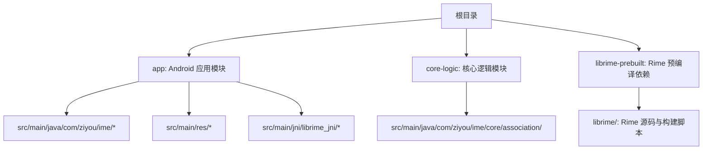
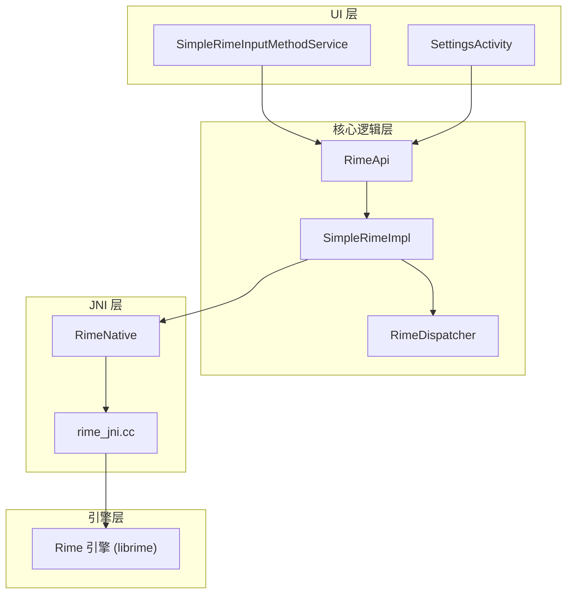
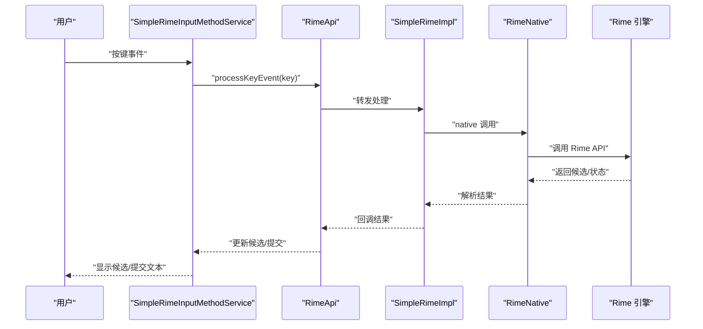
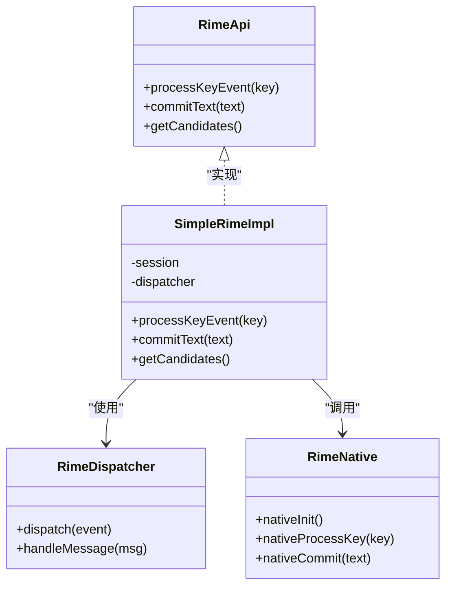
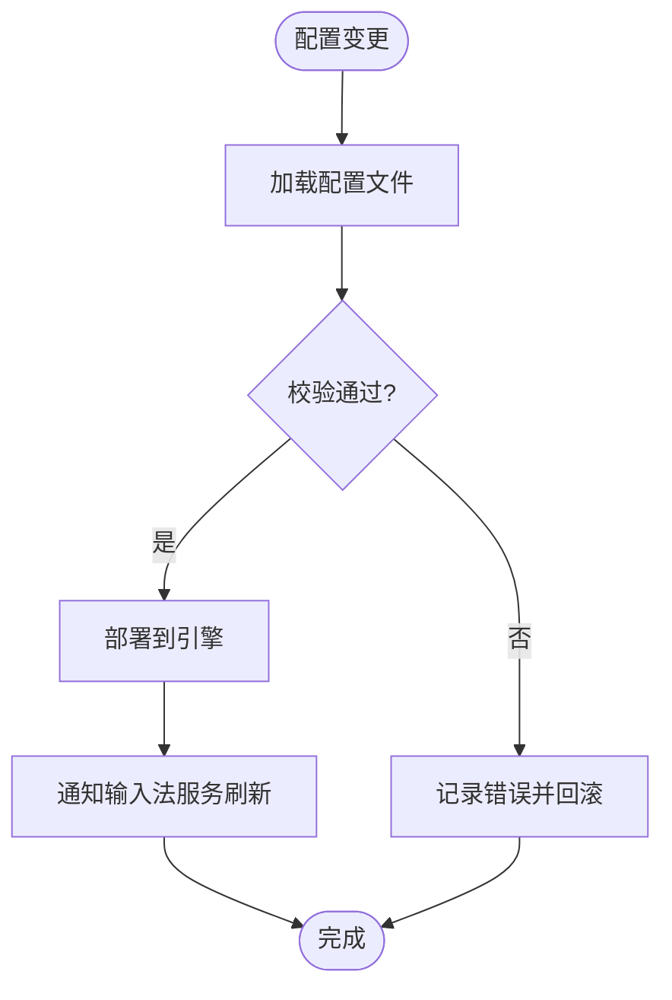
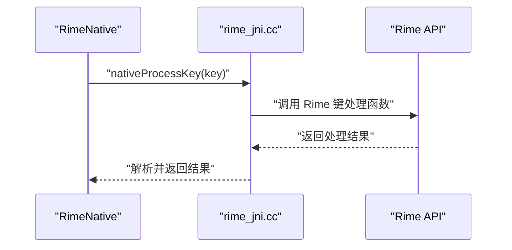
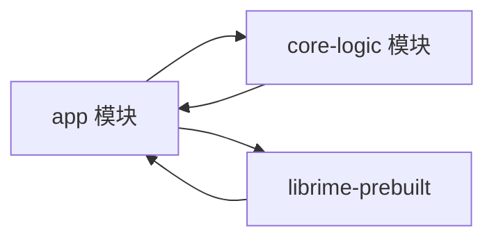

# 项目结构说明

<cite>
**本文引用的文件**   
- [README.md](file://README.md)
- [ARCHITECTURE.md](file://ARCHITECTURE.md)
- [settings.gradle.kts](file://settings.gradle.kts)
- [build.gradle.kts](file://build.gradle.kts)
- [app/build.gradle.kts](file://app/build.gradle.kts)
- [app/src/main/AndroidManifest.xml](file://app/src/main/AndroidManifest.xml)
- [app/src/main/res/xml/input_method.xml](file://app/src/main/res/xml/input_method.xml)
- [app/src/main/java/com/ziyou/ime/ZiyouApplication.kt](file://app/src/main/java/com/ziyou/ime/ZiyouApplication.kt)
- [app/src/main/java/com/ziyou/ime/ime/SimpleRimeInputMethodService.kt](file://app/src/main/java/com/ziyou/ime/ime/SimpleRimeInputMethodService.kt)
- [app/src/main/java/com/ziyou/ime/core/RimeApi.kt](file://app/src/main/java/com/ziyou/ime/core/RimeApi.kt)
- [app/src/main/java/com/ziyou/ime/core/RimeDispatcher.kt](file://app/src/main/java/com/ziyou/ime/core/RimeDispatcher.kt)
- [app/src/main/java/com/ziyou/ime/core/RimeNative.kt](file://app/src/main/java/com/ziyou/ime/core/RimeNative.kt)
- [app/src/main/java/com/ziyou/ime/core/SimpleRimeImpl.kt](file://app/src/main/java/com/ziyou/ime/core/SimpleRimeImpl.kt)
- [app/src/main/java/com/ziyou/ime/config/RimeConfigManager.kt](file://app/src/main/java/com/ziyou/ime/config/RimeConfigManager.kt)
- [app/src/main/java/com/ziyou/ime/config/ThemeManager.kt](file://app/src/main/java/com/ziyou/ime/config/ThemeManager.kt)
- [app/src/main/java/com/ziyou/ime/data/KeyRecordStack.kt](file://app/src/main/java/com/ziyou/ime/data/KeyRecordStack.kt)
- [app/src/main/java/com/ziyou/ime/data/SideSymbol.kt](file://app/src/main/java/com/ziyou/ime/data/SideSymbol.kt)
- [app/src/main/java/com/ziyou/ime/ui/SettingsActivity.kt](file://app/src/main/java/com/ziyou/ime/ui/SettingsActivity.kt)
- [app/src/main/java/com/ziyou/ime/util/T9PinYinUtils.kt](file://app/src/main/java/com/ziyou/ime/util/T9PinYinUtils.kt)
- [app/src/main/jni/librime_jni/rime_jni.cc](file://app/src/main/jni/librime_jni/rime_jni.cc)
- [core-logic/src/main/java/com/ziyou/ime/core/association/](file://core-logic/src/main/java/com/ziyou/ime/core/association/)
- [librime-prebuilt/librime/src/rime_api.h](file://librime-prebuilt/librime/src/rime_api.h)
</cite>

## 目录
1. [简介](#简介)
2. [项目结构](#项目结构)
3. [核心组件](#核心组件)
4. [架构总览](#架构总览)
5. [详细组件分析](#详细组件分析)
6. [依赖关系分析](#依赖关系分析)
7. [性能考量](#性能考量)
8. [故障排查指南](#故障排查指南)
9. [结论](#结论)
10. [附录](#附录)

## 简介
本文件为 ziyou-ime 项目的结构与代码组织说明，面向新加入的开发者。项目采用多模块 Android 工程：
- app：主应用模块，包含输入法服务、UI、配置与数据层、JNI 桥接等。
- core-logic：核心逻辑模块（当前为空壳，预留 association 包用于扩展）。
- librime-prebuilt：预编译的 Rime 引擎源码与构建脚本，作为底层输入引擎。

整体目标是提供可插拔、可扩展的输入法实现，通过 JNI 调用 Rime 引擎完成分词、候选生成与提交，上层负责 UI 交互与配置管理。

## 项目结构
仓库采用 Gradle 多模块组织，顶层 settings 与 build 脚本定义模块与全局配置；app 模块为 Android 应用入口；core-logic 模块承载纯 Java/Kotlin 逻辑；librime-prebuilt 包含 Rime 源码与构建工具链。

图表来源
- [settings.gradle.kts](file://settings.gradle.kts)
- [build.gradle.kts](file://build.gradle.kts)
- [app/build.gradle.kts](file://app/build.gradle.kts)

章节来源
- [settings.gradle.kts](file://settings.gradle.kts)
- [build.gradle.kts](file://build.gradle.kts)
- [app/build.gradle.kts](file://app/build.gradle.kts)

## 核心组件
- 应用启动与生命周期
  - ZiyouApplication：应用初始化入口，负责全局状态与依赖注入准备。
- 输入法服务
  - SimpleRimeInputMethodService：继承 InputMethodService，处理键盘事件、候选展示、文本提交等。
- 核心逻辑
  - RimeApi：对外暴露的核心 API 抽象，屏蔽底层实现细节。
  - SimpleRimeImpl：RimeApi 的具体实现，封装会话管理与消息分发。
  - RimeDispatcher：消息分发器，协调 UI 与引擎之间的异步通信。
  - RimeNative：JNI 桥接层，调用 native 方法访问 Rime 引擎。
- 配置管理
  - RimeConfigManager：加载与更新 Rime 配置（schema、dict、symbols 等）。
  - ThemeManager：主题资源管理与切换。
- 数据存储
  - KeyRecordStack：按键记录栈，维护输入上下文。
  - SideSymbol：侧边符号表数据结构。
- UI
  - SettingsActivity：设置页面，允许用户修改输入法行为与主题。
- 工具
  - T9PinYinUtils：九宫格拼音辅助工具。

章节来源
- [app/src/main/java/com/ziyou/ime/ZiyouApplication.kt](file://app/src/main/java/com/ziyou/ime/ZiyouApplication.kt)
- [app/src/main/java/com/ziyou/ime/ime/SimpleRimeInputMethodService.kt](file://app/src/main/java/com/ziyou/ime/ime/SimpleRimeInputMethodService.kt)
- [app/src/main/java/com/ziyou/ime/core/RimeApi.kt](file://app/src/main/java/com/ziyou/ime/core/RimeApi.kt)
- [app/src/main/java/com/ziyou/ime/core/SimpleRimeImpl.kt](file://app/src/main/java/com/ziyou/ime/core/SimpleRimeImpl.kt)
- [app/src/main/java/com/ziyou/ime/core/RimeDispatcher.kt](file://app/src/main/java/com/ziyou/ime/core/RimeDispatcher.kt)
- [app/src/main/java/com/ziyou/ime/core/RimeNative.kt](file://app/src/main/java/com/ziyou/ime/core/RimeNative.kt)
- [app/src/main/java/com/ziyou/ime/config/RimeConfigManager.kt](file://app/src/main/java/com/ziyou/ime/config/RimeConfigManager.kt)
- [app/src/main/java/com/ziyou/ime/config/ThemeManager.kt](file://app/src/main/java/com/ziyou/ime/config/ThemeManager.kt)
- [app/src/main/java/com/ziyou/ime/data/KeyRecordStack.kt](file://app/src/main/java/com/ziyou/ime/data/KeyRecordStack.kt)
- [app/src/main/java/com/ziyou/ime/data/SideSymbol.kt](file://app/src/main/java/com/ziyou/ime/data/SideSymbol.kt)
- [app/src/main/java/com/ziyou/ime/ui/SettingsActivity.kt](file://app/src/main/java/com/ziyou/ime/ui/SettingsActivity.kt)
- [app/src/main/java/com/ziyou/ime/util/T9PinYinUtils.kt](file://app/src/main/java/com/ziyou/ime/util/T9PinYinUtils.kt)

## 架构总览
系统分层清晰：UI 层（输入法服务与设置页）通过核心逻辑层（API、调度器、具体实现）与 JNI 层交互，最终调用 Rime 引擎进行输入处理。配置与数据层贯穿各层，提供运行时配置与持久化能力。

图表来源
- [app/src/main/java/com/ziyou/ime/ime/SimpleRimeInputMethodService.kt](file://app/src/main/java/com/ziyou/ime/ime/SimpleRimeInputMethodService.kt)
- [app/src/main/java/com/ziyou/ime/ui/SettingsActivity.kt](file://app/src/main/java/com/ziyou/ime/ui/SettingsActivity.kt)
- [app/src/main/java/com/ziyou/ime/core/RimeApi.kt](file://app/src/main/java/com/ziyou/ime/core/RimeApi.kt)
- [app/src/main/java/com/ziyou/ime/core/SimpleRimeImpl.kt](file://app/src/main/java/com/ziyou/ime/core/SimpleRimeImpl.kt)
- [app/src/main/java/com/ziyou/ime/core/RimeDispatcher.kt](file://app/src/main/java/com/ziyou/ime/core/RimeDispatcher.kt)
- [app/src/main/java/com/ziyou/ime/core/RimeNative.kt](file://app/src/main/java/com/ziyou/ime/core/RimeNative.kt)
- [app/src/main/jni/librime_jni/rime_jni.cc](file://app/src/main/jni/librime_jni/rime_jni.cc)
- [librime-prebuilt/librime/src/rime_api.h](file://librime-prebuilt/librime/src/rime_api.h)

## 详细组件分析

### 输入法服务与 UI 组件
- SimpleRimeInputMethodService
  - 职责：处理键盘事件、候选列表渲染、文本提交、输入法开关状态。
  - 交互：调用核心 API 获取候选、提交结果；与配置层联动更新主题与 schema。
- SettingsActivity
  - 职责：提供用户设置界面，触发配置重载与主题切换。
  - 交互：通过配置管理器更新 Rime 配置并通知输入法服务刷新。

图表来源
- [app/src/main/java/com/ziyou/ime/ime/SimpleRimeInputMethodService.kt](file://app/src/main/java/com/ziyou/ime/ime/SimpleRimeInputMethodService.kt)
- [app/src/main/java/com/ziyou/ime/core/RimeApi.kt](file://app/src/main/java/com/ziyou/ime/core/RimeApi.kt)
- [app/src/main/java/com/ziyou/ime/core/SimpleRimeImpl.kt](file://app/src/main/java/com/ziyou/ime/core/SimpleRimeImpl.kt)
- [app/src/main/java/com/ziyou/ime/core/RimeNative.kt](file://app/src/main/java/com/ziyou/ime/core/RimeNative.kt)
- [librime-prebuilt/librime/src/rime_api.h](file://librime-prebuilt/librime/src/rime_api.h)

章节来源
- [app/src/main/java/com/ziyou/ime/ime/SimpleRimeInputMethodService.kt](file://app/src/main/java/com/ziyou/ime/ime/SimpleRimeInputMethodService.kt)
- [app/src/main/java/com/ziyou/ime/ui/SettingsActivity.kt](file://app/src/main/java/com/ziyou/ime/ui/SettingsActivity.kt)

### 核心逻辑层
- RimeApi
  - 职责：定义统一的输入处理接口，屏蔽实现差异。
- SimpleRimeImpl
  - 职责：维护会话、消息队列、状态机；协调 UI 与引擎。
- RimeDispatcher
  - 职责：将 UI 事件转换为引擎消息，分发到对应处理器。
- RimeNative
  - 职责：声明 JNI 方法，封装 native 调用。

图表来源
- [app/src/main/java/com/ziyou/ime/core/RimeApi.kt](file://app/src/main/java/com/ziyou/ime/core/RimeApi.kt)
- [app/src/main/java/com/ziyou/ime/core/SimpleRimeImpl.kt](file://app/src/main/java/com/ziyou/ime/core/SimpleRimeImpl.kt)
- [app/src/main/java/com/ziyou/ime/core/RimeDispatcher.kt](file://app/src/main/java/com/ziyou/ime/core/RimeDispatcher.kt)
- [app/src/main/java/com/ziyou/ime/core/RimeNative.kt](file://app/src/main/java/com/ziyou/ime/core/RimeNative.kt)

章节来源
- [app/src/main/java/com/ziyou/ime/core/RimeApi.kt](file://app/src/main/java/com/ziyou/ime/core/RimeApi.kt)
- [app/src/main/java/com/ziyou/ime/core/SimpleRimeImpl.kt](file://app/src/main/java/com/ziyou/ime/core/SimpleRimeImpl.kt)
- [app/src/main/java/com/ziyou/ime/core/RimeDispatcher.kt](file://app/src/main/java/com/ziyou/ime/core/RimeDispatcher.kt)
- [app/src/main/java/com/ziyou/ime/core/RimeNative.kt](file://app/src/main/java/com/ziyou/ime/core/RimeNative.kt)

### 配置与数据层
- RimeConfigManager
  - 职责：部署与热更新 Rime 配置（schema、字典、符号），确保引擎使用最新设置。
- ThemeManager
  - 职责：管理主题资源，支持动态切换。
- KeyRecordStack
  - 职责：维护按键历史，辅助输入上下文恢复。
- SideSymbol
  - 职责：侧边栏符号表的数据模型。

图表来源
- [app/src/main/java/com/ziyou/ime/config/RimeConfigManager.kt](file://app/src/main/java/com/ziyou/ime/config/RimeConfigManager.kt)
- [app/src/main/java/com/ziyou/ime/config/ThemeManager.kt](file://app/src/main/java/com/ziyou/ime/config/ThemeManager.kt)
- [app/src/main/java/com/ziyou/ime/data/KeyRecordStack.kt](file://app/src/main/java/com/ziyou/ime/data/KeyRecordStack.kt)
- [app/src/main/java/com/ziyou/ime/data/SideSymbol.kt](file://app/src/main/java/com/ziyou/ime/data/SideSymbol.kt)

章节来源
- [app/src/main/java/com/ziyou/ime/config/RimeConfigManager.kt](file://app/src/main/java/com/ziyou/ime/config/RimeConfigManager.kt)
- [app/src/main/java/com/ziyou/ime/config/ThemeManager.kt](file://app/src/main/java/com/ziyou/ime/config/ThemeManager.kt)
- [app/src/main/java/com/ziyou/ime/data/KeyRecordStack.kt](file://app/src/main/java/com/ziyou/ime/data/KeyRecordStack.kt)
- [app/src/main/java/com/ziyou/ime/data/SideSymbol.kt](file://app/src/main/java/com/ziyou/ime/data/SideSymbol.kt)

### JNI 与 Rime 引擎集成
- rime_jni.cc
  - 职责：实现 JNI 方法，映射 Java 调用到 Rime C API。
- RimeNative
  - 职责：声明 native 方法，封装调用参数与返回值。
- Rime API
  - 职责：提供引擎初始化、键处理、提交文本等接口。

图表来源
- [app/src/main/java/com/ziyou/ime/core/RimeNative.kt](file://app/src/main/java/com/ziyou/ime/core/RimeNative.kt)
- [app/src/main/jni/librime_jni/rime_jni.cc](file://app/src/main/jni/librime_jni/rime_jni.cc)
- [librime-prebuilt/librime/src/rime_api.h](file://librime-prebuilt/librime/src/rime_api.h)

章节来源
- [app/src/main/jni/librime_jni/rime_jni.cc](file://app/src/main/jni/librime_jni/rime_jni.cc)
- [app/src/main/java/com/ziyou/ime/core/RimeNative.kt](file://app/src/main/java/com/ziyou/ime/core/RimeNative.kt)
- [librime-prebuilt/librime/src/rime_api.h](file://librime-prebuilt/librime/src/rime_api.h)

### 资源文件组织结构
- 布局与样式
  - res/values/colors.xml：颜色定义
  - res/values/themes.xml：主题配置
- 字符串资源
  - res/values/strings.xml：多语言与文案
- 输入法声明
  - res/xml/input_method.xml：输入法元数据与服务绑定
- Android 清单
  - AndroidManifest.xml：应用权限、服务注册、Intent 过滤

章节来源
- [app/src/main/res/values/colors.xml](file://app/src/main/res/values/colors.xml)
- [app/src/main/res/values/themes.xml](file://app/src/main/res/values/themes.xml)
- [app/src/main/res/values/strings.xml](file://app/src/main/res/values/strings.xml)
- [app/src/main/res/xml/input_method.xml](file://app/src/main/res/xml/input_method.xml)
- [app/src/main/AndroidManifest.xml](file://app/src/main/AndroidManifest.xml)

## 依赖关系分析
- app 模块依赖 core-logic 与 librime-prebuilt（通过 JNI 与原生库）。
- core-logic 目前为空壳，预留 association 包用于未来扩展。
- librime-prebuilt 提供 Rime 引擎源码与构建脚本，供 app 通过 JNI 调用。

图表来源
- [settings.gradle.kts](file://settings.gradle.kts)
- [build.gradle.kts](file://build.gradle.kts)
- [app/build.gradle.kts](file://app/build.gradle.kts)

章节来源
- [settings.gradle.kts](file://settings.gradle.kts)
- [build.gradle.kts](file://build.gradle.kts)
- [app/build.gradle.kts](file://app/build.gradle.kts)

## 性能考量
- 避免在主线程执行重型操作：所有与 Rime 引擎的交互应通过异步消息机制处理，减少 UI 卡顿。
- 合理缓存候选与配置：对频繁读取的配置与候选结果进行内存缓存，降低重复计算与 IO 开销。
- 控制 JNI 调用频率：批量处理按键事件，减少跨进程/跨语言边界调用次数。
- 资源按需加载：主题与符号表按需加载，避免启动时一次性加载全部资源。

## 故障排查指南
- 输入法未生效
  - 检查 AndroidManifest 中输入法服务声明与 input_method.xml 配置是否一致。
  - 确认系统设置中已启用该输入法。
- 候选不显示或异常
  - 查看 Rime 配置是否正确部署，schema 与 dict 路径是否有效。
  - 检查 JNI 层日志，确认 native 调用是否成功。
- 主题切换无效
  - 确认 ThemeManager 是否正确更新资源引用，并通知输入法服务刷新。
- 崩溃或 ANR
  - 定位关键堆栈，优先检查 JNI 调用与线程同步问题。
  - 验证 Rime 引擎初始化顺序与资源可用性。

章节来源
- [app/src/main/AndroidManifest.xml](file://app/src/main/AndroidManifest.xml)
- [app/src/main/res/xml/input_method.xml](file://app/src/main/res/xml/input_method.xml)
- [app/src/main/java/com/ziyou/ime/config/RimeConfigManager.kt](file://app/src/main/java/com/ziyou/ime/config/RimeConfigManager.kt)
- [app/src/main/java/com/ziyou/ime/config/ThemeManager.kt](file://app/src/main/java/com/ziyou/ime/config/ThemeManager.kt)
- [app/src/main/jni/librime_jni/rime_jni.cc](file://app/src/main/jni/librime_jni/rime_jni.cc)

## 结论
ziyou-ime 采用清晰的模块化设计，将输入法服务、核心逻辑、JNI 桥接与 Rime 引擎解耦，便于扩展与维护。遵循本文的组织规范与最佳实践，新成员可以快速理解代码结构并高效参与开发。

## 附录
- 命名约定
  - 包名：以 com.ziyou.ime 为根，按功能划分 ime、core、config、data、ui、util 等子包。
  - 类名：名词为主，动词前缀表示动作（如 Manager、Utils、Impl）。
  - 文件名：与类名一致，Kotlin 文件以 .kt 结尾，C/C++ 文件以 .cc/.h 结尾。
- 代码组织最佳实践
  - 单一职责：每个类/文件聚焦一个职责，避免臃肿。
  - 依赖倒置：通过接口（如 RimeApi）解耦实现，便于替换与测试。
  - 异步优先：耗时操作与 JNI 调用使用异步机制，保证 UI 流畅。
  - 配置外置：将可变配置放入 YAML 或资源文件，运行时动态加载。
  - 日志与错误：统一错误码与日志格式，便于追踪与定位问题。