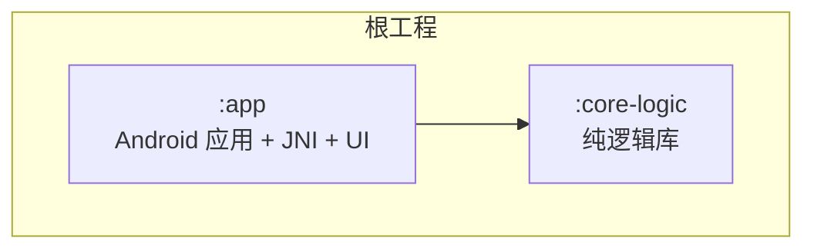
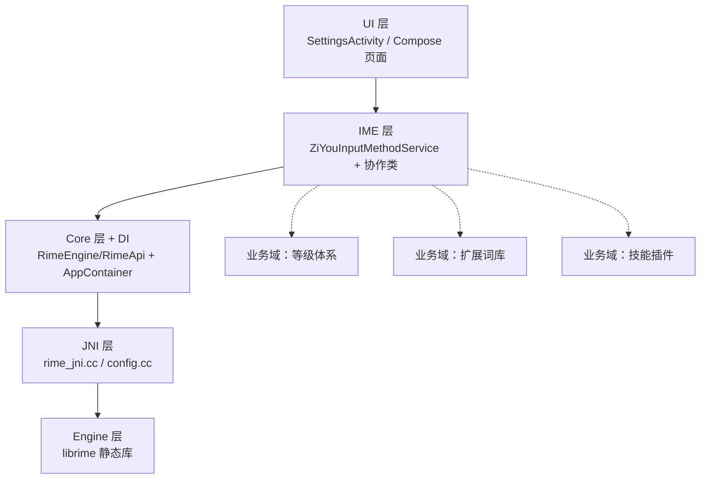
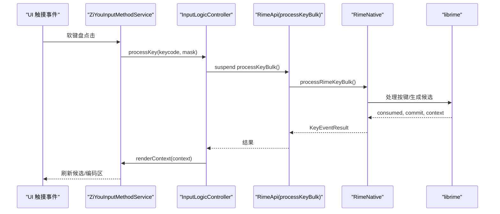
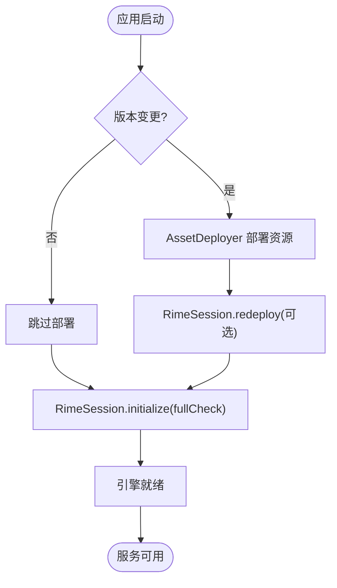
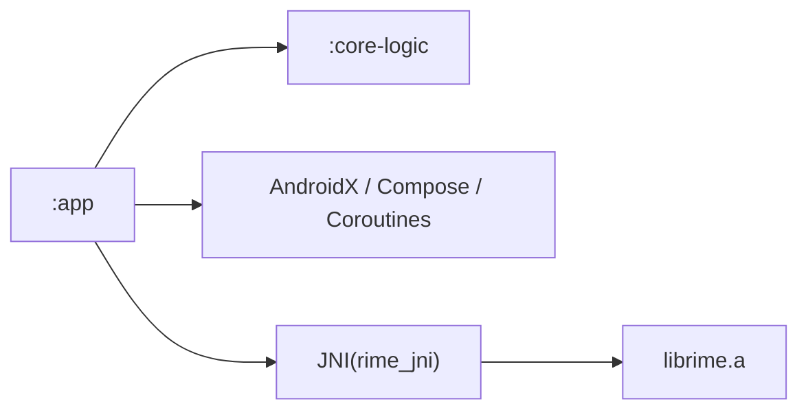

# 快速开始

<cite>
**本文引用的文件**   
- [build.gradle.kts](file://build.gradle.kts)
- [app/build.gradle.kts](file://app/build.gradle.kts)
- [settings.gradle.kts](file://settings.gradle.kts)
- [gradle.properties](file://gradle.properties)
- [gradle/libs.versions.toml](file://gradle/libs.versions.toml)
- [core-logic/build.gradle.kts](file://core-logic/build.gradle.kts)
- [librime-prebuilt/README.md](file://librime-prebuilt/README.md)
- [librime-prebuilt/build.sh](file://librime-prebuilt/build.sh)
- [app/src/main/AndroidManifest.xml](file://app/src/main/AndroidManifest.xml)
- [AGENTS.md](file://AGENTS.md)
- [ARCHITECTURE.md](file://ARCHITECTURE.md)
</cite>

## 目录
1. [简介](#简介)
2. [项目结构](#项目结构)
3. [核心组件](#核心组件)
4. [架构总览](#架构总览)
5. [详细组件分析](#详细组件分析)
6. [依赖分析](#依赖分析)
7. [性能注意事项](#性能注意事项)
8. [故障排查指南](#故障排查指南)
9. [结论](#结论)
10. [附录：第一个自定义功能示例](#附录第一个自定义功能示例)

## 简介
本快速开始指南面向首次接触字由输入法的开发者，目标是帮助你在最短时间内完成环境搭建、成功构建并运行项目，同时理解代码组织方式与关键流程。你将学会：
- 配置 Android Studio、SDK/NDK、JDK 版本
- 克隆仓库并初始化子模块
- 编译与运行 APK
- 了解模块划分与核心交互
- 完成一个最小可验证的自定义（如新增键盘布局或修改输入逻辑）
- 常见问题的定位与解决

## 项目结构
项目采用 Gradle 多模块组织，核心包含两个模块：
- :app：Android 应用层，包含 IME 服务、UI、JNI 集成、业务域（等级体系、扩展词库、技能插件等）
- :core-logic：纯 Kotlin 逻辑库（无 Android/JNI 依赖），承载 T9 映射、九宫格状态机、等级计分、技能包校验、悬浮几何等

**图表来源** 
- [settings.gradle.kts:25-28](file://settings.gradle.kts#L25-L28)
- [app/build.gradle.kts:145-146](file://app/build.gradle.kts#L145-L146)

**章节来源**
- [settings.gradle.kts:25-28](file://settings.gradle.kts#L25-L28)
- [app/build.gradle.kts:145-146](file://app/build.gradle.kts#L145-L146)
- [core-logic/build.gradle.kts:1-29](file://core-logic/build.gradle.kts#L1-29)

## 核心组件
- 输入法服务：ZiYouInputMethodService，负责生命周期、视图装配、按键处理、候选/编码区同步
- 引擎抽象：RimeEngine/RimeApi，通过 RimeSession/SimpleRimeImpl 实现，统一线程调度（RimeDispatcher）
- JNI 桥接：rime_jni.cc 导出 C++ 接口，供 Kotlin RimeNative 调用
- 资源部署：AssetDeployer 将 assets/rime/* 部署到用户目录，支持版本升级重部署
- 业务域：等级体系、扩展词库、九宫格 T9、技能插件（WebView 沙箱）

**章节来源**
- [ARCHITECTURE.md:1-120](file://ARCHITECTURE.md#L1-L120)
- [ARCHITECTURE.md:235-310](file://ARCHITECTURE.md#L235-L310)
- [ARCHITECTURE.md:310-384](file://ARCHITECTURE.md#L310-L384)

## 架构总览
下图展示了从 UI 到引擎的五层单向依赖关系，以及横向业务域如何接入。

**图表来源** 
- [ARCHITECTURE.md:1-63](file://ARCHITECTURE.md#L1-L63)

**章节来源**
- [ARCHITECTURE.md:1-63](file://ARCHITECTURE.md#L1-L63)

## 详细组件分析

### 环境与工具链要求
- JDK：Gradle 需 JDK 21（已固定路径，避免 IDE 自动探测导致缺失 jlink）
- AGP/Gradle：AGP 9.x，Gradle 9.5+
- NDK：r26+（含 cmake 工具链）
- CMake：3.22.1（app 构建指定）
- SDK：compileSdk/targetSdk=35，minSdk=24

**章节来源**
- [gradle.properties:20-24](file://gradle.properties#L20-L24)
- [gradle/libs.versions.toml:1-18](file://gradle/libs.versions.toml#L1-L18)
- [app/build.gradle.kts:22-48](file://app/build.gradle.kts#L22-L48)
- [app/build.gradle.kts:83-97](file://app/build.gradle.kts#L83-L97)

### 环境搭建步骤（Android Studio、SDK、NDK、Git）
- 安装 Android Studio 并打开项目根目录
- 在 Settings → SDK Manager 中安装：
  - Android SDK Platform 35
  - Android SDK Build-Tools
  - Android SDK Command-line Tools
  - Android NDK (r26+)
  - CMake 3.22.1
- 确保 JDK 21 可用（可通过 Android Studio JBR）
- 克隆仓库并初始化子模块：
  - git clone <仓库地址>
  - cd ziyou-ime
  - git submodule update --init --recursive
- 若需要重新生成 librime 预编译库：
  - cd librime-prebuilt
  - make librime（或 ./build.sh arm64-v8a）

**章节来源**
- [AGENTS.md:30-35](file://AGENTS.md#L30-L35)
- [librime-prebuilt/README.md:75-156](file://librime-prebuilt/README.md#L75-L156)
- [librime-prebuilt/build.sh:12-22](file://librime-prebuilt/build.sh#L12-L22)

### 编译与运行
- 调试构建：./gradlew :app:assembleDebug
- 运行测试（纯 JVM）：./gradlew :core-logic:testDebugUnitTest :app:testDebugUnitTest
- 发布构建（需 keystore.properties）：./scripts/build-release.sh

**章节来源**
- [AGENTS.md:8-28](file://AGENTS.md#L8-L28)
- [app/build.gradle.kts:61-81](file://app/build.gradle.kts#L61-L81)

### 输入法服务与输入热路径
- 服务入口：ZiYouInputMethodService
- 输入热路径：InputLogicController.processKeyBulk（单次 JNI 跨界）
- 线程模型：主线程发起 → RimeDispatcher（单线程协程调度器）→ JNI → 返回主线程更新 UI

**图表来源** 
- [ARCHITECTURE.md:395-407](file://ARCHITECTURE.md#L395-L407)

**章节来源**
- [ARCHITECTURE.md:395-407](file://ARCHITECTURE.md#L395-L407)

### 资源部署与引擎初始化
- AssetDeployer：首次启动/版本升级时复制 assets/rime/* 到用户目录
- RimeSession.initialize：IO 线程执行部署步骤（资源部署 → 扩展词库注入）→ 启动引擎（带超时保护）

**图表来源** 
- [ARCHITECTURE.md:207-216](file://ARCHITECTURE.md#L207-L216)

**章节来源**
- [ARCHITECTURE.md:207-216](file://ARCHITECTURE.md#L207-L216)

## 依赖分析
- 模块依赖方向：:app → :core-logic（编译器强制）
- app 依赖 core-logic 以复用纯逻辑（T9、等级、技能校验等）
- 外部依赖通过 gradle/libs.versions.toml 统一管理

**图表来源** 
- [settings.gradle.kts:25-28](file://settings.gradle.kts#L25-L28)
- [app/build.gradle.kts:145-146](file://app/build.gradle.kts#L145-L146)
- [gradle/libs.versions.toml:1-18](file://gradle/libs.versions.toml#L1-L18)

**章节来源**
- [settings.gradle.kts:25-28](file://settings.gradle.kts#L25-L28)
- [app/build.gradle.kts:145-146](file://app/build.gradle.kts#L145-L146)
- [gradle/libs.versions.toml:1-18](file://gradle/libs.versions.toml#L1-L18)

## 性能注意事项
- 输入热路径零磁盘 IO：onCommit 仅 O(1) 内存自增，阈值/生命周期节点异步落盘
- 批量 JNI 调用：processKeyBulk 一次跨界减少往返
- 单线程 Dispatcher：保证 librime 线程安全，避免竞态
- 视图职责分离：Canvas 绘制键盘，避免 XML inflate 开销

**章节来源**
- [ARCHITECTURE.md:70-108](file://ARCHITECTURE.md#L70-L108)
- [ARCHITECTURE.md:431-454](file://ARCHITECTURE.md#L431-L454)

## 故障排查指南
- 未找到 NDK/CMake：检查环境变量或 local.properties 中的 sdk.dir；确保 NDK r26+ 与 CMake 3.22.1
- 链接缺少符号：确认 libs/<abi>/librime.a 存在且 ABI 匹配；检查 WITH_PREDICT 开关一致性
- 构建失败（JDK）：确保使用 JDK 21（gradle.properties 已固定路径）
- 权限问题：IME 服务需在系统设置中启用；FileProvider 用于图片共享

**章节来源**
- [librime-prebuilt/README.md:221-234](file://librime-prebuilt/README.md#L221-L234)
- [app/build.gradle.kts:36-48](file://app/build.gradle.kts#L36-L48)
- [gradle.properties:20-24](file://gradle.properties#L20-L24)
- [app/src/main/AndroidManifest.xml:20-32](file://app/src/main/AndroidManifest.xml#L20-L32)

## 结论
通过以上步骤，你应能成功搭建开发环境、构建并运行字由输入法项目。建议后续深入阅读 ARCHITECTURE.md 与 AGENTS.md 以理解设计决策与扩展点。

## 附录：第一个自定义功能示例

### 示例一：添加新的键盘布局
- 在 KeyboardType 枚举中添加新类型
- 继承 BaseKeyboardView 实现 rows 与 handleKeyUp
- 在 KeyboardLayoutManager.createKeyboardView() 中登记新布局
- 切换逻辑：switchKeyboard(type) 重建视图并保存偏好

**章节来源**
- [ARCHITECTURE.md:515-523](file://ARCHITECTURE.md#L515-L523)

### 示例二：修改输入逻辑（九宫格拼音消歧）
- 维护 KeyRecordStack 不变式（列表顺序 == Rime 编码串逻辑顺序）
- 选拼音时原地替换首个 T9Key 段，光标移至末尾
- 智能退格还原为数字段

**章节来源**
- [ARCHITECTURE.md:409-420](file://ARCHITECTURE.md#L409-L420)

### 示例三：启用联想输入（predictor）
- 确保 librime-predict 已编入预编译库（WITH_PREDICT=ON）
- 在 schema 中启用 predictor 与 predict_translator
- 应用层通过 AssociationManager 控制 prediction 选项

**章节来源**
- [ARCHITECTURE.md:347-364](file://ARCHITECTURE.md#L347-L364)