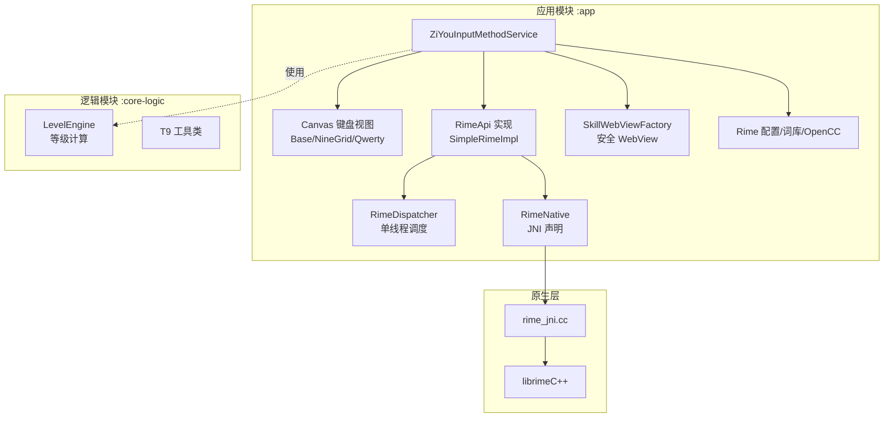
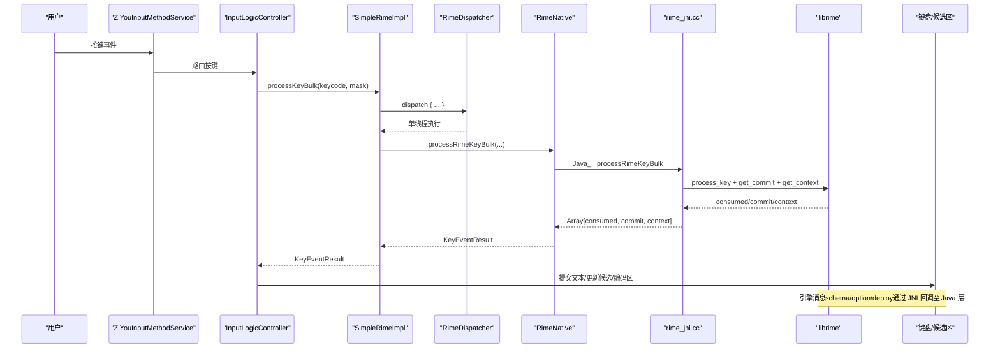
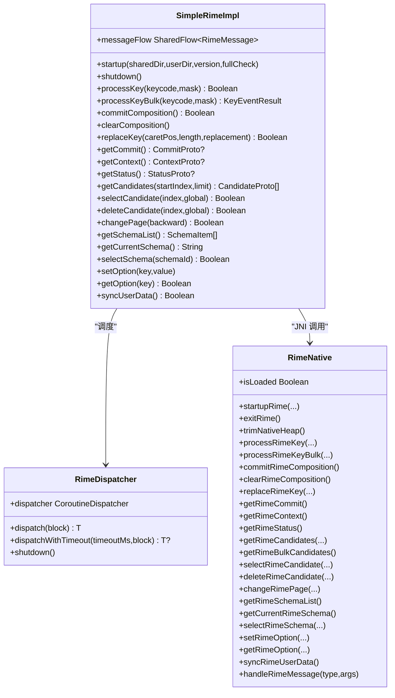
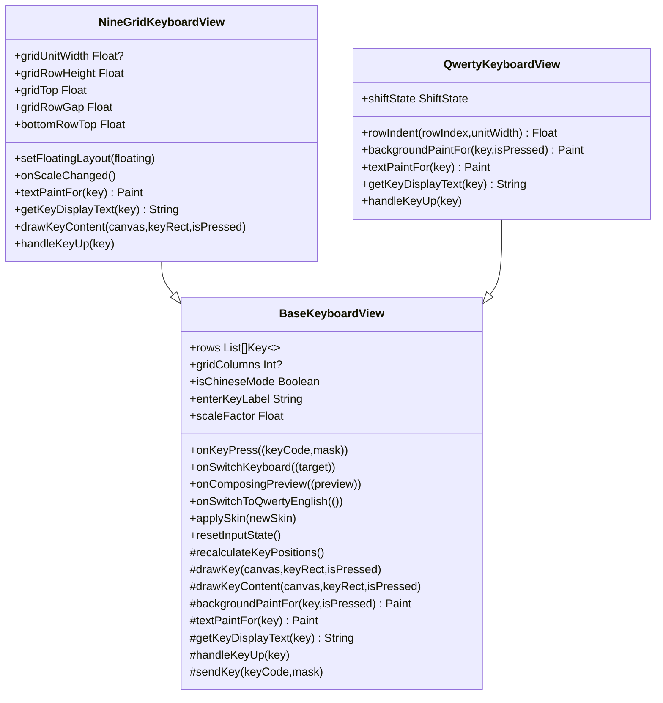
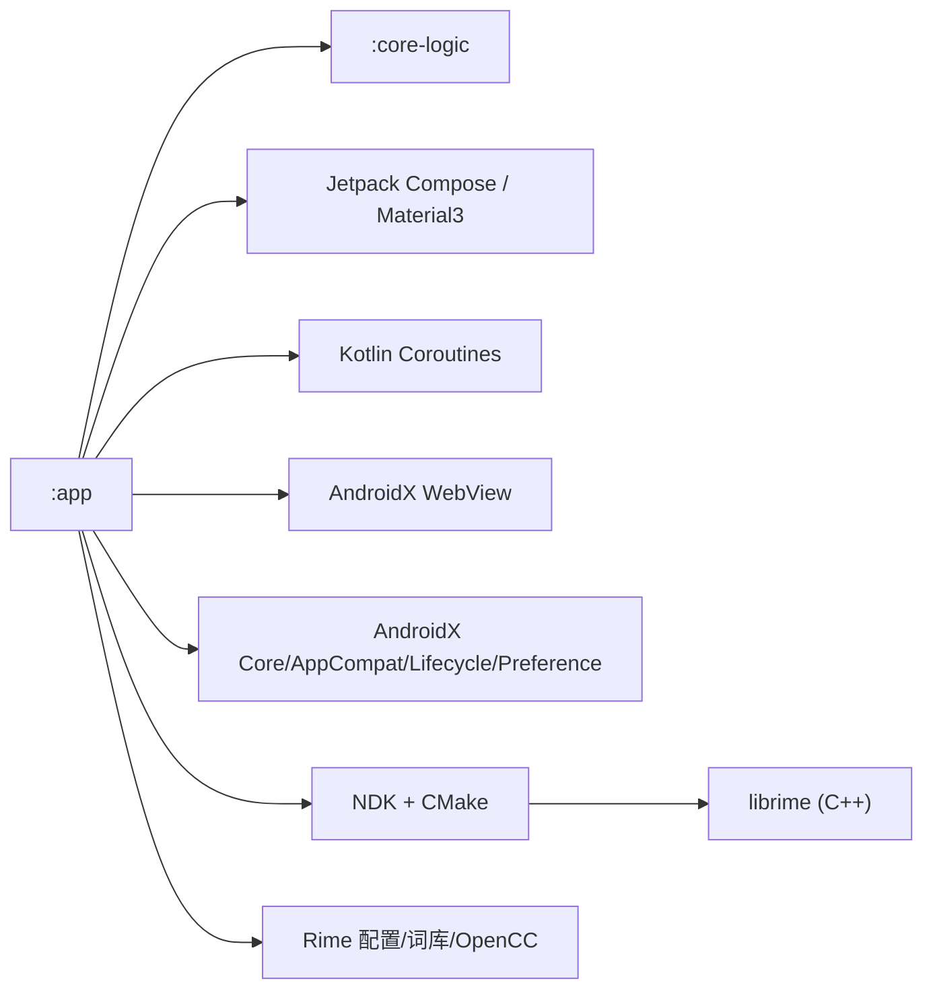

# 技术栈概览

<cite>
**本文引用的文件**   
- [ZiyouApplication.kt](file://app/src/main/java/com/ziyou/ime/ZiyouApplication.kt)
- [ZiYouInputMethodService.kt](file://app/src/main/java/com/ziyou/ime/ime/ZiYouInputMethodService.kt)
- [BaseKeyboardView.kt](file://app/src/main/java/com/ziyou/ime/ime/BaseKeyboardView.kt)
- [NineGridKeyboardView.kt](file://app/src/main/java/com/ziyou/ime/ime/NineGridKeyboardView.kt)
- [QwertyKeyboardView.kt](file://app/src/main/java/com/ziyou/ime/ime/QwertyKeyboardView.kt)
- [RimeDispatcher.kt](file://app/src/main/java/com/ziyou/ime/core/RimeDispatcher.kt)
- [SimpleRimeImpl.kt](file://app/src/main/java/com/ziyou/ime/core/SimpleRimeImpl.kt)
- [RimeNative.kt](file://app/src/main/java/com/ziyou/ime/core/RimeNative.kt)
- [rime_jni.cc](file://app/src/main/jni/librime_jni/rime_jni.cc)
- [SkillWebViewFactory.kt](file://app/src/main/java/com/ziyou/ime/skill/SkillWebViewFactory.kt)
- [LevelEngine.kt](file://core-logic/src/main/java/com/ziyou/ime/core/level/LevelEngine.kt)
- [build.gradle.kts（app）](file://app/build.gradle.kts)
- [build.gradle.kts（core-logic）](file://core-logic/build.gradle.kts)
- [settings.gradle.kts](file://settings.gradle.kts)
- [libs.versions.toml](file://gradle/libs.versions.toml)
</cite>

## 目录
1. [简介](#简介)
2. [项目结构](#项目结构)
3. [核心组件](#核心组件)
4. [架构总览](#架构总览)
5. [详细组件分析](#详细组件分析)
6. [依赖关系分析](#依赖关系分析)
7. [性能考量](#性能考量)
8. [故障排查指南](#故障排查指南)
9. [结论](#结论)
10. [附录](#附录)

## 简介
本文件为字由输入法项目的技术栈概览，聚焦于 Android 输入框架、Jetpack Compose/Material3、Kotlin/C++/JNI、Gradle/CMake/NDK、librime 引擎、协程与 WebView 等关键技术选型与实现。文档从系统架构、模块边界、数据流与关键算法入手，辅以架构图与时序图，帮助开发者快速理解整体布局与优化点。

## 项目结构
项目采用双模块划分：
- :app 模块：Android 应用层，包含 InputMethodService、UI（Compose + Canvas 自定义键盘）、技能面板（WebView）、Rime JNI 桥接与调度、配置与资源部署等。
- :core-logic 模块：纯逻辑库，承载可独立测试的无 Android 依赖的业务逻辑（如等级体系、T9 工具类等）。

构建与依赖管理：
- Gradle + Kotlin DSL 统一版本管理（libs.versions.toml），AGP 9.x，Kotlin 2.x，Compose BOM。
- NDK + CMake 编译 librime_jni，静态链接 librime 预编译库，按需启用 predict 插件。
- 模块间依赖方向严格单向：:app → :core-logic。

图表来源 
- [ZiYouInputMethodService.kt:1-800](file://app/src/main/java/com/ziyou/ime/ime/ZiYouInputMethodService.kt#L1-L800)
- [BaseKeyboardView.kt:1-619](file://app/src/main/java/com/ziyou/ime/ime/BaseKeyboardView.kt#L1-L619)
- [NineGridKeyboardView.kt:1-288](file://app/src/main/java/com/ziyou/ime/ime/NineGridKeyboardView.kt#L1-L288)
- [QwertyKeyboardView.kt:1-139](file://app/src/main/java/com/ziyou/ime/ime/QwertyKeyboardView.kt#L1-L139)
- [SimpleRimeImpl.kt:1-177](file://app/src/main/java/com/ziyou/ime/core/SimpleRimeImpl.kt#L1-L177)
- [RimeDispatcher.kt:1-91](file://app/src/main/java/com/ziyou/ime/core/RimeDispatcher.kt#L1-L91)
- [RimeNative.kt:1-170](file://app/src/main/java/com/ziyou/ime/core/RimeNative.kt#L1-L170)
- [rime_jni.cc:1-528](file://app/src/main/jni/librime_jni/rime_jni.cc#L1-L528)
- [SkillWebViewFactory.kt:1-205](file://app/src/main/java/com/ziyou/ime/skill/SkillWebViewFactory.kt#L1-L205)
- [LevelEngine.kt:1-187](file://core-logic/src/main/java/com/ziyou/ime/core/level/LevelEngine.kt#L1-L187)

章节来源
- [settings.gradle.kts:1-28](file://settings.gradle.kts#L1-L28)
- [build.gradle.kts（app）:1-192](file://app/build.gradle.kts#L1-L192)
- [build.gradle.kts（core-logic）:1-29](file://core-logic/build.gradle.kts#L1-L29)

## 核心组件
- InputMethodService：输入法服务主入口，负责引擎生命周期、按键事件处理、输入视图构建与显示形态（停靠/悬浮）、候选区与编码区同步、剪贴板监听、皮肤与主题切换等。
- Rime 引擎集成：通过 SimpleRimeImpl 暴露统一 API，经 RimeDispatcher 单线程调度，调用 RimeNative JNI 接口，底层 rime_jni.cc 封装 librime 会话与消息回调。
- 键盘视图体系：BaseKeyboardView 抽象出 Canvas 绘制、触摸、皮肤、缩放与布局模型；NineGridKeyboardView/QwertyKeyboardView 分别实现九宫格与全键盘。
- 技能面板：SkillWebViewFactory 提供安全隔离的 WebView 容器，拦截资源、注入垫片脚本、崩溃兜底保活 IME。
- 等级体系：LevelEngine 纯函数计算等级、积分、连续奖励与权益解锁。

章节来源
- [ZiYouInputMethodService.kt:1-800](file://app/src/main/java/com/ziyou/ime/ime/ZiYouInputMethodService.kt#L1-L800)
- [SimpleRimeImpl.kt:1-177](file://app/src/main/java/com/ziyou/ime/core/SimpleRimeImpl.kt#L1-L177)
- [RimeDispatcher.kt:1-91](file://app/src/main/java/com/ziyou/ime/core/RimeDispatcher.kt#L1-L91)
- [RimeNative.kt:1-170](file://app/src/main/java/com/ziyou/ime/core/RimeNative.kt#L1-L170)
- [rime_jni.cc:1-528](file://app/src/main/jni/librime_jni/rime_jni.cc#L1-L528)
- [BaseKeyboardView.kt:1-619](file://app/src/main/java/com/ziyou/ime/ime/BaseKeyboardView.kt#L1-L619)
- [NineGridKeyboardView.kt:1-288](file://app/src/main/java/com/ziyou/ime/ime/NineGridKeyboardView.kt#L1-L288)
- [QwertyKeyboardView.kt:1-139](file://app/src/main/java/com/ziyou/ime/ime/QwertyKeyboardView.kt#L1-L139)
- [SkillWebViewFactory.kt:1-205](file://app/src/main/java/com/ziyou/ime/skill/SkillWebViewFactory.kt#L1-L205)
- [LevelEngine.kt:1-187](file://core-logic/src/main/java/com/ziyou/ime/core/level/LevelEngine.kt#L1-L187)

## 架构总览
下图展示从用户按键到候选词上屏的完整链路，以及引擎状态同步与 UI 刷新流程。

图表来源 
- [ZiYouInputMethodService.kt:1-800](file://app/src/main/java/com/ziyou/ime/ime/ZiYouInputMethodService.kt#L1-L800)
- [SimpleRimeImpl.kt:1-177](file://app/src/main/java/com/ziyou/ime/core/SimpleRimeImpl.kt#L1-L177)
- [RimeDispatcher.kt:1-91](file://app/src/main/java/com/ziyou/ime/core/RimeDispatcher.kt#L1-L91)
- [RimeNative.kt:1-170](file://app/src/main/java/com/ziyou/ime/core/RimeNative.kt#L1-L170)
- [rime_jni.cc:1-528](file://app/src/main/jni/librime_jni/rime_jni.cc#L1-L528)

## 详细组件分析

### 输入法服务与输入视图（ZiYouInputMethodService）
- 职责：管理 Rime 引擎生命周期、按键分发、输入视图构建（候选区+编码区+键盘）、显示形态（停靠/悬浮）、剪贴板监听、皮肤与主题切换、方案一致性守护。
- 关键点：
  - 异步初始化引擎并等待就绪（latest-wins 串行化避免并发交错）。
  - 按键盘类型同步方案与 ascii_mode，联动联想开关。
  - 候选区与编码区分离，确保始终可见与稳定显隐。
  - 多面板协调器（技能/AI/涂鸦/粘贴板/工具/键盘选择）统一编排生命周期与键盘收放。

章节来源
- [ZiYouInputMethodService.kt:1-800](file://app/src/main/java/com/ziyou/ime/ime/ZiYouInputMethodService.kt#L1-L800)

### Rime 引擎集成（SimpleRimeImpl / RimeDispatcher / RimeNative / rime_jni.cc）
- 设计要点：
  - SimpleRimeImpl 将全部 API 调用委派给 RimeDispatcher 的单线程执行器，保证 librime 线程安全。
  - RimeNative 声明 JNI 方法并提供 isLoaded 校验与 trimNativeHeap 内存回收。
  - rime_jni.cc 封装 Session、消息回调、批量按键处理（热路径一次跨界完成 processKey + getCommit + getContext）。
  - 支持 predict 模块（WITH_PREDICT=ON）与 OpenCC 转换资源。

图表来源 
- [SimpleRimeImpl.kt:1-177](file://app/src/main/java/com/ziyou/ime/core/SimpleRimeImpl.kt#L1-L177)
- [RimeDispatcher.kt:1-91](file://app/src/main/java/com/ziyou/ime/core/RimeDispatcher.kt#L1-L91)
- [RimeNative.kt:1-170](file://app/src/main/java/com/ziyou/ime/core/RimeNative.kt#L1-L170)
- [rime_jni.cc:1-528](file://app/src/main/jni/librime_jni/rime_jni.cc#L1-L528)

章节来源
- [SimpleRimeImpl.kt:1-177](file://app/src/main/java/com/ziyou/ime/core/SimpleRimeImpl.kt#L1-L177)
- [RimeDispatcher.kt:1-91](file://app/src/main/java/com/ziyou/ime/core/RimeDispatcher.kt#L1-L91)
- [RimeNative.kt:1-170](file://app/src/main/java/com/ziyou/ime/core/RimeNative.kt#L1-L170)
- [rime_jni.cc:1-528](file://app/src/main/jni/librime_jni/rime_jni.cc#L1-L528)

### 键盘视图体系（BaseKeyboardView / NineGridKeyboardView / QwertyKeyboardView）
- BaseKeyboardView：抽象行×相对宽度或列网格布局、Canvas 绘制（背景/圆角/阴影/文字）、触摸高亮与长按重复、皮肤参数化、悬浮缩放因子。
- NineGridKeyboardView：标准九宫格 4 行布局，智能九键（数字派生拼音），右侧功能列与跨行换行键，底行在悬浮态含「符号」入口。
- QwertyKeyboardView：10 列网格，Shift 三态、中英文切换、数字键盘临时面板。

图表来源 
- [BaseKeyboardView.kt:1-619](file://app/src/main/java/com/ziyou/ime/ime/BaseKeyboardView.kt#L1-L619)
- [NineGridKeyboardView.kt:1-288](file://app/src/main/java/com/ziyou/ime/ime/NineGridKeyboardView.kt#L1-L288)
- [QwertyKeyboardView.kt:1-139](file://app/src/main/java/com/ziyou/ime/ime/QwertyKeyboardView.kt#L1-L139)

章节来源
- [BaseKeyboardView.kt:1-619](file://app/src/main/java/com/ziyou/ime/ime/BaseKeyboardView.kt#L1-L619)
- [NineGridKeyboardView.kt:1-288](file://app/src/main/java/com/ziyou/ime/ime/NineGridKeyboardView.kt#L1-L288)
- [QwertyKeyboardView.kt:1-139](file://app/src/main/java/com/ziyou/ime/ime/QwertyKeyboardView.kt#L1-L139)

### 技能面板（SkillWebViewFactory）
- 安全基线：虚拟域名仅放行包内资源、CSP 收紧、禁用文件/内容访问、JS 仅暴露 SkillBridge、渲染进程崩溃兜底保活 IME。
- 首帧防闪烁：首帧前隐藏 WebView，提交后显示；优先 DOCUMENT_START_SCRIPT 注入垫片脚本，不支持则回退 onPageStarted。

章节来源
- [SkillWebViewFactory.kt:1-205](file://app/src/main/java/com/ziyou/ime/skill/SkillWebViewFactory.kt#L1-L205)

### 等级体系（LevelEngine）
- 纯函数计算：分段计分、连续天数奖励、等级判定与进度、权益解锁（皮肤/音效）。
- 便于单元测试与热路径计数解耦。

章节来源
- [LevelEngine.kt:1-187](file://core-logic/src/main/java/com/ziyou/ime/core/level/LevelEngine.kt#L1-L187)

## 依赖关系分析
- 模块依赖：:app 依赖 :core-logic（单向），编译器强制边界。
- 构建系统：AGP + Kotlin DSL，统一版本管理 libs.versions.toml；NDK + CMake 编译 rime_jni，静态链接 librime。
- 运行时依赖：librime（C++）、OpenCC（简繁转换）、可选 predict 预测模块。

图表来源 
- [settings.gradle.kts:1-28](file://settings.gradle.kts#L1-L28)
- [build.gradle.kts（app）:1-192](file://app/build.gradle.kts#L1-L192)
- [build.gradle.kts（core-logic）:1-29](file://core-logic/build.gradle.kts#L1-L29)
- [libs.versions.toml:1-51](file://gradle/libs.versions.toml#L1-L51)

章节来源
- [settings.gradle.kts:1-28](file://settings.gradle.kts#L1-L28)
- [build.gradle.kts（app）:1-192](file://app/build.gradle.kts#L1-L192)
- [build.gradle.kts（core-logic）:1-29](file://core-logic/build.gradle.kts#L1-L29)
- [libs.versions.toml:1-51](file://gradle/libs.versions.toml#L1-L51)

## 性能考量
- 单线程 Dispatcher：librime 非线程安全，RimeDispatcher 以单线程 Executor 串行化所有操作，避免数据竞争与锁开销。
- 热路径优化：processRimeKeyBulk 合并三次 JNI 跨界（按键处理+提交+上下文），减少跨层开销。
- 候选词批量获取：getRimeBulkCandidates 返回 size/highlighted/candidates，减少多次查询。
- 内存回收：trimNativeHeap 在部署完成后归还空闲页，降低常驻占用与 zRAM 换出。
- 视图绘制：Canvas 自绘键盘，避免复杂 XML 层级；悬浮模式统一缩放因子，零额外布局成本。
- 协程调度：主线程协程作用域用于 UI 更新，IO 任务走 Dispatchers.IO，避免阻塞。

章节来源
- [RimeDispatcher.kt:1-91](file://app/src/main/java/com/ziyou/ime/core/RimeDispatcher.kt#L1-L91)
- [RimeNative.kt:1-170](file://app/src/main/java/com/ziyou/ime/core/RimeNative.kt#L1-L170)
- [rime_jni.cc:1-528](file://app/src/main/jni/librime_jni/rime_jni.cc#L1-L528)
- [BaseKeyboardView.kt:1-619](file://app/src/main/java/com/ziyou/ime/ime/BaseKeyboardView.kt#L1-L619)
- [ZiYouInputMethodService.kt:1-800](file://app/src/main/java/com/ziyou/ime/ime/ZiYouInputMethodService.kt#L1-L800)

## 故障排查指南
- 引擎未就绪：awaitEngineReady 轮询等待，超时放弃并由部署完成消息重同步；检查 fullCheck 与 AssetDeployer 部署结果。
- JNI 库加载失败：RimeNative.isLoaded 校验，ABI 不匹配或缺失 .so 会抛异常；确认 ABI 过滤与 NDK 构建产物。
- 候选区不刷新：检查 applyEngineForKeyboard 中 updateCandidates 与 preeditOverlay 同步路径；确认 messageFlow 订阅。
- 技能面板黑屏或崩溃：WebView 首帧前 INVISIBLE 防闪烁；onRenderProcessGone 兜底保活 IME；检查 CSP 与资源拦截。
- 中文/英文模式错乱：pendingEnglishMode 标志与 scheduleEngineSync 串行化避免竞态；切换时先清编码再同步。

章节来源
- [ZiYouInputMethodService.kt:1-800](file://app/src/main/java/com/ziyou/ime/ime/ZiYouInputMethodService.kt#L1-L800)
- [RimeNative.kt:1-170](file://app/src/main/java/com/ziyou/ime/core/RimeNative.kt#L1-L170)
- [SkillWebViewFactory.kt:1-205](file://app/src/main/java/com/ziyou/ime/skill/SkillWebViewFactory.kt#L1-L205)

## 结论
本项目以 InputMethodService 为核心，结合 Jetpack Compose/Material3 与 Canvas 自绘键盘，形成高性能、可定制化的输入体验。通过 librime 引擎与 JNI 桥接，配合单线程调度与批量跨界优化，保障吞吐与稳定性。模块化 (:app/:core-logic) 与严格的依赖方向提升了可维护性与可测试性。技能面板基于安全 WebView 沙箱，扩展性强且风险可控。

## 附录
- 技术选型原因与优势
  - 为什么选择 librime：成熟开源、可扩展 schema/dict/predict、OpenCC 支持简繁转换，生态完善。
  - 为什么使用 Canvas 绘制键盘：灵活控制样式与交互，适配皮肤与悬浮缩放，避免 XML 层级与系统键盘限制。
  - 为什么采用单线程 Dispatcher：librime 非线程安全，单线程串行化避免锁与竞态，简化并发模型。
  - 为什么使用协程：轻量异步、结构化并发、易于与 UI 线程协作，提升响应性。
  - 为什么引入 WebView 技能系统：HTML/JS 生态丰富，便于快速迭代技能，同时通过安全基线隔离风险。
- 模块边界
  - :core-logic 不包含 Android 依赖，纯逻辑可独立测试；:app 负责 UI、JNI、系统与资源。
- 构建与发布
  - AGP + CMake + NDK 构建 native 库；ProGuard 压缩混淆但关闭激进优化保护 JNI 符号；签名与 ABI 过滤可控。