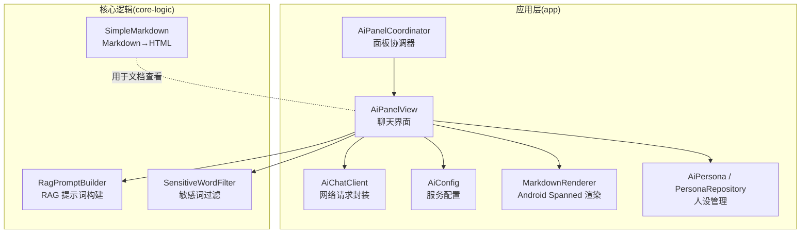
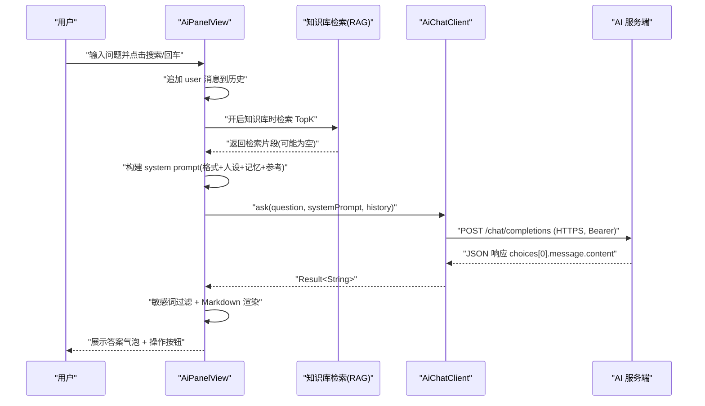
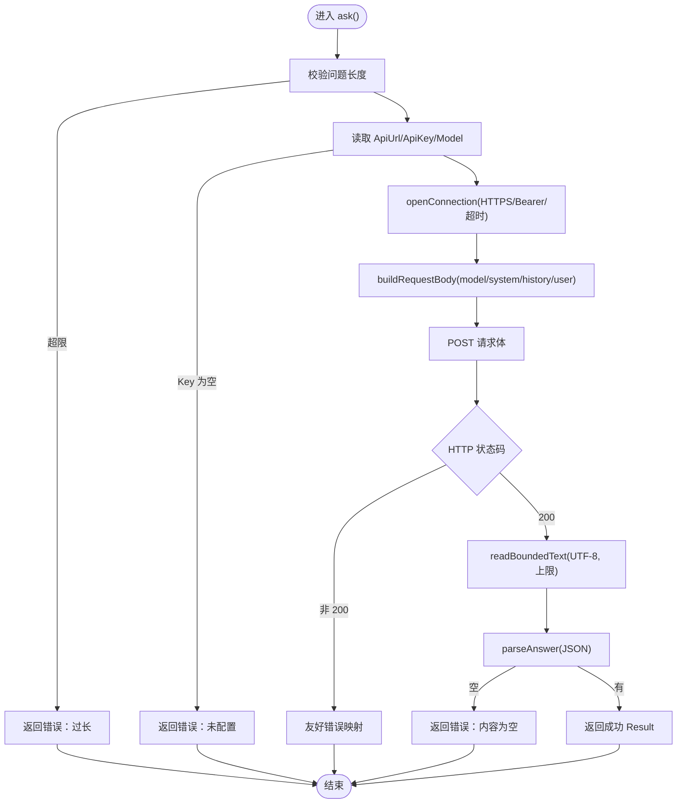
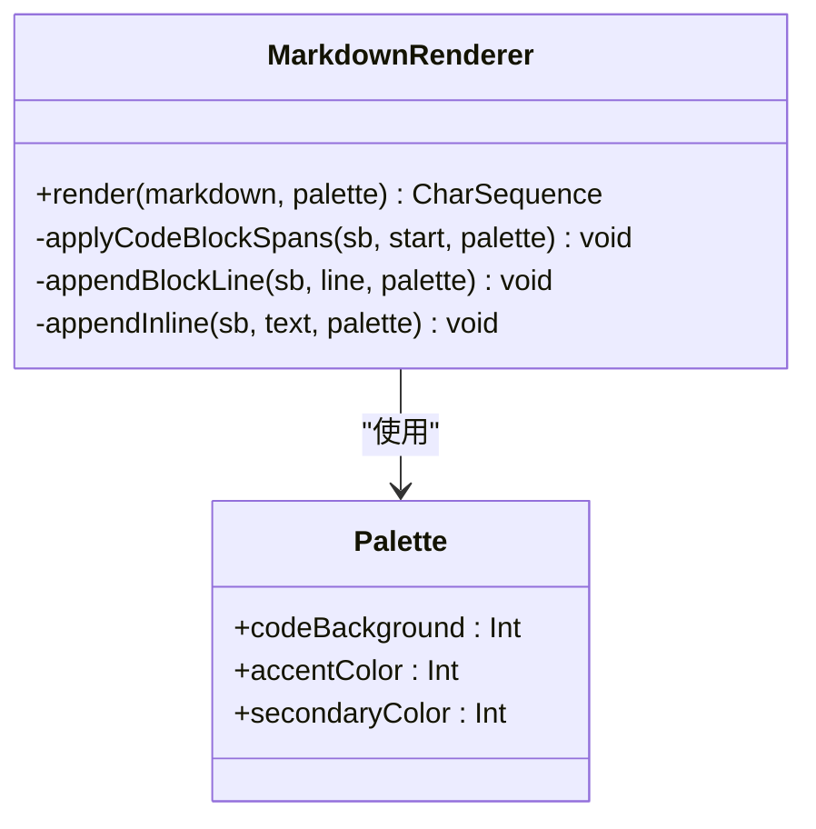
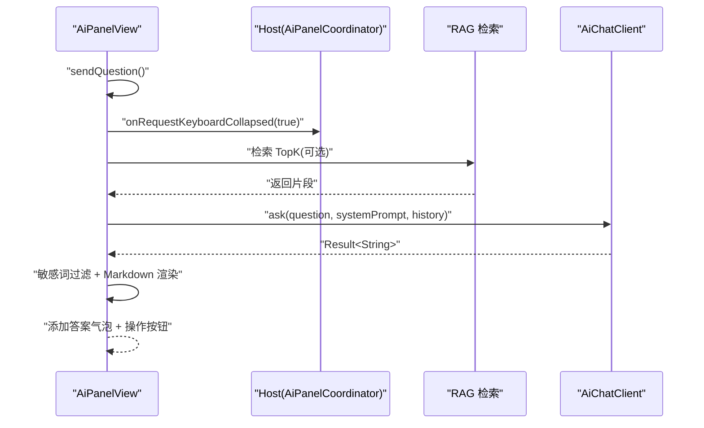
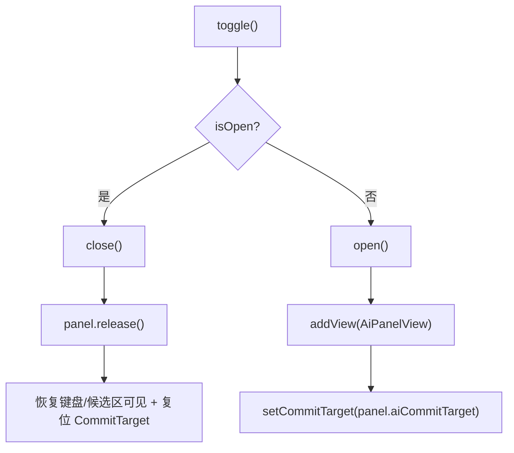
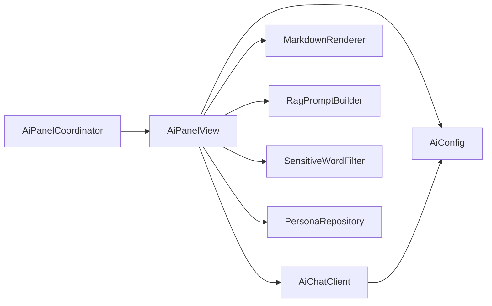

# AI 问答功能

<cite>
**本文引用的文件**   
- [AiChatClient.kt](file://app/src/main/java/com/ziyou/ime/ai/AiChatClient.kt)
- [AiConfig.kt](file://app/src/main/java/com/ziyou/ime/ai/AiConfig.kt)
- [MarkdownRenderer.kt](file://app/src/main/java/com/ziyou/ime/ai/MarkdownRenderer.kt)
- [AiPanelView.kt](file://app/src/main/java/com/ziyou/ime/ime/AiPanelView.kt)
- [AiPanelCoordinator.kt](file://app/src/main/java/com/ziyou/ime/ime/AiPanelCoordinator.kt)
- [SimpleMarkdown.kt](file://core-logic/src/main/java/com/ziyou/ime/core/markdown/SimpleMarkdown.kt)
- [RagPromptBuilder.kt](file://core-logic/src/main/java/com/ziyou/ime/core/rag/RagPromptBuilder.kt)
- [SensitiveWordFilter.kt](file://core-logic/src/main/java/com/ziyou/ime/core/rag/SensitiveWordFilter.kt)
- [AiPersona.kt](file://app/src/main/java/com/ziyou/ime/ai/AiPersona.kt)
- [PersonaRepository.kt](file://app/src/main/java/com/ziyou/ime/ai/PersonaRepository.kt)
</cite>

## 目录
1. [简介](#简介)
2. [项目结构](#项目结构)
3. [核心组件](#核心组件)
4. [架构总览](#架构总览)
5. [详细组件分析](#详细组件分析)
6. [依赖关系分析](#依赖关系分析)
7. [性能考量](#性能考量)
8. [故障排查指南](#故障排查指南)
9. [结论](#结论)
10. [附录](#附录)

## 简介
本文件面向字由输入法的 AI 问答能力，系统性说明客户端集成、网络请求封装与错误处理、Markdown 渲染引擎、聊天界面交互设计、AI 配置与可扩展性、隐私保护与内容过滤、以及用户体验优化方案。文档以代码级为依据，辅以架构图与流程图，帮助开发者快速理解并扩展智能输入功能。

## 项目结构
AI 问答相关代码主要分布在以下模块：
- app 层（UI 与客户端）
  - ai：AI 客户端、配置、人设、Markdown 渲染
  - ime：AI 面板视图与协调器
- core-logic 层（通用逻辑）
  - markdown：面向文档查看的 Markdown→HTML 转换器
  - rag：检索增强生成（RAG）提示词构建与敏感词过滤

图表来源 
- [AiPanelView.kt:1-120](file://app/src/main/java/com/ziyou/ime/ime/AiPanelView.kt#L1-L120)
- [AiPanelCoordinator.kt:1-80](file://app/src/main/java/com/ziyou/ime/ime/AiPanelCoordinator.kt#L1-L80)
- [AiChatClient.kt:1-60](file://app/src/main/java/com/ziyou/ime/ai/AiChatClient.kt#L1-L60)
- [AiConfig.kt:1-40](file://app/src/main/java/com/ziyou/ime/ai/AiConfig.kt#L1-L40)
- [MarkdownRenderer.kt:1-60](file://app/src/main/java/com/ziyou/ime/ai/MarkdownRenderer.kt#L1-L60)
- [SimpleMarkdown.kt:1-40](file://core-logic/src/main/java/com/ziyou/ime/core/markdown/SimpleMarkdown.kt#L1-L40)
- [RagPromptBuilder.kt:1-40](file://core-logic/src/main/java/com/ziyou/ime/core/rag/RagPromptBuilder.kt#L1-L40)
- [SensitiveWordFilter.kt:1-40](file://core-logic/src/main/java/com/ziyou/ime/core/rag/SensitiveWordFilter.kt#L1-L40)

章节来源
- [AiPanelView.kt:1-120](file://app/src/main/java/com/ziyou/ime/ime/AiPanelView.kt#L1-L120)
- [AiPanelCoordinator.kt:1-80](file://app/src/main/java/com/ziyou/ime/ime/AiPanelCoordinator.kt#L1-L80)

## 核心组件
- AiChatClient：OpenAI 兼容 chat/completions 非流式请求封装，强制 HTTPS、超时控制、响应体大小限制、友好错误码映射。
- AiConfig：通过 SharedPreferences 持久化 API URL、API Key、模型名，提供默认值与配置检查。
- MarkdownRenderer：轻量 Markdown→Spanned 渲染，支持标题、粗斜体、删除线、行内代码、代码块、列表、引用、分隔线、链接展示。
- AiPanelView：聊天面板 UI，消息气泡、滚动加载、输入框交互、多轮历史、知识库开关、人设切换、答案操作按钮。
- AiPanelCoordinator：面板生命周期与键盘收放布局编排，保证 IME 窗口高度守恒。
- SimpleMarkdown：纯逻辑 Markdown→HTML 转换器，用于技能开发指南等文档场景，安全转义防注入。
- RagPromptBuilder：融合格式约束、人设、长期记忆摘要与检索知识块，构建最终 system prompt，长度受限。
- SensitiveWordFilter：内置最小敏感词表，对 AI 回答进行清洗替换。
- AiPersona / PersonaRepository：内置与自定义人设管理，系统提示词注入 LLM 以维持角色风格。

章节来源
- [AiChatClient.kt:1-194](file://app/src/main/java/com/ziyou/ime/ai/AiChatClient.kt#L1-L194)
- [AiConfig.kt:1-56](file://app/src/main/java/com/ziyou/ime/ai/AiConfig.kt#L1-L56)
- [MarkdownRenderer.kt:1-206](file://app/src/main/java/com/ziyou/ime/ai/MarkdownRenderer.kt#L1-L206)
- [AiPanelView.kt:1-765](file://app/src/main/java/com/ziyou/ime/ime/AiPanelView.kt#L1-L765)
- [AiPanelCoordinator.kt:1-159](file://app/src/main/java/com/ziyou/ime/ime/AiPanelCoordinator.kt#L1-L159)
- [SimpleMarkdown.kt:1-174](file://core-logic/src/main/java/com/ziyou/ime/core/markdown/SimpleMarkdown.kt#L1-L174)
- [RagPromptBuilder.kt:1-70](file://core-logic/src/main/java/com/ziyou/ime/core/rag/RagPromptBuilder.kt#L1-L70)
- [SensitiveWordFilter.kt:1-60](file://core-logic/src/main/java/com/ziyou/ime/core/rag/SensitiveWordFilter.kt#L1-L60)
- [AiPersona.kt:1-92](file://app/src/main/java/com/ziyou/ime/ai/AiPersona.kt#L1-L92)
- [PersonaRepository.kt:1-148](file://app/src/main/java/com/ziyou/ime/ai/PersonaRepository.kt#L1-L148)

## 架构总览
AI 问答整体流程：用户在面板输入问题 → 面板协调器切换布局为答案态 → 面板发起 RAG 检索（可选）→ 构建 system prompt → 调用 AiChatClient 发起网络请求 → 解析返回文本 → 敏感词过滤 → Markdown 渲染 → 显示答案气泡并提供「发送」「发图」操作。

图表来源 
- [AiPanelView.kt:329-416](file://app/src/main/java/com/ziyou/ime/ime/AiPanelView.kt#L329-L416)
- [RagPromptBuilder.kt:28-48](file://core-logic/src/main/java/com/ziyou/ime/core/rag/RagPromptBuilder.kt#L28-L48)
- [AiChatClient.kt:65-114](file://app/src/main/java/com/ziyou/ime/ai/AiChatClient.kt#L65-L114)

## 详细组件分析

### 网络请求封装与安全策略（AiChatClient）
- 协议与端点：OpenAI 兼容 chat/completions，非流式；端点由 AiConfig 提供，默认指向阿里云百炼 DashScope。
- 安全基线：强制 HTTPS；连接/读取超时；Authorization: Bearer；响应体上限（字节）；单次提问字符上限。
- 错误处理：HTTP 状态码映射为用户可读提示；IO 异常与未知异常统一包装；空响应检测。
- 线程模型：所有 IO 切至 Dispatchers.IO，不阻塞 UI。

图表来源 
- [AiChatClient.kt:65-114](file://app/src/main/java/com/ziyou/ime/ai/AiChatClient.kt#L65-L114)
- [AiChatClient.kt:117-128](file://app/src/main/java/com/ziyou/ime/ai/AiChatClient.kt#L117-L128)
- [AiChatClient.kt:135-153](file://app/src/main/java/com/ziyou/ime/ai/AiChatClient.kt#L135-L153)
- [AiChatClient.kt:156-167](file://app/src/main/java/com/ziyou/ime/ai/AiChatClient.kt#L156-L167)
- [AiChatClient.kt:170-175](file://app/src/main/java/com/ziyou/ime/ai/AiChatClient.kt#L170-L175)
- [AiChatClient.kt:178-192](file://app/src/main/java/com/ziyou/ime/ai/AiChatClient.kt#L178-L192)

章节来源
- [AiChatClient.kt:1-194](file://app/src/main/java/com/ziyou/ime/ai/AiChatClient.kt#L1-L194)
- [AiConfig.kt:1-56](file://app/src/main/java/com/ziyou/ime/ai/AiConfig.kt#L1-L56)

### Markdown 渲染引擎（MarkdownRenderer）
- 目标：将 AI 返回的 Markdown 转换为 Spanned 富文本，直接供 TextView 渲染，零第三方库。
- 支持语法：标题、粗斜体、删除线、行内代码、围栏代码块、无序/有序列表、引用、分隔线、链接（仅展示）。
- 主题适配：颜色从当前键盘主题 Palette 取色，确保深浅色一致。
- 性能：逐行扫描与正则匹配，避免复杂 AST；代码块整体着色；尾部空行清理。

图表来源 
- [MarkdownRenderer.kt:32-47](file://app/src/main/java/com/ziyou/ime/ai/MarkdownRenderer.kt#L32-L47)
- [MarkdownRenderer.kt:71-104](file://app/src/main/java/com/ziyou/ime/ai/MarkdownRenderer.kt#L71-L104)
- [MarkdownRenderer.kt:107-115](file://app/src/main/java/com/ziyou/ime/ai/MarkdownRenderer.kt#L107-L115)
- [MarkdownRenderer.kt:118-163](file://app/src/main/java/com/ziyou/ime/ai/MarkdownRenderer.kt#L118-L163)
- [MarkdownRenderer.kt:166-204](file://app/src/main/java/com/ziyou/ime/ai/MarkdownRenderer.kt#L166-L204)

章节来源
- [MarkdownRenderer.kt:1-206](file://app/src/main/java/com/ziyou/ime/ai/MarkdownRenderer.kt#L1-L206)

### 聊天界面与交互（AiPanelView）
- 布局形态：提问态（紧凑高度，键盘可见）与答案态（接管键盘空间，独立滚动），由协调器编排。
- 消息气泡：用户右对齐强调色底，助手左对齐主题背景；错误提示纯文本高亮。
- 输入交互：CommitTarget 路由键盘上屏到面板输入框；回车即发送；支持回删按码点。
- 多轮历史：FIFO 上限，失败时回滚 user 消息避免重复。
- 知识库开关：开启后检索并融合提示词；无数据或检索异常降级为普通问答。
- 答案操作：「发送」提交纯文本；「发图/存图」根据编辑器能力动态呈现。

图表来源 
- [AiPanelView.kt:329-416](file://app/src/main/java/com/ziyou/ime/ime/AiPanelView.kt#L329-L416)
- [AiPanelView.kt:482-532](file://app/src/main/java/com/ziyou/ime/ime/AiPanelView.kt#L482-L532)

章节来源
- [AiPanelView.kt:1-765](file://app/src/main/java/com/ziyou/ime/ime/AiPanelView.kt#L1-L765)

### 面板协调器（AiPanelCoordinator）
- 职责：打开/关闭面板、挂载到内容根容器顶部、切换 CommitTarget、键盘/候选区收放与高度守恒。
- 两种形态：提问态（WRAP_CONTENT）、答案态（weight=1 接管剩余空间），IME 窗口总高不变。

图表来源 
- [AiPanelCoordinator.kt:71-101](file://app/src/main/java/com/ziyou/ime/ime/AiPanelCoordinator.kt#L71-L101)
- [AiPanelCoordinator.kt:139-157](file://app/src/main/java/com/ziyou/ime/ime/AiPanelCoordinator.kt#L139-L157)

章节来源
- [AiPanelCoordinator.kt:1-159](file://app/src/main/java/com/ziyou/ime/ime/AiPanelCoordinator.kt#L1-L159)

### RAG 提示词构建（RagPromptBuilder）
- 拼接顺序：格式约束 → 人设 → 【长期记忆】→ 【参考资料】编号 → 引用指令。
- 预算控制：MAX_PROMPT_CHARS 限制，低分片段被丢弃以保证总长度。
- 降级策略：无检索结果或记忆摘要时退化为 base + persona。

章节来源
- [RagPromptBuilder.kt:1-70](file://core-logic/src/main/java/com/ziyou/ime/core/rag/RagPromptBuilder.kt#L1-L70)

### 敏感词过滤（SensitiveWordFilter）
- 功能：check 命中检测；sanitize 替换为等长星号，保持原文长度。
- 词表：内置最小词表，ASCII 小写归一化，未来可替换为高效算法。

章节来源
- [SensitiveWordFilter.kt:1-60](file://core-logic/src/main/java/com/ziyou/ime/core/rag/SensitiveWordFilter.kt#L1-L60)

### 人设与配置（AiPersona / PersonaRepository / AiConfig）
- 人设：内置多种角色（助手、创意、导师、翻译、娱乐），systemPrompt 注入 LLM 维持风格；支持自定义增删改。
- 配置：SharedPreferences 存储 API URL、Key、模型名，提供默认值与 isConfigured 检查。

章节来源
- [AiPersona.kt:1-92](file://app/src/main/java/com/ziyou/ime/ai/AiPersona.kt#L1-L92)
- [PersonaRepository.kt:1-148](file://app/src/main/java/com/ziyou/ime/ai/PersonaRepository.kt#L1-L148)
- [AiConfig.kt:1-56](file://app/src/main/java/com/ziyou/ime/ai/AiConfig.kt#L1-L56)

### 文档 Markdown 转换（SimpleMarkdown）
- 用途：技能开发指南等文档查看场景，Markdown→HTML 片段。
- 安全：先 HTML 实体转义再套标签，杜绝注入；不支持语法降级为段落。

章节来源
- [SimpleMarkdown.kt:1-174](file://core-logic/src/main/java/com/ziyou/ime/core/markdown/SimpleMarkdown.kt#L1-L174)

## 依赖关系分析
- AiPanelView 依赖 AiChatClient、AiConfig、MarkdownRenderer、RagPromptBuilder、SensitiveWordFilter、AiPersona/PersonaRepository。
- AiPanelCoordinator 依赖 ZiYouInputMethodService 提供的宿主能力（视图容器、输入路由切换）。
- AiChatClient 依赖 AiConfig 获取端点与鉴权信息。
- RagPromptBuilder 依赖 RetrievedChunk（来自检索模块）与 AiMemoryStore（跨会话记忆）。

图表来源 
- [AiPanelView.kt:1-120](file://app/src/main/java/com/ziyou/ime/ime/AiPanelView.kt#L1-L120)
- [AiPanelCoordinator.kt:1-80](file://app/src/main/java/com/ziyou/ime/ime/AiPanelCoordinator.kt#L1-L80)
- [AiChatClient.kt:1-60](file://app/src/main/java/com/ziyou/ime/ai/AiChatClient.kt#L1-L60)

章节来源
- [AiPanelView.kt:1-200](file://app/src/main/java/com/ziyou/ime/ime/AiPanelView.kt#L1-L200)
- [AiPanelCoordinator.kt:1-100](file://app/src/main/java/com/ziyou/ime/ime/AiPanelCoordinator.kt#L1-L100)
- [AiChatClient.kt:1-100](file://app/src/main/java/com/ziyou/ime/ai/AiChatClient.kt#L1-L100)

## 性能考量
- 网络 IO 全部在 IO 线程执行，避免主线程阻塞。
- 响应体读取限制最大字节数，防止内存溢出。
- Markdown 渲染采用逐行扫描与正则匹配，避免复杂解析开销；代码块一次性着色。
- 多轮历史 FIFO 上限，减少上下文长度与请求体积。
- RAG 提示词构建限制最大字符数，低分片段截断，控制 token 占用。
- 面板释放时取消协程作用域与进行中请求，避免泄漏。

## 故障排查指南
- 未配置 API Key：面板会引导跳转设置页；确认 AiConfig.isConfigured 返回 true。
- HTTP 错误：查看友好错误映射（401/403/429/5xx），核对密钥、额度与服务可用性。
- 网络异常：检查网络连接与超时设置；日志中记录异常堆栈。
- 响应为空：服务端返回 JSON 不包含 choices 或 message.content 为空；检查模型输出。
- 渲染异常：Markdown 解析失败会降级为原样文本；检查输入是否包含不支持语法。
- 面板布局异常：确认协调器 setKeyboardCollapsed 调用与 IME 窗口高度守恒策略。

章节来源
- [AiPanelView.kt:349-416](file://app/src/main/java/com/ziyou/ime/ime/AiPanelView.kt#L349-L416)
- [AiChatClient.kt:90-114](file://app/src/main/java/com/ziyou/ime/ai/AiChatClient.kt#L90-L114)
- [AiChatClient.kt:170-175](file://app/src/main/java/com/ziyou/ime/ai/AiChatClient.kt#L170-L175)

## 结论
本实现以轻量、安全、可扩展为核心原则：
- 网络层严格安全基线与健壮的错误处理；
- Markdown 渲染零依赖且主题自适应；
- 聊天界面交互流畅，支持多轮对话与知识库增强；
- 人设与配置灵活，便于接入多种 AI 服务；
- 敏感词过滤与隐私保护贯穿全流程；
- 性能与资源管理到位，保障 IME 稳定性。

## 附录
- 支持的 Markdown 子集与限制：表格/图片/HTML 不在 Android 渲染范围内，客户端已做源头约束。
- 扩展建议：
  - 新增 AI 服务：仅需在设置页替换 ApiUrl/ApiKey/Model，无需改动客户端。
  - 扩展 Markdown：可在 MarkdownRenderer 增加新 Span 样式，保持与主题 Palette 解耦。
  - 增强 RAG：调整 RagPromptBuilder 预算与片段排序策略，提升引用质量。
  - 内容安全：扩充 SensitiveWordFilter 词表，必要时引入更高效匹配算法。