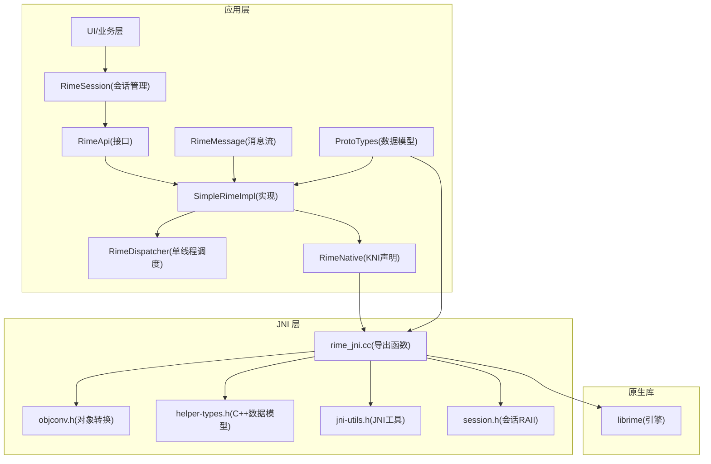
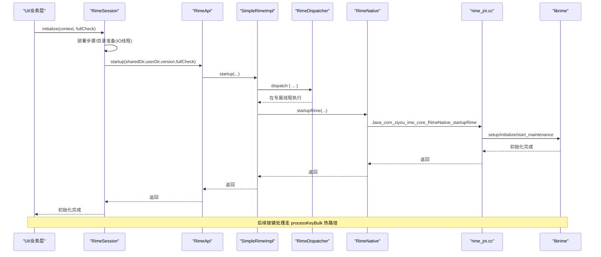
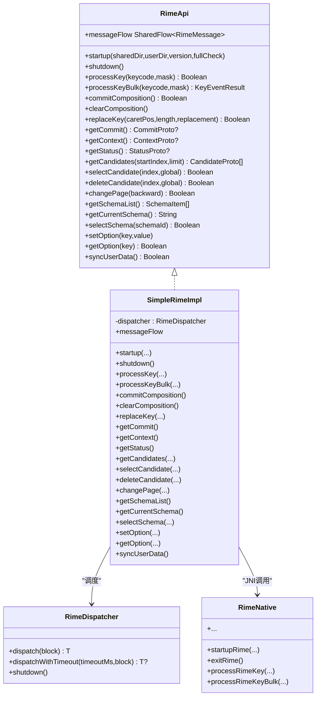
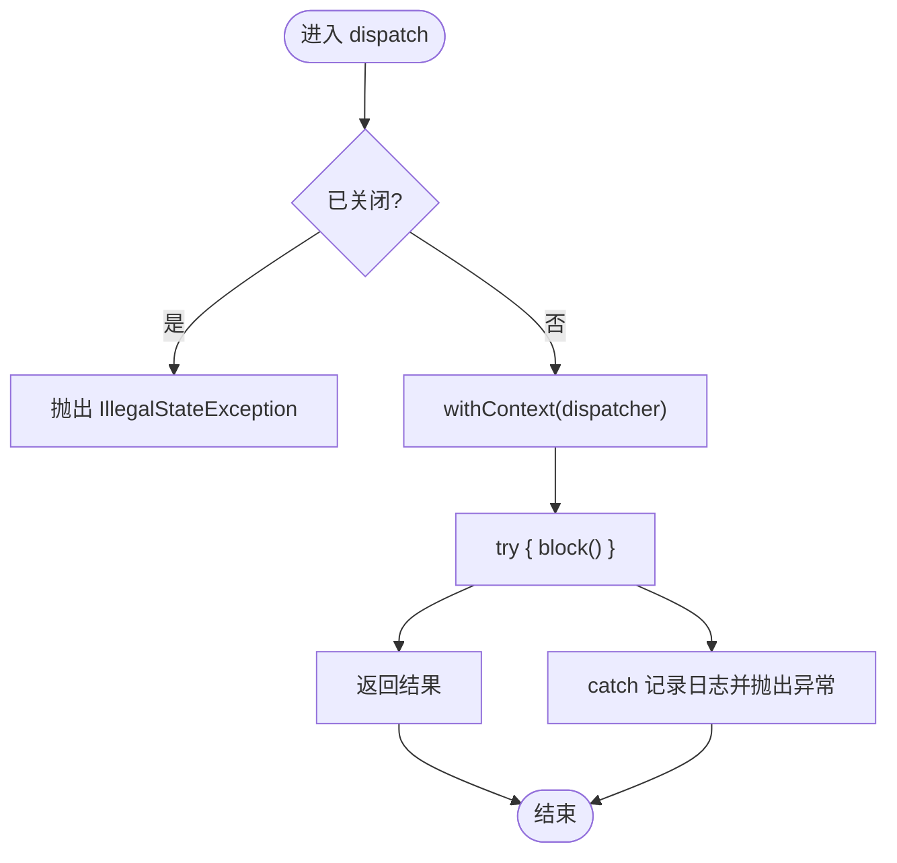
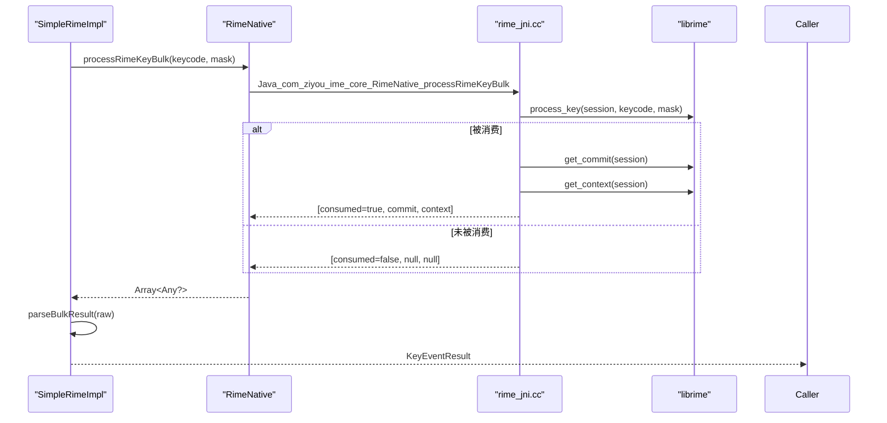
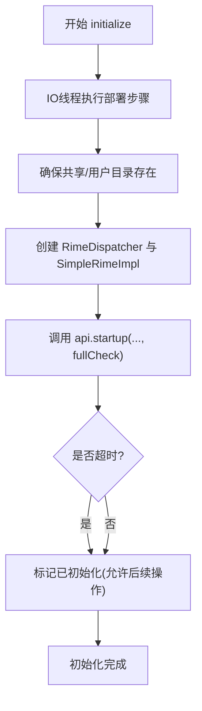
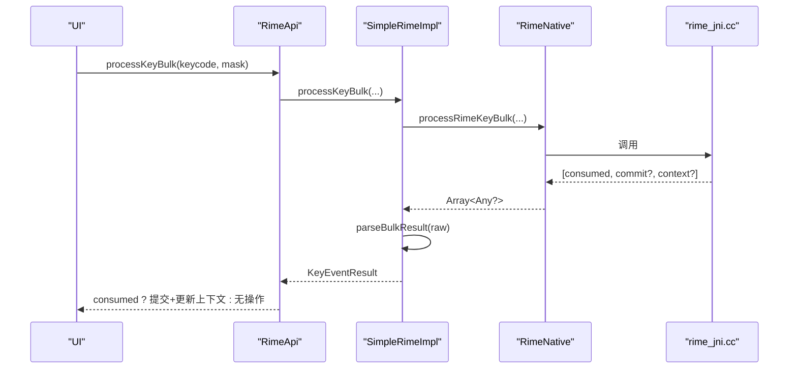
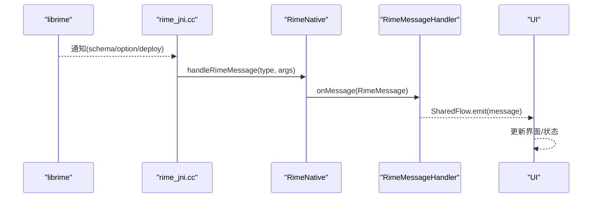
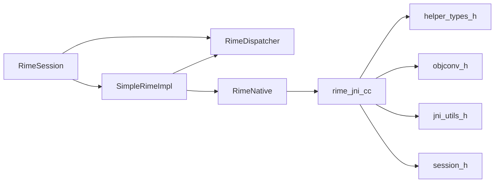

# Rime 引擎集成架构

<cite>
**本文引用的文件**   
- [RimeApi.kt](file://app/src/main/java/com/ziyou/ime/core/RimeApi.kt)
- [SimpleRimeImpl.kt](file://app/src/main/java/com/ziyou/ime/core/SimpleRimeImpl.kt)
- [RimeDispatcher.kt](file://app/src/main/java/com/ziyou/ime/core/RimeDispatcher.kt)
- [RimeNative.kt](file://app/src/main/java/com/ziyou/ime/core/RimeNative.kt)
- [RimeMessage.kt](file://app/src/main/java/com/ziyou/ime/core/RimeMessage.kt)
- [ProtoTypes.kt](file://app/src/main/java/com/ziyou/ime/core/ProtoTypes.kt)
- [rime_jni.cc](file://app/src/main/jni/librime_jni/rime_jni.cc)
- [session.h](file://app/src/main/jni/librime_jni/session.h)
- [objconv.h](file://app/src/main/jni/librime_jni/objconv.h)
- [helper-types.h](file://app/src/main/jni/librime_jni/helper-types.h)
- [jni-utils.h](file://app/src/main/jni/librime_jni/jni-utils.h)
- [RimeSession.kt](file://app/src/main/java/com/ziyou/ime/daemon/RimeSession.kt)
- [RimeDispatcherTest.kt](file://app/src/test/java/com/ziyou/ime/core/RimeDispatcherTest.kt)
- [SimpleRimeImplTest.kt](file://app/src/test/java/com/ziyou/ime/core/SimpleRimeImplTest.kt)
</cite>

## 目录
1. [简介](#简介)
2. [项目结构](#项目结构)
3. [核心组件](#核心组件)
4. [架构总览](#架构总览)
5. [详细组件分析](#详细组件分析)
6. [依赖关系分析](#依赖关系分析)
7. [性能考量](#性能考量)
8. [故障排查指南](#故障排查指南)
9. [结论](#结论)
10. [附录：API 使用示例与扩展指南](#附录api-使用示例与扩展指南)

## 简介
本文件面向开发者，系统化阐述 Android 输入法应用中 Rime 引擎的集成架构。重点覆盖以下方面：
- RimeApi 接口设计、SimpleRimeImpl 实现原理
- RimeDispatcher 单线程调度机制与 JNI 桥接层实现
- 引擎启动流程、生命周期管理、按键处理流程与状态管理机制
- 多线程安全模型、性能优化策略（批量 API）与错误处理机制
- 扩展与自定义指南（方案切换、选项设置、消息订阅等）

## 项目结构
Android 侧通过 Kotlin 定义抽象接口与实现，JNI 层以 C++ 封装 librime 调用，并通过对象转换头文件完成 Java/C++ 数据结构映射。关键目录与职责：
- app/src/main/java/com/ziyou/ime/core：Rime 引擎 API、实现、调度器、消息与数据模型
- app/src/main/jni/librime_jni：JNI 导出函数、会话管理、对象转换、辅助工具
- app/src/main/java/com/ziyou/ime/daemon：Rime 会话管理器（生命周期编排）
- app/src/main/assets/rime：schema、词典、OpenCC 配置等资源

**图表来源** 
- [RimeSession.kt:1-226](file://app/src/main/java/com/ziyou/ime/daemon/RimeSession.kt#L1-L226)
- [RimeApi.kt:1-105](file://app/src/main/java/com/ziyou/ime/core/RimeApi.kt#L1-L105)
- [SimpleRimeImpl.kt:1-177](file://app/src/main/java/com/ziyou/ime/core/SimpleRimeImpl.kt#L1-L177)
- [RimeDispatcher.kt:1-91](file://app/src/main/java/com/ziyou/ime/core/RimeDispatcher.kt#L1-L91)
- [RimeNative.kt:1-170](file://app/src/main/java/com/ziyou/ime/core/RimeNative.kt#L1-L170)
- [rime_jni.cc:1-528](file://app/src/main/jni/librime_jni/rime_jni.cc#L1-L528)
- [objconv.h:1-126](file://app/src/main/jni/librime_jni/objconv.h#L1-L126)
- [helper-types.h:1-165](file://app/src/main/jni/librime_jni/helper-types.h#L1-L165)
- [jni-utils.h:1-209](file://app/src/main/jni/librime_jni/jni-utils.h#L1-L209)
- [session.h:1-36](file://app/src/main/jni/librime_jni/session.h#L1-L36)

**章节来源**
- [RimeSession.kt:1-226](file://app/src/main/java/com/ziyou/ime/daemon/RimeSession.kt#L1-L226)
- [RimeApi.kt:1-105](file://app/src/main/java/com/ziyou/ime/core/RimeApi.kt#L1-L105)
- [SimpleRimeImpl.kt:1-177](file://app/src/main/java/com/ziyou/ime/core/SimpleRimeImpl.kt#L1-L177)
- [RimeDispatcher.kt:1-91](file://app/src/main/java/com/ziyou/ime/core/RimeDispatcher.kt#L1-L91)
- [RimeNative.kt:1-170](file://app/src/main/java/com/ziyou/ime/core/RimeNative.kt#L1-L170)
- [rime_jni.cc:1-528](file://app/src/main/jni/librime_jni/rime_jni.cc#L1-L528)

## 核心组件
- RimeApi：统一输入处理、状态查询、候选操作、方案管理与运行时选项的 suspend 接口集合，屏蔽线程细节。
- SimpleRimeImpl：RimeApi 的具体实现，所有方法通过 RimeDispatcher 在专属线程执行，并委托 RimeNative 进行 JNI 调用。
- RimeDispatcher：基于单线程 Executor 的协程调度器，确保 librime 非线程安全的 API 顺序执行。
- RimeNative：JNI 方法声明与库加载检查，提供 native 方法入口与消息回调转发。
- rime_jni.cc：C++ 封装 librime，维护全局单例与 SessionHolder，实现键处理、状态获取、候选词操作、方案管理等。
- helper-types.h / objconv.h：C++ 数据模型与 Java 对象转换工具，保证跨语言数据结构一致性。
- session.h：RAII 会话管理，自动创建/销毁 Rime 会话。
- RimeMessage：事件流模型与分发器，将 JNI 通知广播给 UI。
- RimeSession：会话管理器，负责资源部署、目录准备、引擎启动/销毁、超时保护与重新部署。

**章节来源**
- [RimeApi.kt:1-105](file://app/src/main/java/com/ziyou/ime/core/RimeApi.kt#L1-L105)
- [SimpleRimeImpl.kt:1-177](file://app/src/main/java/com/ziyou/ime/core/SimpleRimeImpl.kt#L1-L177)
- [RimeDispatcher.kt:1-91](file://app/src/main/java/com/ziyou/ime/core/RimeDispatcher.kt#L1-L91)
- [RimeNative.kt:1-170](file://app/src/main/java/com/ziyou/ime/core/RimeNative.kt#L1-L170)
- [rime_jni.cc:1-528](file://app/src/main/jni/librime_jni/rime_jni.cc#L1-L528)
- [helper-types.h:1-165](file://app/src/main/jni/librime_jni/helper-types.h#L1-L165)
- [objconv.h:1-126](file://app/src/main/jni/librime_jni/objconv.h#L1-L126)
- [session.h:1-36](file://app/src/main/jni/librime_jni/session.h#L1-L36)
- [RimeMessage.kt:1-42](file://app/src/main/java/com/ziyou/ime/core/RimeMessage.kt#L1-L42)
- [RimeSession.kt:1-226](file://app/src/main/java/com/ziyou/ime/daemon/RimeSession.kt#L1-L226)

## 架构总览
整体采用“接口 + 单线程实现 + JNI”的分层架构：
- 上层通过 RimeApi 暴露统一 API；
- SimpleRimeImpl 将所有调用串行化到 RimeDispatcher 的单线程；
- RimeNative 声明 JNI 方法，实际由 rime_jni.cc 实现；
- rime_jni.cc 封装 librime，维护单例与 SessionHolder，保证线程安全；
- 消息通过 JNI 回调 -> RimeNative.handleRimeMessage -> RimeMessageHandler.SharedFlow -> UI 订阅。

**图表来源** 
- [RimeSession.kt:88-153](file://app/src/main/java/com/ziyou/ime/daemon/RimeSession.kt#L88-L153)
- [SimpleRimeImpl.kt:32-42](file://app/src/main/java/com/ziyou/ime/core/SimpleRimeImpl.kt#L32-L42)
- [RimeNative.kt:44-46](file://app/src/main/java/com/ziyou/ime/core/RimeNative.kt#L44-L46)
- [rime_jni.cc:280-315](file://app/src/main/jni/librime_jni/rime_jni.cc#L280-L315)

## 详细组件分析

### RimeApi 接口设计
- 生命周期：startup/shutdown
- 输入处理：processKey、processKeyBulk（热路径）、commitComposition、clearComposition、replaceKey
- 状态查询：getCommit、getContext、getStatus、getCandidates
- 候选操作：selectCandidate、deleteCandidate、changePage
- 方案管理：getSchemaList、getCurrentSchema、selectSchema
- 运行时选项：setOption/getOption
- 同步：syncUserData
- 消息流：messageFlow（SharedFlow<RimeMessage>）

设计要点：
- 全部为 suspend 函数，调用方无需关心线程安全；
- processKeyBulk 默认实现组合 processKey + getCommit + getContext，生产实现通过 JNI 单次跨界提升性能；
- messageFlow 暴露引擎通知（schema/option/deploy）。

**章节来源**
- [RimeApi.kt:1-105](file://app/src/main/java/com/ziyou/ime/core/RimeApi.kt#L1-L105)

### SimpleRimeImpl 实现原理
- 所有方法通过 dispatcher.dispatch 在专属线程执行；
- 直接调用 RimeNative 对应方法；
- processKeyBulk 解析 JNI 返回数组为 KeyEventResult；
- startup 前检查 RimeNative.isLoaded，未加载抛出异常；
- messageFlow 透传至 RimeMessageHandler.messageFlow。

**图表来源** 
- [RimeApi.kt:1-105](file://app/src/main/java/com/ziyou/ime/core/RimeApi.kt#L1-L105)
- [SimpleRimeImpl.kt:1-177](file://app/src/main/java/com/ziyou/ime/core/SimpleRimeImpl.kt#L1-L177)
- [RimeDispatcher.kt:1-91](file://app/src/main/java/com/ziyou/ime/core/RimeDispatcher.kt#L1-L91)
- [RimeNative.kt:1-170](file://app/src/main/java/com/ziyou/ime/core/RimeNative.kt#L1-L170)

**章节来源**
- [SimpleRimeImpl.kt:1-177](file://app/src/main/java/com/ziyou/ime/core/SimpleRimeImpl.kt#L1-L177)

### RimeDispatcher 线程调度机制
- 使用 Executors.newSingleThreadExecutor 创建守护线程；
- 通过 CoroutineDispatcher 绑定该线程；
- dispatch 在专属线程执行 block，异常原样传播；
- dispatchWithTimeout 支持超时保护，超时返回 null；
- shutdown 后再次 dispatch 抛异常，幂等关闭。

**图表来源** 
- [RimeDispatcher.kt:48-60](file://app/src/main/java/com/ziyou/ime/core/RimeDispatcher.kt#L48-L60)

**章节来源**
- [RimeDispatcher.kt:1-91](file://app/src/main/java/com/ziyou/ime/core/RimeDispatcher.kt#L1-L91)

### JNI 桥接层实现（rime_jni.cc）
- 单例 Rime：封装 librime 初始化、会话管理、键处理、状态获取、候选操作、方案管理、选项设置、用户数据同步；
- SessionHolder：RAII 管理会话生命周期；
- 对象转换：objconv.h 将 C++ Proto 转换为 Java 对象；
- 消息回调：JNI 注册通知处理器，将 schema/option/deploy 消息转发到 RimeNative.handleRimeMessage；
- 热路径：processRimeKeyBulk 一次跨界返回 consumed + commit + context，减少 JNI 调用次数；
- 内存优化：trimNativeHeap 调用 mallopt(M_PURGE) 归还空闲页，降低部署后常驻内存。

**图表来源** 
- [rime_jni.cc:366-384](file://app/src/main/jni/librime_jni/rime_jni.cc#L366-L384)
- [SimpleRimeImpl.kt:59-64](file://app/src/main/java/com/ziyou/ime/core/SimpleRimeImpl.kt#L59-L64)

**章节来源**
- [rime_jni.cc:1-528](file://app/src/main/jni/librime_jni/rime_jni.cc#L1-L528)
- [objconv.h:1-126](file://app/src/main/jni/librime_jni/objconv.h#L1-L126)
- [helper-types.h:1-165](file://app/src/main/jni/librime_jni/helper-types.h#L1-L165)
- [session.h:1-36](file://app/src/main/jni/librime_jni/session.h#L1-L36)

### 引擎启动流程与生命周期管理
- RimeSession.initialize：
  - IO 线程执行部署步骤（资源部署、词库注入等）；
  - 确保共享/用户目录存在；
  - 创建 RimeDispatcher 与 SimpleRimeImpl；
  - 启动引擎（带超时保护），即使超时也标记为已初始化，允许后续操作。
- destroy：
  - 调用 shutdown、取消 scope、关闭 dispatcher、清理引用。
- redeploy：
  - 关闭当前引擎，重新执行部署步骤并以 fullCheck 模式重启。

**图表来源** 
- [RimeSession.kt:88-153](file://app/src/main/java/com/ziyou/ime/daemon/RimeSession.kt#L88-L153)

**章节来源**
- [RimeSession.kt:1-226](file://app/src/main/java/com/ziyou/ime/daemon/RimeSession.kt#L1-L226)

### 按键处理流程与状态管理
- 按键处理：
  - 优先使用 processKeyBulk 热路径，减少 JNI 跨界；
  - 若未被消费，UI 不刷新；若被消费，根据 commit/context 更新输入区与候选列表。
- 状态管理：
  - getCommit：获取并提交文本（调用后自动清除）；
  - getContext：获取编码区与菜单信息；
  - getStatus：获取输入法状态（方案、模式等）。

**图表来源** 
- [SimpleRimeImpl.kt:59-64](file://app/src/main/java/com/ziyou/ime/core/SimpleRimeImpl.kt#L59-L64)
- [rime_jni.cc:366-384](file://app/src/main/jni/librime_jni/rime_jni.cc#L366-L384)

**章节来源**
- [RimeApi.kt:26-49](file://app/src/main/java/com/ziyou/ime/core/RimeApi.kt#L26-L49)
- [SimpleRimeImpl.kt:53-82](file://app/src/main/java/com/ziyou/ime/core/SimpleRimeImpl.kt#L53-L82)
- [ProtoTypes.kt:74-79](file://app/src/main/java/com/ziyou/ime/core/ProtoTypes.kt#L74-L79)

### 消息机制与事件流
- JNI 层通过通知处理器将 schema/option/deploy 消息转发到 RimeNative.handleRimeMessage；
- RimeMessageHandler 使用 MutableSharedFlow 广播消息；
- UI 订阅 RimeMessageHandler.messageFlow 或 RimeApi.messageFlow 获取状态变更。

**图表来源** 
- [rime_jni.cc:288-315](file://app/src/main/jni/librime_jni/rime_jni.cc#L288-L315)
- [RimeMessage.kt:29-41](file://app/src/main/java/com/ziyou/ime/core/RimeMessage.kt#L29-L41)
- [RimeNative.kt:158-168](file://app/src/main/java/com/ziyou/ime/core/RimeNative.kt#L158-L168)

**章节来源**
- [RimeMessage.kt:1-42](file://app/src/main/java/com/ziyou/ime/core/RimeMessage.kt#L1-L42)
- [RimeNative.kt:151-168](file://app/src/main/java/com/ziyou/ime/core/RimeNative.kt#L151-L168)

## 依赖关系分析
- SimpleRimeImpl 依赖 RimeDispatcher 与 RimeNative；
- RimeNative 依赖 rime_jni.cc 导出的 native 方法；
- rime_jni.cc 依赖 helper-types.h、objconv.h、jni-utils.h、session.h；
- RimeSession 依赖 RimeDispatcher、SimpleRimeImpl、部署步骤与目录管理。

**图表来源** 
- [SimpleRimeImpl.kt:1-177](file://app/src/main/java/com/ziyou/ime/core/SimpleRimeImpl.kt#L1-L177)
- [RimeNative.kt:1-170](file://app/src/main/java/com/ziyou/ime/core/RimeNative.kt#L1-L170)
- [rime_jni.cc:1-528](file://app/src/main/jni/librime_jni/rime_jni.cc#L1-L528)
- [helper-types.h:1-165](file://app/src/main/jni/librime_jni/helper-types.h#L1-L165)
- [objconv.h:1-126](file://app/src/main/jni/librime_jni/objconv.h#L1-L126)
- [jni-utils.h:1-209](file://app/src/main/jni/librime_jni/jni-utils.h#L1-L209)
- [session.h:1-36](file://app/src/main/jni/librime_jni/session.h#L1-L36)
- [RimeSession.kt:1-226](file://app/src/main/java/com/ziyou/ime/daemon/RimeSession.kt#L1-L226)

**章节来源**
- [RimeSession.kt:1-226](file://app/src/main/java/com/ziyou/ime/daemon/RimeSession.kt#L1-L226)
- [SimpleRimeImpl.kt:1-177](file://app/src/main/java/com/ziyou/ime/core/SimpleRimeImpl.kt#L1-L177)
- [RimeNative.kt:1-170](file://app/src/main/java/com/ziyou/ime/core/RimeNative.kt#L1-L170)
- [rime_jni.cc:1-528](file://app/src/main/jni/librime_jni/rime_jni.cc#L1-L528)

## 性能考量
- 热路径优化：processKeyBulk 合并 processKey + getCommit + getContext，减少 JNI 跨界次数与对象分配；
- 候选词批量获取：getRimeBulkCandidates 一次性返回 size/highlighted/candidates，减少多次调用；
- 内存回收：部署完成后调用 trimNativeHeap 归还空闲页，降低常驻内存占用；
- 单线程调度：避免锁竞争与数据竞争，提高吞吐与稳定性；
- 超时保护：engine startup 与 dispatchWithTimeout 防止阻塞过久导致 ANR。

[本节为通用指导，不直接分析具体文件]

## 故障排查指南
- 库加载失败：
  - 检查 ABI 匹配（仅支持 arm64-v8a）与 .so 文件是否存在；
  - RimeNative.isLoaded 为 false 时抛出 IllegalStateException。
- 引擎启动超时：
  - 检查词典文件完整性与 fullCheck 参数；
  - 适当降低 fullCheck 或增加超时时间。
- 线程问题：
  - 确认所有 RimeNative 调用均通过 RimeDispatcher 执行；
  - 测试用例验证 dispatch 在专属线程执行且异常正确传播。
- 消息回调异常：
  - JNI 层捕获并清除异常，避免崩溃；
  - 检查 RimeNative.handleRimeMessage 的参数类型与值。

**章节来源**
- [RimeNative.kt:18-40](file://app/src/main/java/com/ziyou/ime/core/RimeNative.kt#L18-L40)
- [RimeDispatcherTest.kt:29-133](file://app/src/test/java/com/ziyou/ime/core/RimeDispatcherTest.kt#L29-L133)
- [SimpleRimeImplTest.kt:130-144](file://app/src/test/java/com/ziyou/ime/core/SimpleRimeImplTest.kt#L130-L144)
- [rime_jni.cc:308-312](file://app/src/main/jni/librime_jni/rime_jni.cc#L308-L312)

## 结论
本架构通过清晰的接口分层、单线程调度与高效的 JNI 桥接，实现了稳定、高性能的 Rime 引擎集成。SimpleRimeImpl 屏蔽了线程细节，RimeDispatcher 保证了 librime 的非线程安全约束，JNI 层通过批量 API 与内存优化提升了性能。RimeSession 提供了完整的生命周期管理与容错能力。开发者可基于 RimeApi 扩展功能，如自定义方案、选项与消息处理。

[本节为总结性内容，不直接分析具体文件]

## 附录：API 使用示例与扩展指南

### 正确使用 API 进行输入处理
- 初始化与启动：
  - 调用 RimeSession.initialize(context, fullCheck)；
  - 获取 api = RimeSession.api；
- 按键处理：
  - 优先使用 api.processKeyBulk(keycode, mask)；
  - 若 consumed 为 true，根据 commit 与 context 更新 UI；
- 状态查询：
  - 使用 api.getCommit()/getContext()/getStatus() 获取最新状态；
- 候选操作：
  - api.selectCandidate(index, global)、api.changePage(backward)；
- 方案与选项：
  - api.getSchemaList()/api.selectSchema(schemaId)；
  - api.setOption(key, value)/api.getOption(key)；
- 消息订阅：
  - 订阅 api.messageFlow 或 RimeMessageHandler.messageFlow。

**章节来源**
- [RimeApi.kt:26-98](file://app/src/main/java/com/ziyou/ime/core/RimeApi.kt#L26-L98)
- [SimpleRimeImpl.kt:53-170](file://app/src/main/java/com/ziyou/ime/core/SimpleRimeImpl.kt#L53-L170)
- [RimeSession.kt:71-82](file://app/src/main/java/com/ziyou/ime/daemon/RimeSession.kt#L71-L82)

### 多线程安全模型
- 所有 RimeNative 方法必须在 RimeDispatcher 的专属线程执行；
- SimpleRimeImpl 通过 dispatcher.dispatch 保证串行化；
- 测试覆盖 dispatch 线程切换与异常传播。

**章节来源**
- [RimeDispatcher.kt:48-60](file://app/src/main/java/com/ziyou/ime/core/RimeDispatcher.kt#L48-L60)
- [RimeDispatcherTest.kt:30-47](file://app/src/test/java/com/ziyou/ime/core/RimeDispatcherTest.kt#L30-L47)

### 性能优化策略
- 使用 processKeyBulk 热路径；
- 批量获取候选词 getRimeBulkCandidates；
- 部署完成后调用 trimNativeHeap；
- 合理设置 fullCheck 与超时时间。

**章节来源**
- [rime_jni.cc:366-384](file://app/src/main/jni/librime_jni/rime_jni.cc#L366-L384)
- [rime_jni.cc:510-527](file://app/src/main/jni/librime_jni/rime_jni.cc#L510-L527)
- [RimeNative.kt:52-58](file://app/src/main/java/com/ziyou/ime/core/RimeNative.kt#L52-L58)

### 错误处理机制
- JNI 层捕获并清除异常，避免崩溃；
- RimeDispatcher 记录异常并向上抛出；
- RimeSession 对启动超时进行保护，仍标记为已初始化。

**章节来源**
- [rime_jni.cc:308-312](file://app/src/main/jni/librime_jni/rime_jni.cc#L308-L312)
- [RimeDispatcher.kt:55-58](file://app/src/main/java/com/ziyou/ime/core/RimeDispatcher.kt#L55-L58)
- [RimeSession.kt:135-152](file://app/src/main/java/com/ziyou/ime/daemon/RimeSession.kt#L135-L152)

### 扩展与自定义指南
- 自定义方案：
  - 通过 api.selectSchema(schemaId) 切换；
  - 监听 SchemaMessage 更新 UI；
- 自定义选项：
  - 使用 setOption/getOption 控制行为；
  - 监听 OptionMessage 响应变化；
- 部署步骤扩展：
  - 在 RimeSession.deploySteps 中插入自定义步骤；
- 消息处理：
  - 订阅 RimeMessageHandler.messageFlow 处理 DeployMessage。

**章节来源**
- [RimeApi.kt:76-98](file://app/src/main/java/com/ziyou/ime/core/RimeApi.kt#L76-L98)
- [RimeMessage.kt:11-23](file://app/src/main/java/com/ziyou/ime/core/RimeMessage.kt#L11-L23)
- [RimeSession.kt:52-56](file://app/src/main/java/com/ziyou/ime/daemon/RimeSession.kt#L52-L56)