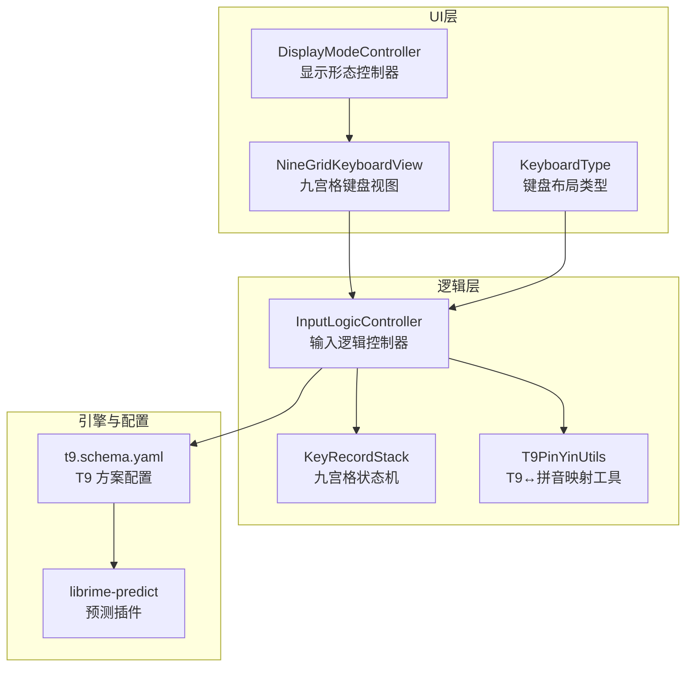
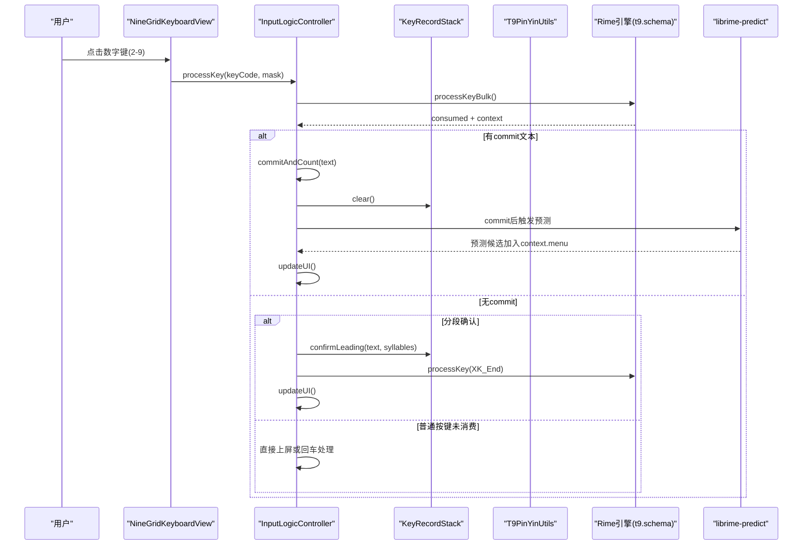
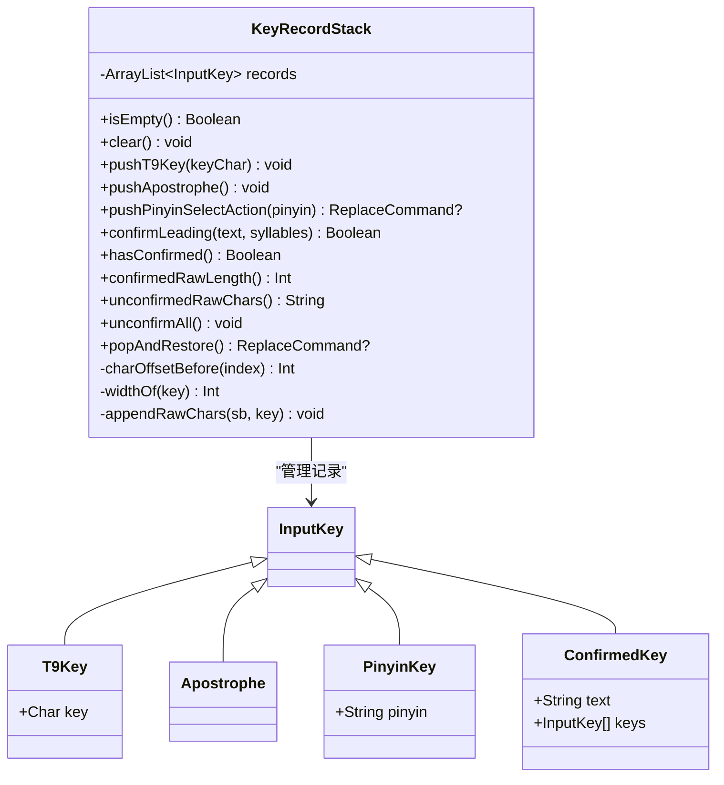
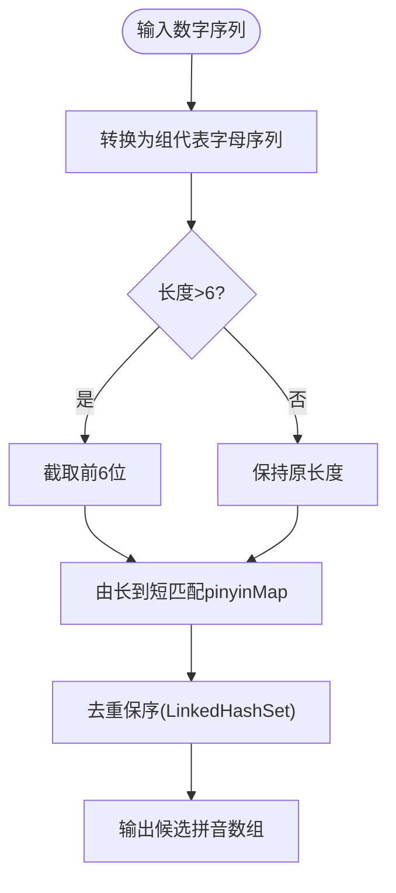
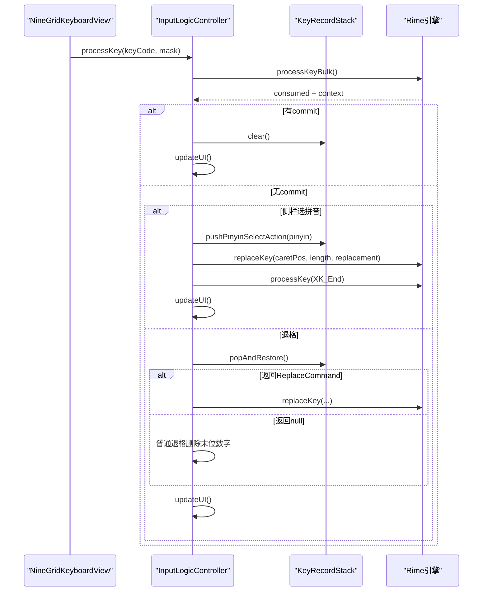
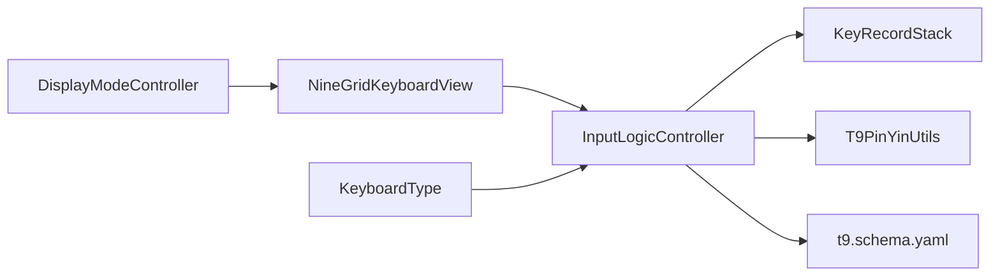

# T9 九宫格输入方案

<cite>
**本文引用的文件**
- [KeyRecordStack.kt](file://core-logic/src/main/java/com/ziyou/ime/core/t9/KeyRecordStack.kt)
- [T9PinYinUtils.kt](file://core-logic/src/main/java/com/ziyou/ime/util/T9PinYinUtils.kt)
- [NineGridKeyboardView.kt](file://app/src/main/java/com/ziyou/ime/ime/NineGridKeyboardView.kt)
- [InputLogicController.kt](file://app/src/main/java/com/ziyou/ime/ime/InputLogicController.kt)
- [t9.schema.yaml](file://app/src/main/assets/rime/t9.schema.yaml)
- [KeyboardType.kt](file://app/src/main/java/com/ziyou/ime/ime/KeyboardType.kt)
- [DisplayModeController.kt](file://app/src/main/java/com/ziyou/ime/ime/DisplayModeController.kt)
- [RimeConfigManager.kt](file://app/src/main/java/com/ziyou/ime/config/RimeConfigManager.kt)
- [KeyRecordStackTest.kt](file://core-logic/src/test/java/com/ziyou/ime/core/t9/KeyRecordStackTest.kt)
- [T9PinYinUtilsTest.kt](file://core-logic/src/test/java/com/ziyou/ime/util/T9PinYinUtilsTest.kt)
</cite>

## 目录
1. [简介](#简介)
2. [项目结构](#项目结构)
3. [核心组件](#核心组件)
4. [架构总览](#架构总览)
5. [详细组件分析](#详细组件分析)
6. [依赖关系分析](#依赖关系分析)
7. [性能考量](#性能考量)
8. [故障排查指南](#故障排查指南)
9. [结论](#结论)
10. [附录：配置与使用示例](#附录配置与使用示例)

## 简介
本文件系统化阐述 T9 九宫格输入方案的实现与使用，覆盖以下关键点：
- 配置结构：t9.schema.yaml 的 speller/algebra、delimiter、spelling_hints、predictor 等。
- 数字键映射：T9PinYinUtils 中“数字键↔组代表字母↔拼音”的双向映射与 O(1) 反查。
- 消歧算法：基于 Rime 的 derive 派生数字编码，配合候选排序与 comment 注音展示。
- 预测逻辑：librime-predict 插件在 commit 后生成预测候选，随上下文刷新显示。
- 完整处理链路：从按键到 Rime 引擎、状态机同步、候选词选择与上屏。
- KeyRecordStack 栈式记录机制：支持锁定拼音、分段确认、智能退格还原。
- 全键盘切换机制与用户体验优化：布局类型绑定、形态控制、输入上限保护。

## 项目结构
T9 相关代码主要分布在三个层次：
- UI 层：九宫格键盘视图 NineGridKeyboardView，负责按键事件与渲染。
- 逻辑层：InputLogicController 协调 Rime 引擎调用、候选选择、状态同步；KeyRecordStack 维护九宫格输入状态；T9PinYinUtils 提供映射工具。
- 引擎配置层：t9.schema.yaml 定义 T9 方案、拼写规则、标点、预测等。

图表来源
- [NineGridKeyboardView.kt:1-288](file://app/src/main/java/com/ziyou/ime/ime/NineGridKeyboardView.kt#L1-L288)
- [InputLogicController.kt:1-531](file://app/src/main/java/com/ziyou/ime/ime/InputLogicController.kt#L1-L531)
- [KeyRecordStack.kt:1-310](file://core-logic/src/main/java/com/ziyou/ime/core/t9/KeyRecordStack.kt#L1-L310)
- [T9PinYinUtils.kt:1-375](file://core-logic/src/main/java/com/ziyou/ime/util/T9PinYinUtils.kt#L1-L375)
- [t9.schema.yaml:1-126](file://app/src/main/assets/rime/t9.schema.yaml#L1-L126)
- [KeyboardType.kt:1-55](file://app/src/main/java/com/ziyou/ime/ime/KeyboardType.kt#L1-L55)
- [DisplayModeController.kt:1-153](file://app/src/main/java/com/ziyou/ime/ime/DisplayModeController.kt#L1-L153)

章节来源
- [NineGridKeyboardView.kt:1-288](file://app/src/main/java/com/ziyou/ime/ime/NineGridKeyboardView.kt#L1-L288)
- [InputLogicController.kt:1-531](file://app/src/main/java/com/ziyou/ime/ime/InputLogicController.kt#L1-L531)
- [KeyRecordStack.kt:1-310](file://core-logic/src/main/java/com/ziyou/ime/core/t9/KeyRecordStack.kt#L1-L310)
- [T9PinYinUtils.kt:1-375](file://core-logic/src/main/java/com/ziyou/ime/util/T9PinYinUtils.kt#L1-L375)
- [t9.schema.yaml:1-126](file://app/src/main/assets/rime/t9.schema.yaml#L1-L126)
- [KeyboardType.kt:1-55](file://app/src/main/java/com/ziyou/ime/ime/KeyboardType.kt#L1-L55)
- [DisplayModeController.kt:1-153](file://app/src/main/java/com/ziyou/ime/ime/DisplayModeController.kt#L1-L153)

## 核心组件
- KeyRecordStack：九宫格输入状态机，维护 T9Key/Apostrophe/PinyinKey/ConfirmedKey 序列，支持选拼音替换、分段确认、智能退格还原、原始编码串重建与偏移计算。
- T9PinYinUtils：数字键与拼音双向映射，包含组代表字母中间表示、反向索引表、候选排序（由长到短）、格式化显示。
- InputLogicController：统一按键处理、候选选择、分页、侧栏选拼音、退格重打、回车落地、富媒体提交、UI 刷新。
- NineGridKeyboardView：九宫格键盘布局与按键事件分发，发送数字键给 Rime，支持分词键、重输、换行、中英切换。
- t9.schema.yaml：T9 方案配置，定义字母表、分隔符、代数派生、translator 设置、predictor 参数、key_binder 覆写。
- KeyboardType：键盘布局枚举，强制绑定 t9 方案，屏蔽用户自选。
- DisplayModeController：停靠/悬浮形态控制，影响 UI 呈现但不改变引擎状态。

章节来源
- [KeyRecordStack.kt:1-310](file://core-logic/src/main/java/com/ziyou/ime/core/t9/KeyRecordStack.kt#L1-L310)
- [T9PinYinUtils.kt:1-375](file://core-logic/src/main/java/com/ziyou/ime/util/T9PinYinUtils.kt#L1-L375)
- [InputLogicController.kt:1-531](file://app/src/main/java/com/ziyou/ime/ime/InputLogicController.kt#L1-L531)
- [NineGridKeyboardView.kt:1-288](file://app/src/main/java/com/ziyou/ime/ime/NineGridKeyboardView.kt#L1-L288)
- [t9.schema.yaml:1-126](file://app/src/main/assets/rime/t9.schema.yaml#L1-L126)
- [KeyboardType.kt:1-55](file://app/src/main/java/com/ziyou/ime/ime/KeyboardType.kt#L1-L55)
- [DisplayModeController.kt:1-153](file://app/src/main/java/com/ziyou/ime/ime/DisplayModeController.kt#L1-L153)

## 架构总览
下图展示了从按键到候选词的端到端流程，以及状态机与引擎配置的协作关系。

图表来源
- [NineGridKeyboardView.kt:253-280](file://app/src/main/java/com/ziyou/ime/ime/NineGridKeyboardView.kt#L253-L280)
- [InputLogicController.kt:126-185](file://app/src/main/java/com/ziyou/ime/ime/InputLogicController.kt#L126-L185)
- [t9.schema.yaml:38-68](file://app/src/main/assets/rime/t9.schema.yaml#L38-L68)

章节来源
- [InputLogicController.kt:126-185](file://app/src/main/java/com/ziyou/ime/ime/InputLogicController.kt#L126-L185)
- [t9.schema.yaml:38-68](file://app/src/main/assets/rime/t9.schema.yaml#L38-L68)

## 详细组件分析

### KeyRecordStack 栈式记录机制
- 设计要点：列表顺序严格对应 Rime 编码串逻辑顺序；已锁定拼音始终排在剩余数字之前；字符偏移按列表顺序累加。
- 关键方法：
  - pushT9Key/pushApostrophe：追加数字键与分词符。
  - pushPinyinSelectAction：定位首个未确定音节段，校验前缀匹配，原地替换为 PinyinKey，返回 ReplaceCommand。
  - confirmLeading：按候选注音合并栈头记录为 ConfirmedKey，跳过已有确认段，支持简拼与分词符归属。
  - popAndRestore：智能退格，解锁拼音还原为数字段，展开确认段递归处理。
  - unconfirmAll：展开全部确认段，恢复原始记录顺序。
  - confirmedRawLength/unconfirmedRawChars：计算原始编码串长度与未确认部分字符串。

图表来源
- [KeyRecordStack.kt:20-310](file://core-logic/src/main/java/com/ziyou/ime/core/t9/KeyRecordStack.kt#L20-L310)

章节来源
- [KeyRecordStack.kt:1-310](file://core-logic/src/main/java/com/ziyou/ime/core/t9/KeyRecordStack.kt#L1-L310)
- [KeyRecordStackTest.kt:1-185](file://core-logic/src/test/java/com/ziyou/ime/core/t9/KeyRecordStackTest.kt#L1-L185)

### T9PinYinUtils 工具类功能
- 数字键→拼音候选：将数字序列转换为组代表字母序列，按由长到短匹配 pinyinMap，去重保序。
- 拼音→数字键：通过 reverseMap 进行 O(1) 查找，返回对应数字键序列。
- 单字符映射：pinyin2T9Key 将字母映射到组代表字母。
- 格式化显示：getT9Composition 根据 comment 与 composition 对齐显示可读拼音片段。

图表来源
- [T9PinYinUtils.kt:305-318](file://core-logic/src/main/java/com/ziyou/ime/util/T9PinYinUtils.kt#L305-L318)

章节来源
- [T9PinYinUtils.kt:1-375](file://core-logic/src/main/java/com/ziyou/ime/util/T9PinYinUtils.kt#L1-L375)
- [T9PinYinUtilsTest.kt:1-74](file://core-logic/src/test/java/com/ziyou/ime/util/T9PinYinUtilsTest.kt#L1-L74)

### 九宫格键盘与输入逻辑
- NineGridKeyboardView：
  - 按键事件：字母键直接发送数字键（2-9），分词键发送撇号，重输发送 Escape，换行发送 Return。
  - 布局：前三行为标准 T9 网格，右侧功能列，底行支持数字模式与中英切换。
- InputLogicController：
  - processKey：批量处理按键，超限防护（MAX_INPUT_LENGTH=30），慢按键告警，commit 后清理状态机并刷新 UI。
  - selectCandidate：分段确认后同步状态机，必要时补发 End 标记。
  - selectPinyin/restorePinyin：侧栏选拼音锁定音节或退格还原。
  - retypeUnconfirmed/deleteUnconfirmedBackward：存在已确认段时的安全删除与重打路径。
  - handleEnterKey：回车键路由到面板或编辑器语义。

图表来源
- [NineGridKeyboardView.kt:253-280](file://app/src/main/java/com/ziyou/ime/ime/NineGridKeyboardView.kt#L253-L280)
- [InputLogicController.kt:126-185](file://app/src/main/java/com/ziyou/ime/ime/InputLogicController.kt#L126-L185)
- [InputLogicController.kt:273-303](file://app/src/main/java/com/ziyou/ime/ime/InputLogicController.kt#L273-L303)
- [KeyRecordStack.kt:196-230](file://core-logic/src/main/java/com/ziyou/ime/core/t9/KeyRecordStack.kt#L196-L230)

章节来源
- [NineGridKeyboardView.kt:1-288](file://app/src/main/java/com/ziyou/ime/ime/NineGridKeyboardView.kt#L1-L288)
- [InputLogicController.kt:126-303](file://app/src/main/java/com/ziyou/ime/ime/InputLogicController.kt#L126-L303)

### 预测逻辑与候选展示
- t9.schema.yaml 启用 predictor 与 predict_translator，commit 后生成预测候选，max_candidates=10，max_iterations=3。
- InputLogicController.updateUI 获取 context，若启用预测，候选位于 context.menu，随本次刷新一并展示。
- 候选注释 comment 携带真实拼音（spelling_hints=32），用于侧栏拼音候选区展示。

章节来源
- [t9.schema.yaml:38-68](file://app/src/main/assets/rime/t9.schema.yaml#L38-L68)
- [InputLogicController.kt:518-528](file://app/src/main/java/com/ziyou/ime/ime/InputLogicController.kt#L518-L528)

### 全键盘与九宫格切换机制
- KeyboardType.NINE_GRID 强制绑定 schema_id="t9"，不允许用户自选方案。
- DisplayModeController 控制停靠/悬浮形态，仅影响 UI 呈现，不改变引擎状态。
- NineGridKeyboardView 支持底行切换数字键盘与中英模式，不影响 T9 方案。

章节来源
- [KeyboardType.kt:27-55](file://app/src/main/java/com/ziyou/ime/ime/KeyboardType.kt#L27-L55)
- [DisplayModeController.kt:54-98](file://app/src/main/java/com/ziyou/ime/ime/DisplayModeController.kt#L54-L98)
- [NineGridKeyboardView.kt:89-119](file://app/src/main/java/com/ziyou/ime/ime/NineGridKeyboardView.kt#L89-L119)

## 依赖关系分析
- InputLogicController 依赖 KeyRecordStack 与 T9PinYinUtils，协调 Rime 引擎调用。
- NineGridKeyboardView 依赖 InputLogicController 处理按键事件。
- t9.schema.yaml 定义引擎行为，包括 speller、translator、predictor、key_binder。
- KeyboardType 与 DisplayModeController 分别管理布局与形态，与引擎解耦。

图表来源
- [InputLogicController.kt:1-531](file://app/src/main/java/com/ziyou/ime/ime/InputLogicController.kt#L1-L531)
- [KeyRecordStack.kt:1-310](file://core-logic/src/main/java/com/ziyou/ime/core/t9/KeyRecordStack.kt#L1-L310)
- [T9PinYinUtils.kt:1-375](file://core-logic/src/main/java/com/ziyou/ime/util/T9PinYinUtils.kt#L1-L375)
- [t9.schema.yaml:1-126](file://app/src/main/assets/rime/t9.schema.yaml#L1-L126)
- [KeyboardType.kt:1-55](file://app/src/main/java/com/ziyou/ime/ime/KeyboardType.kt#L1-L55)
- [DisplayModeController.kt:1-153](file://app/src/main/java/com/ziyou/ime/ime/DisplayModeController.kt#L1-L153)

章节来源
- [InputLogicController.kt:1-531](file://app/src/main/java/com/ziyou/ime/ime/InputLogicController.kt#L1-L531)
- [KeyRecordStack.kt:1-310](file://core-logic/src/main/java/com/ziyou/ime/core/t9/KeyRecordStack.kt#L1-L310)
- [T9PinYinUtils.kt:1-375](file://core-logic/src/main/java/com/ziyou/ime/util/T9PinYinUtils.kt#L1-L375)
- [t9.schema.yaml:1-126](file://app/src/main/assets/rime/t9.schema.yaml#L1-L126)
- [KeyboardType.kt:1-55](file://app/src/main/java/com/ziyou/ime/ime/KeyboardType.kt#L1-L55)
- [DisplayModeController.kt:1-153](file://app/src/main/java/com/ziyou/ime/ime/DisplayModeController.kt#L1-L153)

## 性能考量
- 编码长度上限：MAX_INPUT_LENGTH=30，避免 script_translator 组句搜索组合爆炸导致按键积压。
- 慢按键告警：processKeyBulk 耗时超过阈值（SLOW_KEY_WARN_MS=100ms）时记录日志，便于发现退化。
- 批量处理：processKeyBulk 单次引擎调度完成，减少主线程↔Rime 线程往返与 JNI 跨界开销。
- 预测候选限制：max_candidates=10，防止预测霸屏；max_iterations=3 防无限联想链。
- 状态机操作：KeyRecordStack 的原地替换与宽度计算保证偏移准确，避免错位导致的额外回退成本。

章节来源
- [InputLogicController.kt:54-64](file://app/src/main/java/com/ziyou/ime/ime/InputLogicController.kt#L54-L64)
- [InputLogicController.kt:126-185](file://app/src/main/java/com/ziyou/ime/ime/InputLogicController.kt#L126-L185)
- [t9.schema.yaml:64-69](file://app/src/main/assets/rime/t9.schema.yaml#L64-L69)

## 故障排查指南
- 分段确认同步失败：当 confirmLeading 失败（注音缺失或不匹配）会清栈降级，检查候选 comment 是否包含有效音节。
- 编码超限丢弃按键：当 input.length>=30 时丢弃新增编码键，检查是否异常长编码输入。
- 慢按键告警：processKeyBulk 耗时过长，检查引擎负载或词典规模。
- 已确认段被撤销：express_editor 的 BackSpace 可能触发 ReopenPreviousSegment，改用 deleteUnconfirmedBackward/retypeUnconfirmed 安全路径。
- 预测候选不显示：确认 predictor 已启用且 context.menu 非空，updateUI 正常刷新。

章节来源
- [InputLogicController.kt:233-245](file://app/src/main/java/com/ziyou/ime/ime/InputLogicController.kt#L233-L245)
- [InputLogicController.kt:126-185](file://app/src/main/java/com/ziyou/ime/ime/InputLogicController.kt#L126-L185)
- [InputLogicController.kt:319-372](file://app/src/main/java/com/ziyou/ime/ime/InputLogicController.kt#L319-L372)
- [InputLogicController.kt:518-528](file://app/src/main/java/com/ziyou/ime/ime/InputLogicController.kt#L518-L528)

## 结论
T9 九宫格输入方案通过严谨的状态机设计与高效的映射工具，实现了从数字按键到候选词的流畅链路。KeyRecordStack 确保多音节位置与偏移正确，T9PinYinUtils 提供 O(1) 的反向索引，t9.schema.yaml 定义智能消歧与预测策略。结合 InputLogicController 的批量处理与超限保护，整体性能与稳定性得到保障。全键盘与九宫格的切换机制清晰解耦，用户体验优化策略完善。

## 附录：配置与使用示例
- 配置示例：
  - t9.schema.yaml 中 speller.algebra 派生数字编码，delimiter 包含空格与撇号，spelling_hints=32 提供候选注音。
  - predictor.db 路径与 max_candidates/max_iterations 控制预测行为。
- 使用场景：
  - 九宫格输入：点击数字键 2-9，Rime 自动消歧，侧栏展示拼音候选，支持分词与重输。
  - 侧栏选拼音：锁定首个未确定音节，替换为拼音段，后续候选按完整组合生成。
  - 分段确认：选择候选词后，状态机同步确认段，支持智能退格还原。
- 优化建议：
  - 调整 max_candidates 平衡候选密度与屏幕占用。
  - 监控慢按键日志，优化词典或引擎负载。
  - 合理设置 MAX_INPUT_LENGTH 防止超长编码卡顿。

章节来源
- [t9.schema.yaml:71-103](file://app/src/main/assets/rime/t9.schema.yaml#L71-L103)
- [t9.schema.yaml:64-69](file://app/src/main/assets/rime/t9.schema.yaml#L64-L69)
- [InputLogicController.kt:126-185](file://app/src/main/java/com/ziyou/ime/ime/InputLogicController.kt#L126-L185)
- [KeyRecordStack.kt:57-83](file://core-logic/src/main/java/com/ziyou/ime/core/t9/KeyRecordStack.kt#L57-L83)