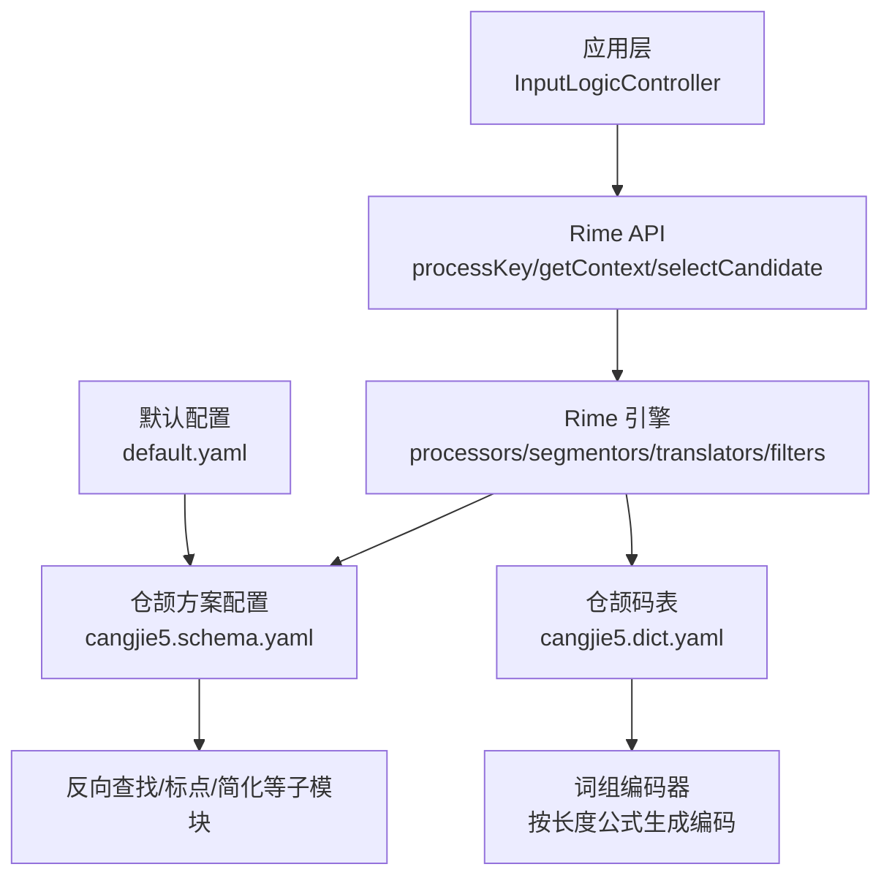
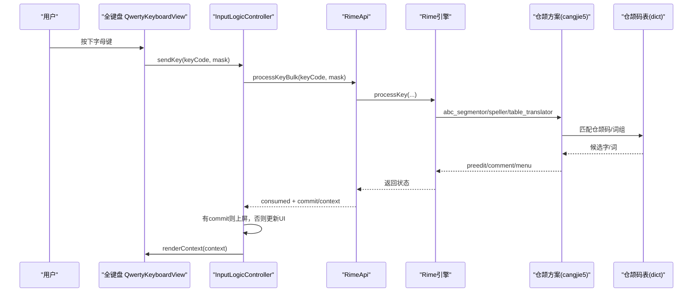
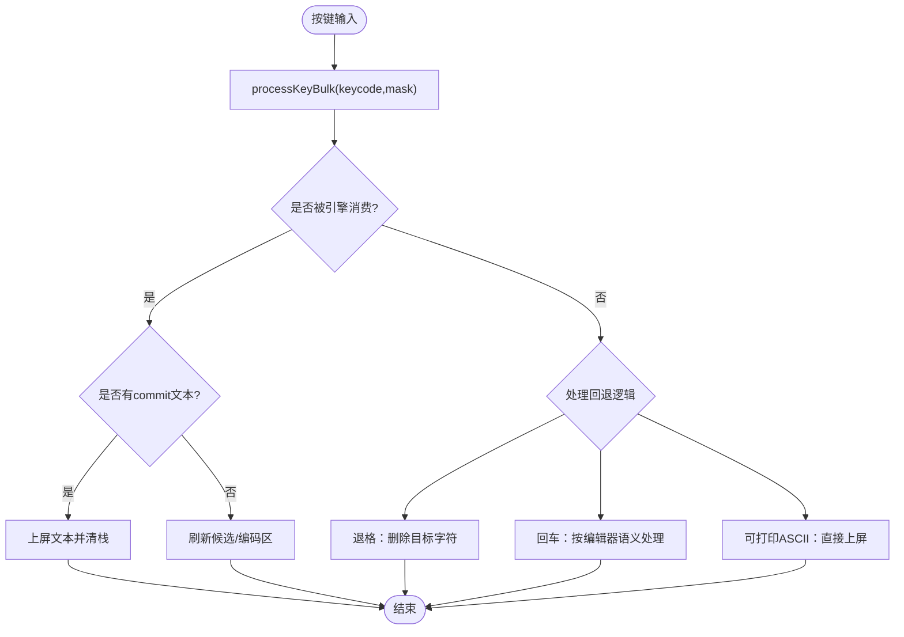
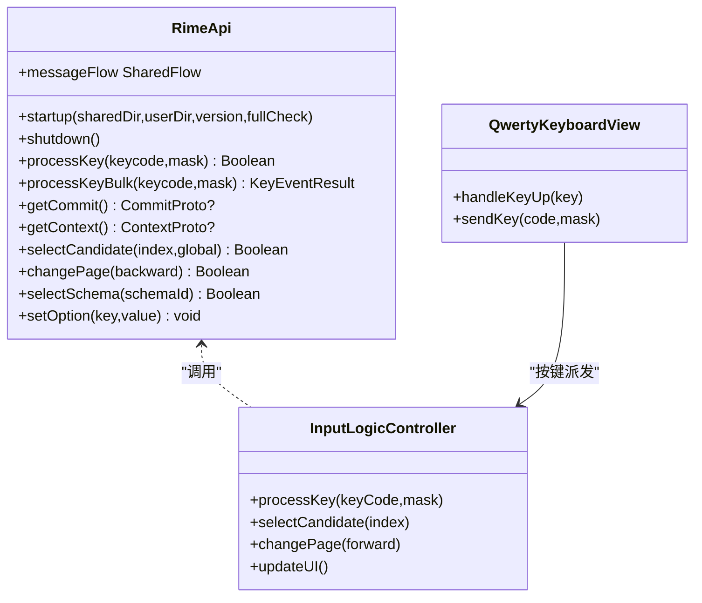

# 仓颉五笔输入方案

<cite>
**本文引用的文件**   
- [cangjie5.schema.yaml](file://app/src/main/assets/rime/cangjie5.schema.yaml)
- [cangjie5.dict.yaml](file://app/src/main/assets/rime/cangjie5.dict.yaml)
- [default.yaml](file://app/src/main/assets/rime/default.yaml)
- [RimeApi.kt](file://app/src/main/java/com/ziyou/ime/core/RimeApi.kt)
- [InputLogicController.kt](file://app/src/main/java/com/ziyou/ime/ime/InputLogicController.kt)
- [QwertyKeyboardView.kt](file://app/src/main/java/com/ziyou/ime/ime/QwertyKeyboardView.kt)
- [RimeMessage.kt](file://app/src/main/java/com/ziyou/ime/core/RimeMessage.kt)
- [cangjie5.schema.yaml（最小化）](file://librime-prebuilt/librime/data/minimal/cangjie5.schema.yaml)
- [cangjie5.dict.yaml（最小化）](file://librime-prebuilt/librime/data/minimal/cangjie5.dict.yaml)
</cite>

## 目录
1. [简介](#简介)
2. [项目结构](#项目结构)
3. [核心组件](#核心组件)
4. [架构总览](#架构总览)
5. [详细组件分析](#详细组件分析)
6. [依赖关系分析](#依赖关系分析)
7. [性能考量](#性能考量)
8. [故障排查指南](#故障排查指南)
9. [结论](#结论)
10. [附录](#附录)

## 简介
本文件为仓颉五代（Cangjie5）输入方案的完整技术文档，覆盖配置结构、字根映射与编码规则、拆字算法要点、从按键到候选显示的完整处理流程，以及码表配置、容错码设置、用户词典管理与高级技巧。同时给出与拼音方案的切换机制与兼容性说明，并提供常用字根速查与扩展建议。

## 项目结构
仓颉五笔方案由三部分组成：
- 方案定义与引擎管线：cangjie5.schema.yaml
- 仓颉码表与词组编码器：cangjie5.dict.yaml
- 默认配置与方案列表：default.yaml

图表来源
- [cangjie5.schema.yaml:1-111](file://app/src/main/assets/rime/cangjie5.schema.yaml#L1-L111)
- [cangjie5.dict.yaml:1-800](file://app/src/main/assets/rime/cangjie5.dict.yaml#L1-L800)
- [default.yaml:1-144](file://app/src/main/assets/rime/default.yaml#L1-L144)

章节来源
- [cangjie5.schema.yaml:1-111](file://app/src/main/assets/rime/cangjie5.schema.yaml#L1-L111)
- [cangjie5.dict.yaml:1-800](file://app/src/main/assets/rime/cangjie5.dict.yaml#L1-L800)
- [default.yaml:1-144](file://app/src/main/assets/rime/default.yaml#L1-L144)

## 核心组件
- 方案配置（schema）：声明 schema_id、名称、版本、依赖、开关项、engine 管线（处理器、分词器、翻译器、过滤器）、拼写器字母表与分隔符、翻译器字典与格式、反向查找、识别器等。
- 码表（dict）：定义列、编码器规则（按词长选择公式）、尾锚字符、排序策略等；并包含大量“汉字—仓颉码”的映射条目。
- 输入控制（App 层）：将键盘事件交给 Rime 引擎批量处理，获取提交文本与上下文，刷新 UI 候选区。
- 键盘视图（全键盘）：负责字母键大小写、中英文切换、数字面板等，最终通过 InputLogicController 进入引擎。

章节来源
- [cangjie5.schema.yaml:1-111](file://app/src/main/assets/rime/cangjie5.schema.yaml#L1-L111)
- [cangjie5.dict.yaml:1-800](file://app/src/main/assets/rime/cangjie5.dict.yaml#L1-L800)
- [RimeApi.kt:1-105](file://app/src/main/java/com/ziyou/ime/core/RimeApi.kt#L1-L105)
- [InputLogicController.kt:1-531](file://app/src/main/java/com/ziyou/ime/ime/InputLogicController.kt#L1-L531)
- [QwertyKeyboardView.kt:1-139](file://app/src/main/java/com/ziyou/ime/ime/QwertyKeyboardView.kt#L1-L139)

## 架构总览
仓颉五笔在 Rime 中的处理链路如下：
- 键盘输入 → InputLogicController.processKeyBulk → Rime engine.processKey
- 分词器 abc_segmentor 识别英文字母序列
- 拼写器 speller 使用字母表与分隔符构建候选前缀
- 翻译器 table_translator 基于 cangjie5.dict.yaml 匹配单字与词组
- 过滤器 simplifier/uniquifier/single_char_filter 进行简繁转换、去重、单字过滤
- 结果经 express_editor 组织 preedit/comment/menu，返回给上层渲染

图表来源
- [InputLogicController.kt:126-185](file://app/src/main/java/com/ziyou/ime/ime/InputLogicController.kt#L126-L185)
- [RimeApi.kt:28-40](file://app/src/main/java/com/ziyou/ime/core/RimeApi.kt#L28-L40)
- [cangjie5.schema.yaml:39-84](file://app/src/main/assets/rime/cangjie5.schema.yaml#L39-L84)
- [cangjie5.dict.yaml:19-42](file://app/src/main/assets/rime/cangjie5.dict.yaml#L19-L42)

## 详细组件分析

### 仓颉方案配置（cangjie5.schema.yaml）
- schema 元信息：schema_id=cangjie5，name=倉頡五代，version=1.2.test，dependencies 包含 luna_pinyin（用于反向查找）。
- switches：中英文模式、全半角、简繁体、扩展字集、中英文标点、联想开关（prediction，当前为惰性 no-op，便于后续启用预测）。
- engine：
  - processors：ascii_composer、recognizer、key_binder、speller、punctuator、selector、navigator、express_editor
  - segmentors：ascii_segmentor、matcher、abc_segmentor、punct_segmentor、fallback_segmentor
  - translators：punct_translator、reverse_lookup_translator、table_translator
  - filters：simplifier、uniquifier、single_char_filter
- speller：alphabet=小写字母顺序，delimiter=" ;'"（空格、分号、撇号为分隔符）
- translator：
  - dictionary=cangjie5
  - enable_charset_filter=true, enable_sentence=true, enable_encoder=true, encode_commit_history=true
  - max_phrase_length=5
  - preedit_format/comment_format：将字母映射为仓颉字根名（日月金木水火土竹戈十大中一弓人心手口尸廿山女田難卜符），并在注释中显示字根提示
  - disable_user_dict_for_patterns：屏蔽以 z 开头和 yyy 开头的模式（避免与系统功能冲突）
- reverse_lookup：以 luna_pinyin 为字典，反查前缀 `，后缀 '，tips=〔拼音〕
- recognizer：patterns 包含 reverse_lookup 的正则

章节来源
- [cangjie5.schema.yaml:1-111](file://app/src/main/assets/rime/cangjie5.schema.yaml#L1-L111)

### 仓颉码表与编码器（cangjie5.dict.yaml）
- columns：text/code/stem（文本、仓颉码、词干）
- encoder：
  - exclude_patterns：排除 x* 与 z* 开头的词（避免与系统快捷键或特殊功能冲突）
  - rules：按词长选择编码公式
    - length_equal: 2 → 首字首码+次码 + 尾字尾码（示例公式）
    - length_equal: 3 → 首字首码+次码 + 尾字尾码 + 末字尾码
    - length_in_range: [4,10] → 首字首码 + 尾字尾码 + 中间字尾码 + 尾字尾码 + 末字尾码
  - tail_anchor：'（撇号作为词尾锚点，用于拆分与取尾码）
- 数据行：每行“汉字 TAB 仓颉码”，部分词条含 stem（如 ab'gr）表示可拆分结构

章节来源
- [cangjie5.dict.yaml:19-42](file://app/src/main/assets/rime/cangjie5.dict.yaml#L19-L42)

### 输入处理流程（从按键到候选）
- 全键盘 QwertyKeyboardView 将按键转换为 keyCode/mask，交由 InputLogicController
- InputLogicController.processKeyBulk 调用 RimeApi.processKeyBulk，减少 JNI 跨界次数
- 若被引擎消费：
  - 若有 commit 文本，直接上屏并清空九宫格栈
  - 用返回的 context 刷新候选区与编码区
- 若未被消费：
  - 退格键：若无编码可删，直接删除目标（编辑器或技能面板）
  - 回车键：根据编辑器行为执行搜索/发送/换行
  - 可打印 ASCII：直接上屏

图表来源
- [InputLogicController.kt:126-185](file://app/src/main/java/com/ziyou/ime/ime/InputLogicController.kt#L126-L185)
- [RimeApi.kt:28-40](file://app/src/main/java/com/ziyou/ime/core/RimeApi.kt#L28-L40)

章节来源
- [InputLogicController.kt:126-185](file://app/src/main/java/com/ziyou/ime/ime/InputLogicController.kt#L126-L185)
- [RimeApi.kt:28-40](file://app/src/main/java/com/ziyou/ime/core/RimeApi.kt#L28-L40)

### 仓颉码字根映射与编码规则
- 字根映射：通过 preedit_format/comment_format 的 xlit 将 a-z 映射为仓颉字根名（日月金木水火土竹戈十大中一弓人心手口尸廿山女田難卜符），用于预编辑与注释显示
- 编码规则：
  - 单字：直接查码表
  - 词组：依据 encoder.rules 按长度选择公式，结合 tail_anchor=' 定位尾码
  - 排除规则：exclude_patterns 屏蔽 x* 与 z* 开头的词
- 反向查找：`...` 形式的前缀/后缀配合 luna_pinyin 字典，支持在仓颉模式下快速查拼音

章节来源
- [cangjie5.schema.yaml:69-84](file://app/src/main/assets/rime/cangjie5.schema.yaml#L69-L84)
- [cangjie5.dict.yaml:30-42](file://app/src/main/assets/rime/cangjie5.dict.yaml#L30-L42)

### 容错码与分隔符
- 分隔符：speller.delimiter 包含空格、分号、撇号，用于词间切分与尾码锚定
- 容错：仓颉五代通常不依赖“容错码”概念，而是通过精确码表与词组编码器实现；如需扩展，可在 dict 中增加同音/近形变体映射或在 schema 中调整识别器 patterns

章节来源
- [cangjie5.schema.yaml:64-67](file://app/src/main/assets/rime/cangjie5.schema.yaml#L64-L67)
- [cangjie5.dict.yaml:30-42](file://app/src/main/assets/rime/cangjie5.dict.yaml#L30-L42)

### 用户词典管理
- 提交历史：translator.encode_commit_history=true，记录已提交内容用于统计与优化
- 禁用模式：disable_user_dict_for_patterns 屏蔽 z* 与 yyy* 模式，避免与系统功能冲突
- 用户词典写入：通过 Rime 的用户数据库接口（由底层 librime 提供），上层可通过 RimeConfigManager 读取/写入配置项

章节来源
- [cangjie5.schema.yaml:69-84](file://app/src/main/assets/rime/cangjie5.schema.yaml#L69-L84)
- [RimeConfigManager.kt:1-200](file://app/src/main/java/com/ziyou/ime/config/RimeConfigManager.kt#L1-L200)

### 高级输入技巧
- 词尾锚点：使用 '（撇号）明确尾码位置，提高多字词命中率
- 分隔符：利用空格或分号切分词段，辅助组词
- 反向查找：在仓颉模式下输入 `拼音' 快速查字
- 候选翻页：上下页键或逗号/句号翻页（见 default.yaml key_binder）

章节来源
- [cangjie5.dict.yaml:30-42](file://app/src/main/assets/rime/cangjie5.dict.yaml#L30-L42)
- [default.yaml:98-131](file://app/src/main/assets/rime/default.yaml#L98-L131)

### 与拼音方案的切换机制与兼容性
- 方案列表：default.yaml 的 schema_list 包含 luna_pinyin、t9、cangjie5
- 切换方式：客户端统一控制（设置页/候选区“方”键），避免物理热键绕过客户端逻辑
- 选项持久化：switcher.save_options 保存 full_shape、ascii_punct、simplification、extended_charset
- 兼容性：cangjie5 依赖 luna_pinyin 用于反向查找；prediction 开关在三方案保持一致（当前为 no-op）

章节来源
- [default.yaml:6-24](file://app/src/main/assets/rime/default.yaml#L6-L24)
- [cangjie5.schema.yaml:14-37](file://app/src/main/assets/rime/cangjie5.schema.yaml#L14-L37)

## 依赖关系分析
- 应用层依赖 RimeApi 抽象，封装生命周期、输入处理、候选操作、方案管理、运行时选项、消息流
- InputLogicController 协调键盘视图与 Rime 引擎，串行化输入事务，保证按键与 commit/context 一致
- 方案与码表由 Rime 引擎加载，translator 依赖 dict 文件，filters 依赖 simplifier/uniquifier 等

图表来源
- [RimeApi.kt:1-105](file://app/src/main/java/com/ziyou/ime/core/RimeApi.kt#L1-L105)
- [InputLogicController.kt:1-531](file://app/src/main/java/com/ziyou/ime/ime/InputLogicController.kt#L1-L531)
- [QwertyKeyboardView.kt:1-139](file://app/src/main/java/com/ziyou/ime/ime/QwertyKeyboardView.kt#L1-L139)

章节来源
- [RimeApi.kt:1-105](file://app/src/main/java/com/ziyou/ime/core/RimeApi.kt#L1-L105)
- [InputLogicController.kt:1-531](file://app/src/main/java/com/ziyou/ime/ime/InputLogicController.kt#L1-L531)
- [QwertyKeyboardView.kt:1-139](file://app/src/main/java/com/ziyou/ime/ime/QwertyKeyboardView.kt#L1-L139)

## 性能考量
- 批量处理：processKeyBulk 合并 processKey/getCommit/getContext，减少线程往返与 JNI 跨界
- 慢按键告警：超过阈值（如 100ms）记录日志，便于发现退化
- 编码长度上限：MAX_INPUT_LENGTH=30，防止超长编码导致组合爆炸
- 候选渲染：在主线程刷新 UI，避免阻塞 Rime 线程

章节来源
- [InputLogicController.kt:54-64](file://app/src/main/java/com/ziyou/ime/ime/InputLogicController.kt#L54-L64)
- [InputLogicController.kt:140-146](file://app/src/main/java/com/ziyou/ime/ime/InputLogicController.kt#L140-L146)

## 故障排查指南
- 无法切换到仓颉方案：检查 default.yaml 的 schema_list 是否包含 cangjie5
- 候选为空：确认 cangjie5.dict.yaml 是否正确部署，translator.dictionary 指向 cangjie5
- 反向查找无效：确认 reverse_lookup 的 prefix/suffix 与 luna_pinyin 字典可用
- 候选乱序：检查 filter uniquifier 与 single_char_filter 是否启用
- 慢按键：查看日志中“慢按键”警告，关注编码长度与复杂词组

章节来源
- [default.yaml:6-24](file://app/src/main/assets/rime/default.yaml#L6-L24)
- [cangjie5.schema.yaml:69-84](file://app/src/main/assets/rime/cangjie5.schema.yaml#L69-L84)
- [InputLogicController.kt:140-146](file://app/src/main/java/com/ziyou/ime/ime/InputLogicController.kt#L140-L146)

## 结论
仓颉五笔方案在本项目中通过清晰的 schema/dict 配置与稳健的 App 层输入控制，实现了从按键到候选的稳定高效处理。借助 Rime 的模块化管线与 librime 的性能优势，用户在保持传统仓颉体验的同时，也能享受现代输入法的流畅交互与可扩展性。

## 附录

### 常用仓颉字根速查（a-z 映射）
- a: 日
- b: 月
- c: 金
- d: 木
- e: 水
- f: 火
- g: 土
- h: 竹
- i: 戈
- j: 十
- k: 大
- l: 中
- m: 一
- n: 弓
- o: 人
- p: 心
- q: 手
- r: 口
- s: 尸
- t: 廿
- u: 山
- v: 女
- w: 田
- x: 難
- y: 卜
- z: 符

章节来源
- [cangjie5.schema.yaml:76-80](file://app/src/main/assets/rime/cangjie5.schema.yaml#L76-L80)

### 自定义仓颉规则与扩展字根库
- 扩展字根映射：在 schema 的 preedit_format/comment_format 中添加 xlit 映射，将新字母映射到新字根名
- 新增词组编码：在 dict 中追加“汉字 TAB 仓颉码”条目，必要时添加 stem 字段
- 调整编码器规则：修改 encoder.rules 的公式或新增长度区间规则
- 容错与识别：在 recognizer.patterns 中增加正则，或在 schema 中引入新的 segmentor/filter

章节来源
- [cangjie5.schema.yaml:69-84](file://app/src/main/assets/rime/cangjie5.schema.yaml#L69-L84)
- [cangjie5.dict.yaml:30-42](file://app/src/main/assets/rime/cangjie5.dict.yaml#L30-L42)

### 最小化资源参考
- 最小化 schema/dict 位于 librime-prebuilt 中，可用于对比与裁剪

章节来源
- [cangjie5.schema.yaml（最小化）:1-105](file://librime-prebuilt/librime/data/minimal/cangjie5.schema.yaml#L1-L105)
- [cangjie5.dict.yaml（最小化）:1-800](file://librime-prebuilt/librime/data/minimal/cangjie5.dict.yaml#L1-L800)