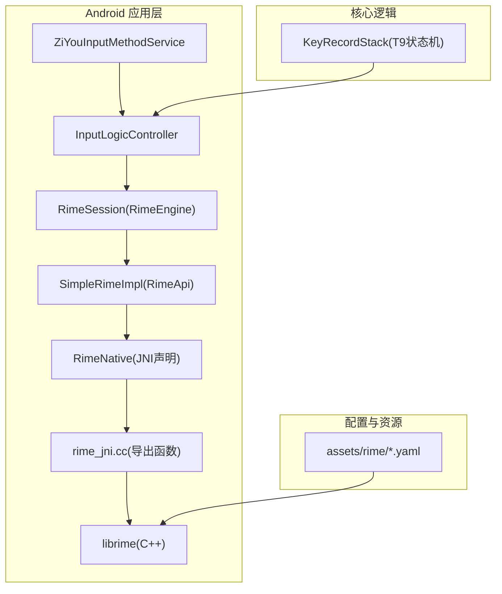
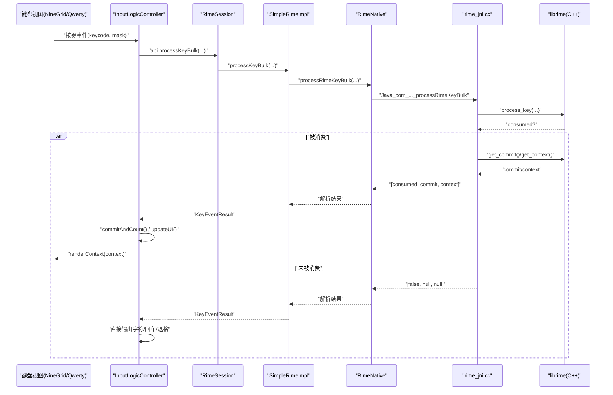
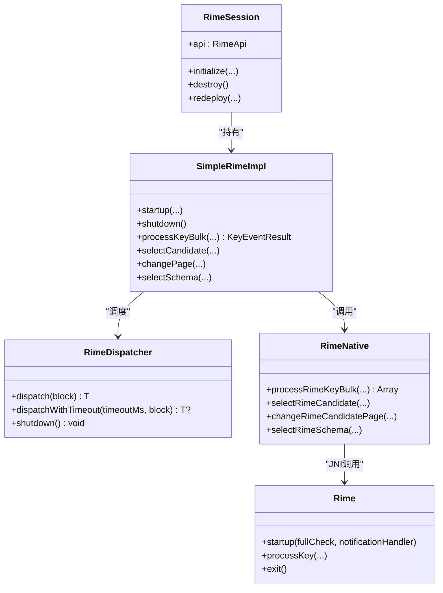
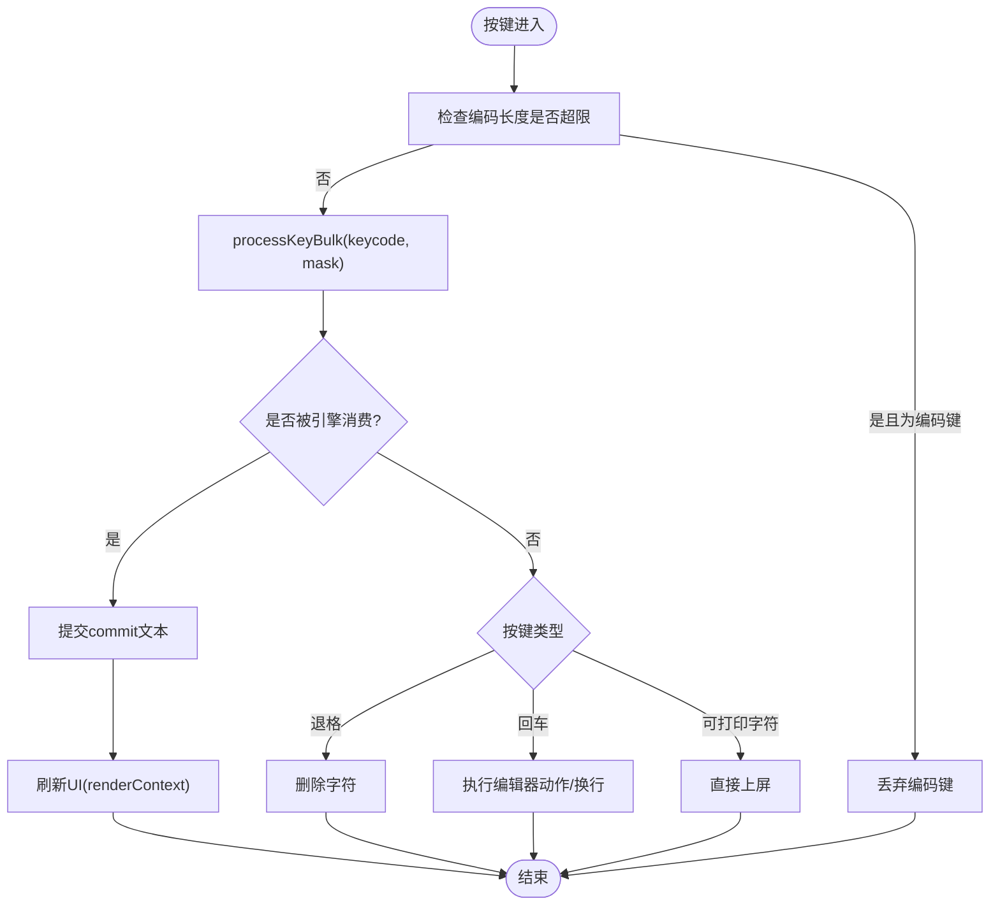
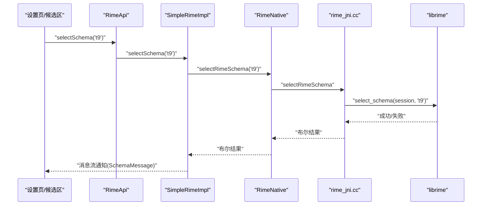
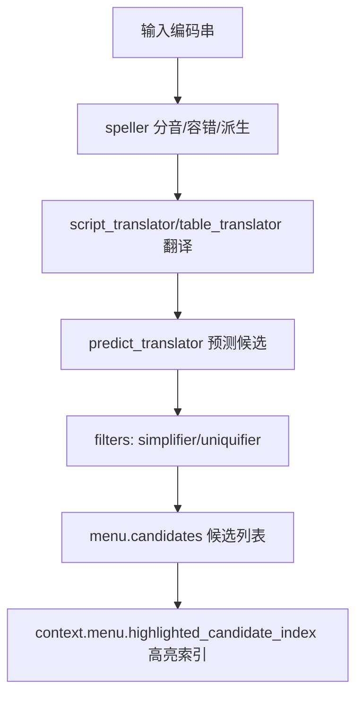
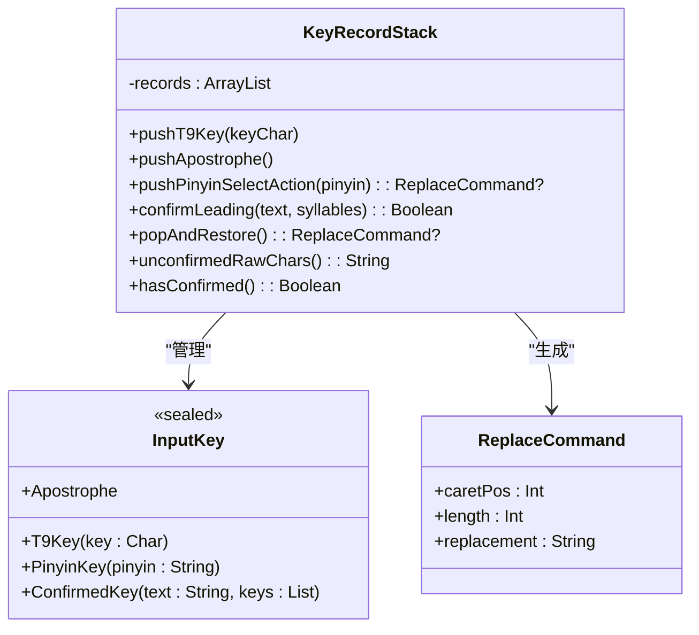
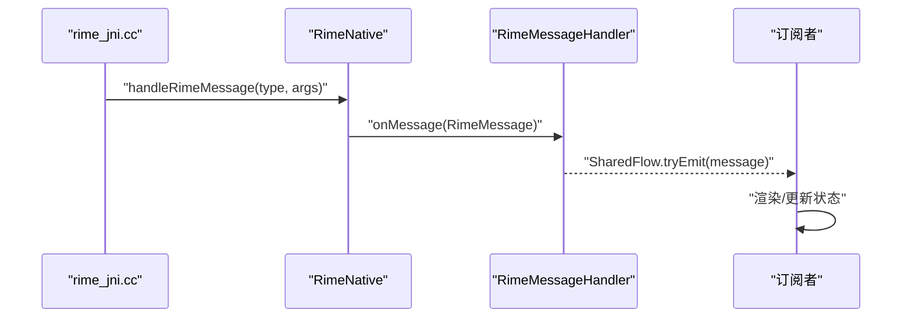
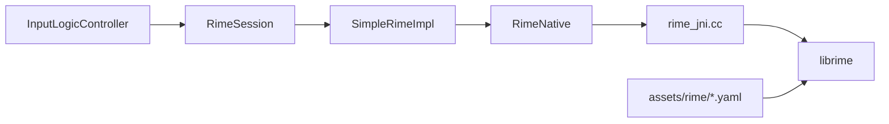

# 多方案中文输入

<cite>
**本文引用的文件**   
- [RimeApi.kt](file://app/src/main/java/com/ziyou/ime/core/RimeApi.kt)
- [SimpleRimeImpl.kt](file://app/src/main/java/com/ziyou/ime/core/SimpleRimeImpl.kt)
- [RimeNative.kt](file://app/src/main/java/com/ziyou/ime/core/RimeNative.kt)
- [rime_jni.cc](file://app/src/main/jni/librime_jni/rime_jni.cc)
- [session.h](file://app/src/main/jni/librime_jni/session.h)
- [InputLogicController.kt](file://app/src/main/java/com/ziyou/ime/ime/InputLogicController.kt)
- [NineGridKeyboardView.kt](file://app/src/main/java/com/ziyou/ime/ime/NineGridKeyboardView.kt)
- [KeyRecordStack.kt](file://core-logic/src/main/java/com/ziyou/ime/core/t9/KeyRecordStack.kt)
- [RimeSession.kt](file://app/src/main/java/com/ziyou/ime/daemon/RimeSession.kt)
- [default.yaml](file://app/src/main/assets/rime/default.yaml)
- [luna_pinyin.schema.yaml](file://app/src/main/assets/rime/luna_pinyin.schema.yaml)
- [cangjie5.schema.yaml](file://app/src/main/assets/rime/cangjie5.schema.yaml)
- [t9.schema.yaml](file://app/src/main/assets/rime/t9.schema.yaml)
</cite>

## 目录
1. [引言](#引言)
2. [项目结构](#项目结构)
3. [核心组件](#核心组件)
4. [架构总览](#架构总览)
5. [详细组件分析](#详细组件分析)
6. [依赖关系分析](#依赖关系分析)
7. [性能考量](#性能考量)
8. [故障排查指南](#故障排查指南)
9. [结论](#结论)
10. [附录：配置与扩展指南](#附录配置与扩展指南)

## 引言
本文件面向字由输入法的多方案中文输入能力，系统性阐述拼音（luna_pinyin）、仓颉五笔（cangjie5）与 T9 九宫格（t9）的实现原理、配置方式与使用场景；并深入解析 Rime 引擎在 Android 端的集成架构，包括 JNI 桥接层、线程模型、按键处理流程、候选词生成算法、编码区处理逻辑与方案切换机制。文档同时提供初学者概念介绍与高级开发者所需的实现细节和扩展指南。

## 项目结构
本项目采用“Android 应用 + core-logic 模块 + librime-prebuilt + JNI”的分层组织：
- app 层：IME 服务、UI 键盘视图、输入逻辑控制器、Rime 会话管理、JNI 封装与消息流
- core-logic 层：T9 状态机、工具类、通用逻辑
- librime-prebuilt：Rime 引擎源码与构建脚本
- assets/rime：各方案的 schema/dict 配置与 OpenCC 转换资源

**图表来源** 
- [RimeSession.kt:38-153](file://app/src/main/java/com/ziyou/ime/daemon/RimeSession.kt#L38-L153)
- [SimpleRimeImpl.kt:10-42](file://app/src/main/java/com/ziyou/ime/core/SimpleRimeImpl.kt#L10-L42)
- [RimeNative.kt:10-50](file://app/src/main/java/com/ziyou/ime/core/RimeNative.kt#L10-L50)
- [rime_jni.cc:280-315](file://app/src/main/jni/librime_jni/rime_jni.cc#L280-L315)
- [luna_pinyin.schema.yaml:1-20](file://app/src/main/assets/rime/luna_pinyin.schema.yaml#L1-L20)
- [cangjie5.schema.yaml:1-20](file://app/src/main/assets/rime/cangjie5.schema.yaml#L1-L20)
- [t9.schema.yaml:1-25](file://app/src/main/assets/rime/t9.schema.yaml#L1-L25)

**章节来源**
- [RimeSession.kt:38-153](file://app/src/main/java/com/ziyou/ime/daemon/RimeSession.kt#L38-L153)
- [default.yaml:6-10](file://app/src/main/assets/rime/default.yaml#L6-L10)

## 核心组件
- RimeApi：定义所有对 Rime 引擎的异步 API（启动/关闭、按键处理、候选操作、方案管理、选项设置、消息流等），统一通过调度器执行，屏蔽线程安全。
- SimpleRimeImpl：RimeApi 的具体实现，将调用派发至单线程 RimeDispatcher，保证 librime 非线程安全的约束。
- RimeNative：JNI 接口声明，对应 C++ 层的 native 方法，负责跨语言数据转换与回调分发。
- rime_jni.cc：JNI 导出函数与 Rime 引擎单例封装，维护会话生命周期、按键处理、候选获取、方案切换、消息回调到 Java。
- InputLogicController：输入逻辑中枢，串联键盘事件、Rime 引擎、上屏目标（宿主编辑器或技能面板）、候选选择与 UI 刷新。
- NineGridKeyboardView：九宫格键盘视图，将字母键映射为数字键发送，配合 t9 方案进行智能消歧。
- KeyRecordStack：T9 输入状态机，维护击键序列、已锁定拼音与确认段，支持替换指令与退格重打。
- RimeSession：Rime 会话管理器，负责部署步骤、目录准备、引擎启动/销毁/重新部署，以及对外暴露 RimeApi。

**章节来源**
- [RimeApi.kt:10-104](file://app/src/main/java/com/ziyou/ime/core/RimeApi.kt#L10-L104)
- [SimpleRimeImpl.kt:10-42](file://app/src/main/java/com/ziyou/ime/core/SimpleRimeImpl.kt#L10-L42)
- [RimeNative.kt:10-50](file://app/src/main/java/com/ziyou/ime/core/RimeNative.kt#L10-L50)
- [rime_jni.cc:46-88](file://app/src/main/jni/librime_jni/rime_jni.cc#L46-L88)
- [InputLogicController.kt:43-74](file://app/src/main/java/com/ziyou/ime/ime/InputLogicController.kt#L43-L74)
- [NineGridKeyboardView.kt:37-57](file://app/src/main/java/com/ziyou/ime/ime/NineGridKeyboardView.kt#L37-L57)
- [KeyRecordStack.kt:20-41](file://core-logic/src/main/java/com/ziyou/ime/core/t9/KeyRecordStack.kt#L20-L41)
- [RimeSession.kt:38-153](file://app/src/main/java/com/ziyou/ime/daemon/RimeSession.kt#L38-L153)

## 架构总览
下图展示从键盘事件到 Rime 引擎再到 UI 刷新的完整调用链，涵盖 JNI 桥接、线程模型与消息回调。

**图表来源** 
- [InputLogicController.kt:126-185](file://app/src/main/java/com/ziyou/ime/ime/InputLogicController.kt#L126-L185)
- [SimpleRimeImpl.kt:59-64](file://app/src/main/java/com/ziyou/ime/core/SimpleRimeImpl.kt#L59-L64)
- [RimeNative.kt:66-71](file://app/src/main/java/com/ziyou/ime/core/RimeNative.kt#L66-L71)
- [rime_jni.cc:366-384](file://app/src/main/jni/librime_jni/rime_jni.cc#L366-L384)

## 详细组件分析

### Rime 引擎集成与线程模型
- 单线程调度器：RimeDispatcher 创建专属单线程 Executor，所有 librime 调用通过协程 withContext(dispatcher) 顺序执行，避免并发访问导致的数据竞争。
- 会话管理：RimeSession 负责部署步骤、目录准备、引擎启动/销毁/重新部署，并在 IO 线程执行磁盘 IO，避免主线程阻塞。
- JNI 桥接：RimeNative 声明 native 方法；rime_jni.cc 中 Rime 单例封装 SessionHolder RAII 管理会话生命周期，并提供 processKeyBulk 热路径优化。

**图表来源** 
- [RimeDispatcher.kt:22-60](file://app/src/main/java/com/ziyou/ime/core/RimeDispatcher.kt#L22-L60)
- [SimpleRimeImpl.kt:10-42](file://app/src/main/java/com/ziyou/ime/core/SimpleRimeImpl.kt#L10-L42)
- [RimeNative.kt:66-71](file://app/src/main/java/com/ziyou/ime/core/RimeNative.kt#L66-L71)
- [RimeSession.kt:88-153](file://app/src/main/java/com/ziyou/ime/daemon/RimeSession.kt#L88-L153)
- [rime_jni.cc:46-88](file://app/src/main/jni/librime_jni/rime_jni.cc#L46-L88)
- [session.h:12-35](file://app/src/main/jni/librime_jni/session.h#L12-L35)

**章节来源**
- [RimeDispatcher.kt:22-60](file://app/src/main/java/com/ziyou/ime/core/RimeDispatcher.kt#L22-L60)
- [RimeSession.kt:88-153](file://app/src/main/java/com/ziyou/ime/daemon/RimeSession.kt#L88-L153)
- [rime_jni.cc:280-315](file://app/src/main/jni/librime_jni/rime_jni.cc#L280-L315)

### 按键处理流程与热路径优化
- 热路径：InputLogicController 使用 processKeyBulk 合并 processKey/getCommit/getContext 为单次引擎调度，减少主线程↔Rime 线程往返与 JNI 跨界次数。
- 超限防护：当编码串长度超过阈值时丢弃新增编码键，避免 script_translator 组句搜索耗时爆炸。
- 未消费处理：退格、回车、可打印字符按不同语义落地（宿主编辑器或技能面板）。

**图表来源** 
- [InputLogicController.kt:126-185](file://app/src/main/java/com/ziyou/ime/ime/InputLogicController.kt#L126-L185)
- [SimpleRimeImpl.kt:59-64](file://app/src/main/java/com/ziyou/ime/core/SimpleRimeImpl.kt#L59-L64)
- [rime_jni.cc:366-384](file://app/src/main/jni/librime_jni/rime_jni.cc#L366-L384)

**章节来源**
- [InputLogicController.kt:126-185](file://app/src/main/java/com/ziyou/ime/ime/InputLogicController.kt#L126-L185)

### 方案切换机制与默认配置
- 默认方案列表：default.yaml 中声明 luna_pinyin、t9、cangjie5。
- 客户端控制：hotkeys 清空，避免物理键盘绕过客户端的“键盘布局 ↔ 方案”映射与专用方案过滤逻辑。
- 运行时切换：通过 selectSchema(schemaId) 切换当前活跃方案，并触发消息流通知 UI。

**图表来源** 
- [default.yaml:6-16](file://app/src/main/assets/rime/default.yaml#L6-L16)
- [RimeApi.kt:78-86](file://app/src/main/java/com/ziyou/ime/core/RimeApi.kt#L78-L86)
- [SimpleRimeImpl.kt:144-148](file://app/src/main/java/com/ziyou/ime/core/SimpleRimeImpl.kt#L144-L148)
- [RimeNative.kt:131-133](file://app/src/main/java/com/ziyou/ime/core/RimeNative.kt#L131-L133)
- [rime_jni.cc:470-475](file://app/src/main/jni/librime_jni/rime_jni.cc#L470-L475)

**章节来源**
- [default.yaml:6-16](file://app/src/main/assets/rime/default.yaml#L6-L16)

### 候选词生成算法与编码区处理
- 拼音（luna_pinyin）：speller/algebra 定义容错与简拼规则；translator 使用 luna_pinyin 词典；predictor 提供上屏后预测候选；filters 包含繁简转换与去重。
- 仓颉五笔（cangjie5）：table_translator 基于 cangjie5 词典；reverse_lookup 支持拼音反查；preedit/comment_format 映射仓颡码与汉字。
- T9（t9）：speller/algebra 派生数字键写法（2=abc…9=wxyz），引擎在所有可能组合中匹配候选；spelling_hints 携带真实拼音读音作为 comment，供侧栏展示。

**图表来源** 
- [luna_pinyin.schema.yaml:33-64](file://app/src/main/assets/rime/luna_pinyin.schema.yaml#L33-L64)
- [cangjie5.schema.yaml:39-63](file://app/src/main/assets/rime/cangjie5.schema.yaml#L39-L63)
- [t9.schema.yaml:38-62](file://app/src/main/assets/rime/t9.schema.yaml#L38-L62)
- [rime_jni.cc:214-227](file://app/src/main/jni/librime_jni/rime_jni.cc#L214-L227)

**章节来源**
- [luna_pinyin.schema.yaml:33-64](file://app/src/main/assets/rime/luna_pinyin.schema.yaml#L33-L64)
- [cangjie5.schema.yaml:39-63](file://app/src/main/assets/rime/cangjie5.schema.yaml#L39-L63)
- [t9.schema.yaml:38-62](file://app/src/main/assets/rime/t9.schema.yaml#L38-L62)

### T9 九宫格实现与状态机
- 键盘视图：NineGridKeyboardView 将字母键映射为数字键（2-9）发送，配合 t9 方案进行智能消歧；“分词”键发送撇号手动分词，“重输”键发送 Escape 清除编码。
- 状态机：KeyRecordStack 维护 T9 击键、已锁定拼音与确认段，支持 pushPinyinSelectAction 原地替换、confirmLeading 分段确认同步、popAndRestore 智能回退与 retypeUnconfirmed 退格重打。

**图表来源** 
- [NineGridKeyboardView.kt:253-280](file://app/src/main/java/com/ziyou/ime/ime/NineGridKeyboardView.kt#L253-L280)
- [KeyRecordStack.kt:20-41](file://core-logic/src/main/java/com/ziyou/ime/core/t9/KeyRecordStack.kt#L20-L41)
- [KeyRecordStack.kt:57-83](file://core-logic/src/main/java/com/ziyou/ime/core/t9/KeyRecordStack.kt#L57-L83)
- [KeyRecordStack.kt:98-142](file://core-logic/src/main/java/com/ziyou/ime/core/t9/KeyRecordStack.kt#L98-L142)
- [KeyRecordStack.kt:196-230](file://core-logic/src/main/java/com/ziyou/ime/core/t9/KeyRecordStack.kt#L196-L230)

**章节来源**
- [NineGridKeyboardView.kt:253-280](file://app/src/main/java/com/ziyou/ime/ime/NineGridKeyboardView.kt#L253-L280)
- [KeyRecordStack.kt:57-83](file://core-logic/src/main/java/com/ziyou/ime/core/t9/KeyRecordStack.kt#L57-L83)

### 消息流与通知机制
- JNI 回调：rime_jni.cc 注册通知处理器，将 schema/option/deploy 消息转发到 Java。
- Java 分发：RimeNative.handleRimeMessage 将消息转换为 RimeMessage 并通过 RimeMessageHandler 的 SharedFlow 广播给订阅者（如 UI 层）。

**图表来源** 
- [rime_jni.cc:289-314](file://app/src/main/jni/librime_jni/rime_jni.cc#L289-L314)
- [RimeNative.kt:158-168](file://app/src/main/java/com/ziyou/ime/core/RimeNative.kt#L158-L168)
- [RimeMessage.kt:29-41](file://app/src/main/java/com/ziyou/ime/core/RimeMessage.kt#L29-L41)

**章节来源**
- [RimeMessage.kt:29-41](file://app/src/main/java/com/ziyou/ime/core/RimeMessage.kt#L29-L41)

## 依赖关系分析
- 组件耦合：InputLogicController 依赖 RimeSession/RimeApi；RimeSession 依赖 SimpleRimeImpl/RimeDispatcher；SimpleRimeImpl 依赖 RimeNative；JNI 层依赖 librime。
- 外部依赖：assets/rime 下的 schema/dict 与 OpenCC 资源；系统 mallopt（可选）用于内存释放。
- 潜在循环：无直接循环依赖；消息流通过 SharedFlow 解耦。

**图表来源** 
- [InputLogicController.kt:43-74](file://app/src/main/java/com/ziyou/ime/ime/InputLogicController.kt#L43-L74)
- [RimeSession.kt:38-153](file://app/src/main/java/com/ziyou/ime/daemon/RimeSession.kt#L38-L153)
- [SimpleRimeImpl.kt:10-42](file://app/src/main/java/com/ziyou/ime/core/SimpleRimeImpl.kt#L10-L42)
- [RimeNative.kt:10-50](file://app/src/main/java/com/ziyou/ime/core/RimeNative.kt#L10-L50)
- [rime_jni.cc:280-315](file://app/src/main/jni/librime_jni/rime_jni.cc#L280-L315)

**章节来源**
- [RimeSession.kt:38-153](file://app/src/main/java/com/ziyou/ime/daemon/RimeSession.kt#L38-L153)

## 性能考量
- 热路径优化：processKeyBulk 合并三次引擎调用，减少线程与 JNI 跨界开销。
- 慢按键告警：InputLogicController 记录单次按键耗时，超过阈值打 Log.w 便于发现退化。
- 编码上限：MAX_INPUT_LENGTH=30，防止长编码导致的组合爆炸。
- 内存释放：trimNativeHeap 调用 mallopt(M_PURGE) 归还空闲页，降低部署后的常驻占用。

[本节为通用指导，不直接分析具体文件]

## 故障排查指南
- 库加载失败：RimeNative.isLoaded 检查，抛出 IllegalStateException 提示 ABI 不匹配或缺失 .so。
- 引擎启动超时：RimeSession 启动带超时保护，超时仍标记初始化完成，允许后续操作。
- 候选错位：KeyRecordStack.confirmLeading 失败会清栈降级，避免错位；检查 comment 与音节匹配。
- 已确认段丢失：replaceKey 会清空已确认段，需先 unconfirmAll 再替换；或使用 retypeUnconfirmed 保留前缀。

**章节来源**
- [RimeNative.kt:33-40](file://app/src/main/java/com/ziyou/ime/core/RimeNative.kt#L33-L40)
- [RimeSession.kt:134-153](file://app/src/main/java/com/ziyou/ime/daemon/RimeSession.kt#L134-L153)
- [KeyRecordStack.kt:98-142](file://core-logic/src/main/java/com/ziyou/ime/core/t9/KeyRecordStack.kt#L98-L142)
- [rime_jni.cc:98-112](file://app/src/main/jni/librime_jni/rime_jni.cc#L98-L112)

## 结论
字由输入法通过清晰的分层架构与严格的线程模型，将 Rime 引擎稳定集成于 Android 端，支持拼音、仓颉五笔与 T9 九宫格三种中文输入方案。输入逻辑控制器统一管理按键处理、候选选择与 UI 刷新；T9 状态机确保多音节位置与退格行为正确；消息流机制实现引擎状态变更的实时响应。整体设计兼顾易用性与可扩展性，便于后续新增方案与功能增强。

[本节为总结，不直接分析具体文件]

## 附录：配置与扩展指南

### 配置示例与使用场景
- 拼音（luna_pinyin）：适合标准全键盘用户，支持简拼、容错、联想与繁简切换。
- 仓颉五笔（cangjie5）：适合专业打字员，支持反查拼音与码表翻译。
- T9 九宫格（t9）：适合数字键盘快速输入，智能消歧与侧栏拼音候选提升效率。

**章节来源**
- [luna_pinyin.schema.yaml:1-20](file://app/src/main/assets/rime/luna_pinyin.schema.yaml#L1-L20)
- [cangjie5.schema.yaml:1-20](file://app/src/main/assets/rime/cangjie5.schema.yaml#L1-L20)
- [t9.schema.yaml:1-25](file://app/src/main/assets/rime/t9.schema.yaml#L1-L25)

### 如何扩展新输入方案
- 新增 schema.yaml：定义 engine/segmentors/translators/filters/speller/translator/predictor/key_binder/recognizer 等配置。
- 添加词典：在 assets/rime 下放置 *.dict.yaml，并在 translator 中引用。
- 注册方案：在 default.yaml 的 schema_list 中添加新方案 ID。
- 客户端适配：如需特殊键盘行为，扩展 InputLogicController 与键盘视图；必要时增加 KeyRecordStack 支持。

**章节来源**
- [default.yaml:6-10](file://app/src/main/assets/rime/default.yaml#L6-L10)
- [luna_pinyin.schema.yaml:33-64](file://app/src/main/assets/rime/luna_pinyin.schema.yaml#L33-L64)
- [cangjie5.schema.yaml:39-63](file://app/src/main/assets/rime/cangjie5.schema.yaml#L39-L63)
- [t9.schema.yaml:38-62](file://app/src/main/assets/rime/t9.schema.yaml#L38-L62)