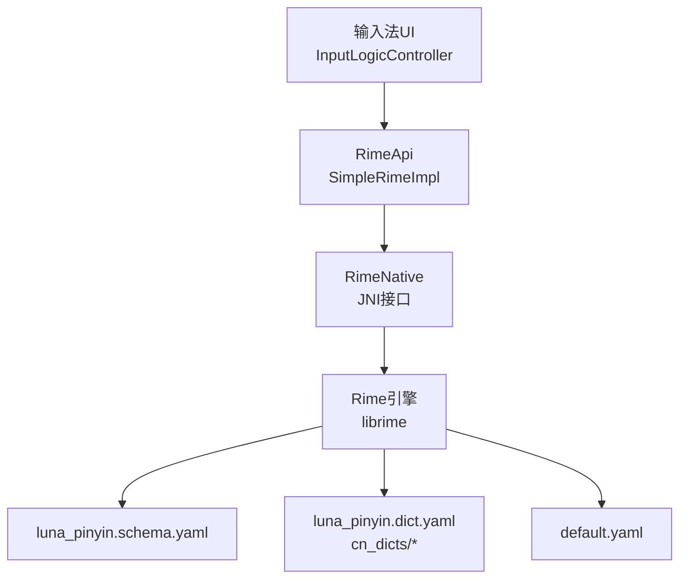
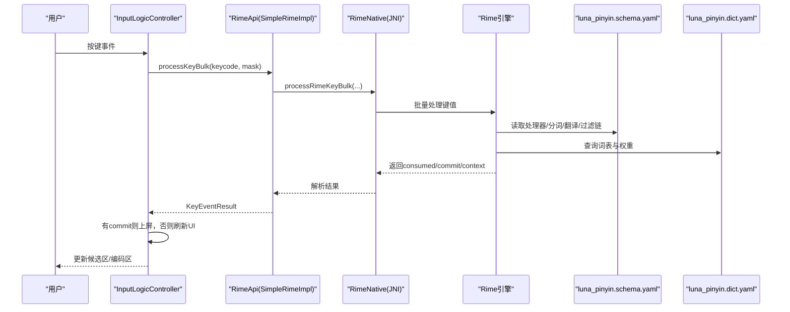
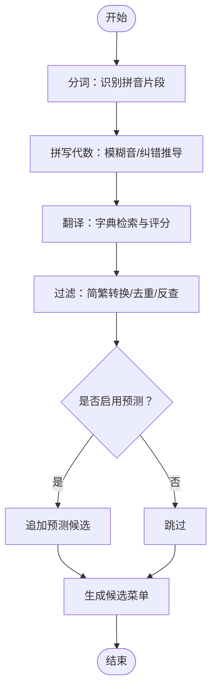
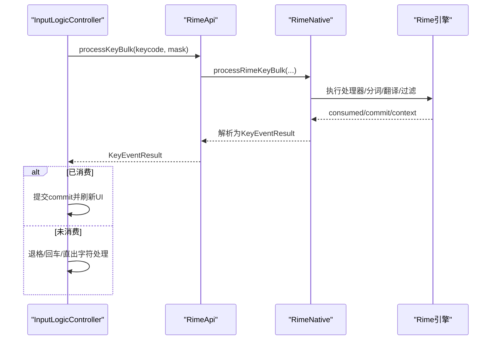
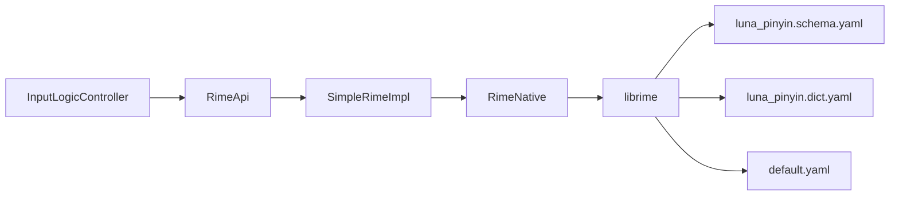

# 拼音输入方案

<cite>
**本文引用的文件**   
- [luna_pinyin.schema.yaml](file://app/src/main/assets/rime/luna_pinyin.schema.yaml)
- [luna_pinyin.dict.yaml](file://app/src/main/assets/rime/luna_pinyin.dict.yaml)
- [default.yaml](file://app/src/main/assets/rime/default.yaml)
- [minimal luna_pinyin.schema.yaml](file://librime-prebuilt/librime/data/minimal/luna_pinyin.schema.yaml)
- [others.dict.yaml](file://app/src/main/assets/rime/cn_dicts/others.dict.yaml)
- [RimeApi.kt](file://app/src/main/java/com/ziyou/ime/core/RimeApi.kt)
- [SimpleRimeImpl.kt](file://app/src/main/java/com/ziyou/ime/core/SimpleRimeImpl.kt)
- [RimeNative.kt](file://app/src/main/java/com/ziyou/ime/core/RimeNative.kt)
- [RimeSession.kt](file://app/src/main/java/com/ziyou/ime/daemon/RimeSession.kt)
- [InputLogicController.kt](file://app/src/main/java/com/ziyou/ime/ime/InputLogicController.kt)
- [AssociationManager.kt](file://app/src/main/java/com/ziyou/ime/data/AssociationManager.kt)
</cite>

## 目录
1. [简介](#简介)
2. [项目结构](#项目结构)
3. [核心组件](#核心组件)
4. [架构总览](#架构总览)
5. [详细组件分析](#详细组件分析)
6. [依赖关系分析](#依赖关系分析)
7. [性能考虑](#性能考虑)
8. [故障排查指南](#故障排查指南)
9. [结论](#结论)
10. [附录](#附录)

## 简介
本文件面向“朙月拼音（luna_pinyin）”输入方案的配置、词典与候选生成流程，系统性说明从按键输入到候选词展示的完整链路，涵盖拼音规则、模糊音、用户词典管理与智能纠错（联想）能力。同时给出与 Rime 引擎的交互方式、性能优化技巧以及自定义扩展方法，帮助开发者快速掌握并定制该方案。

## 项目结构
本项目将 Rime 的配置与词库以 assets 形式打包，并在运行时部署到共享与用户数据目录；Android 层通过 JNI 调用 librime 实现输入处理与候选渲染。关键路径如下：
- 方案与默认配置：assets/rime/*.yaml
- 词库与扩展：assets/rime/cn_dicts/*.dict.yaml
- Android 接入层：core/daemon/ime 等模块
- 预编译 Rime 源码与最小示例：librime-prebuilt/librime/data/minimal

图表来源 
- [RimeApi.kt](file://app/src/main/java/com/ziyou/ime/core/RimeApi.kt)
- [SimpleRimeImpl.kt](file://app/src/main/java/com/ziyou/ime/core/SimpleRimeImpl.kt)
- [RimeNative.kt](file://app/src/main/java/com/ziyou/ime/core/RimeNative.kt)
- [luna_pinyin.schema.yaml](file://app/src/main/assets/rime/luna_pinyin.schema.yaml)
- [luna_pinyin.dict.yaml](file://app/src/main/assets/rime/luna_pinyin.dict.yaml)
- [default.yaml](file://app/src/main/assets/rime/default.yaml)

章节来源
- [luna_pinyin.schema.yaml:1-158](file://app/src/main/assets/rime/luna_pinyin.schema.yaml#L1-L158)
- [luna_pinyin.dict.yaml:1-68](file://app/src/main/assets/rime/luna_pinyin.dict.yaml#L1-L68)
- [default.yaml:1-144](file://app/src/main/assets/rime/default.yaml#L1-L144)

## 核心组件
- 方案配置（schema）：定义处理器、分词器、翻译器、过滤器、speller 代数、translator 字典、切换开关等。
- 词典（dictionary）：导入多个子词表，支持排序策略与字/数字映射。
- Android 接入层：RimeSession 管理生命周期与部署；SimpleRimeImpl 封装单线程调度；RimeNative 暴露 JNI 接口；InputLogicController 串联按键、候选与上屏。
- 联想（predictor）：由 librime-predict 插件提供，应用侧通过选项门控。

章节来源
- [luna_pinyin.schema.yaml:33-92](file://app/src/main/assets/rime/luna_pinyin.schema.yaml#L33-L92)
- [luna_pinyin.dict.yaml:16-26](file://app/src/main/assets/rime/luna_pinyin.dict.yaml#L16-L26)
- [RimeSession.kt:88-153](file://app/src/main/java/com/ziyou/ime/daemon/RimeSession.kt#L88-L153)
- [SimpleRimeImpl.kt:32-49](file://app/src/main/java/com/ziyou/ime/core/SimpleRimeImpl.kt#L32-L49)
- [RimeNative.kt:44-71](file://app/src/main/java/com/ziyou/ime/core/RimeNative.kt#L44-L71)
- [InputLogicController.kt:126-185](file://app/src/main/java/com/ziyou/ime/ime/InputLogicController.kt#L126-L185)
- [AssociationManager.kt:21-43](file://app/src/main/java/com/ziyou/ime/data/AssociationManager.kt#L21-L43)

## 架构总览
下图展示从按键到候选展示的端到端流程，以及 Rime 内部处理管线。

图表来源 
- [InputLogicController.kt:126-185](file://app/src/main/java/com/ziyou/ime/ime/InputLogicController.kt#L126-L185)
- [SimpleRimeImpl.kt:59-64](file://app/src/main/java/com/ziyou/ime/core/SimpleRimeImpl.kt#L59-L64)
- [RimeNative.kt:66-71](file://app/src/main/java/com/ziyou/ime/core/RimeNative.kt#L66-L71)
- [luna_pinyin.schema.yaml:33-64](file://app/src/main/assets/rime/luna_pinyin.schema.yaml#L33-L64)
- [luna_pinyin.dict.yaml:16-26](file://app/src/main/assets/rime/luna_pinyin.dict.yaml#L16-L26)

## 详细组件分析

### 方案配置（luna_pinyin.schema.yaml）
- 引擎管线
  - processors：ascii_composer → recognizer → predictor → key_binder → speller → punctuator → selector → navigator → express_editor
  - segmentors：ascii_segmentor、matcher、abc_segmentor、affix_segmentor@alphabet/cangjie/pinyin、punct_segmentor、fallback_segmentor
  - translators：punct_translator、reverse_lookup_translator、script_translator、table_translator@cangjie、script_translator@pinyin、predict_translator
  - filters：reverse_lookup_filter@cangjie_lookup、simplifier@zh_trad、uniquifier
- speller 代数（模糊音与纠错）
  - 缩写、声母修正、韵母归一化、ng/gn 互换、ong/on、ao/oa、iou/ui/un 等推导规则
- translator 字典与 preedit_format
  - 指定 luna_pinyin 字典，v→ü 的显示转换
- pinyin 段与 reverse_lookup
  - 标签、前缀/后缀、提示语、是否启用用户词典
- 预测（predictor）
  - predict.db 路径、最大候选数、迭代次数
- 标点与键盘绑定
  - import_preset: default

章节来源
- [luna_pinyin.schema.yaml:33-92](file://app/src/main/assets/rime/luna_pinyin.schema.yaml#L33-L92)
- [luna_pinyin.schema.yaml:113-139](file://app/src/main/assets/rime/luna_pinyin.schema.yaml#L113-L139)
- [luna_pinyin.schema.yaml:65-70](file://app/src/main/assets/rime/luna_pinyin.schema.yaml#L65-L70)
- [luna_pinyin.schema.yaml:145-158](file://app/src/main/assets/rime/luna_pinyin.schema.yaml#L145-L158)

### 词典格式与组织（luna_pinyin.dict.yaml 与 cn_dicts）
- 词表组成
  - 通过 import_tables 引入基础字表、基础词库、扩展词库、腾讯大词库与其他补充
- 排序策略
  - sort: by_weight（按权重排序）
- 特殊条目
  - 大写字母映射、数字参与造词
- 容错与多音字
  - others.dict.yaml 包含口语读音、异读、错音错字提示、叠字等

章节来源
- [luna_pinyin.dict.yaml:16-26](file://app/src/main/assets/rime/luna_pinyin.dict.yaml#L16-L26)
- [luna_pinyin.dict.yaml:28-68](file://app/src/main/assets/rime/luna_pinyin.dict.yaml#L28-L68)
- [others.dict.yaml:14-101](file://app/src/main/assets/rime/cn_dicts/others.dict.yaml#L14-L101)

### 候选词生成算法与流程
- 分词与拼写
  - abc_segmentor/affix_segmentor@pinyin 识别拼音片段；speller 对输入进行代数变换（模糊音、纠错）
- 翻译与检索
  - script_translator@pinyin 基于 luna_pinyin 字典检索匹配项，结合权重排序
- 过滤与去重
  - simplifier（简繁转换）、uniquifier（去重）、reverse_lookup_filter（仓颉反查）
- 预测候选
  - predict_translator 在 commit 后根据 predict.db 生成后续预测候选，注入 context.menu

图表来源 
- [luna_pinyin.schema.yaml:33-64](file://app/src/main/assets/rime/luna_pinyin.schema.yaml#L33-L64)
- [luna_pinyin.schema.yaml:71-92](file://app/src/main/assets/rime/luna_pinyin.schema.yaml#L71-L92)
- [luna_pinyin.schema.yaml:53-64](file://app/src/main/assets/rime/luna_pinyin.schema.yaml#L53-L64)

### 按键到候选的完整链路（Android 层）
- InputLogicController.processKey
  - 使用 processKeyBulk 一次性完成 processKey + getCommit + getContext，减少线程往返与 JNI 跨界
  - 若被消费：提交 commit 文本并刷新 UI；未消费：退格/回车/可打印字符直接处理
- 选词与翻页
  - selectCandidate/changePage 调用引擎接口，分段确认时同步九宫格状态机
- 九宫格消歧
  - replaceKey 替换编码中指定位置的键序列，随后移动光标至末尾以重组候选

图表来源 
- [InputLogicController.kt:126-185](file://app/src/main/java/com/ziyou/ime/ime/InputLogicController.kt#L126-L185)
- [SimpleRimeImpl.kt:59-64](file://app/src/main/java/com/ziyou/ime/core/SimpleRimeImpl.kt#L59-L64)
- [RimeNative.kt:66-71](file://app/src/main/java/com/ziyou/ime/core/RimeNative.kt#L66-L71)

### 拼音规则配置与模糊音设置
- 字母表与分隔符
  - alphabet: zyxwvutsrqponmlkjihgfedcba；delimiter: 空格与撇号
- 代数规则要点
  - 首字母缩写、zcs+h 缩写、nlve→lue/jqxyu→v、un/uen、ui/uei、iu/iou、ng/gn、o(u|ng)/o、ong/on、ao/oa、(iu)a(o|ng?)→a(iu)(o|ng?)
- preedit_format
  - v→ü 的显示转换，提升可读性

章节来源
- [luna_pinyin.schema.yaml:71-92](file://app/src/main/assets/rime/luna_pinyin.schema.yaml#L71-L92)
- [luna_pinyin.schema.yaml:89-92](file://app/src/main/assets/rime/luna_pinyin.schema.yaml#L89-L92)

### 用户词典管理与智能纠错（联想）
- 用户词典
  - pinyin.enable_user_dict 控制是否启用用户词典；可通过 engine 选项或部署步骤写入用户目录
- 联想（predictor）
  - schema 中 predictor.db/max_candidates/max_iterations 控制预测行为
  - 应用侧 AssociationManager 持久化开关，并通过 setOption("prediction", true/false) 映射到引擎选项
  - 当前预编译 librime.a 默认未编入 predict 模块，需按 README 开启 WITH_PREDICT=ON

章节来源
- [luna_pinyin.schema.yaml:113-122](file://app/src/main/assets/rime/luna_pinyin.schema.yaml#L113-L122)
- [luna_pinyin.schema.yaml:65-70](file://app/src/main/assets/rime/luna_pinyin.schema.yaml#L65-L70)
- [AssociationManager.kt:21-43](file://app/src/main/java/com/ziyou/ime/data/AssociationManager.kt#L21-L43)

### 与 Rime 引擎的交互方式
- 生命周期
  - RimeSession.initialize/redeploy/destroy 负责资源部署、目录创建与引擎启停
- API 封装
  - SimpleRimeImpl 将所有操作调度到单一线程执行，避免并发问题
- JNI 接口
  - RimeNative 暴露 startup/exit/processKeyBulk/getContext/selectCandidate 等方法

章节来源
- [RimeSession.kt:88-153](file://app/src/main/java/com/ziyou/ime/daemon/RimeSession.kt#L88-L153)
- [SimpleRimeImpl.kt:32-49](file://app/src/main/java/com/ziyou/ime/core/SimpleRimeImpl.kt#L32-L49)
- [RimeNative.kt:44-71](file://app/src/main/java/com/ziyou/ime/core/RimeNative.kt#L44-L71)

### 性能优化技巧
- 热路径批量接口
  - processKeyBulk 一次 JNI 跨界完成 processKey + getCommit + getContext，显著降低延迟
- 编码长度上限
  - MAX_INPUT_LENGTH=30，防止超长编码导致组合爆炸
- 慢按键告警
  - 超过阈值记录日志，便于定位退化点
- 内存回收
  - trimNativeHeap 归还 native 堆空闲页，降低常驻占用

章节来源
- [InputLogicController.kt:54-64](file://app/src/main/java/com/ziyou/ime/ime/InputLogicController.kt#L54-L64)
- [InputLogicController.kt:126-185](file://app/src/main/java/com/ziyou/ime/ime/InputLogicController.kt#L126-L185)
- [RimeNative.kt:52-58](file://app/src/main/java/com/ziyou/ime/core/RimeNative.kt#L52-L58)

### 自定义拼音规则与扩展词典
- 修改拼音规则
  - 在 luna_pinyin.schema.yaml 的 speller.algebra 中添加/调整 derive/abbrev/erase 规则
  - 在 translator.preedit_format 或 pinyin.preedit_format 中调整显示转换
- 扩展词典
  - 新增 cn_dicts/*.dict.yaml，并在 luna_pinyin.dict.yaml 的 import_tables 中引用
  - 利用 others.dict.yaml 的容错/多音字/叠字条目增强纠错与覆盖
- 启用预测
  - 确保 predict.db 存在且 predictor 配置合理；必要时重新构建 librime 以启用 predict 模块

章节来源
- [luna_pinyin.schema.yaml:71-92](file://app/src/main/assets/rime/luna_pinyin.schema.yaml#L71-L92)
- [luna_pinyin.dict.yaml:16-26](file://app/src/main/assets/rime/luna_pinyin.dict.yaml#L16-L26)
- [others.dict.yaml:14-101](file://app/src/main/assets/rime/cn_dicts/others.dict.yaml#L14-L101)

## 依赖关系分析
- Android 层依赖
  - InputLogicController → RimeApi → SimpleRimeImpl → RimeNative → librime
- 配置与词库依赖
  - luna_pinyin.schema.yaml 引用 luna_pinyin.dict.yaml 与 opencc 转换配置
  - default.yaml 提供全局菜单、标点、键绑定等默认值
- 最小参考
  - minimal luna_pinyin.schema.yaml 可作为精简版对照

图表来源 
- [InputLogicController.kt:126-185](file://app/src/main/java/com/ziyou/ime/ime/InputLogicController.kt#L126-L185)
- [SimpleRimeImpl.kt:59-64](file://app/src/main/java/com/ziyou/ime/core/SimpleRimeImpl.kt#L59-L64)
- [RimeNative.kt:66-71](file://app/src/main/java/com/ziyou/ime/core/RimeNative.kt#L66-L71)
- [luna_pinyin.schema.yaml:33-64](file://app/src/main/assets/rime/luna_pinyin.schema.yaml#L33-L64)
- [luna_pinyin.dict.yaml:16-26](file://app/src/main/assets/rime/luna_pinyin.dict.yaml#L16-L26)
- [default.yaml:1-144](file://app/src/main/assets/rime/default.yaml#L1-L144)

章节来源
- [luna_pinyin.schema.yaml:33-64](file://app/src/main/assets/rime/luna_pinyin.schema.yaml#L33-L64)
- [default.yaml:1-144](file://app/src/main/assets/rime/default.yaml#L1-L144)

## 性能考虑
- 单次按键耗时监控与上限保护，避免长编码导致的组句搜索爆炸
- 批量接口减少线程与 JNI 跨界开销
- 按需启用预测，避免不必要的计算
- 部署完成后释放 native 堆，降低内存驻留

[本节为通用指导，不直接分析具体文件]

## 故障排查指南
- 引擎启动超时
  - 检查 fullCheck 模式与词典完整性；必要时降低 fullCheck 或清理缓存
- 候选为空或错乱
  - 确认 speller.algebra 规则是否正确；检查字典导入与权重；验证 predict.db 是否存在
- 慢按键告警
  - 关注日志中的 processKeyBulk 耗时与编码长度；排查超长编码或复杂规则
- 联想无效
  - 确认 AssociationManager 开关与 engine option 同步；检查 predict 模块是否启用

章节来源
- [RimeSession.kt:134-152](file://app/src/main/java/com/ziyou/ime/daemon/RimeSession.kt#L134-L152)
- [InputLogicController.kt:140-146](file://app/src/main/java/com/ziyou/ime/ime/InputLogicController.kt#L140-L146)
- [AssociationManager.kt:21-43](file://app/src/main/java/com/ziyou/ime/data/AssociationManager.kt#L21-L43)

## 结论
luna_pinyin 方案通过清晰的 schema 配置、丰富的词典结构与高效的 Android 接入层，实现了稳定、可扩展的拼音输入体验。借助 speller 代数、predictor 预测与完善的错误处理机制，可在保证性能的同时提供优秀的纠错与联想能力。开发者可按需扩展词典与规则，并结合性能监控与故障排查手段持续优化。

[本节为总结性内容，不直接分析具体文件]

## 附录
- 参考最小方案：minimal luna_pinyin.schema.yaml 可用于对比精简配置
- 默认配置：default.yaml 提供全局菜单、标点、键绑定等默认值

章节来源
- [minimal luna_pinyin.schema.yaml:1-160](file://librime-prebuilt/librime/data/minimal/luna_pinyin.schema.yaml#L1-L160)
- [default.yaml:1-144](file://app/src/main/assets/rime/default.yaml#L1-L144)