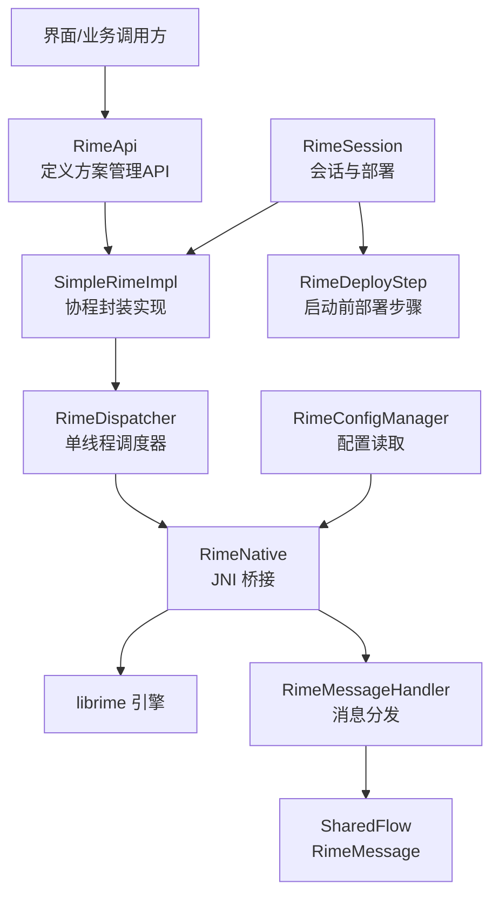
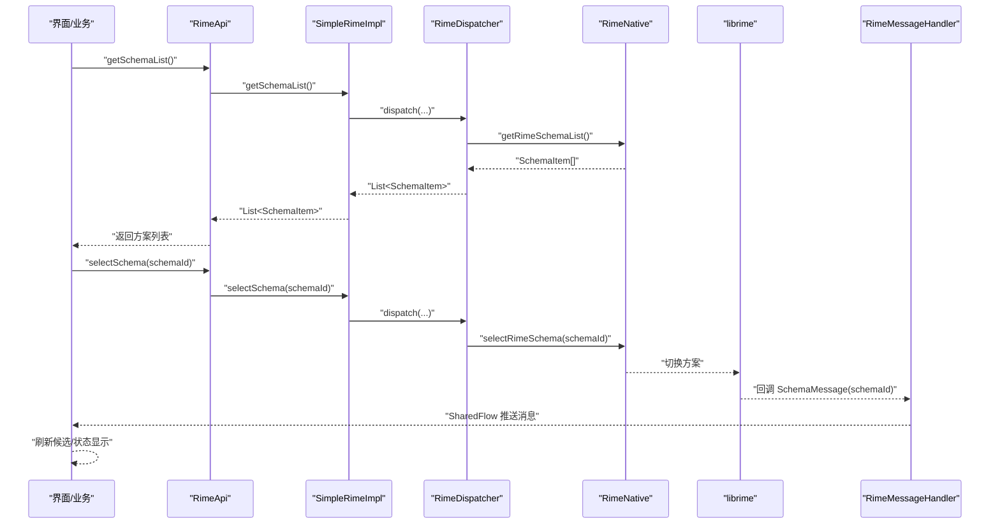
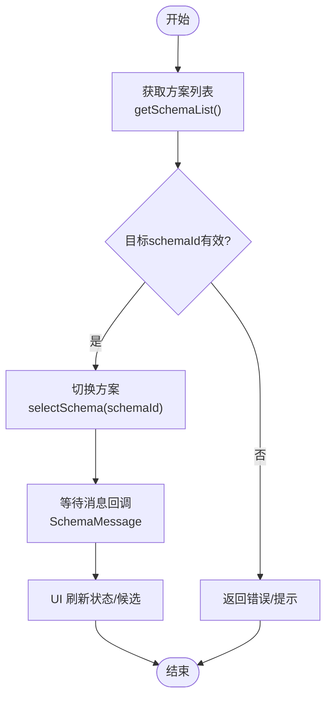
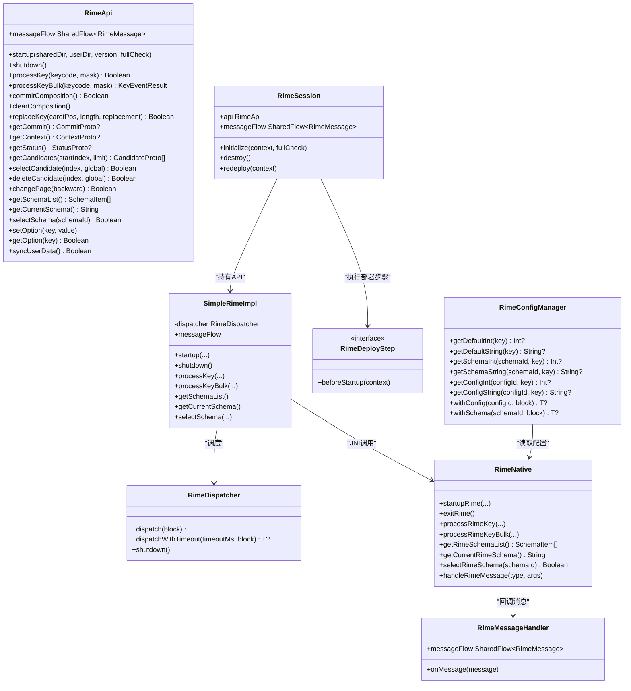

# 输入方案切换机制

<cite>
**本文引用的文件**   
- [RimeApi.kt](file://app/src/main/java/com/ziyou/ime/core/RimeApi.kt)
- [SimpleRimeImpl.kt](file://app/src/main/java/com/ziyou/ime/core/SimpleRimeImpl.kt)
- [RimeDispatcher.kt](file://app/src/main/java/com/ziyou/ime/core/RimeDispatcher.kt)
- [RimeNative.kt](file://app/src/main/java/com/ziyou/ime/core/RimeNative.kt)
- [RimeMessage.kt](file://app/src/main/java/com/ziyou/ime/core/RimeMessage.kt)
- [RimeSession.kt](file://app/src/main/java/com/ziyou/ime/daemon/RimeSession.kt)
- [RimeDeployStep.kt](file://app/src/main/java/com/ziyou/ime/daemon/RimeDeployStep.kt)
- [RimeConfigManager.kt](file://app/src/main/java/com/ziyou/ime/config/RimeConfigManager.kt)
</cite>

## 目录
1. [简介](#简介)
2. [项目结构](#项目结构)
3. [核心组件](#核心组件)
4. [架构总览](#架构总览)
5. [详细组件分析](#详细组件分析)
6. [依赖关系分析](#依赖关系分析)
7. [性能考虑](#性能考虑)
8. [故障排查指南](#故障排查指南)
9. [结论](#结论)
10. [附录：UI实现与扩展指南](#附录ui实现与扩展指南)

## 简介
本文件围绕“输入方案切换机制”进行系统化说明，覆盖触发条件、切换流程、状态同步、API使用（getSchemaList、selectSchema）、动态加载与热切换、性能优化策略、不同方案的状态隔离与兼容性处理，以及扩展新输入方案的完整指南。文档面向开发者与产品工程师，力求在保持技术深度的同时提供可操作的实践建议。

## 项目结构
输入方案切换涉及 Kotlin 层 API 抽象、单线程调度器、JNI 桥接、消息分发与会话生命周期管理。关键文件分布如下：
- 接口与实现：RimeApi、SimpleRimeImpl
- 线程安全调度：RimeDispatcher
- JNI 桥接：RimeNative
- 消息流：RimeMessage、RimeMessageHandler
- 会话与部署：RimeSession、RimeDeployStep
- 配置读取：RimeConfigManager

图表来源 
- [RimeApi.kt:10-105](file://app/src/main/java/com/ziyou/ime/core/RimeApi.kt#L10-L105)
- [SimpleRimeImpl.kt:10-177](file://app/src/main/java/com/ziyou/ime/core/SimpleRimeImpl.kt#L10-L177)
- [RimeDispatcher.kt:22-91](file://app/src/main/java/com/ziyou/ime/core/RimeDispatcher.kt#L22-L91)
- [RimeNative.kt:10-170](file://app/src/main/java/com/ziyou/ime/core/RimeNative.kt#L10-L170)
- [RimeMessage.kt:11-42](file://app/src/main/java/com/ziyou/ime/core/RimeMessage.kt#L11-L42)
- [RimeSession.kt:38-226](file://app/src/main/java/com/ziyou/ime/daemon/RimeSession.kt#L38-L226)
- [RimeDeployStep.kt:15-20](file://app/src/main/java/com/ziyou/ime/daemon/RimeDeployStep.kt#L15-L20)
- [RimeConfigManager.kt:24-200](file://app/src/main/java/com/ziyou/ime/config/RimeConfigManager.kt#L24-L200)

章节来源
- [RimeApi.kt:10-105](file://app/src/main/java/com/ziyou/ime/core/RimeApi.kt#L10-L105)
- [SimpleRimeImpl.kt:10-177](file://app/src/main/java/com/ziyou/ime/core/SimpleRimeImpl.kt#L10-L177)
- [RimeDispatcher.kt:22-91](file://app/src/main/java/com/ziyou/ime/core/RimeDispatcher.kt#L22-L91)
- [RimeNative.kt:10-170](file://app/src/main/java/com/ziyou/ime/core/RimeNative.kt#L10-L170)
- [RimeMessage.kt:11-42](file://app/src/main/java/com/ziyou/ime/core/RimeMessage.kt#L11-L42)
- [RimeSession.kt:38-226](file://app/src/main/java/com/ziyou/ime/daemon/RimeSession.kt#L38-L226)
- [RimeDeployStep.kt:15-20](file://app/src/main/java/com/ziyou/ime/daemon/RimeDeployStep.kt#L15-L20)
- [RimeConfigManager.kt:24-200](file://app/src/main/java/com/ziyou/ime/config/RimeConfigManager.kt#L24-L200)

## 核心组件
- RimeApi：定义输入与方案管理的统一接口，包括 getSchemaList、getCurrentSchema、selectSchema 等。
- SimpleRimeImpl：基于协程的轻量实现，将操作调度到 RimeDispatcher 的单线程执行。
- RimeDispatcher：保证 librime 非线程安全的约束，所有 native 调用串行化。
- RimeNative：JNI 声明，暴露 librime 能力（如 schema 列表、当前方案、切换方案）。
- RimeMessage：事件模型（schema/option/deploy），通过 SharedFlow 广播。
- RimeSession：会话生命周期管理（初始化、销毁、重新部署），协调部署步骤与引擎启动。
- RimeDeployStep：启动前部署步骤抽象，支持资源部署与词库注入。
- RimeConfigManager：便捷读取默认/用户/方案配置项，辅助 UI 展示与校验。

章节来源
- [RimeApi.kt:10-105](file://app/src/main/java/com/ziyou/ime/core/RimeApi.kt#L10-L105)
- [SimpleRimeImpl.kt:10-177](file://app/src/main/java/com/ziyou/ime/core/SimpleRimeImpl.kt#L10-L177)
- [RimeDispatcher.kt:22-91](file://app/src/main/java/com/ziyou/ime/core/RimeDispatcher.kt#L22-L91)
- [RimeNative.kt:10-170](file://app/src/main/java/com/ziyou/ime/core/RimeNative.kt#L10-L170)
- [RimeMessage.kt:11-42](file://app/src/main/java/com/ziyou/ime/core/RimeMessage.kt#L11-L42)
- [RimeSession.kt:38-226](file://app/src/main/java/com/ziyou/ime/daemon/RimeSession.kt#L38-L226)
- [RimeDeployStep.kt:15-20](file://app/src/main/java/com/ziyou/ime/daemon/RimeDeployStep.kt#L15-L20)
- [RimeConfigManager.kt:24-200](file://app/src/main/java/com/ziyou/ime/config/RimeConfigManager.kt#L24-L200)

## 架构总览
输入方案切换的整体路径为：UI/业务调用 RimeApi → SimpleRimeImpl → RimeDispatcher → RimeNative → librime；切换完成后由 JNI 回调触发 RimeMessageHandler，通过 SharedFlow 通知 UI 更新。

图表来源 
- [RimeApi.kt:78-86](file://app/src/main/java/com/ziyou/ime/core/RimeApi.kt#L78-L86)
- [SimpleRimeImpl.kt:132-148](file://app/src/main/java/com/ziyou/ime/core/SimpleRimeImpl.kt#L132-L148)
- [RimeNative.kt:123-134](file://app/src/main/java/com/ziyou/ime/core/RimeNative.kt#L123-L134)
- [RimeMessage.kt:11-42](file://app/src/main/java/com/ziyou/ime/core/RimeMessage.kt#L11-L42)

## 详细组件分析

### 方案切换触发条件
- 用户主动选择：从方案列表中选择目标 schemaId。
- 系统或设置变更：通过选项（option）或部署（deploy）事件间接影响。
- 运行时校验：目标 schemaId 必须存在于 getSchemaList() 返回的列表中。

章节来源
- [RimeApi.kt:78-86](file://app/src/main/java/com/ziyou/ime/core/RimeApi.kt#L78-L86)
- [RimeMessage.kt:11-42](file://app/src/main/java/com/ziyou/ime/core/RimeMessage.kt#L11-L42)

### 切换流程
- 获取方案列表：调用 getSchemaList()，底层通过 RimeNative.getRimeSchemaList() 获取。
- 切换方案：调用 selectSchema(schemaId)，底层通过 RimeNative.selectRimeSchema(schemaId) 执行。
- 状态同步：JNI 回调触发 RimeMessage.SchemaMessage，UI 订阅 messageFlow 并刷新。

图表来源 
- [RimeApi.kt:78-86](file://app/src/main/java/com/ziyou/ime/core/RimeApi.kt#L78-L86)
- [SimpleRimeImpl.kt:132-148](file://app/src/main/java/com/ziyou/ime/core/SimpleRimeImpl.kt#L132-L148)
- [RimeNative.kt:123-134](file://app/src/main/java/com/ziyou/ime/core/RimeNative.kt#L123-L134)
- [RimeMessage.kt:11-42](file://app/src/main/java/com/ziyou/ime/core/RimeMessage.kt#L11-L42)

### 状态同步机制
- 消息类型：SchemaMessage（方案切换）、OptionMessage（选项变更）、DeployMessage（部署状态）。
- 分发方式：RimeMessageHandler 维护 MutableSharedFlow，对外暴露 SharedFlow 供 UI 订阅。
- 订阅位置：UI 层监听 messageFlow，收到 SchemaMessage 后刷新候选区与状态栏。

章节来源
- [RimeMessage.kt:11-42](file://app/src/main/java/com/ziyou/ime/core/RimeMessage.kt#L11-L42)
- [RimeApi.kt:102-104](file://app/src/main/java/com/ziyou/ime/core/RimeApi.kt#L102-L104)

### API 使用方法与最佳实践
- getSchemaList()
  - 用途：获取可用方案列表，用于构建 UI 列表。
  - 注意：应在 UI 主线程调用（协程自动调度），避免重复频繁请求，可缓存结果并在部署后刷新。
- getCurrentSchema()
  - 用途：获取当前活跃方案ID，用于高亮选中项。
- selectSchema(schemaId)
  - 用途：切换到指定方案。
  - 注意：确保 schemaId 来自 getSchemaList()；切换后监听 messageFlow 以确认生效。
- messageFlow
  - 用途：订阅 RimeMessage，响应方案/选项/部署变化。
  - 注意：在 Activity/Fragment 生命周期内订阅，避免内存泄漏。

章节来源
- [RimeApi.kt:78-104](file://app/src/main/java/com/ziyou/ime/core/RimeApi.kt#L78-L104)
- [SimpleRimeImpl.kt:132-148](file://app/src/main/java/com/ziyou/ime/core/SimpleRimeImpl.kt#L132-L148)
- [RimeMessage.kt:11-42](file://app/src/main/java/com/ziyou/ime/core/RimeMessage.kt#L11-L42)

### 动态加载与热切换
- 动态加载：通过 RimeSession.redeploy(context) 重新部署（关闭→执行部署步骤→重启），适用于词库/资源变更后。
- 热切换：selectSchema(schemaId) 直接切换，无需重启引擎；切换后通过消息流同步状态。
- 部署步骤：RimeDeployStep.beforeStartup(context) 在 IO 线程执行，适合复制 assets、生成主词库等耗时操作。

章节来源
- [RimeSession.kt:189-198](file://app/src/main/java/com/ziyou/ime/daemon/RimeSession.kt#L189-L198)
- [RimeDeployStep.kt:15-20](file://app/src/main/java/com/ziyou/ime/daemon/RimeDeployStep.kt#L15-L20)
- [RimeApi.kt:78-86](file://app/src/main/java/com/ziyou/ime/core/RimeApi.kt#L78-L86)

### 性能优化策略
- 批量按键处理：processKeyBulk 合并 processKey + getCommit + getContext，减少 JNI 跨界次数。
- 单线程调度：RimeDispatcher 保证顺序执行，避免竞争与锁开销。
- 内存回收：RimeNative.trimNativeHeap() 在部署完成或内存紧张时归还空闲页，降低常驻占用。
- 超时保护：initialize/redeploy 使用超时控制，避免长时间阻塞。

章节来源
- [RimeApi.kt:32-40](file://app/src/main/java/com/ziyou/ime/core/RimeApi.kt#L32-L40)
- [RimeDispatcher.kt:22-91](file://app/src/main/java/com/ziyou/ime/core/RimeDispatcher.kt#L22-L91)
- [RimeNative.kt:52-58](file://app/src/main/java/com/ziyou/ime/core/RimeNative.kt#L52-L58)
- [RimeSession.kt:134-152](file://app/src/main/java/com/ziyou/ime/daemon/RimeSession.kt#L134-L152)

### 不同方案间的状态隔离与兼容性
- 状态隔离：每个 schema 拥有独立上下文与候选集；切换后通过消息流刷新 UI。
- 兼容性处理：
  - 校验 schemaId 有效性（来自 getSchemaList）。
  - 使用 RimeConfigManager 读取方案配置（名称、键位映射等）以适配 UI。
  - 对旧版本 schema 做降级兼容（如缺失字段时回退默认值）。

章节来源
- [RimeApi.kt:78-86](file://app/src/main/java/com/ziyou/ime/core/RimeApi.kt#L78-L86)
- [RimeConfigManager.kt:47-85](file://app/src/main/java/com/ziyou/ime/config/RimeConfigManager.kt#L47-L85)
- [RimeMessage.kt:11-42](file://app/src/main/java/com/ziyou/ime/core/RimeMessage.kt#L11-L42)

## 依赖关系分析
- SimpleRimeImpl 依赖 RimeDispatcher 与 RimeNative。
- RimeSession 依赖 SimpleRimeImpl 与 RimeDeployStep。
- RimeMessageHandler 被 RimeNative 回调驱动，向 UI 广播消息。
- RimeConfigManager 依赖 RimeConfig（JNI 配置读写），用于读取默认/用户/方案配置。

图表来源 
- [RimeApi.kt:10-105](file://app/src/main/java/com/ziyou/ime/core/RimeApi.kt#L10-L105)
- [SimpleRimeImpl.kt:10-177](file://app/src/main/java/com/ziyou/ime/core/SimpleRimeImpl.kt#L10-L177)
- [RimeDispatcher.kt:22-91](file://app/src/main/java/com/ziyou/ime/core/RimeDispatcher.kt#L22-L91)
- [RimeNative.kt:10-170](file://app/src/main/java/com/ziyou/ime/core/RimeNative.kt#L10-L170)
- [RimeMessage.kt:11-42](file://app/src/main/java/com/ziyou/ime/core/RimeMessage.kt#L11-L42)
- [RimeSession.kt:38-226](file://app/src/main/java/com/ziyou/ime/daemon/RimeSession.kt#L38-L226)
- [RimeDeployStep.kt:15-20](file://app/src/main/java/com/ziyou/ime/daemon/RimeDeployStep.kt#L15-L20)
- [RimeConfigManager.kt:24-200](file://app/src/main/java/com/ziyou/ime/config/RimeConfigManager.kt#L24-L200)

## 性能考虑
- 热路径优化：优先使用 processKeyBulk 减少 JNI 跨界与线程切换。
- 并发控制：所有 librime 调用经 RimeDispatcher 串行执行，避免锁竞争。
- 内存管理：部署完成后调用 trimNativeHeap 释放临时分配，降低常驻内存。
- 超时与容错：initialize/redeploy 设置超时，防止长时间阻塞导致 ANR。

[本节为通用指导，不直接分析具体文件]

## 故障排查指南
- 常见问题
  - rime_jni 未加载：检查 ABI 匹配与 .so 文件是否存在。
  - 切换无效：确认 schemaId 是否在 getSchemaList() 中；监听 messageFlow 确认回调。
  - 启动超时：检查词典/配置文件完整性，或降低 fullCheck。
- 定位方法
  - 查看日志：RimeDispatcher、RimeNative、RimeSession 的日志输出。
  - 订阅消息：观察 RimeMessage 类型与参数，确认切换/部署状态。
  - 配置读取：使用 RimeConfigManager 验证默认/用户/方案配置项。

章节来源
- [RimeNative.kt:18-27](file://app/src/main/java/com/ziyou/ime/core/RimeNative.kt#L18-L27)
- [RimeSession.kt:134-152](file://app/src/main/java/com/ziyou/ime/daemon/RimeSession.kt#L134-L152)
- [RimeMessage.kt:11-42](file://app/src/main/java/com/ziyou/ime/core/RimeMessage.kt#L11-L42)
- [RimeConfigManager.kt:24-200](file://app/src/main/java/com/ziyou/ime/config/RimeConfigManager.kt#L24-L200)

## 结论
输入方案切换机制通过清晰的 API 抽象、严格的单线程调度、可靠的 JNI 桥接与消息流同步，实现了高效、稳定的热切换体验。结合部署步骤与配置读取，可在不重启引擎的前提下完成资源更新与方案切换。遵循本文的最佳实践与性能优化策略，可为用户提供流畅的输入法体验。

[本节为总结性内容，不直接分析具体文件]

## 附录：UI实现与扩展指南

### UI 实现要点
- 方案列表展示
  - 调用 getSchemaList() 获取列表，缓存并在部署后刷新。
  - 使用 getCurrentSchema() 高亮当前方案。
- 切换交互
  - 用户点击后调用 selectSchema(schemaId)。
  - 订阅 messageFlow，收到 SchemaMessage 后刷新候选区与状态栏。
- 配置读取
  - 使用 RimeConfigManager.getSchemaString/getSchemaInt 读取方案名称、键位映射等，用于 UI 文案与布局。

章节来源
- [RimeApi.kt:78-86](file://app/src/main/java/com/ziyou/ime/core/RimeApi.kt#L78-L86)
- [RimeMessage.kt:11-42](file://app/src/main/java/com/ziyou/ime/core/RimeMessage.kt#L11-L42)
- [RimeConfigManager.kt:47-85](file://app/src/main/java/com/ziyou/ime/config/RimeConfigManager.kt#L47-L85)

### 扩展新输入方案
- 新增 schema 配置
  - 在 assets/rime 下添加 schema.yaml/dict.yaml 等配置文件。
  - 通过 RimeDeployStep.beforeStartup(context) 在启动前部署资源。
- 注册部署步骤
  - 在组合根装配 deploySteps，确保资源复制与词库生成按序执行。
- 验证与测试
  - 调用 getSchemaList() 确认新方案可见。
  - 调用 selectSchema(newSchemaId) 验证切换与消息回调。
  - 使用 RimeConfigManager 读取配置项验证 UI 展示。

章节来源
- [RimeDeployStep.kt:15-20](file://app/src/main/java/com/ziyou/ime/daemon/RimeDeployStep.kt#L15-L20)
- [RimeSession.kt:189-198](file://app/src/main/java/com/ziyou/ime/daemon/RimeSession.kt#L189-L198)
- [RimeApi.kt:78-86](file://app/src/main/java/com/ziyou/ime/core/RimeApi.kt#L78-L86)
- [RimeConfigManager.kt:47-85](file://app/src/main/java/com/ziyou/ime/config/RimeConfigManager.kt#L47-L85)