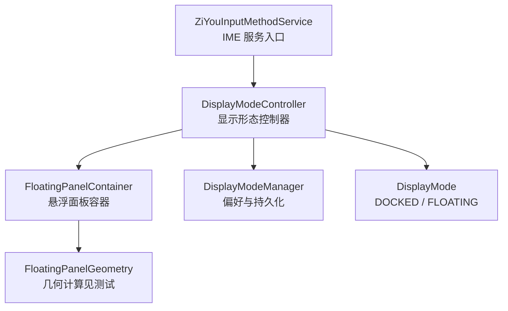
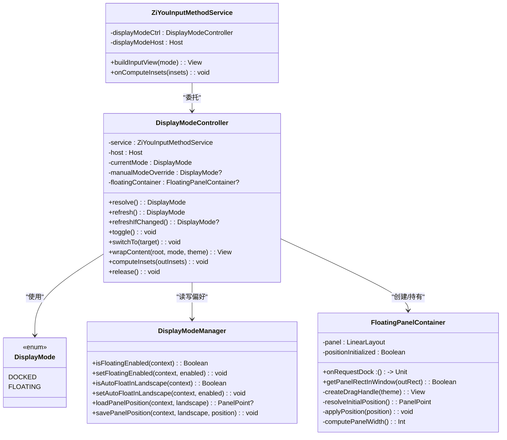
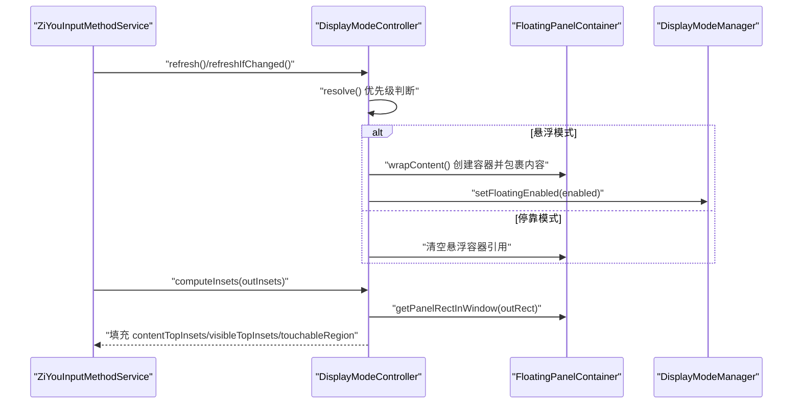
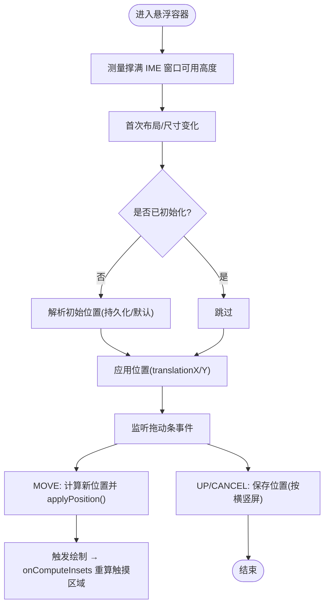
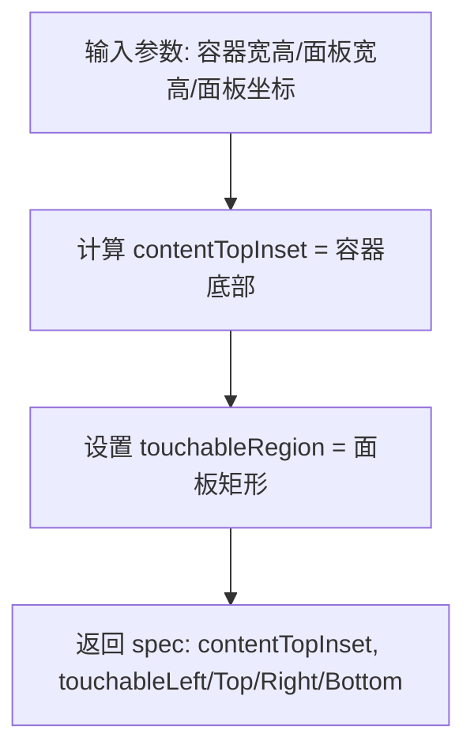
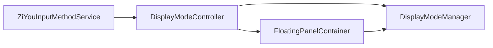

# 悬浮键盘形态

<cite>
**本文引用的文件**   
- [FloatingPanelContainer.kt](file://app/src/main/java/com/ziyou/ime/ime/FloatingPanelContainer.kt)
- [DisplayModeController.kt](file://app/src/main/java/com/ziyou/ime/ime/DisplayModeController.kt)
- [DisplayMode.kt](file://app/src/main/java/com/ziyou/ime/ime/DisplayMode.kt)
- [DisplayModeManager.kt](file://app/src/main/java/com/ziyou/ime/config/DisplayModeManager.kt)
- [ZiYouInputMethodService.kt](file://app/src/main/java/com/ziyou/ime/ime/ZiYouInputMethodService.kt)
- [FloatingPanelGeometryTest.kt](file://core-logic/src/test/java/com/ziyou/ime/core/floating/FloatingPanelGeometryTest.kt)
</cite>

## 目录
1. [简介](#简介)
2. [项目结构](#项目结构)
3. [核心组件](#核心组件)
4. [架构总览](#架构总览)
5. [详细组件分析](#详细组件分析)
6. [依赖关系分析](#依赖关系分析)
7. [性能考量](#性能考量)
8. [故障排查指南](#故障排查指南)
9. [结论](#结论)
10. [附录：配置与扩展点](#附录：配置与扩展点)

## 简介
本文件面向字由输入法的“悬浮键盘”形态，系统性阐述停靠模式与悬浮模式的切换机制、显示优先级判断、横屏自动悬浮逻辑；深入解释悬浮窗口的几何计算、触摸区域裁剪、窗口 insets 处理；说明拖拽交互、位置持久化、停靠按钮功能；并给出与宿主应用的集成策略（全屏模式禁用、画面遮挡处理）以及自定义配置项与扩展点，帮助开发者理解移动端输入法高级形态的实现方式。

## 项目结构
围绕悬浮键盘的核心代码主要分布在 ime 层与 config 层，几何计算逻辑通过测试用例体现其纯函数特性，便于单测与复用。

**图表来源** 
- [ZiYouInputMethodService.kt](file://app/src/main/java/com/ziyou/ime/ime/ZiYouInputMethodService.kt)
- [DisplayModeController.kt](file://app/src/main/java/com/ziyou/ime/ime/DisplayModeController.kt)
- [FloatingPanelContainer.kt](file://app/src/main/java/com/ziyou/ime/ime/FloatingPanelContainer.kt)
- [DisplayModeManager.kt](file://app/src/main/java/com/ziyou/ime/config/DisplayModeManager.kt)
- [DisplayMode.kt](file://app/src/main/java/com/ziyou/ime/ime/DisplayMode.kt)
- [FloatingPanelGeometryTest.kt](file://core-logic/src/test/java/com/ziyou/ime/core/floating/FloatingPanelGeometryTest.kt)

**章节来源**
- [ZiYouInputMethodService.kt](file://app/src/main/java/com/ziyou/ime/ime/ZiYouInputMethodService.kt)
- [DisplayModeController.kt](file://app/src/main/java/com/ziyou/ime/ime/DisplayModeController.kt)
- [FloatingPanelContainer.kt](file://app/src/main/java/com/ziyou/ime/ime/FloatingPanelContainer.kt)
- [DisplayModeManager.kt](file://app/src/main/java/com/ziyou/ime/config/DisplayModeManager.kt)
- [DisplayMode.kt](file://app/src/main/java/com/ziyou/ime/ime/DisplayMode.kt)
- [FloatingPanelGeometryTest.kt](file://core-logic/src/test/java/com/ziyou/ime/core/floating/FloatingPanelGeometryTest.kt)

## 核心组件
- DisplayMode：定义停靠与悬浮两种显示形态，与键盘布局正交。
- DisplayModeManager：管理悬浮开关、横屏自动悬浮、面板位置等用户偏好。
- DisplayModeController：解析当前形态、执行切换、包裹内容视图、计算悬浮 insets。
- FloatingPanelContainer：悬浮面板根容器，负责宽度计算、拖拽移动、位置持久化、停靠按钮回调。
- ZiYouInputMethodService：IME 服务主类，装配视图、协调各面板、委托 DisplayModeController 完成形态相关逻辑。

**章节来源**
- [DisplayMode.kt](file://app/src/main/java/com/ziyou/ime/ime/DisplayMode.kt)
- [DisplayModeManager.kt](file://app/src/main/java/com/ziyou/ime/config/DisplayModeManager.kt)
- [DisplayModeController.kt](file://app/src/main/java/com/ziyou/ime/ime/DisplayModeController.kt)
- [FloatingPanelContainer.kt](file://app/src/main/java/com/ziyou/ime/ime/FloatingPanelContainer.kt)
- [ZiYouInputMethodService.kt](file://app/src/main/java/com/ziyou/ime/ime/ZiYouInputMethodService.kt)

## 架构总览
悬浮键盘的架构以“显示形态控制器”为中心，将“形态解析/切换/insets 计算”从 IME 服务中解耦，悬浮面板容器仅关注 UI 与交互，几何计算下沉为纯函数（由测试覆盖）。

**图表来源** 
- [DisplayMode.kt](file://app/src/main/java/com/ziyou/ime/ime/DisplayMode.kt)
- [DisplayModeManager.kt](file://app/src/main/java/com/ziyou/ime/config/DisplayModeManager.kt)
- [DisplayModeController.kt](file://app/src/main/java/com/ziyou/ime/ime/DisplayModeController.kt)
- [FloatingPanelContainer.kt](file://app/src/main/java/com/ziyou/ime/ime/FloatingPanelContainer.kt)
- [ZiYouInputMethodService.kt](file://app/src/main/java/com/ziyou/ime/ime/ZiYouInputMethodService.kt)

## 详细组件分析

### 显示形态控制器（DisplayModeController）
- 形态优先级：手动覆盖（本次服务生命周期内） > 悬浮总开关 > 横屏自动悬浮。
- 入口方法：
  - refresh()：解析并生效当前形态。
  - refreshIfChanged()：在 onStartInputView 时重新解析，若变化则返回新形态供调用方重建视图。
  - toggle()：悬浮↔停靠互切。
  - switchTo(target)：切换前清理临时状态，持久化开关，重建视图并重同步引擎状态。
- 视图包裹：wrapContent() 在悬浮模式下用 FloatingPanelContainer 包裹原内容根，停靠模式直接返回原根。
- insets 计算：computeInsets() 仅在悬浮模式生效，设置 contentTopInsets/visibleTopInsets 压到容器底部，使宿主应用认为键盘高度为 0；touchableInsets 设为区域模式，touchableRegion 裁剪为面板矩形，面板外触摸穿透给下层应用。

**图表来源** 
- [DisplayModeController.kt](file://app/src/main/java/com/ziyou/ime/ime/DisplayModeController.kt)
- [FloatingPanelContainer.kt](file://app/src/main/java/com/ziyou/ime/ime/FloatingPanelContainer.kt)
- [DisplayModeManager.kt](file://app/src/main/java/com/ziyou/ime/config/DisplayModeManager.kt)

**章节来源**
- [DisplayModeController.kt](file://app/src/main/java/com/ziyou/ime/ime/DisplayModeController.kt)

### 悬浮面板容器（FloatingPanelContainer）
- 职责：
  - 面板宽度计算与摆放（委托几何计算）。
  - 拖动条拖拽移动，逐帧边界钳制，松手后按屏幕方向持久化位置。
  - 使用 translationX/Y 位移实现拖动，零 relayout，保持 60fps；位移触发的绘制遍历让系统重新回调 onComputeInsets，触摸区域随面板实时同步。
  - 暴露 getPanelRectInWindow() 供 Service 的 onComputeInsets 裁剪触摸区域。
- 初始位置：首次 layout 或转屏后恢复持久化位置或默认右下角位置，并钳制到容器内。
- 停靠按钮：点击触发 onRequestDock 回调，请求退出悬浮模式（切换回 DOCKED）。

**图表来源** 
- [FloatingPanelContainer.kt](file://app/src/main/java/com/ziyou/ime/ime/FloatingPanelContainer.kt)

**章节来源**
- [FloatingPanelContainer.kt](file://app/src/main/java/com/ziyou/ime/ime/FloatingPanelContainer.kt)

### 几何计算与 insets（FloatingPanelGeometry）
- 面板宽度：按比例计算并落在最小/最大 dp 范围内，不超过容器宽度。
- 位置钳制：clampPosition() 保证面板始终位于容器可视区内。
- 默认位置：defaultPosition() 将面板置于右下角并内缩 margin。
- 拖拽位移：dragPosition() 根据手指位移计算新位置并逐帧钳制。
- insets 计算：computeInsets() 将内容 inset 压到容器底部（宿主视键盘高度为 0），touchableRegion 等于面板矩形，面板外触摸穿透。

**图表来源** 
- [FloatingPanelGeometryTest.kt](file://core-logic/src/test/java/com/ziyou/ime/core/floating/FloatingPanelGeometryTest.kt)

**章节来源**
- [FloatingPanelGeometryTest.kt](file://core-logic/src/test/java/com/ziyou/ime/core/floating/FloatingPanelGeometryTest.kt)

### 显示形态枚举（DisplayMode）
- DOCKED：停靠形态，键盘停靠屏幕底部、横跨全宽。
- FLOATING：悬浮形态，小面板悬浮于应用之上，可拖拽、面板外触摸穿透。

**章节来源**
- [DisplayMode.kt](file://app/src/main/java/com/ziyou/ime/ime/DisplayMode.kt)

### IME 服务集成（ZiYouInputMethodService）
- 通过 DisplayModeController.Host 接口提供切换前后能力：
  - beforeModeSwitch()：重置输入状态，丢弃未提交的多击预览等临时输入。
  - onModeSwitched(mode)：重建输入视图并调度引擎状态同步。
- buildInputView() 末尾调用 wrapContent() 包裹内容；onComputeInsets() 委托 computeInsets() 计算悬浮 insets。
- 与皮肤/面板协调器协作，确保形态切换后 UI 与引擎状态一致。

**章节来源**
- [ZiYouInputMethodService.kt](file://app/src/main/java/com/ziyou/ime/ime/ZiYouInputMethodService.kt)

## 依赖关系分析
- DisplayModeController 依赖 DisplayModeManager 读取/写入用户偏好，依赖 FloatingPanelContainer 进行悬浮 UI 组装与交互。
- FloatingPanelContainer 依赖 DisplayModeManager 进行位置持久化，依赖几何计算（由测试覆盖）进行宽度与位置计算。
- ZiYouInputMethodService 作为宿主，集中编排视图构建与状态同步，将形态相关逻辑委托给 DisplayModeController。

**图表来源** 
- [ZiYouInputMethodService.kt](file://app/src/main/java/com/ziyou/ime/ime/ZiYouInputMethodService.kt)
- [DisplayModeController.kt](file://app/src/main/java/com/ziyou/ime/ime/DisplayModeController.kt)
- [DisplayModeManager.kt](file://app/src/main/java/com/ziyou/ime/config/DisplayModeManager.kt)
- [FloatingPanelContainer.kt](file://app/src/main/java/com/ziyou/ime/ime/FloatingPanelContainer.kt)

**章节来源**
- [ZiYouInputMethodService.kt](file://app/src/main/java/com/ziyou/ime/ime/ZiYouInputMethodService.kt)
- [DisplayModeController.kt](file://app/src/main/java/com/ziyou/ime/ime/DisplayModeController.kt)
- [DisplayModeManager.kt](file://app/src/main/java/com/ziyou/ime/config/DisplayModeManager.kt)
- [FloatingPanelContainer.kt](file://app/src/main/java/com/ziyou/ime/ime/FloatingPanelContainer.kt)

## 性能考量
- 使用 translationX/Y 位移实现拖拽，避免 relayout，减少绘制开销，维持 60fps。
- 面板背景半透明降低对游戏画面的遮挡感，提升沉浸体验。
- 几何计算为纯函数，无 IO 与复杂分支，易于单测与优化。
- 位置持久化采用 SharedPreferences，轻量且跨会话记忆。

[本节为通用指导，不直接分析具体文件]

## 故障排查指南
- 触摸区域异常：检查 FloatingPanelContainer.getPanelRectInWindow() 是否在面板布局完成后调用；确认 computeInsets() 正确设置 TOUCHABLE_INSETS_REGION 与 touchableRegion。
- 面板越界：验证 clampPosition() 与 dragPosition() 的边界钳制逻辑；确认容器宽高与面板宽高参数传递正确。
- 横屏自动悬浮未生效：检查 isAutoFloatInLandscape() 与 isFloatingEnabled() 的开关状态；确认 resolve() 优先级顺序。
- 位置丢失：确认 savePanelPosition() 在 ACTION_UP/ACTION_CANCEL 时被调用；检查横竖屏键名区分是否正确。
- 悬浮模式无法退出：核对「停靠」按钮 onClick 是否触发 switchTo(DOCKED)，以及 beforeModeSwitch() 是否清理了临时输入状态。

**章节来源**
- [FloatingPanelContainer.kt](file://app/src/main/java/com/ziyou/ime/ime/FloatingPanelContainer.kt)
- [DisplayModeController.kt](file://app/src/main/java/com/ziyou/ime/ime/DisplayModeController.kt)
- [DisplayModeManager.kt](file://app/src/main/java/com/ziyou/ime/config/DisplayModeManager.kt)

## 结论
悬浮键盘形态通过清晰的职责拆分与纯几何计算，实现了高流畅度、低侵入的悬浮输入体验。显示优先级明确、横屏自动悬浮可控、触摸区域精准裁剪、位置持久化可靠，配合 IME 服务的统一编排，既满足游戏场景需求，又保持与宿主应用的无缝集成。开发者可基于现有扩展点快速定制外观与行为。

[本节为总结性内容，不直接分析具体文件]

## 附录：配置与扩展点
- 悬浮模式总开关：isFloatingEnabled()/setFloatingEnabled()
- 横屏自动悬浮：isAutoFloatInLandscape()/setAutoFloatInLandscape()
- 面板位置：loadPanelPosition()/savePanelPosition()（横/竖屏独立）
- 面板缩放因子：FLOATING_SCALE（首版固定档位，预留扩展）
- 面板宽度比例与范围：PANEL_WIDTH_RATIO、PANEL_MIN_WIDTH_DP、PANEL_MAX_WIDTH_DP
- 默认边缘内缩：PANEL_EDGE_MARGIN_DP
- 扩展点：
  - DisplayModeController.Host：切换前后钩子，用于清理与重建视图。
  - FloatingPanelContainer.onRequestDock：停靠按钮回调，支持自定义退出逻辑。
  - 几何计算：可替换 panelWidth/clampPosition/defaultPosition/dragPosition/computeInsets 的实现以适配不同设备与样式。

**章节来源**
- [DisplayModeManager.kt](file://app/src/main/java/com/ziyou/ime/config/DisplayModeManager.kt)
- [DisplayModeController.kt](file://app/src/main/java/com/ziyou/ime/ime/DisplayModeController.kt)
- [FloatingPanelContainer.kt](file://app/src/main/java/com/ziyou/ime/ime/FloatingPanelContainer.kt)
- [FloatingPanelGeometryTest.kt](file://core-logic/src/test/java/com/ziyou/ime/core/floating/FloatingPanelGeometryTest.kt)