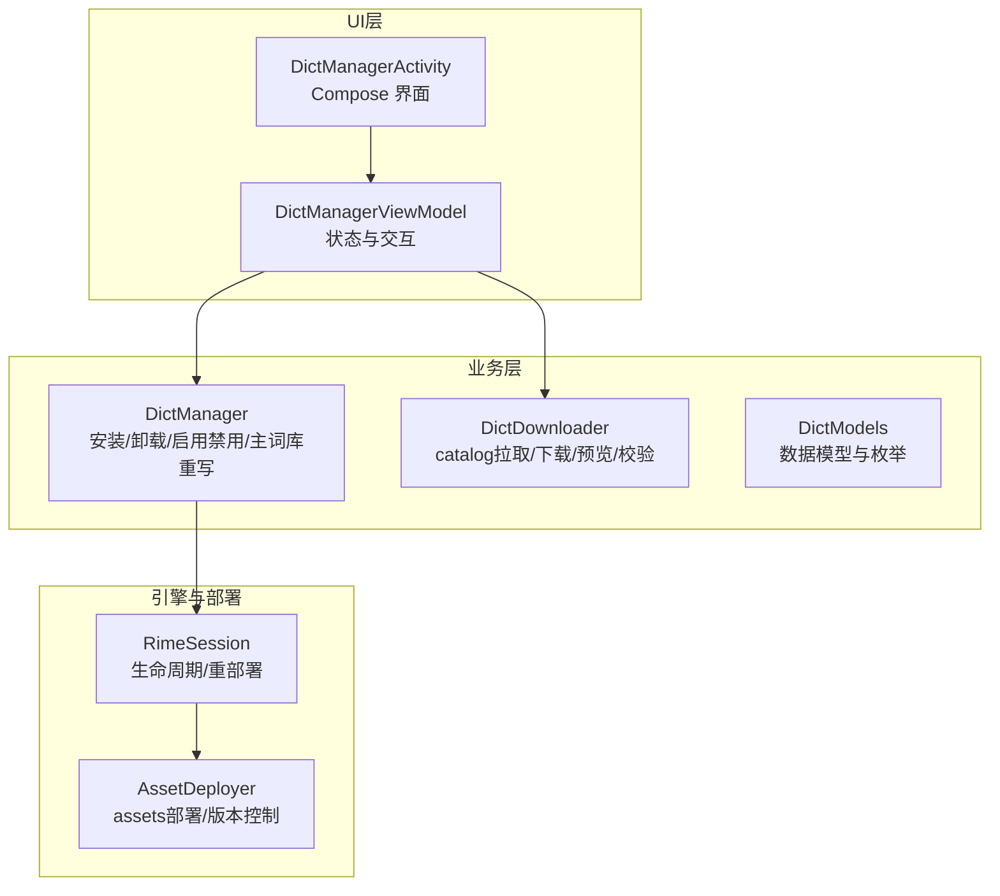
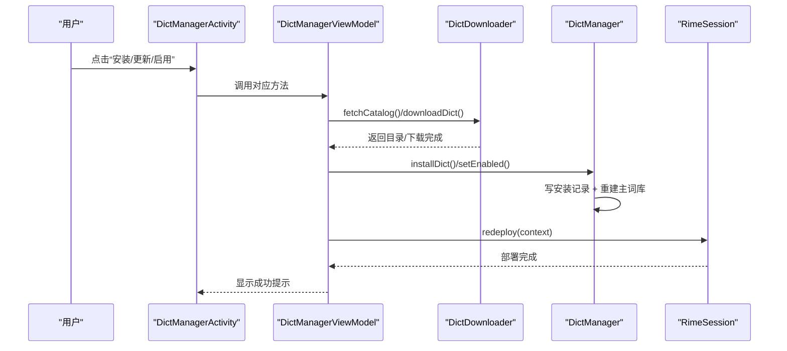
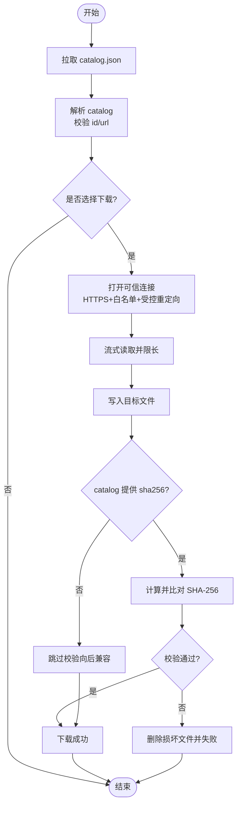
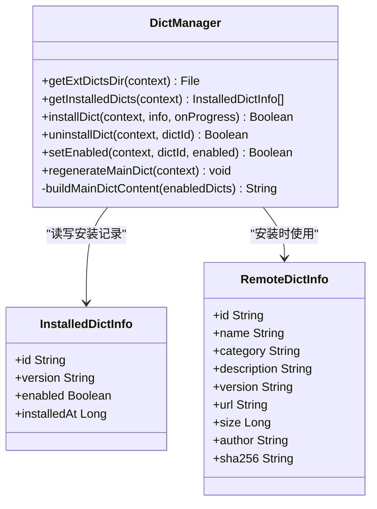
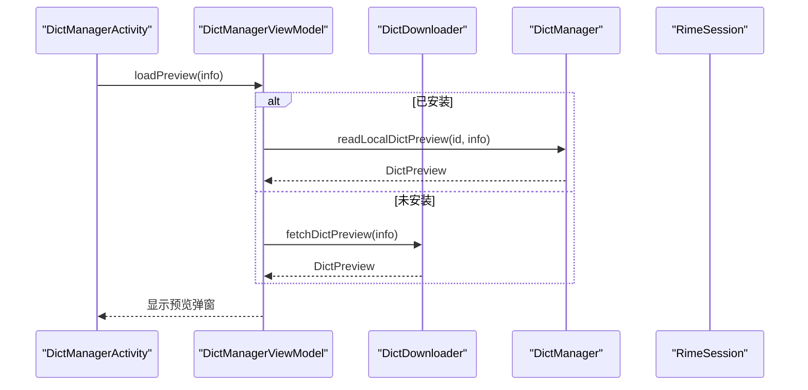
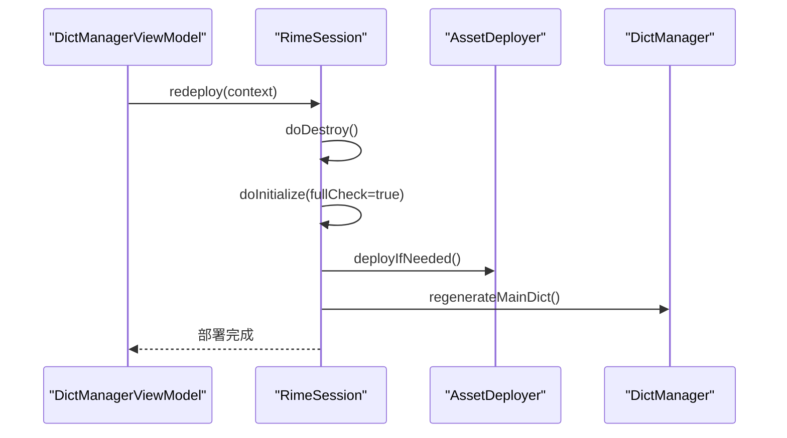
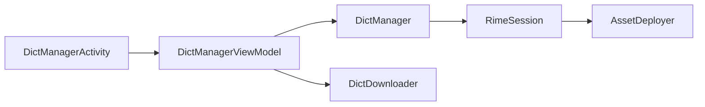

# 扩展词库系统

<cite>
**本文引用的文件**   
- [DictManager.kt](file://app/src/main/java/com/ziyou/ime/dict/DictManager.kt)
- [DictDownloader.kt](file://app/src/main/java/com/ziyou/ime/dict/DictDownloader.kt)
- [DictModels.kt](file://app/src/main/java/com/ziyou/ime/dict/DictModels.kt)
- [DictManagerActivity.kt](file://app/src/main/java/com/ziyou/ime/ui/DictManagerActivity.kt)
- [DictManagerViewModel.kt](file://app/src/main/java/com/ziyou/ime/ui/DictManagerViewModel.kt)
- [RimeSession.kt](file://app/src/main/java/com/ziyou/ime/daemon/RimeSession.kt)
- [AssetDeployer.kt](file://app/src/main/java/com/ziyou/ime/config/AssetDeployer.kt)
- [others.dict.yaml](file://app/src/main/assets/rime/cn_dicts/others.dict.yaml)
</cite>

## 目录
1. [简介](#简介)
2. [项目结构](#项目结构)
3. [核心组件](#核心组件)
4. [架构总览](#架构总览)
5. [详细组件分析](#详细组件分析)
6. [依赖关系分析](#依赖关系分析)
7. [性能考量](#性能考量)
8. [故障排查指南](#故障排查指南)
9. [结论](#结论)
10. [附录：开发、发布与版本管理](#附录开发发布与版本管理)

## 简介
本文件为字由输入法“扩展词库系统”的完整技术文档，覆盖远程词库发现、下载与安装部署、词库格式规范与目录结构、供应链安全（SHA256 校验、域名白名单、路径穿越防护）、热部署生效机制，以及面向第三方开发者的词库开发与发布流程、版本管理策略。目标是帮助开发者快速理解并安全地贡献扩展词库。

## 项目结构
扩展词库系统位于 app 模块中，围绕以下关键目录与文件组织：
- 词库管理与下载：app/src/main/java/com/ziyou/ime/dict
- UI 与管理界面：app/src/main/java/com/ziyou/ime/ui
- 引擎生命周期与部署步骤：app/src/main/java/com/ziyou/ime/daemon
- 资源部署器（assets → 内部存储）：app/src/main/java/com/ziyou/ime/config
- 内置词库示例：app/src/main/assets/rime/cn_dicts

图表来源
- [DictManagerActivity.kt:1-120](file://app/src/main/java/com/ziyou/ime/ui/DictManagerActivity.kt#L1-L120)
- [DictManagerViewModel.kt:1-120](file://app/src/main/java/com/ziyou/ime/ui/DictManagerViewModel.kt#L1-L120)
- [DictManager.kt:1-120](file://app/src/main/java/com/ziyou/ime/dict/DictManager.kt#L1-L120)
- [DictDownloader.kt:1-120](file://app/src/main/java/com/ziyou/ime/dict/DictDownloader.kt#L1-L120)
- [RimeSession.kt:1-120](file://app/src/main/java/com/ziyou/ime/daemon/RimeSession.kt#L1-L120)
- [AssetDeployer.kt:1-80](file://app/src/main/java/com/ziyou/ime/config/AssetDeployer.kt#L1-L80)

章节来源
- [DictManagerActivity.kt:1-120](file://app/src/main/java/com/ziyou/ime/ui/DictManagerActivity.kt#L1-L120)
- [DictManagerViewModel.kt:1-120](file://app/src/main/java/com/ziyou/ime/ui/DictManagerViewModel.kt#L1-L120)
- [DictManager.kt:1-120](file://app/src/main/java/com/ziyou/ime/dict/DictManager.kt#L1-L120)
- [DictDownloader.kt:1-120](file://app/src/main/java/com/ziyou/ime/dict/DictDownloader.kt#L1-L120)
- [RimeSession.kt:1-120](file://app/src/main/java/com/ziyou/ime/daemon/RimeSession.kt#L1-L120)
- [AssetDeployer.kt:1-80](file://app/src/main/java/com/ziyou/ime/config/AssetDeployer.kt#L1-L80)

## 核心组件
- DictManager：扩展词库管理器（单例），负责安装/卸载/启用/禁用、本地安装记录维护、主词库重新生成（注入已启用的扩展词库）。
- DictDownloader：词库下载器，负责 catalog 拉取、词库文件下载、预览读取、SHA256 完整性校验、HTTPS+域名白名单+受控重定向。
- DictModels：数据模型与枚举，包括 RemoteDictInfo、InstalledDictInfo、DictCatalog、PreviewState 等。
- DictManagerViewModel：UI 状态与交互逻辑，协调 catalog 刷新、下载进度、安装/更新/启用/禁用、预览加载与触发重部署。
- RimeSession：RIME 会话管理器，负责初始化、销毁、redeploy；在启动前按顺序执行部署步骤（资源部署、主词库重写等）。
- AssetDeployer：资源部署器，将 assets/rime 部署到应用内部存储，并维护部署版本。

章节来源
- [DictManager.kt:1-120](file://app/src/main/java/com/ziyou/ime/dict/DictManager.kt#L1-L120)
- [DictDownloader.kt:1-120](file://app/src/main/java/com/ziyou/ime/dict/DictDownloader.kt#L1-L120)
- [DictModels.kt:1-113](file://app/src/main/java/com/ziyou/ime/dict/DictModels.kt#L1-L113)
- [DictManagerViewModel.kt:1-120](file://app/src/main/java/com/ziyou/ime/ui/DictManagerViewModel.kt#L1-L120)
- [RimeSession.kt:1-120](file://app/src/main/java/com/ziyou/ime/daemon/RimeSession.kt#L1-L120)
- [AssetDeployer.kt:1-80](file://app/src/main/java/com/ziyou/ime/config/AssetDeployer.kt#L1-L80)

## 架构总览
扩展词库系统的整体调用链如下：
- 用户通过 UI（DictManagerActivity）操作词库列表。
- ViewModel（DictManagerViewModel）协调 Catalog 拉取、下载、安装、启用/禁用、预览加载。
- 安装/更新后，调用 DictManager 写入安装记录并重建主词库（luna_pinyin.dict.yaml）。
- 随后触发 RimeSession.redeploy，关闭旧引擎并按部署步骤重新初始化，使新词库立即生效。

图表来源
- [DictManagerActivity.kt:1-120](file://app/src/main/java/com/ziyou/ime/ui/DictManagerActivity.kt#L1-L120)
- [DictManagerViewModel.kt:120-200](file://app/src/main/java/com/ziyou/ime/ui/DictManagerViewModel.kt#L120-L200)
- [DictDownloader.kt:80-160](file://app/src/main/java/com/ziyou/ime/dict/DictDownloader.kt#L80-L160)
- [DictManager.kt:120-240](file://app/src/main/java/com/ziyou/ime/dict/DictManager.kt#L120-L240)
- [RimeSession.kt:180-226](file://app/src/main/java/com/ziyou/ime/daemon/RimeSession.kt#L180-L226)

## 详细组件分析

### 词库数据模型与分类
- RemoteDictInfo：包含 id、name、category、description、version、url、size、author、sha256。id 必须满足安全正则，防止路径穿越。
- InstalledDictInfo：本地安装记录，含 id、version、enabled、installedAt。
- DictCatalog：catalog.json 的结构，包含 version 与 dictionaries 列表。
- PreviewState/DownloadState/DeployState：用于 UI 状态流转。

章节来源
- [DictModels.kt:1-113](file://app/src/main/java/com/ziyou/ime/dict/DictModels.kt#L1-L113)

### 远程词库发现与下载
- catalog 拉取：从固定 BASE_URL 获取 catalog.json，限制响应大小，解析字典条目时进行 id 合法性与 URL 可信性校验。
- 下载词库：强制 HTTPS、域名白名单（gitee.com、raw.giteeusercontent.com）、手动跟随重定向且每跳都校验白名单，限制最大跳数。
- 完整性校验：若 catalog 提供 sha256，则对下载文件计算 SHA-256 并与期望值比对，失败则删除文件并拒绝安装。
- 预览：仅读取前 N 条词条，限制读取上限，避免大文件影响体验。

图表来源
- [DictDownloader.kt:50-160](file://app/src/main/java/com/ziyou/ime/dict/DictDownloader.kt#L50-L160)
- [DictDownloader.kt:260-320](file://app/src/main/java/com/ziyou/ime/dict/DictDownloader.kt#L260-L320)

章节来源
- [DictDownloader.kt:1-160](file://app/src/main/java/com/ziyou/ime/dict/DictDownloader.kt#L1-L160)
- [DictDownloader.kt:260-320](file://app/src/main/java/com/ziyou/ime/dict/DictDownloader.kt#L260-L320)

### 安装/卸载/启用/禁用与主词库重写
- 安装：下载完成后更新安装记录（ext_dicts.json），默认启用，然后重建主词库。
- 卸载：删除 .dict.yaml 文件，移除安装记录，重建主词库。
- 启用/禁用：修改 installed 列表中 enabled 字段，重建主词库。
- 主词库重写：保留基础 import_tables，追加已启用的扩展词库路径（ext_dicts/<id>），同时附加常用大写与数字词条。

图表来源
- [DictManager.kt:120-302](file://app/src/main/java/com/ziyou/ime/dict/DictManager.kt#L120-L302)
- [DictModels.kt:23-75](file://app/src/main/java/com/ziyou/ime/dict/DictModels.kt#L23-L75)

章节来源
- [DictManager.kt:120-302](file://app/src/main/java/com/ziyou/ime/dict/DictManager.kt#L120-L302)

### UI 与状态管理
- Activity：使用 Compose 展示词库列表、分类筛选、已安装视图、下载进度、部署提示与预览弹窗。
- ViewModel：封装 catalog 刷新、下载进度、安装/更新/启用/禁用、预览加载、触发 redeploy。

图表来源
- [DictManagerActivity.kt:512-717](file://app/src/main/java/com/ziyou/ime/ui/DictManagerActivity.kt#L512-L717)
- [DictManagerViewModel.kt:200-234](file://app/src/main/java/com/ziyou/ime/ui/DictManagerViewModel.kt#L200-L234)
- [DictManager.kt:314-375](file://app/src/main/java/com/ziyou/ime/dict/DictManager.kt#L314-L375)
- [DictDownloader.kt:170-202](file://app/src/main/java/com/ziyou/ime/dict/DictDownloader.kt#L170-L202)

章节来源
- [DictManagerActivity.kt:1-120](file://app/src/main/java/com/ziyou/ime/ui/DictManagerActivity.kt#L1-L120)
- [DictManagerViewModel.kt:120-200](file://app/src/main/java/com/ziyou/ime/ui/DictManagerViewModel.kt#L120-L200)

### 引擎生命周期与热部署
- RimeSession.initialize：在 IO 线程执行部署步骤（资源部署、主词库重写等），创建调度器与 API，启动引擎（带超时保护）。
- RimeSession.redeploy：关闭当前引擎，以 fullCheck 模式重新启动，确保新词库立即生效。
- AssetDeployer：将 assets/rime 复制到内部存储，并维护部署版本，避免重复部署。

图表来源
- [RimeSession.kt:180-226](file://app/src/main/java/com/ziyou/ime/daemon/RimeSession.kt#L180-L226)
- [AssetDeployer.kt:25-90](file://app/src/main/java/com/ziyou/ime/config/AssetDeployer.kt#L25-L90)
- [DictManager.kt:222-302](file://app/src/main/java/com/ziyou/ime/dict/DictManager.kt#L222-L302)

章节来源
- [RimeSession.kt:80-153](file://app/src/main/java/com/ziyou/ime/daemon/RimeSession.kt#L80-L153)
- [AssetDeployer.kt:25-90](file://app/src/main/java/com/ziyou/ime/config/AssetDeployer.kt#L25-L90)

## 依赖关系分析
- UI 层依赖 ViewModel，ViewModel 依赖业务层（DictManager、DictDownloader），业务层依赖引擎生命周期（RimeSession）与资源部署（AssetDeployer）。
- 部署步骤抽象（RimeDeployStep）解耦 daemon 层与业务域，保证单向向下依赖。

图表来源
- [DictManagerActivity.kt:1-120](file://app/src/main/java/com/ziyou/ime/ui/DictManagerActivity.kt#L1-L120)
- [DictManagerViewModel.kt:120-200](file://app/src/main/java/com/ziyou/ime/ui/DictManagerViewModel.kt#L120-L200)
- [DictManager.kt:120-240](file://app/src/main/java/com/ziyou/ime/dict/DictManager.kt#L120-L240)
- [RimeSession.kt:180-226](file://app/src/main/java/com/ziyou/ime/daemon/RimeSession.kt#L180-L226)
- [AssetDeployer.kt:25-90](file://app/src/main/java/com/ziyou/ime/config/AssetDeployer.kt#L25-L90)

章节来源
- [DictManagerViewModel.kt:120-200](file://app/src/main/java/com/ziyou/ime/ui/DictManagerViewModel.kt#L120-L200)
- [RimeSession.kt:180-226](file://app/src/main/java/com/ziyou/ime/daemon/RimeSession.kt#L180-L226)

## 性能考量
- 网络与 IO：所有下载、文件读写均在 IO 线程执行，避免阻塞主线程；catalog 与词库文件大小均有限制，防止内存与磁盘耗尽。
- 流式处理：下载与预览采用流式读取，边读边写，减少峰值内存占用。
- 重部署超时：引擎启动设置超时保护，避免长时间阻塞；即使超时也标记为已初始化，允许后续操作。
- 增量更新：仅当 catalog 版本变化或安装记录版本不一致时才触发更新检查，减少不必要下载。

[本节为通用指导，不直接分析具体文件]

## 故障排查指南
- catalog 拉取失败：检查网络连接与服务器可达性；确认 BASE_URL 可访问；查看日志中的 HTTP 响应码。
- 下载失败：检查域名白名单与 HTTPS 要求；确认重定向次数未超限；查看是否因文件大小超限被拒绝。
- SHA256 校验失败：确认 catalog 提供的 sha256 与下载文件一致；如不一致，删除损坏文件并重新下载。
- 主词库重写失败：检查 luna_pinyin.dict.yaml 是否存在；查看权限与磁盘空间；确认 ext_dicts 目录存在。
- 重部署失败：查看 RimeSession 日志；确认部署步骤执行顺序正确；必要时执行 fullCheck。

章节来源
- [DictDownloader.kt:50-160](file://app/src/main/java/com/ziyou/ime/dict/DictDownloader.kt#L50-L160)
- [DictManager.kt:222-302](file://app/src/main/java/com/ziyou/ime/dict/DictManager.kt#L222-L302)
- [RimeSession.kt:180-226](file://app/src/main/java/com/ziyou/ime/daemon/RimeSession.kt#L180-L226)

## 结论
扩展词库系统通过严格的供应链安全策略（HTTPS、域名白名单、受控重定向、SHA256 校验、id 合法性校验）保障词库来源可信与内容完整；通过主词库重写与引擎重部署实现热部署，使新词库立即生效；通过清晰的目录结构与格式规范，降低第三方开发门槛。建议遵循本文档的开发与发布流程，确保词库质量与安全。

[本节为总结，不直接分析具体文件]

## 附录：开发、发布与版本管理

### 词库格式规范
- 文件格式：RIME dict.yaml，UTF-8 编码，YAML 头部以 --- 开头，主体以 ... 分隔，词条行使用 Tab 分隔词语与编码。
- 示例参考：内置 others.dict.yaml 展示了多音字、错音错字、叠字等词条组织方式。
- 主词库组成：基础 import_tables（cn_dicts/8105、base、ext、tencent、others）+ 已启用的扩展词库（ext_dicts/<id>）。

章节来源
- [others.dict.yaml:1-120](file://app/src/main/assets/rime/cn_dicts/others.dict.yaml#L1-L120)
- [DictManager.kt:243-302](file://app/src/main/java/com/ziyou/ime/dict/DictManager.kt#L243-L302)

### 目录结构
- 扩展词库存放目录：应用内部存储 rime/ext_dicts/<id>.dict.yaml。
- 安装记录：rime/ext_dicts.json，包含 installed 列表。
- 主词库：rime/luna_pinyin.dict.yaml，由系统动态生成。

章节来源
- [DictManager.kt:44-57](file://app/src/main/java/com/ziyou/ime/dict/DictManager.kt#L44-L57)
- [DictManager.kt:61-110](file://app/src/main/java/com/ziyou/ime/dict/DictManager.kt#L61-L110)

### 配置文件要求
- catalog.json：包含 version 与 dictionaries 数组，每个条目需具备 id、name、category、description、version、url、size、author、sha256（可选）。
- id 合法性：仅允许字母、数字、下划线、连字符，防止路径穿越。
- url 可信性：必须 HTTPS，且域名在白名单内（gitee.com、raw.giteeusercontent.com）。

章节来源
- [DictModels.kt:23-56](file://app/src/main/java/com/ziyou/ime/dict/DictModels.kt#L23-L56)
- [DictDownloader.kt:322-365](file://app/src/main/java/com/ziyou/ime/dict/DictDownloader.kt#L322-L365)

### 供应链安全保障措施
- SHA256 校验：下载完成后计算文件 SHA-256 并与 catalog 提供的值比对，失败则删除文件并拒绝安装。
- 域名白名单：catalog 与下载链接的域名必须在白名单内，防止外链投毒。
- 受控重定向：手动跟随重定向，每跳都重新校验白名单，限制最大跳数。
- 路径穿越防护：id 合法性校验，非法 id 直接丢弃，不会进入文件系统。

章节来源
- [DictDownloader.kt:135-160](file://app/src/main/java/com/ziyou/ime/dict/DictDownloader.kt#L135-L160)
- [DictDownloader.kt:260-320](file://app/src/main/java/com/ziyou/ime/dict/DictDownloader.kt#L260-L320)
- [DictModels.kt:46-56](file://app/src/main/java/com/ziyou/ime/dict/DictModels.kt#L46-L56)

### 热部署生效机制
- 安装/更新/启用/禁用后，调用 DictManager.regenerateMainDict 重写主词库。
- 随后调用 RimeSession.redeploy，关闭旧引擎并以 fullCheck 模式重启，确保新词库立即生效。

章节来源
- [DictManager.kt:222-302](file://app/src/main/java/com/ziyou/ime/dict/DictManager.kt#L222-L302)
- [RimeSession.kt:180-226](file://app/src/main/java/com/ziyou/ime/daemon/RimeSession.kt#L180-L226)

### 词库开发指南
- 准备词库文件：遵循 RIME dict.yaml 格式，使用 Tab 分隔词语与编码。
- 测试预览：使用 DictDownloader.fetchDictPreview 或本地读取验证词条解析。
- 集成安装：通过 DictManager.installDict 进行安装与主词库重写。
- 验证效果：触发 RimeSession.redeploy 后，检查输入候选是否包含新词库词条。

章节来源
- [DictDownloader.kt:170-202](file://app/src/main/java/com/ziyou/ime/dict/DictDownloader.kt#L170-L202)
- [DictManager.kt:120-150](file://app/src/main/java/com/ziyou/ime/dict/DictManager.kt#L120-L150)
- [RimeSession.kt:180-226](file://app/src/main/java/com/ziyou/ime/daemon/RimeSession.kt#L180-L226)

### 发布流程
- 上传 catalog.json 与词库文件至指定仓库（BASE_URL）。
- 确保 catalog 中 id 合法、url 可信、sha256 正确。
- 在应用内刷新 catalog，验证词库可见并可下载。
- 安装后触发重部署，验证词库生效。

章节来源
- [DictDownloader.kt:50-120](file://app/src/main/java/com/ziyou/ime/dict/DictDownloader.kt#L50-L120)
- [DictManagerViewModel.kt:76-91](file://app/src/main/java/com/ziyou/ime/ui/DictManagerViewModel.kt#L76-L91)

### 版本管理策略
- catalog.version：目录版本，用于标识目录结构变更。
- dictionary.version：词库版本，用于检测更新（与本地 installed.version 比较）。
- 应用部署版本：AssetDeployer 维护，避免重复部署 assets。

章节来源
- [DictModels.kt:66-75](file://app/src/main/java/com/ziyou/ime/dict/DictModels.kt#L66-L75)
- [AssetDeployer.kt:25-63](file://app/src/main/java/com/ziyou/ime/config/AssetDeployer.kt#L25-L63)