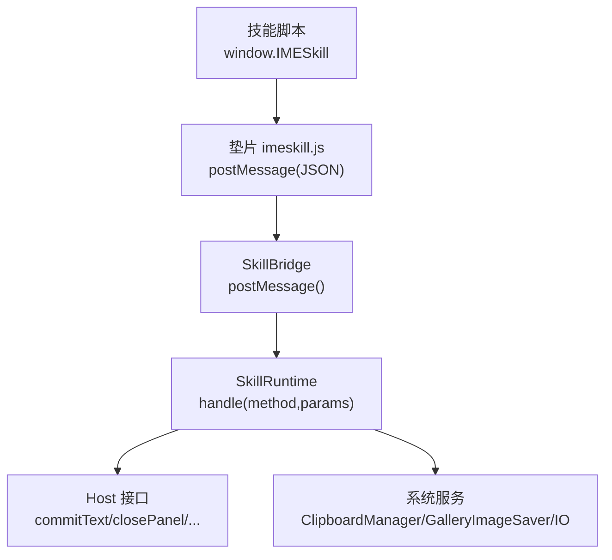
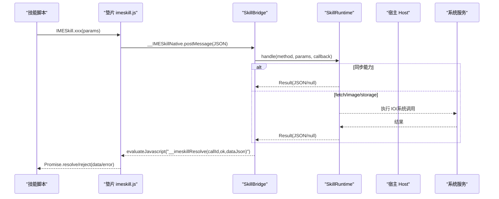
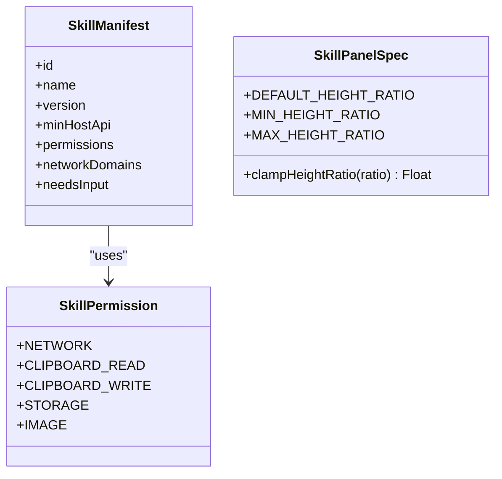

# API 参考

<cite>
**本文引用的文件**   
- [imeskill.js](file://app/src/main/assets/skill_runtime/imeskill.js)
- [SkillBridge.kt](file://app/src/main/java/com/ziyou/ime/skill/SkillBridge.kt)
- [SkillRuntime.kt](file://app/src/main/java/com/ziyou/ime/skill/SkillRuntime.kt)
- [SkillWebViewFactory.kt](file://app/src/main/java/com/ziyou/ime/skill/SkillWebViewFactory.kt)
- [SkillManifest.kt](file://core-logic/src/main/java/com/ziyou/ime/core/skill/SkillManifest.kt)
- [SkillPermission.kt](file://core-logic/src/main/java/com/ziyou/ime/core/skill/SkillPermission.kt)
- [SkillPanelSpec.kt](file://core-logic/src/main/java/com/ziyou/ime/core/skill/SkillPanelSpec.kt)
- [SkillManifestValidator.kt](file://core-logic/src/main/java/com/ziyou/ime/core/skill/SkillManifestValidator.kt)
</cite>

## 目录
1. [简介](#简介)
2. [项目结构](#项目结构)
3. [核心组件](#核心组件)
4. [架构总览](#架构总览)
5. [详细组件分析](#详细组件分析)
6. [依赖关系分析](#依赖关系分析)
7. [性能与限制](#性能与限制)
8. [故障排查与错误码](#故障排查与错误码)
9. [结论](#结论)
10. [附录：面板规格 SkillPanelSpec](#附录面板规格-skillpanelspec)

## 简介
本文件为“技能插件”的完整 API 参考，面向在 WebView 中运行的技能脚本（JS），系统性记录宿主通过 JS Bridge 暴露的全部能力。内容覆盖：
- 文本输入与上屏：sendText、input.requestFocus / input.releaseFocus
- 剪贴板操作：clipboard.read / clipboard.write
- 系统功能调用：haptic、getContext、getLocale
- 网络请求代理：fetch（HTTPS + 白名单）
- 图片输出：image.send / image.saveToGallery（API v3）
- 面板 UI 控制：ui.setTitle、ui.close、ui.setExpanded、ui.setPanelHeight（API v4）
- 轻量持久化：storage.get / storage.set / storage.remove
- 面板规格定义：SkillPanelSpec（高度比例钳制）

所有方法均以 Promise 形式返回；异常统一以 Error 对象抛出，message 字段包含错误原因。

## 项目结构
技能运行时由三层组成：
- 前端垫片：imeskill.js，封装 window.IMESkill 并统一经 __IMESkillNative.postMessage 发起调用
- Bridge 单入口：SkillBridge，负责消息分发、线程切换与结果回传
- 运行时实现：SkillRuntime，承载权限校验、业务逻辑与系统能力调用

**图表来源** 
- [imeskill.js:1-164](file://app/src/main/assets/skill_runtime/imeskill.js#L1-L164)
- [SkillBridge.kt:1-99](file://app/src/main/java/com/ziyou/ime/skill/SkillBridge.kt#L1-L99)
- [SkillRuntime.kt:1-521](file://app/src/main/java/com/ziyou/ime/skill/SkillRuntime.kt#L1-L521)

**章节来源**
- [SkillWebViewFactory.kt:1-205](file://app/src/main/java/com/ziyou/ime/skill/SkillWebViewFactory.kt#L1-L205)

## 核心组件
- 垫片与全局对象
  - 注入名：__IMESkillNative（Bridge 单入口）
  - 全局对象：window.IMESkill（所有 API 均在此命名空间下）
  - 版本协商：apiVersion（由宿主动态覆写，默认回退值存在）
- Bridge 安全与线程模型
  - 单入口 postMessage，全异步 resolve/reject
  - 主线程分发，异常兜底不波及 IME 主进程
  - 消息长度上限 512KB
- 运行时能力
  - 权限校验（manifest.permissions）
  - 参数校验与限额（文本长度、存储大小、网络响应大小等）
  - 资源与 IO 隔离（仅允许白名单域名、禁用重定向）

**章节来源**
- [imeskill.js:1-164](file://app/src/main/assets/skill_runtime/imeskill.js#L1-L164)
- [SkillBridge.kt:1-99](file://app/src/main/java/com/ziyou/ime/skill/SkillBridge.kt#L1-L99)
- [SkillRuntime.kt:1-521](file://app/src/main/java/com/ziyou/ime/skill/SkillRuntime.kt#L1-L521)

## 架构总览
技能运行时的端到端调用流程如下：

**图表来源** 
- [imeskill.js:1-164](file://app/src/main/assets/skill_runtime/imeskill.js#L1-L164)
- [SkillBridge.kt:1-99](file://app/src/main/java/com/ziyou/ime/skill/SkillBridge.kt#L1-L99)
- [SkillRuntime.kt:1-521](file://app/src/main/java/com/ziyou/ime/skill/SkillRuntime.kt#L1-L521)

## 详细组件分析

### 文本输入与上屏
- sendText(text)
  - 作用：将文本直接上屏到当前输入框，并关闭技能面板
  - 参数：text（string，非空，长度上限 5000）
  - 返回：Promise<void>
  - 异常：text 为空或超长时拒绝
  - 行为：若输入路由仍激活会先复位路由，确保直达宿主编辑器
- input.requestFocus(fieldId)
  - 作用：将键盘上屏文本改道注入面板内指定 id 的 input/textarea 元素（需 needs_input）
  - 参数：fieldId（string，DOM 元素 id）
  - 返回：Promise<void>
  - 异常：未声明 needs_input 或元素不存在
- input.releaseFocus()
  - 作用：结束面板内输入路由，恢复直达宿主编辑器
  - 返回：Promise<void>

使用示例（伪代码）
- 发送文本并关闭面板：await IMESkill.sendText("你好")
- 面板内输入：await IMESkill.input.requestFocus("myInput"); // 之后键盘输入会进入该元素
- 释放焦点：await IMESkill.input.releaseFocus();

**章节来源**
- [SkillRuntime.kt:159-241](file://app/src/main/java/com/ziyou/ime/skill/SkillRuntime.kt#L159-L241)
- [imeskill.js:45-71](file://app/src/main/assets/skill_runtime/imeskill.js#L45-L71)

### 剪贴板操作
- clipboard.read()
  - 作用：读取系统剪贴板首项文本
  - 权限：clipboard_read
  - 返回：Promise<string|null>
- clipboard.write(text)
  - 作用：写入系统剪贴板
  - 权限：clipboard_write
  - 参数：text（string）
  - 返回：Promise<void>

使用示例（伪代码）
- const text = await IMESkill.clipboard.read();
- await IMESkill.clipboard.write("复制内容");

**章节来源**
- [SkillRuntime.kt:210-224](file://app/src/main/java/com/ziyou/ime/skill/SkillRuntime.kt#L210-L224)
- [SkillPermission.kt:1-27](file://core-logic/src/main/java/com/ziyou/ime/core/skill/SkillPermission.kt#L1-L27)

### 系统功能调用
- getContext()
  - 返回：Promise<{packageName:string, inputType:string}>
- getLocale()
  - 返回：Promise<string>（BCP 47，如 zh-CN）
- haptic()
  - 作用：触发震动反馈
  - 返回：Promise<void>

使用示例（伪代码）
- const ctx = await IMESkill.getContext();
- const lang = await IMESkill.getLocale();
- await IMESkill.haptic();

**章节来源**
- [SkillRuntime.kt:172-182](file://app/src/main/java/com/ziyou/ime/skill/SkillRuntime.kt#L172-L182)

### 网络请求代理（fetch）
- fetch(url, options?)
  - 作用：宿主代理网络请求，强制 HTTPS + 域名白名单 + 频控 + 并发限制
  - 权限：network（需配合 networkDomains 白名单）
  - 参数：
    - url（string，必须 https）
    - options（object，可选）
      - method（string，POST/GET，默认 GET）
      - body（string，POST 时有效）
      - contentType（string，Content-Type）
  - 返回：Promise<{status:number, body:string}>
  - 限制：
    - 超时 10s
    - 响应体 ≤ 1MB
    - 频率 ≤ 30 次/分钟
    - 并发 ≤ 2
    - 禁止跟随重定向
  - 异常：非法 URL、非 HTTPS、域名不在白名单、超限等

使用示例（伪代码）
- const res = await IMESkill.fetch("https://api.example.com/data", { method:"POST", body:'{"k":"v"}', contentType:"application/json" });
- console.log(res.status, res.body);

**章节来源**
- [SkillRuntime.kt:374-471](file://app/src/main/java/com/ziyou/ime/skill/SkillRuntime.kt#L374-L471)
- [SkillPermission.kt:1-27](file://core-logic/src/main/java/com/ziyou/ime/core/skill/SkillPermission.kt#L1-L27)

### 图片输出（API v3）
- image.send(base64)
  - 作用：将 PNG 图片以富媒体方式发送到当前输入框（需 editorAcceptsImage）
  - 权限：image
  - 参数：base64（string，支持 data URL 前缀，PNG 魔数校验）
  - 返回：Promise<void>
- image.saveToGallery(base64)
  - 作用：保存 PNG 到系统相册（Android 10+）
  - 权限：image
  - 参数：base64（string，PNG 魔数校验）
  - 返回：Promise<void>

使用示例（伪代码）
- await IMESkill.image.send("data:image/png;base64,...");
- await IMESkill.image.saveToGallery("iVBORw0KGgoAAAANSUhEUgAA...");

注意：Bridge 单消息 512KB 上限，超大图请先降分辨率重绘。

**章节来源**
- [SkillRuntime.kt:286-366](file://app/src/main/java/com/ziyou/ime/skill/SkillRuntime.kt#L286-L366)
- [SkillPermission.kt:1-27](file://core-logic/src/main/java/com/ziyou/ime/core/skill/SkillPermission.kt#L1-L27)

### 面板 UI 控制
- ui.setTitle(title)
  - 作用：设置面板标题栏文字（长度上限 20）
  - 参数：title（string）
  - 返回：Promise<void>
- ui.close()
  - 作用：关闭技能面板
  - 返回：Promise<void>
- ui.setExpanded(expanded?)
  - 作用：展开/收缩输入法界面（仅 needs_input 技能有效）
  - 参数：expanded（boolean，缺省 true）
  - 返回：Promise<void>
- ui.setPanelHeight(ratio)（API v4）
  - 作用：自定义面板高度（键盘高度的倍数，宿主钳制到 [0.4, 1.2]）
  - 参数：ratio（number）
  - 返回：Promise<void>

使用示例（伪代码）
- await IMESkill.ui.setTitle("计算器");
- await IMESkill.ui.setExpanded(false); // 收缩输入法界面
- await IMESkill.ui.setPanelHeight(0.8);
- await IMESkill.ui.close();

**章节来源**
- [SkillRuntime.kt:184-208](file://app/src/main/java/com/ziyou/ime/skill/SkillRuntime.kt#L184-L208)
- [SkillPanelSpec.kt:1-30](file://core-logic/src/main/java/com/ziyou/ime/core/skill/SkillPanelSpec.kt#L1-L30)

### 轻量持久化（storage）
- storage.get(key)
  - 权限：storage
  - 参数：key（string）
  - 返回：Promise<string|null>
- storage.set(key, value)
  - 权限：storage
  - 参数：key（string）、value（string）
  - 返回：Promise<void>
- storage.remove(key)
  - 权限：storage
  - 参数：key（string）
  - 返回：Promise<void>

限制与特性
- 每技能独立 JSON 文件，序列化后上限 1MB
- 读写串行（FIFO），保证 set/remove 顺序
- 失败自动降级（损坏则重置）

使用示例（伪代码）
- await IMESkill.storage.set("theme","dark");
- const theme = await IMESkill.storage.get("theme");
- await IMESkill.storage.remove("theme");

**章节来源**
- [SkillRuntime.kt:243-284](file://app/src/main/java/com/ziyou/ime/skill/SkillRuntime.kt#L243-L284)
- [SkillPermission.kt:1-27](file://core-logic/src/main/java/com/ziyou/ime/core/skill/SkillPermission.kt#L1-L27)

### 面板规格定义（SkillPanelSpec）
- DEFAULT_HEIGHT_RATIO：默认高度比例 0.6
- MIN_HEIGHT_RATIO：最小高度比例 0.4
- MAX_HEIGHT_RATIO：最大高度比例 1.2
- clampHeightRatio(ratio)：钳制 ratio 到合法区间，非有限值回退默认

用途
- 用于 ui.setPanelHeight 的高度校验与归一化
- 提升挂载形态（needs_input）下，面板高度以键盘实测高度倍数表达

**章节来源**
- [SkillPanelSpec.kt:1-30](file://core-logic/src/main/java/com/ziyou/ime/core/skill/SkillPanelSpec.kt#L1-L30)

## 依赖关系分析
- 权限模型
  - NETWORK：fetch 代理
  - CLIPBOARD_READ / CLIPBOARD_WRITE：剪贴板读写
  - STORAGE：本地 KV 持久化
  - IMAGE：图片输出（富媒体/相册）
- Manifest 与版本
  - HOST_API_VERSION：当前 4（v1~v4 能力逐步开放）
  - SUPPORTED_MANIFEST_VERSION：当前 1
  - min_host_api：技能声明最低宿主 API 版本
- WebView 安全
  - 虚拟域名 appassets.androidplatform.net
  - CSP 收紧连接与外域访问
  - 渲染进程崩溃兜底，IME 主进程保活

**图表来源** 
- [SkillPermission.kt:1-27](file://core-logic/src/main/java/com/ziyou/ime/core/skill/SkillPermission.kt#L1-L27)
- [SkillManifest.kt:1-51](file://core-logic/src/main/java/com/ziyou/ime/core/skill/SkillManifest.kt#L1-L51)
- [SkillPanelSpec.kt:1-30](file://core-logic/src/main/java/com/ziyou/ime/core/skill/SkillPanelSpec.kt#L1-L30)

**章节来源**
- [SkillManifestValidator.kt:1-78](file://core-logic/src/main/java/com/ziyou/ime/core/skill/SkillManifestValidator.kt#L1-L78)
- [SkillWebViewFactory.kt:1-205](file://app/src/main/java/com/ziyou/ime/skill/SkillWebViewFactory.kt#L1-L205)

## 性能与限制
- 消息长度上限：512KB（Bridge 单条消息）
- 文本上屏单次上限：5000 字符
- 面板标题长度上限：20 字符
- 存储上限：1MB（序列化后）
- 网络请求：
  - 超时 10s
  - 响应体 ≤ 1MB
  - 频率 ≤ 30 次/分钟
  - 并发 ≤ 2
  - 禁止跟随重定向
- 图片处理：
  - 仅支持 PNG（文件头魔数校验）
  - 单消息 512KB 上限，大图需降分辨率

[本节为通用指导，无需源码引用]

## 故障排查与错误码
常见错误类型与定位要点（均为 Promise.reject(Error) 的 message 字段）：
- 权限相关
  - “权限拒绝：manifest 未声明 <permission_id>”
  - 检查 manifest.permissions 是否包含所需权限
- 参数与格式
  - “text 不能为空”、“未知方法: <method>”、“key 不能为空”、“ratio 不能为空”
  - 检查参数是否存在、类型是否正确
- 网络
  - “非法 URL”、“仅允许 HTTPS 请求”、“域名不在白名单: <host>”
  - “请求过于频繁（上限 30 次/分钟）”、“并发请求超限（上限 2）”
  - 检查 URL 协议、白名单配置与调用频率
- 图片
  - “图片数据无效”、“仅支持 PNG 图片”、“保存到相册需要 Android 10 及以上系统”
  - 检查 base64 是否为 PNG、系统版本是否满足
- 输入路由
  - “manifest 未声明 needs_input，无法使用面板输入”
  - 确认 manifest.needsInput 与布局模式
- 内部错误
  - 当非预期异常发生时，message 可能为“内部错误”
  - 查看日志中的桥接异常堆栈

调试技巧
- 使用浏览器 DevTools 调试 WebView（debuggable 构建）
- 在技能脚本中捕获 Promise reject 的 error.message 进行定位
- 关注 Bridge 日志（TAG: SkillBridge/SkillRuntime）
- 验证 manifest 字段合法性（SkillManifestValidator 规则）

**章节来源**
- [SkillRuntime.kt:159-471](file://app/src/main/java/com/ziyou/ime/skill/SkillRuntime.kt#L159-L471)
- [SkillBridge.kt:45-99](file://app/src/main/java/com/ziyou/ime/skill/SkillBridge.kt#L45-L99)
- [SkillManifestValidator.kt:1-78](file://core-logic/src/main/java/com/ziyou/ime/core/skill/SkillManifestValidator.kt#L1-L78)

## 结论
本 API 参考覆盖了技能插件在文本输入、剪贴板、系统交互、网络代理、图片输出、面板 UI 与持久化等方面的全部能力。通过统一的 Promise 接口与安全边界（权限、白名单、限额），开发者可在受控环境中快速构建丰富的技能面板。建议严格遵循权限与限额约束，并在开发阶段充分使用调试工具与日志定位问题。

[本节为总结性内容，无需源码引用]

## 附录：面板规格 SkillPanelSpec
- 默认高度比例：0.6
- 最小高度比例：0.4
- 最大高度比例：1.2
- 钳制函数：clampHeightRatio(ratio)
  - 非有限值（NaN/Infinity）回退默认值
  - 其余值钳制到 [0.4, 1.2]

适用场景
- needs_input 技能在提升挂载形态下，通过 ui.setPanelHeight 自定义面板高度
- 宿主统一钳制，防止面板过小不可用或过大影响整体窗口布局

**章节来源**
- [SkillPanelSpec.kt:1-30](file://core-logic/src/main/java/com/ziyou/ime/core/skill/SkillPanelSpec.kt#L1-L30)