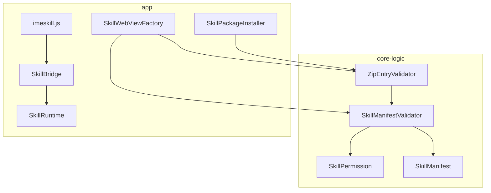
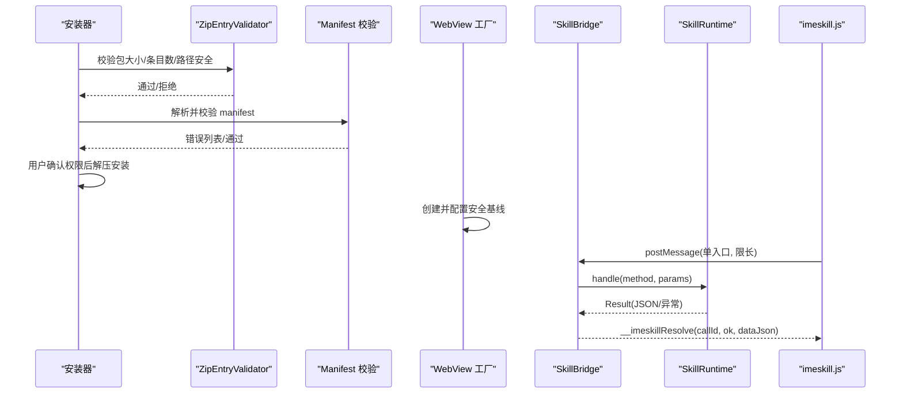
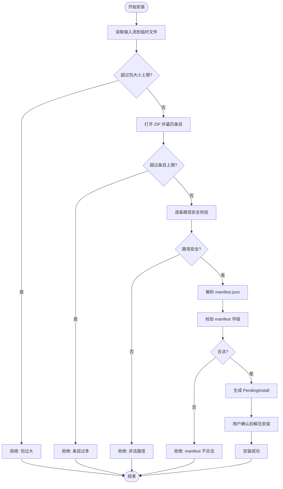
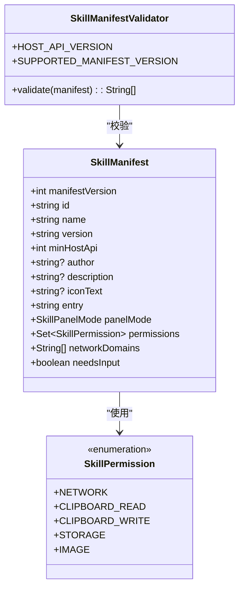
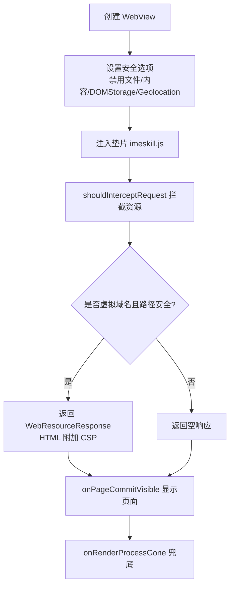
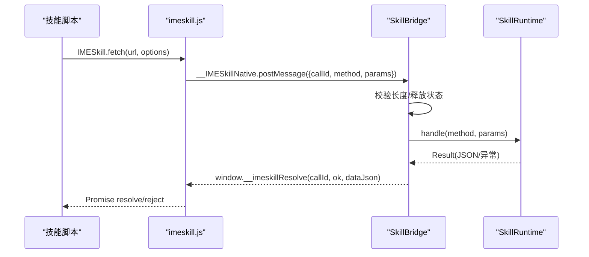
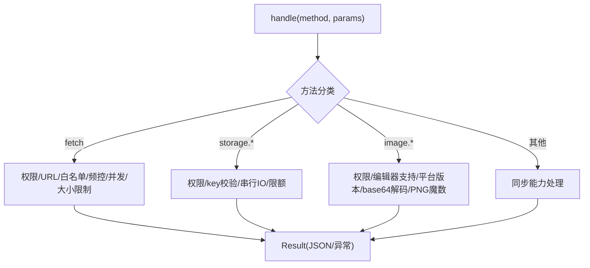
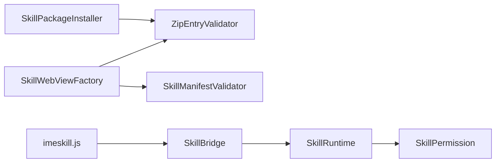

# 安全机制

<cite>
**本文引用的文件**
- [ZipEntryValidator.kt](file://core-logic/src/main/java/com/ziyou/ime/core/skill/ZipEntryValidator.kt)
- [SkillManifestValidator.kt](file://core-logic/src/main/java/com/ziyou/ime/core/skill/SkillManifestValidator.kt)
- [SkillPermission.kt](file://core-logic/src/main/java/com/ziyou/ime/core/skill/SkillPermission.kt)
- [SkillManifest.kt](file://core-logic/src/main/java/com/ziyou/ime/core/skill/SkillManifest.kt)
- [SkillBridge.kt](file://app/src/main/java/com/ziyou/ime/skill/SkillBridge.kt)
- [SkillWebViewFactory.kt](file://app/src/main/java/com/ziyou/ime/skill/SkillWebViewFactory.kt)
- [SkillRuntime.kt](file://app/src/main/java/com/ziyou/ime/skill/SkillRuntime.kt)
- [SkillPackageInstaller.kt](file://app/src/main/java/com/ziyou/ime/skill/SkillPackageInstaller.kt)
- [imeskill.js](file://app/src/main/assets/skill_runtime/imeskill.js)
- [ZipEntryValidatorTest.kt](file://core-logic/src/test/java/com/ziyou/ime/core/skill/ZipEntryValidatorTest.kt)
- [SkillManifestValidatorTest.kt](file://core-logic/src/test/java/com/ziyou/ime/core/skill/SkillManifestValidatorTest.kt)
</cite>

## 目录
1. [简介](#简介)
2. [项目结构](#项目结构)
3. [核心组件](#核心组件)
4. [架构总览](#架构总览)
5. [详细组件分析](#详细组件分析)
6. [依赖关系分析](#依赖关系分析)
7. [性能考量](#性能考量)
8. [故障排查指南](#故障排查指南)
9. [结论](#结论)

## 简介
本文件面向技能插件系统的安全机制，覆盖以下关键方面：
- 插件包安全校验流程：ZipEntryValidator 的目录遍历攻击防护、文件大小与条目数限制、入口文件白名单。
- Manifest 验证器的权限控制：危险权限显式声明、域名白名单校验、宿主 API 版本协商。
- WebView 沙箱环境配置与安全限制：JavaScript 执行隔离、文件系统访问控制、网络请求过滤与 CSP 策略。
- SkillBridge 安全通信协议：单入口窄面、全异步消息、长度限制、异常兜底，防止恶意代码注入与 XSS。

## 项目结构
技能安全相关代码分布在 core-logic（纯逻辑）与 app（Android 运行时集成）两个模块中：
- core-logic：路径校验、Manifest 校验、权限枚举与数据模型。
- app：WebView 工厂、Bridge 桥接、运行时能力实现、安装包安装器。

图表来源
- [ZipEntryValidator.kt:1-37](file://core-logic/src/main/java/com/ziyou/ime/core/skill/ZipEntryValidator.kt#L1-L37)
- [SkillManifestValidator.kt:1-78](file://core-logic/src/main/java/com/ziyou/ime/core/skill/SkillManifestValidator.kt#L1-L78)
- [SkillPermission.kt:1-27](file://core-logic/src/main/java/com/ziyou/ime/core/skill/SkillPermission.kt#L1-L27)
- [SkillManifest.kt:1-51](file://core-logic/src/main/java/com/ziyou/ime/core/skill/SkillManifest.kt#L1-L51)
- [SkillWebViewFactory.kt:1-205](file://app/src/main/java/com/ziyou/ime/skill/SkillWebViewFactory.kt#L1-L205)
- [SkillBridge.kt:1-99](file://app/src/main/java/com/ziyou/ime/skill/SkillBridge.kt#L1-L99)
- [SkillRuntime.kt:1-521](file://app/src/main/java/com/ziyou/ime/skill/SkillRuntime.kt#L1-L521)
- [SkillPackageInstaller.kt:1-194](file://app/src/main/java/com/ziyou/ime/skill/SkillPackageInstaller.kt#L1-L194)
- [imeskill.js:1-164](file://app/src/main/assets/skill_runtime/imeskill.js#L1-L164)

章节来源
- [ZipEntryValidator.kt:1-37](file://core-logic/src/main/java/com/ziyou/ime/core/skill/ZipEntryValidator.kt#L1-L37)
- [SkillManifestValidator.kt:1-78](file://core-logic/src/main/java/com/ziyou/ime/core/skill/SkillManifestValidator.kt#L1-L78)
- [SkillWebViewFactory.kt:1-205](file://app/src/main/java/com/ziyou/ime/skill/SkillWebViewFactory.kt#L1-L205)
- [SkillBridge.kt:1-99](file://app/src/main/java/com/ziyou/ime/skill/SkillBridge.kt#L1-L99)
- [SkillRuntime.kt:1-521](file://app/src/main/java/com/ziyou/ime/skill/SkillRuntime.kt#L1-L521)
- [SkillPackageInstaller.kt:1-194](file://app/src/main/java/com/ziyou/ime/skill/SkillPackageInstaller.kt#L1-L194)
- [imeskill.js:1-164](file://app/src/main/assets/skill_runtime/imeskill.js#L1-L164)

## 核心组件
- ZipEntryValidator：提供相对路径安全校验，防御 Zip Slip 与路径逃逸；定义包大小、条目数、路径长度上限。
- SkillManifestValidator：校验 manifest 字段合法性，包括 id、名称、版本、入口文件、网络域名白名单与权限一致性。
- SkillPermission：定义可申请的权限集合（network、clipboard_read、clipboard_write、storage、image）。
- SkillWebViewFactory：统一创建并配置 WebView 安全基线，资源拦截、CSP 注入、渲染进程崩溃兜底。
- SkillBridge：JS 到宿主的单入口桥接，限长、异步、异常兜底，避免多方法直暴与同步返回风险。
- SkillRuntime：承载 Bridge API 的业务实现，权限检查、存储限额、fetch 代理、图片输出、输入路由等。
- SkillPackageInstaller：两段式安装（inspect → commit），包体落盘前完成全部校验，原子替换与回滚。

章节来源
- [ZipEntryValidator.kt:1-37](file://core-logic/src/main/java/com/ziyou/ime/core/skill/ZipEntryValidator.kt#L1-L37)
- [SkillManifestValidator.kt:1-78](file://core-logic/src/main/java/com/ziyou/ime/core/skill/SkillManifestValidator.kt#L1-L78)
- [SkillPermission.kt:1-27](file://core-logic/src/main/java/com/ziyou/ime/core/skill/SkillPermission.kt#L1-L27)
- [SkillWebViewFactory.kt:1-205](file://app/src/main/java/com/ziyou/ime/skill/SkillWebViewFactory.kt#L1-L205)
- [SkillBridge.kt:1-99](file://app/src/main/java/com/ziyou/ime/skill/SkillBridge.kt#L1-L99)
- [SkillRuntime.kt:1-521](file://app/src/main/java/com/ziyou/ime/skill/SkillRuntime.kt#L1-L521)
- [SkillPackageInstaller.kt:1-194](file://app/src/main/java/com/ziyou/ime/skill/SkillPackageInstaller.kt#L1-L194)

## 架构总览
技能插件从安装到运行，安全校验贯穿全流程：
- 安装阶段：包大小与条目数限制、Zip Slip 防护、manifest 解析与校验、冲突与升级规则。
- 运行阶段：WebView 沙箱隔离、资源白名单与 CSP、Bridge 单入口与限长、运行时权限与限额。
- 通信阶段：JS 垫片封装 Promise 调用，宿主侧严格校验参数与权限，异常统一兜底。

图表来源
- [SkillPackageInstaller.kt:1-194](file://app/src/main/java/com/ziyou/ime/skill/SkillPackageInstaller.kt#L1-L194)
- [ZipEntryValidator.kt:1-37](file://core-logic/src/main/java/com/ziyou/ime/core/skill/ZipEntryValidator.kt#L1-L37)
- [SkillManifestValidator.kt:1-78](file://core-logic/src/main/java/com/ziyou/ime/core/skill/SkillManifestValidator.kt#L1-L78)
- [SkillWebViewFactory.kt:1-205](file://app/src/main/java/com/ziyou/ime/skill/SkillWebViewFactory.kt#L1-L205)
- [SkillBridge.kt:1-99](file://app/src/main/java/com/ziyou/ime/skill/SkillBridge.kt#L1-L99)
- [SkillRuntime.kt:1-521](file://app/src/main/java/com/ziyou/ime/skill/SkillRuntime.kt#L1-L521)
- [imeskill.js:1-164](file://app/src/main/assets/skill_runtime/imeskill.js#L1-L164)

## 详细组件分析

### 插件包安全校验（ZipEntryValidator 与安装器）
- 目录遍历攻击防护：isSafeRelativePath 拒绝空路径、绝对路径、反斜杠、盘符冒号、.. / . / 空段、超长路径、NUL 字符。
- 文件大小与条目数限制：MAX_PACKAGE_BYTES、MAX_ENTRIES、MAX_PATH_LENGTH。
- 安装器两段式流程：inspect 阶段落临时文件并全量校验；commit 阶段解压到 staging，备份旧版本，原子替换，失败回滚。

图表来源
- [SkillPackageInstaller.kt:1-194](file://app/src/main/java/com/ziyou/ime/skill/SkillPackageInstaller.kt#L1-L194)
- [ZipEntryValidator.kt:1-37](file://core-logic/src/main/java/com/ziyou/ime/core/skill/ZipEntryValidator.kt#L1-L37)

章节来源
- [SkillPackageInstaller.kt:1-194](file://app/src/main/java/com/ziyou/ime/skill/SkillPackageInstaller.kt#L1-L194)
- [ZipEntryValidator.kt:1-37](file://core-logic/src/main/java/com/ziyou/ime/core/skill/ZipEntryValidator.kt#L1-L37)
- [ZipEntryValidatorTest.kt:1-55](file://core-logic/src/test/java/com/ziyou/ime/core/skill/ZipEntryValidatorTest.kt#L1-L55)

### Manifest 验证器与权限控制
- 字段校验：manifest_version、id（反向域名风格）、name、version、minHostApi、entry（必须为 .html 且安全路径）、networkDomains（域名格式与数量限制）。
- 权限一致性：若声明 network_domains 则必须包含 NETWORK 权限；未知权限 id 由解析器拒绝。
- 宿主 API 版本协商：HOST_API_VERSION 与 minHostApi 比较，确保兼容性。

图表来源
- [SkillManifest.kt:1-51](file://core-logic/src/main/java/com/ziyou/ime/core/skill/SkillManifest.kt#L1-L51)
- [SkillPermission.kt:1-27](file://core-logic/src/main/java/com/ziyou/ime/core/skill/SkillPermission.kt#L1-L27)
- [SkillManifestValidator.kt:1-78](file://core-logic/src/main/java/com/ziyou/ime/core/skill/SkillManifestValidator.kt#L1-L78)

章节来源
- [SkillManifestValidator.kt:1-78](file://core-logic/src/main/java/com/ziyou/ime/core/skill/SkillManifestValidator.kt#L1-L78)
- [SkillPermission.kt:1-27](file://core-logic/src/main/java/com/ziyou/ime/core/skill/SkillPermission.kt#L1-L27)
- [SkillManifest.kt:1-51](file://core-logic/src/main/java/com/ziyou/ime/core/skill/SkillManifest.kt#L1-L51)
- [SkillManifestValidatorTest.kt:1-107](file://core-logic/src/test/java/com/ziyou/ime/core/skill/SkillManifestValidatorTest.kt#L1-L107)

### WebView 沙箱环境与资源访问控制
- 安全基线：禁用文件/内容访问、DOM Storage、地理定位、多窗口、自动打开窗口；仅启用 JavaScript。
- 资源拦截：仅放行虚拟域名下的技能包内资源，其余一律返回空响应；HTML 附加 CSP 头收紧连接与脚本策略。
- 首帧可见性：隐藏至首帧提交后再显示，避免黑屏闪烁。
- 渲染进程崩溃兜底：onRenderProcessGone 回调销毁面板，保证 IME 主进程存活。

图表来源
- [SkillWebViewFactory.kt:1-205](file://app/src/main/java/com/ziyou/ime/skill/SkillWebViewFactory.kt#L1-L205)
- [ZipEntryValidator.kt:1-37](file://core-logic/src/main/java/com/ziyou/ime/core/skill/ZipEntryValidator.kt#L1-L37)

章节来源
- [SkillWebViewFactory.kt:1-205](file://app/src/main/java/com/ziyou/ime/skill/SkillWebViewFactory.kt#L1-L205)

### SkillBridge 安全通信协议
- 单入口窄面：仅暴露 __IMESkillNative.postMessage，避免 addJavascriptInterface 多方法直暴。
- 全异步：所有结果经 evaluateJavascript 异步回传，避免同步返回带来的安全风险。
- 长度限制：单条消息最大 512KB，防拖垮主线程。
- 异常兜底：捕获 JSON 解析与分发异常，统一以内部错误返回，技能崩溃不影响 IME。

图表来源
- [SkillBridge.kt:1-99](file://app/src/main/java/com/ziyou/ime/skill/SkillBridge.kt#L1-L99)
- [imeskill.js:1-164](file://app/src/main/assets/skill_runtime/imeskill.js#L1-L164)

章节来源
- [SkillBridge.kt:1-99](file://app/src/main/java/com/ziyou/ime/skill/SkillBridge.kt#L1-L99)
- [imeskill.js:1-164](file://app/src/main/assets/skill_runtime/imeskill.js#L1-L164)

### SkillRuntime 运行时权限与能力限制
- 权限检查：每个敏感方法调用前 requirePermission，未声明权限直接拒绝。
- 存储限额：序列化后不超过 1MB，串行 IO 调度器保证顺序。
- fetch 代理：强制 HTTPS、域名白名单精确匹配、超时 10s、响应 ≤1MB、频控 30 次/分钟、并发 ≤2、禁止重定向。
- 图片输出：仅接受 PNG（文件头魔数校验），send 经 commitContent 发送，saveToGallery 写入相册。
- 输入路由：needs_input 技能方可使用 requestFocus/releaseFocus。

图表来源
- [SkillRuntime.kt:1-521](file://app/src/main/java/com/ziyou/ime/skill/SkillRuntime.kt#L1-L521)

章节来源
- [SkillRuntime.kt:1-521](file://app/src/main/java/com/ziyou/ime/skill/SkillRuntime.kt#L1-L521)

## 依赖关系分析
- 安装器依赖 ZipEntryValidator 进行路径安全校验与包体限制。
- WebView 工厂依赖 ZipEntryValidator 与 Manifest 校验器，确保资源与 CSP 策略正确。
- Bridge 依赖 Runtime 实现具体能力，Runtime 依赖权限枚举与宿主接口。
- 垫片脚本与 Bridge 形成稳定的 Promise 通信契约。

图表来源
- [SkillPackageInstaller.kt:1-194](file://app/src/main/java/com/ziyou/ime/skill/SkillPackageInstaller.kt#L1-L194)
- [SkillWebViewFactory.kt:1-205](file://app/src/main/java/com/ziyou/ime/skill/SkillWebViewFactory.kt#L1-L205)
- [SkillBridge.kt:1-99](file://app/src/main/java/com/ziyou/ime/skill/SkillBridge.kt#L1-L99)
- [SkillRuntime.kt:1-521](file://app/src/main/java/com/ziyou/ime/skill/SkillRuntime.kt#L1-L521)
- [SkillPermission.kt:1-27](file://core-logic/src/main/java/com/ziyou/ime/core/skill/SkillPermission.kt#L1-L27)
- [imeskill.js:1-164](file://app/src/main/assets/skill_runtime/imeskill.js#L1-L164)

章节来源
- [SkillPackageInstaller.kt:1-194](file://app/src/main/java/com/ziyou/ime/skill/SkillPackageInstaller.kt#L1-L194)
- [SkillWebViewFactory.kt:1-205](file://app/src/main/java/com/ziyou/ime/skill/SkillWebViewFactory.kt#L1-L205)
- [SkillBridge.kt:1-99](file://app/src/main/java/com/ziyou/ime/skill/SkillBridge.kt#L1-L99)
- [SkillRuntime.kt:1-521](file://app/src/main/java/com/ziyou/ime/skill/SkillRuntime.kt#L1-L521)
- [SkillPermission.kt:1-27](file://core-logic/src/main/java/com/ziyou/ime/core/skill/SkillPermission.kt#L1-L27)
- [imeskill.js:1-164](file://app/src/main/assets/skill_runtime/imeskill.js#L1-L164)

## 性能考量
- 安装阶段：边拷贝边校验包大小，避免大文件内存占用；解压前预检磁盘空间，减少中途失败。
- WebView：禁用缓存避免膨胀；首帧前隐藏避免闪烁；DOCUMENT_START_SCRIPT 优先注入提升可用性。
- Bridge/Runtime：消息长度限制与异步协程调度，避免阻塞主线程；fetch 频控与并发限制保护后端与宿主。
- 存储：串行 IO 与限额保障稳定性与一致性。

[本节为通用指导，无需特定文件引用]

## 故障排查指南
- 安装失败常见原因：包过大、条目过多、路径非法、manifest 不合法、入口文件不存在、权限不一致。
- WebView 加载问题：资源被拦截（非虚拟域名或路径不安全）、CSP 阻止连接、渲染进程崩溃导致面板销毁。
- Bridge 调用异常：JSON 解析失败、方法未知、权限拒绝、参数超限、网络请求失败。
- 运行时错误：存储超限、图片格式不支持、当前输入框不接受图片、系统版本不足。

章节来源
- [SkillPackageInstaller.kt:1-194](file://app/src/main/java/com/ziyou/ime/skill/SkillPackageInstaller.kt#L1-L194)
- [SkillWebViewFactory.kt:1-205](file://app/src/main/java/com/ziyou/ime/skill/SkillWebViewFactory.kt#L1-L205)
- [SkillBridge.kt:1-99](file://app/src/main/java/com/ziyou/ime/skill/SkillBridge.kt#L1-L99)
- [SkillRuntime.kt:1-521](file://app/src/main/java/com/ziyou/ime/skill/SkillRuntime.kt#L1-L521)

## 结论
技能插件系统的安全机制围绕“最小权限、最小暴露、纵深防御”展开：
- 安装阶段严格校验包结构与路径安全，确保 manifest 合法与权限一致。
- WebView 沙箱全面关闭非必要能力，资源与 CSP 双重限制，渲染崩溃兜底。
- Bridge 单入口与全异步通信，结合长度限制与异常兜底，有效防止注入与 XSS。
- 运行时权限与限额精细化控制，保障宿主稳定与用户体验。

[本节为总结，无需特定文件引用]