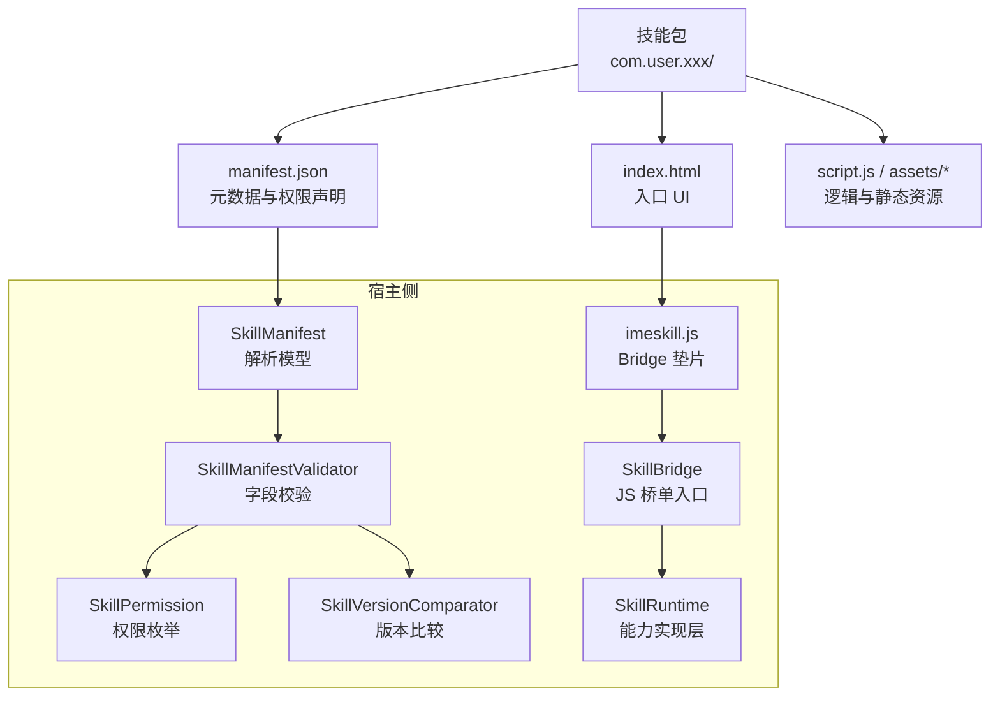
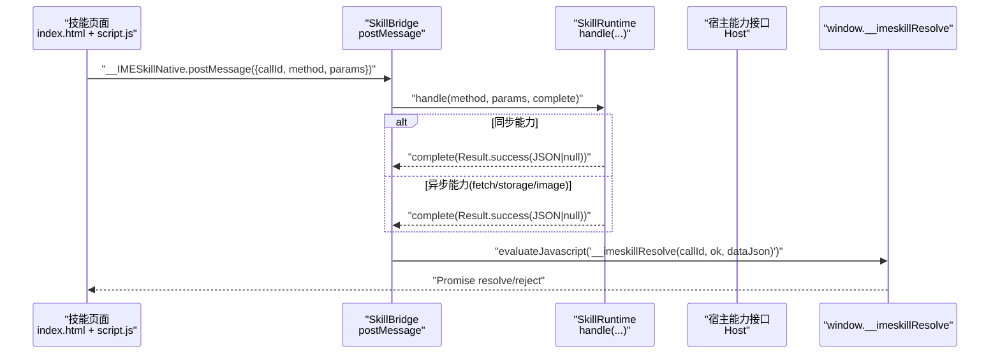
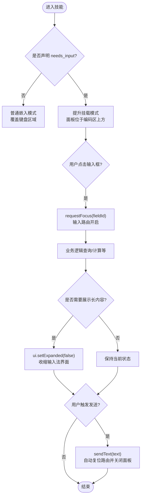
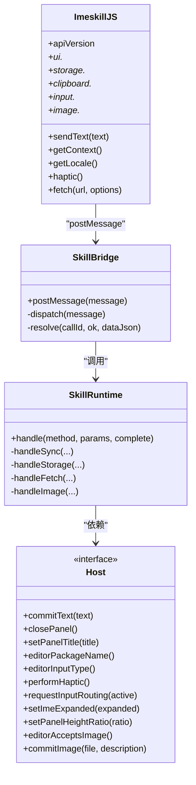

# 开发指南

<cite>
**本文引用的文件**   
- [SkillManifest.kt](file://core-logic/src/main/java/com/ziyou/ime/core/skill/SkillManifest.kt)
- [SkillManifestValidator.kt](file://core-logic/src/main/java/com/ziyou/ime/core/skill/SkillManifestValidator.kt)
- [SkillPermission.kt](file://core-logic/src/main/java/com/ziyou/ime/core/skill/SkillPermission.kt)
- [SkillVersionComparator.kt](file://core-logic/src/main/java/com/ziyou/ime/core/skill/SkillVersionComparator.kt)
- [imeskill.js](file://app/src/main/assets/skill_runtime/imeskill.js)
- [SkillBridge.kt](file://app/src/main/java/com/ziyou/ime/skill/SkillBridge.kt)
- [SkillRuntime.kt](file://app/src/main/java/com/ziyou/ime/skill/SkillRuntime.kt)
- [manifest.json（计算器）](file://app/src/main/assets/skills/calculator/manifest.json)
- [index.html（计算器）](file://app/src/main/assets/skills/calculator/index.html)
- [manifest.json（天气）](file://app/src/main/assets/skills/weather/manifest.json)
- [index.html（天气）](file://app/src/main/assets/skills/weather/index.html)
- [manifest.json（星座）](file://skills-dev/com.user.constellation/manifest.json)
- [index.html（星座）](file://skills-dev/com.user.constellation/index.html)
- [script.js（星座）](file://skills-dev/com.user.constellation/script.js)
</cite>

## 目录
1. [引言](#引言)
2. [项目结构](#项目结构)
3. [核心组件](#核心组件)
4. [架构总览](#架构总览)
5. [详细组件分析](#详细组件分析)
6. [依赖关系分析](#依赖关系分析)
7. [性能考量](#性能考量)
8. [故障排查指南](#故障排查指南)
9. [结论](#结论)
10. [附录](#附录)

## 引言
本指南面向技能插件开发者，系统性说明 manifest.json 配置字段与校验规则、HTML/CSS/JavaScript 开发模板与最佳实践、JS Bridge API 参考，以及计算器、天气、星座等示例的源码分析与开发步骤。读者无需深入 Android 或 Kotlin 即可上手开发高质量技能插件。

## 项目结构
技能插件以“包”为单位组织：每个技能是一个目录（分发时打包为 .skill），包含 manifest.json、入口 HTML、可选脚本与资源。宿主在加载技能前对包体进行严格校验，确保路径安全、字段合法、权限受控。

图示来源
- [SkillManifest.kt:1-51](file://core-logic/src/main/java/com/ziyou/ime/core/skill/SkillManifest.kt#L1-L51)
- [SkillManifestValidator.kt:1-78](file://core-logic/src/main/java/com/ziyou/ime/core/skill/SkillManifestValidator.kt#L1-L78)
- [SkillPermission.kt:1-27](file://core-logic/src/main/java/com/ziyou/ime/core/skill/SkillPermission.kt#L1-L27)
- [SkillVersionComparator.kt:1-30](file://core-logic/src/main/java/com/ziyou/ime/core/skill/SkillVersionComparator.kt#L1-L30)
- [imeskill.js:1-164](file://app/src/main/assets/skill_runtime/imeskill.js#L1-L164)
- [SkillBridge.kt:1-99](file://app/src/main/java/com/ziyou/ime/skill/SkillBridge.kt#L1-L99)
- [SkillRuntime.kt:1-521](file://app/src/main/java/com/ziyou/ime/skill/SkillRuntime.kt#L1-L521)

章节来源
- [SkillManifest.kt:1-51](file://core-logic/src/main/java/com/ziyou/ime/core/skill/SkillManifest.kt#L1-L51)
- [SkillManifestValidator.kt:1-78](file://core-logic/src/main/java/com/ziyou/ime/core/skill/SkillManifestValidator.kt#L1-L78)
- [SkillPermission.kt:1-27](file://core-logic/src/main/java/com/ziyou/ime/core/skill/SkillPermission.kt#L1-L27)
- [SkillVersionComparator.kt:1-30](file://core-logic/src/main/java/com/ziyou/ime/core/skill/SkillVersionComparator.kt#L1-L30)

## 核心组件
- SkillManifest：manifest.json 的纯数据模型，包含 id、name、version、min_host_api、entry、panel_mode、permissions、network_domains、needs_input 等字段。
- SkillManifestValidator：字段合法性校验器，负责版本兼容检查、id/name/version 格式、entry 路径安全、权限与域名白名单一致性等。
- SkillPermission：权限枚举（network、clipboard_read、clipboard_write、storage、image）。
- SkillVersionComparator：版本号比较与升级判定（严格更高才允许覆盖安装）。
- imeskill.js：Bridge 垫片，向页面注入 window.IMESkill，统一 Promise 化调用。
- SkillBridge：JS 桥单入口，接收 postMessage，调度到运行时并异步回传结果。
- SkillRuntime：能力实现层，承载权限检查、storage 限额、fetch 代理、剪贴板、输入路由、图片输出等。

章节来源
- [SkillManifest.kt:1-51](file://core-logic/src/main/java/com/ziyou/ime/core/skill/SkillManifest.kt#L1-L51)
- [SkillManifestValidator.kt:1-78](file://core-logic/src/main/java/com/ziyou/ime/core/skill/SkillManifestValidator.kt#L1-L78)
- [SkillPermission.kt:1-27](file://core-logic/src/main/java/com/ziyou/ime/core/skill/SkillPermission.kt#L1-L27)
- [SkillVersionComparator.kt:1-30](file://core-logic/src/main/java/com/ziyou/ime/core/skill/SkillVersionComparator.kt#L1-L30)
- [imeskill.js:1-164](file://app/src/main/assets/skill_runtime/imeskill.js#L1-L164)
- [SkillBridge.kt:1-99](file://app/src/main/java/com/ziyou/ime/skill/SkillBridge.kt#L1-L99)
- [SkillRuntime.kt:1-521](file://app/src/main/java/com/ziyou/ime/skill/SkillRuntime.kt#L1-L521)

## 架构总览
技能运行时的关键交互链路如下：页面通过 IMESkill 垫片发起调用 → Bridge 接收并校验消息 → Runtime 执行能力（含权限/限额/网络/存储/输入路由/图片）→ 通过 evaluateJavascript 将结果异步返回给页面 Promise。

图示来源
- [SkillBridge.kt:1-99](file://app/src/main/java/com/ziyou/ime/skill/SkillBridge.kt#L1-L99)
- [SkillRuntime.kt:1-521](file://app/src/main/java/com/ziyou/ime/skill/SkillRuntime.kt#L1-L521)
- [imeskill.js:1-164](file://app/src/main/assets/skill_runtime/imeskill.js#L1-L164)

## 详细组件分析

### manifest.json 字段定义与验证规则
- 字段定义
  - manifest_version：固定为 1，其他值拒绝加载。
  - id：反向域名风格，至少两段，小写字母开头，可含数字/下划线；≤100 字符。
  - name：展示名，非空且 ≤30 字符。
  - version：数字点分（如 1.0.0），不支持字母后缀。
  - min_host_api：最低宿主 API 版本，高于宿主当前版本（v4）则拒绝加载。
  - author/description/icon_text：可选。
  - entry：入口 HTML 相对路径，必须以 .html 结尾，且为安全相对路径。
  - panel_mode：embed 或 card。
  - permissions：权限数组，未知 id 整包拒绝。
  - network_domains：域名白名单（≤10 个），仅当声明 network 权限时允许非空；只写域名，子域需显式列出。
  - needs_input：true 时启用面板内输入路由（Phase 3）。
- 校验规则
  - 版本兼容性：SUPPORTED_MANIFEST_VERSION=1；HOST_API_VERSION=4。
  - id/name/version 正则校验与长度限制。
  - entry 安全路径与扩展名校验。
  - permissions 与 network_domains 一致性校验。
  - 域名白名单格式校验（禁止协议/路径/通配符）。

章节来源
- [SkillManifest.kt:1-51](file://core-logic/src/main/java/com/ziyou/ime/core/skill/SkillManifest.kt#L1-L51)
- [SkillManifestValidator.kt:1-78](file://core-logic/src/main/java/com/ziyou/ime/core/skill/SkillManifestValidator.kt#L1-L78)
- [manifest.json（计算器）:1-14](file://app/src/main/assets/skills/calculator/manifest.json#L1-L14)
- [manifest.json（天气）:1-16](file://app/src/main/assets/skills/weather/manifest.json#L1-L16)
- [manifest.json（星座）:1-15](file://skills-dev/com.user.constellation/manifest.json#L1-L15)

### 权限模型与版本比较
- 权限枚举
  - network：经宿主代理的网络请求（配合 networkDomains 白名单）。
  - clipboard_read / clipboard_write：读/写剪贴板。
  - storage：轻量 KV 持久化（每技能独立空间，限额见运行时）。
  - image：图片输出（API v3）。
- 版本比较
  - 按段数值比较，缺段视为 0（1.0 == 1.0.0）。
  - isUpgrade：新版本必须严格更高才允许覆盖安装。

章节来源
- [SkillPermission.kt:1-27](file://core-logic/src/main/java/com/ziyou/ime/core/skill/SkillPermission.kt#L1-L27)
- [SkillVersionComparator.kt:1-30](file://core-logic/src/main/java/com/ziyou/ime/core/skill/SkillVersionComparator.kt#L1-L30)

### JS Bridge 垫片与通信机制
- 垫片职责
  - 全局唯一注入 window.IMESkill，所有方法返回 Promise。
  - 通过 __IMESkillNative.postMessage 单入口发送消息，使用 callId 关联响应。
  - 输入路由：__imeskillInput.commit/backspace 由宿主回调，垫片按 value+光标位置插入文本并派发 input 事件。
- 通信流程
  - 页面调用 IMESkill.* → 生成 callId 与 pending 任务 → postMessage → 宿主处理 → evaluateJavascript("__imeskillResolve(...)") → Promise resolve/reject。

章节来源
- [imeskill.js:1-164](file://app/src/main/assets/skill_runtime/imeskill.js#L1-L164)
- [SkillBridge.kt:1-99](file://app/src/main/java/com/ziyou/ime/skill/SkillBridge.kt#L1-L99)

### 运行时能力实现（SkillRuntime）
- 同步能力
  - sendText：上屏并关闭面板；若输入路由仍激活会先复位。
  - getContext/getLocale/haptic/ui.setTitle/ui.close/ui.setExpanded/ui.setPanelHeight。
  - clipboard.read/write：需对应权限。
  - input.requestFocus/releaseFocus：需 manifest.needs_input。
- 异步能力
  - storage.get/set/remove：IO 串行，总量 1MB 限额。
  - fetch：强制 HTTPS、白名单精确匹配、禁重定向、超时 10s、响应 ≤1MB、频控 30 次/分钟、并发 ≤2。
  - image.send/saveToGallery：仅 PNG（文件头魔数校验），send 需编辑框接受 image 类型，saveToGallery 需 Android 10+。
- 错误处理
  - 统一抛 SkillApiException，message 透传给脚本 reject。
  - Bridge 层异常兜底，避免技能崩溃波及宿主。

章节来源
- [SkillRuntime.kt:1-521](file://app/src/main/java/com/ziyou/ime/skill/SkillRuntime.kt#L1-L521)

### 示例一：计算器（embed 模式，零权限）
- 特点
  - 无网络与存储权限，纯本地计算。
  - CSP 禁用 eval，采用双栈算符优先求值。
  - 使用 haptic 震动反馈与 sendText 一键上屏。
- 布局要点
  - 顶部显示区为宿主悬浮角标让位（左「‹ 计算器」/ 右「✕」）。
  - 网格按键自适应高度，矮屏压缩字号与间距。

章节来源
- [index.html（计算器）:1-202](file://app/src/main/assets/skills/calculator/index.html#L1-L202)
- [manifest.json（计算器）:1-14](file://app/src/main/assets/skills/calculator/manifest.json#L1-L14)

### 示例二：天气查询（card 模式，network + storage）
- 特点
  - 使用 IMESkill.fetch 访问 wttr.in（需 network 权限与域名白名单）。
  - 使用 storage 记忆最近城市。
  - 点击结果卡片 sendText 上屏并自动收起面板。
- 交互建议
  - 无输入需求时使用预设城市按钮，避免声明 needs_input。

章节来源
- [index.html（天气）:1-125](file://app/src/main/assets/skills/weather/index.html#L1-L125)
- [manifest.json（天气）:1-16](file://app/src/main/assets/skills/weather/manifest.json#L1-L16)

### 示例三：星座查询（needs_input + 输入路由 + setExpanded）
- 特点
  - 离线数据，无需 network 权限。
  - 使用 input.requestFocus/releaseFocus 实现面板内输入。
  - 查询成功后 ui.setExpanded(false) 收缩输入法界面，面板接管全部空间展示长内容。
- 交互流程
  - 输入阶段 → 查询阶段 → 展示阶段 → 发送阶段（sendText 直达聊天框并自动收起面板）。

章节来源
- [index.html（星座）:1-68](file://skills-dev/com.user.constellation/index.html#L1-L68)
- [script.js（星座）:1-220](file://skills-dev/com.user.constellation/script.js#L1-L220)
- [manifest.json（星座）:1-15](file://skills-dev/com.user.constellation/manifest.json#L1-L15)

### 概念总览
- 面板形态切换
  - embed/card 决定语义差异；needs_input 提升挂载至编码区上方。
  - setExpanded(false) 收缩整个输入法界面，面板接管其空间（IME 窗口总高不变）。
- 输入路由
  - 键盘上屏文本改道注入面板指定元素，支持中文候选与退格。
  - requestFocus 后自动恢复完整界面；releaseFocus 或 sendText 后恢复直达宿主编辑器。

[此图为概念流程图，不直接映射具体代码文件]

## 依赖关系分析
- 组件耦合
  - SkillBridge 依赖 SkillRuntime 与 WebViewProvider，仅暴露 postMessage 单入口。
  - SkillRuntime 依赖宿主 Host 接口（commitText/closePanel/performHaptic/requestInputRouting/setImeExpanded/setPanelHeightRatio/editorAcceptsImage/commitImage）。
  - 页面通过 imeskill.js 与 Bridge 解耦，避免直接暴露原生方法。
- 外部依赖
  - 网络：HttpURLConnection（fetch 代理）。
  - 系统服务：ClipboardManager、MediaStore（相册写入）、EditorInfo（富媒体支持检测）。
- 潜在循环依赖
  - 无循环依赖；Bridge/Runtime/页面分层清晰。

图示来源
- [SkillBridge.kt:1-99](file://app/src/main/java/com/ziyou/ime/skill/SkillBridge.kt#L1-L99)
- [SkillRuntime.kt:1-521](file://app/src/main/java/com/ziyou/ime/skill/SkillRuntime.kt#L1-L521)
- [imeskill.js:1-164](file://app/src/main/assets/skill_runtime/imeskill.js#L1-L164)

章节来源
- [SkillBridge.kt:1-99](file://app/src/main/java/com/ziyou/ime/skill/SkillBridge.kt#L1-L99)
- [SkillRuntime.kt:1-521](file://app/src/main/java/com/ziyou/ime/skill/SkillRuntime.kt#L1-L521)

## 性能考量
- 网络请求
  - 超时 10s、响应 ≤1MB、频控 30 次/分钟、并发 ≤2，避免阻塞主线程。
- 存储
  - 序列化后总量 1MB 限额；读写走 IO 串行调度器，保证顺序与稳定性。
- 图片输出
  - 仅 PNG，Base64 单消息 512KB 上限；超大图需降分辨率重绘。
- 输入路由
  - 仅在需要自由输入时启用，减少不必要的布局切换与焦点管理开销。

章节来源
- [SkillRuntime.kt:1-521](file://app/src/main/java/com/ziyou/ime/skill/SkillRuntime.kt#L1-L521)

## 故障排查指南
- 常见错误与定位
  - 权限拒绝：检查 manifest.permissions 是否包含所需权限。
  - 域名不在白名单：确认 network_domains 精确匹配目标域名。
  - 请求过于频繁/并发超限：降低调用频率或合并请求。
  - 存储超限：清理历史数据或优化 JSON 体积。
  - 文本超长/为空：限制 sendText 长度与参数校验。
  - 未声明 needs_input：如需面板输入，需在 manifest 中声明。
- 调试建议
  - 浏览器预调：添加 mock 垫片模拟 IMESkill。
  - 真机调试：Chrome DevTools 远程调试 WebView。
  - Logcat：关注 SkillManager/SkillBridge/SkillRuntime/SkillWebViewFactory/SkillPackageInstaller。

章节来源
- [SkillRuntime.kt:1-521](file://app/src/main/java/com/ziyou/ime/skill/SkillRuntime.kt#L1-L521)
- [SkillBridge.kt:1-99](file://app/src/main/java/com/ziyou/ime/skill/SkillBridge.kt#L1-L99)

## 结论
本指南系统化阐述了技能插件的 manifest 规范、Bridge API、运行时能力与安全边界，并通过计算器、天气、星座三个示例展示了从零到一的开发路径。遵循本文的最佳实践与校验规则，可快速构建稳定、安全、易用的技能插件。

## 附录
- 开发模板与最佳实践
  - 使用 flex/grid 纵向自适应布局，避免写死高度。
  - 顶部为宿主悬浮角标让位（左侧约 90px、右侧约 40px）。
  - 背景透明或半透明灰，自动融入主题。
  - 按钮触摸目标 ≥40px，根字号 14~17px。
  - 内容超出时设置 overflow-y:auto。
- 安装与调试
  - 图形化导入 .skill 文件或从 URL 导入。
  - 开发者侧载：adb push/run-as 快速迭代。
  - Chrome DevTools 远程调试 WebView。

[本节为通用指导，不直接分析具体文件]