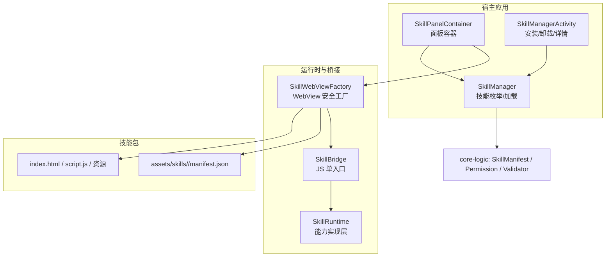
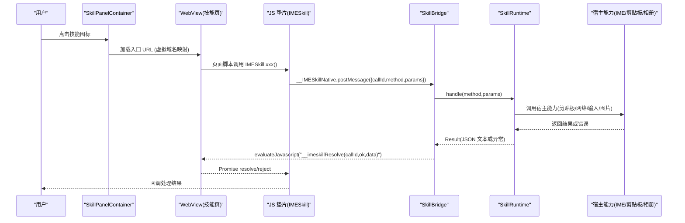
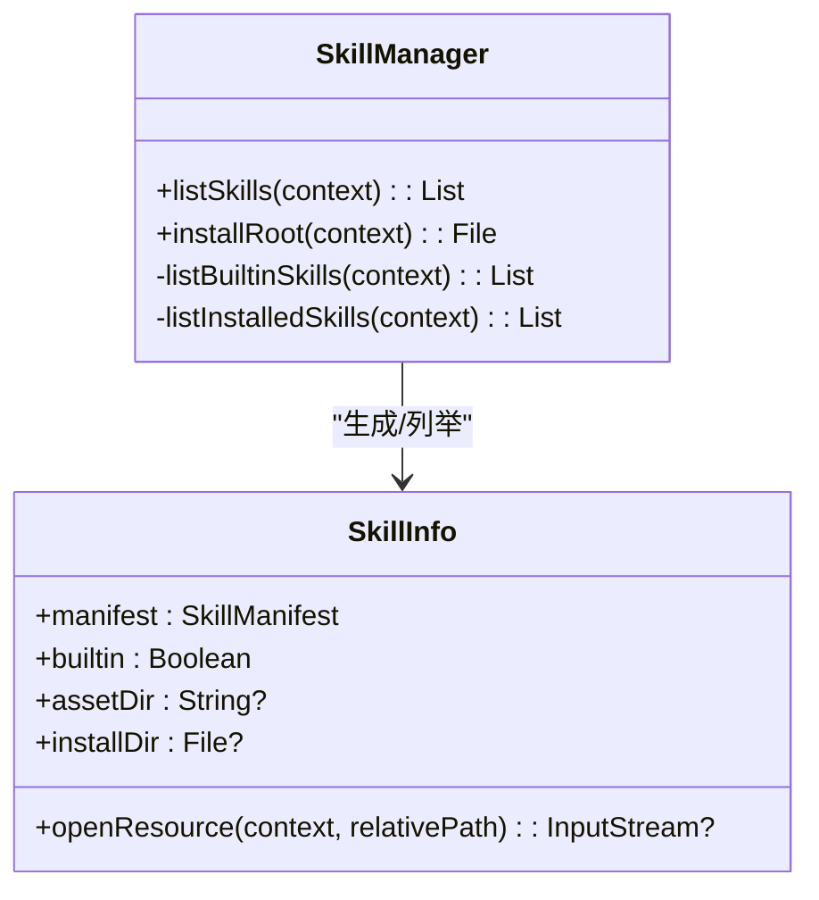
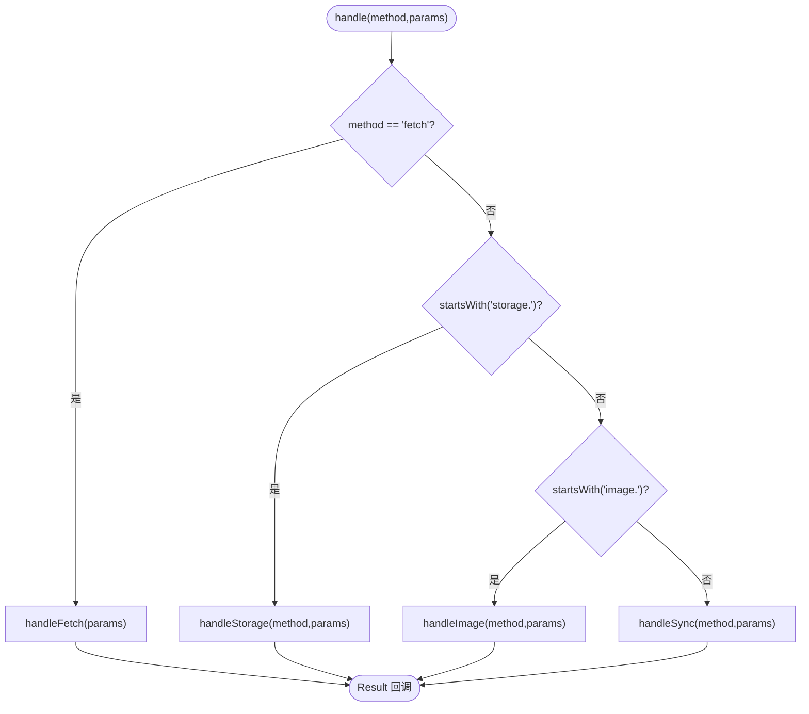
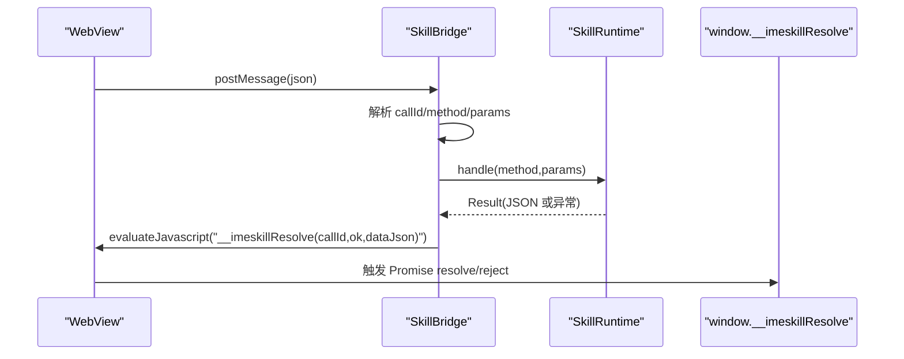
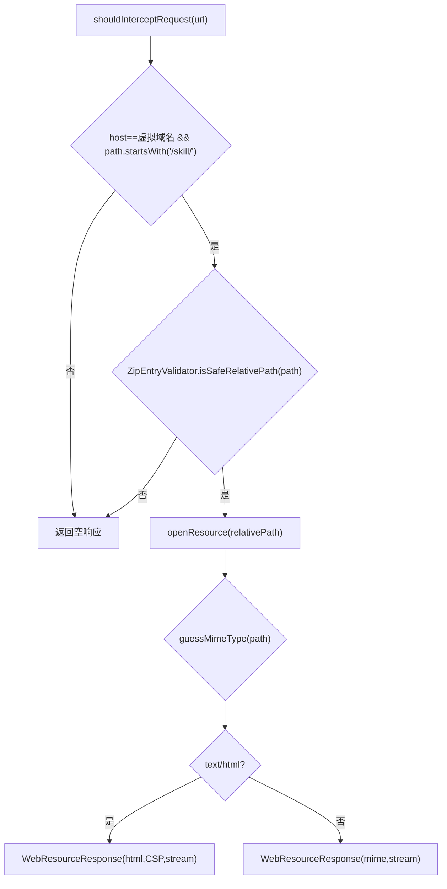
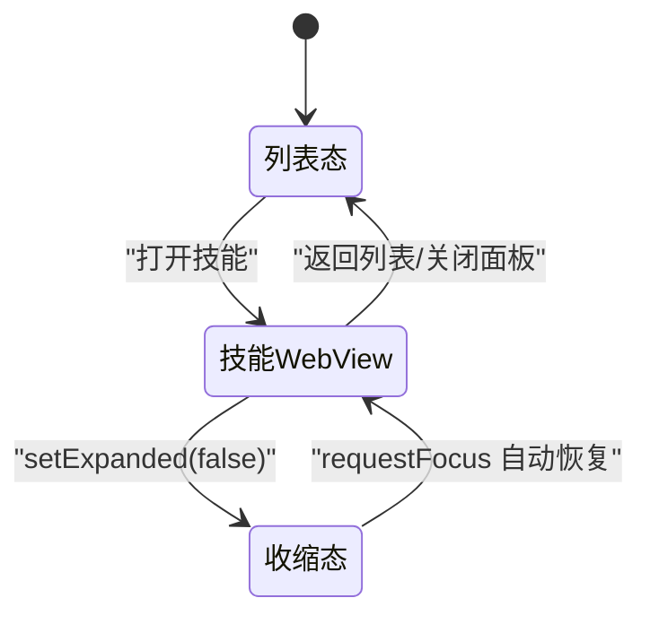
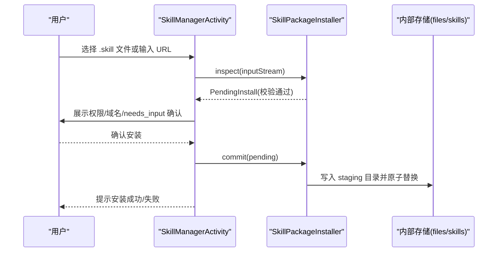
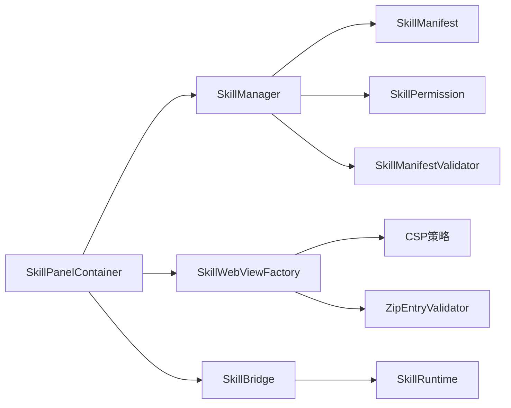

# 技能插件系统

<cite>
**本文引用的文件**   
- [SkillManager.kt](file://app/src/main/java/com/ziyou/ime/skill/SkillManager.kt)
- [SkillRuntime.kt](file://app/src/main/java/com/ziyou/ime/skill/SkillRuntime.kt)
- [SkillBridge.kt](file://app/src/main/java/com/ziyou/ime/skill/SkillBridge.kt)
- [SkillWebViewFactory.kt](file://app/src/main/java/com/ziyou/ime/skill/SkillWebViewFactory.kt)
- [imeskill.js](file://app/src/main/assets/skill_runtime/imeskill.js)
- [SkillManifest.kt](file://core-logic/src/main/java/com/ziyou/ime/core/skill/SkillManifest.kt)
- [SkillPermission.kt](file://core-logic/src/main/java/com/ziyou/ime/core/skill/SkillPermission.kt)
- [SkillManifestValidator.kt](file://core-logic/src/main/java/com/ziyou/ime/core/skill/SkillManifestValidator.kt)
- [SkillPanelContainer.kt](file://app/src/main/java/com/ziyou/ime/ime/SkillPanelContainer.kt)
- [SkillManagerActivity.kt](file://app/src/main/java/com/ziyou/ime/ui/SkillManagerActivity.kt)
- [manifest.json（计算器）](file://app/src/main/assets/skills/calculator/manifest.json)
- [manifest.json（天气）](file://app/src/main/assets/skills/weather/manifest.json)
- [manifest.json（星座示例）](file://skills-dev/com.user.constellation/manifest.json)
- [开发指南.md](file://docs/技能插件开发指南.md)
</cite>

## 目录
1. [简介](#简介)
2. [项目结构](#项目结构)
3. [核心组件](#核心组件)
4. [架构总览](#架构总览)
5. [详细组件分析](#详细组件分析)
6. [依赖关系分析](#依赖关系分析)
7. [性能与限制](#性能与限制)
8. [故障排查指南](#故障排查指南)
9. [结论](#结论)
10. [附录：开发指南与最佳实践](#附录开发指南与最佳实践)

## 简介
本文件系统性地梳理字由输入法的“技能插件系统”，围绕基于 WebView 的可扩展技能面板，深入解析内置技能（计算器、天气、星座等）的实现方式，以及插件生命周期管理、安全沙箱机制、JS Bridge 通信协议。文档同时覆盖插件安装流程、权限控制、资源隔离策略，并提供完整的开发指南（manifest 配置、API 调用、UI 设计模式），帮助开发者快速创建自定义技能插件。

## 项目结构
技能插件系统由“宿主层（Android/Kotlin）+ 运行时（Kotlin）+ 桥接层（JS 垫片 + WebView）+ 技能包（HTML/JS/CSS/资源）”组成。关键目录与职责如下：
- app/src/main/java/com/ziyou/ime/skill：技能管理器、运行时、桥接、WebView 工厂
- core-logic/src/main/java/com/ziyou/ime/core/skill：技能元数据模型、权限枚举、校验器
- app/src/main/assets/skills：内置技能包（每个技能一个目录，含 manifest.json 与入口 HTML）
- app/src/main/assets/skill_runtime：注入到页面的 JS 垫片 imeskill.js
- app/src/main/java/com/ziyou/ime/ime：技能面板容器（列表与 WebView 容器、输入路由）
- app/src/main/java/com/ziyou/ime/ui：技能管理页面（导入、卸载、详情）
- skills-dev：用户侧开发示例（如星座查询）

**图表来源** 
- [SkillPanelContainer.kt](file://app/src/main/java/com/ziyou/ime/ime/SkillPanelContainer.kt)
- [SkillManager.kt](file://app/src/main/java/com/ziyou/ime/skill/SkillManager.kt)
- [SkillWebViewFactory.kt](file://app/src/main/java/com/ziyou/ime/skill/SkillWebViewFactory.kt)
- [SkillBridge.kt](file://app/src/main/java/com/ziyou/ime/skill/SkillBridge.kt)
- [SkillRuntime.kt](file://app/src/main/java/com/ziyou/ime/skill/SkillRuntime.kt)
- [SkillManifest.kt](file://core-logic/src/main/java/com/ziyou/ime/core/skill/SkillManifest.kt)
- [SkillPermission.kt](file://core-logic/src/main/java/com/ziyou/ime/core/skill/SkillPermission.kt)
- [SkillManifestValidator.kt](file://core-logic/src/main/java/com/ziyou/ime/core/skill/SkillManifestValidator.kt)

**章节来源**
- [SkillManager.kt](file://app/src/main/java/com/ziyou/ime/skill/SkillManager.kt)
- [SkillPanelContainer.kt](file://app/src/main/java/com/ziyou/ime/ime/SkillPanelContainer.kt)
- [SkillManagerActivity.kt](file://app/src/main/java/com/ziyou/ime/ui/SkillManagerActivity.kt)

## 核心组件
- 技能信息与管理：SkillInfo、SkillManager（列举内置与已安装技能，统一资源读取入口）
- 运行时能力：SkillRuntime（权限检查、storage 限额、fetch 代理、剪贴板、输入路由、图片输出）
- JS 桥接：SkillBridge（单入口 postMessage，异步 resolve/reject，线程切换与异常兜底）
- WebView 工厂：SkillWebViewFactory（安全基线、资源拦截、CSP、崩溃隔离、垫片注入）
- 元数据与权限：SkillManifest、SkillPermission、SkillManifestValidator（字段校验、版本协商）
- 面板容器：SkillPanelContainer（列表与 WebView 容器、悬浮角标、输入路由、生命周期管理）
- 安装管理：SkillManagerActivity（本地/URL 导入、权限确认、安装/卸载）

**章节来源**
- [SkillManager.kt](file://app/src/main/java/com/ziyou/ime/skill/SkillManager.kt)
- [SkillRuntime.kt](file://app/src/main/java/com/ziyou/ime/skill/SkillRuntime.kt)
- [SkillBridge.kt](file://app/src/main/java/com/ziyou/ime/skill/SkillBridge.kt)
- [SkillWebViewFactory.kt](file://app/src/main/java/com/ziyou/ime/skill/SkillWebViewFactory.kt)
- [SkillManifest.kt](file://core-logic/src/main/java/com/ziyou/ime/core/skill/SkillManifest.kt)
- [SkillPermission.kt](file://core-logic/src/main/java/com/ziyou/ime/core/skill/SkillPermission.kt)
- [SkillManifestValidator.kt](file://core-logic/src/main/java/com/ziyou/ime/core/skill/SkillManifestValidator.kt)
- [SkillPanelContainer.kt](file://app/src/main/java/com/ziyou/ime/ime/SkillPanelContainer.kt)
- [SkillManagerActivity.kt](file://app/src/main/java/com/ziyou/ime/ui/SkillManagerActivity.kt)

## 架构总览
技能面板以 WebView 为载体，通过 JS 垫片暴露 IMESkill API；宿主侧以 SkillBridge 作为唯一入口，将调用转发至 SkillRuntime 执行具体能力；WebView 资源请求全量拦截，仅允许访问技能包内相对路径，并附加 CSP 策略；面板容器负责 UI 挂载、悬浮角标、输入路由与生命周期。

**图表来源** 
- [SkillPanelContainer.kt](file://app/src/main/java/com/ziyou/ime/ime/SkillPanelContainer.kt)
- [SkillWebViewFactory.kt](file://app/src/main/java/com/ziyou/ime/skill/SkillWebViewFactory.kt)
- [SkillBridge.kt](file://app/src/main/java/com/ziyou/ime/skill/SkillBridge.kt)
- [SkillRuntime.kt](file://app/src/main/java/com/ziyou/ime/skill/SkillRuntime.kt)
- [imeskill.js](file://app/src/main/assets/skill_runtime/imeskill.js)

## 详细组件分析

### 技能信息与枚举（SkillInfo / SkillManager）
- SkillInfo：封装 manifest 与资源来源（内置 assets 或用户安装 files），提供 openResource 统一读取入口，并对安装目录进行 canonicalPath 校验防 Zip Slip。
- SkillManager：扫描 assets/skills 与 files/skills，解析 manifest 并排序列出；非法 manifest 记录日志跳过，不影响其他技能。

**图表来源** 
- [SkillManager.kt](file://app/src/main/java/com/ziyou/ime/skill/SkillManager.kt)

**章节来源**
- [SkillManager.kt](file://app/src/main/java/com/ziyou/ime/skill/SkillManager.kt)

### 运行时能力（SkillRuntime）
- 同步能力：sendText、getContext、getLocale、haptic、ui.*、clipboard.*、input.* 等，立即完成。
- 异步能力：storage.*（串行 IO）、image.*（PNG 校验、commitContent/相册写入）、fetch（HTTPS、白名单、频控/并发/超时/响应大小）。
- 权限校验：requirePermission 基于 manifest.permissions；未知方法抛错。
- 资源隔离：storage 按 skill id 独立 JSON 文件，总量 1MB；图片经共享缓存目录提交。

**图表来源** 
- [SkillRuntime.kt](file://app/src/main/java/com/ziyou/ime/skill/SkillRuntime.kt)

**章节来源**
- [SkillRuntime.kt](file://app/src/main/java/com/ziyou/ime/skill/SkillRuntime.kt)

### JS 桥接（SkillBridge）
- 单入口 postMessage：消息体包含 callId/method/params，全部异步 resolve/reject。
- 线程模型：WebView 线程接收 → 主线程分发 → 结果回传 evaluateJavascript。
- 异常兜底：内部错误统一包装为通用 message，避免波及 IME 主进程。

**图表来源** 
- [SkillBridge.kt](file://app/src/main/java/com/ziyou/ime/skill/SkillBridge.kt)
- [SkillRuntime.kt](file://app/src/main/java/com/ziyou/ime/skill/SkillRuntime.kt)
- [imeskill.js](file://app/src/main/assets/skill_runtime/imeskill.js)

**章节来源**
- [SkillBridge.kt](file://app/src/main/java/com/ziyou/ime/skill/SkillBridge.kt)

### WebView 安全工厂（SkillWebViewFactory）
- 资源拦截：仅放行虚拟域名下的技能包内相对路径，其余请求返回空响应。
- CSP 注入：default-src/self、script-src/self+'unsafe-inline'、connect-src'none'，禁用 eval/new Function。
- 垫片注入：优先 DOCUMENT_START_SCRIPT，失败回退 onPageStarted。
- 崩溃隔离：onRenderProcessGone 销毁面板，IME 主进程存活。

**图表来源** 
- [SkillWebViewFactory.kt](file://app/src/main/java/com/ziyou/ime/skill/SkillWebViewFactory.kt)

**章节来源**
- [SkillWebViewFactory.kt](file://app/src/main/java/com/ziyou/ime/skill/SkillWebViewFactory.kt)

### 面板容器与输入路由（SkillPanelContainer）
- 列表与 WebView 容器：懒创建 WebView，用完即毁；悬浮角标原生绘制，z 序在 WebView 之上。
- 输入路由：skillCommitTarget 将键盘上屏文本注入面板输入框（__imeskillInput.commit/backspace）。
- 生命周期：打开技能时提升布局（needs_input），返回列表/关闭面板时恢复输入法界面与路由。

**图表来源** 
- [SkillPanelContainer.kt](file://app/src/main/java/com/ziyou/ime/ime/SkillPanelContainer.kt)

**章节来源**
- [SkillPanelContainer.kt](file://app/src/main/java/com/ziyou/ime/ime/SkillPanelContainer.kt)

### 安装与权限管理（SkillManagerActivity）
- 支持本地 .skill 文件与 HTTPS 直链导入。
- 两段式流水线：inspect（IO 校验）→ 用户确认弹窗 → commit（落盘 staging 原子替换）。
- 同 id 升级需版本号严格更高；内置技能不可覆盖。

**图表来源** 
- [SkillManagerActivity.kt](file://app/src/main/java/com/ziyou/ime/ui/SkillManagerActivity.kt)

**章节来源**
- [SkillManagerActivity.kt](file://app/src/main/java/com/ziyou/ime/ui/SkillManagerActivity.kt)

### 内置技能示例
- 计算器（embed，零权限）：纯本地计算，sendText 一键上屏。
- 天气（card，network+storage）：fetch 代理查询 wttr.in，storage 记忆常用城市。
- 星座（embed，storage，needs_input）：输入路由 + setExpanded 全流程。

**章节来源**
- [manifest.json（计算器）](file://app/src/main/assets/skills/calculator/manifest.json)
- [manifest.json（天气）](file://app/src/main/assets/skills/weather/manifest.json)
- [manifest.json（星座示例）](file://skills-dev/com.user.constellation/manifest.json)

## 依赖关系分析
- SkillPanelContainer 依赖 SkillManager（列举技能）、SkillWebViewFactory（创建 WebView）、SkillBridge/SkillRuntime（桥接与能力）。
- SkillManager 依赖 core-logic 的 SkillManifest/SkillPermission/SkillManifestValidator（元数据与校验）。
- SkillWebViewFactory 依赖 ZipEntryValidator（路径安全）与 CSP 策略。
- SkillRuntime 依赖宿主 Host 接口（IME/剪贴板/相册/输入路由）。

**图表来源** 
- [SkillPanelContainer.kt](file://app/src/main/java/com/ziyou/ime/ime/SkillPanelContainer.kt)
- [SkillManager.kt](file://app/src/main/java/com/ziyou/ime/skill/SkillManager.kt)
- [SkillWebViewFactory.kt](file://app/src/main/java/com/ziyou/ime/skill/SkillWebViewFactory.kt)
- [SkillBridge.kt](file://app/src/main/java/com/ziyou/ime/skill/SkillBridge.kt)
- [SkillRuntime.kt](file://app/src/main/java/com/ziyou/ime/skill/SkillRuntime.kt)
- [SkillManifest.kt](file://core-logic/src/main/java/com/ziyou/ime/core/skill/SkillManifest.kt)
- [SkillPermission.kt](file://core-logic/src/main/java/com/ziyou/ime/core/skill/SkillPermission.kt)
- [SkillManifestValidator.kt](file://core-logic/src/main/java/com/ziyou/ime/core/skill/SkillManifestValidator.kt)

**章节来源**
- [SkillPanelContainer.kt](file://app/src/main/java/com/ziyou/ime/ime/SkillPanelContainer.kt)
- [SkillManager.kt](file://app/src/main/java/com/ziyou/ime/skill/SkillManager.kt)
- [SkillWebViewFactory.kt](file://app/src/main/java/com/ziyou/ime/skill/SkillWebViewFactory.kt)
- [SkillBridge.kt](file://app/src/main/java/com/ziyou/ime/skill/SkillBridge.kt)
- [SkillRuntime.kt](file://app/src/main/java/com/ziyou/ime/skill/SkillRuntime.kt)
- [SkillManifest.kt](file://core-logic/src/main/java/com/ziyou/ime/core/skill/SkillManifest.kt)
- [SkillPermission.kt](file://core-logic/src/main/java/com/ziyou/ime/core/skill/SkillPermission.kt)
- [SkillManifestValidator.kt](file://core-logic/src/main/java/com/ziyou/ime/core/skill/SkillManifestValidator.kt)

## 性能与限制
- WebView 首帧闪烁防护：背景色填充 + 首帧前 INVISIBLE，减少黑屏。
- 资源无缓存：LOAD_NO_CACHE，避免 WebView 缓存膨胀。
- storage 串行 IO：limitedParallelism(1)，保证 set/remove 顺序。
- fetch 频控：滑动窗口 30 次/分钟，并发 ≤2，超时 10s，响应 ≤1MB。
- 图片 PNG 魔数校验：防止伪造 MIME；超大 base64 受 Bridge 单消息 512KB 限制。
- 渲染进程崩溃隔离：onRenderProcessGone 销毁面板，IME 主进程不受影响。

[本节为通用指导，不直接分析具体文件]

## 故障排查指南
- 常见错误定位：
  - manifest 校验失败：查看 logcat tag SkillManager，检查 id/name/version/entry/permissions/network_domains。
  - Bridge 调用异常：查看 SkillBridge 日志，确认 callId/method/params 合法。
  - fetch 失败：检查 HTTPS、白名单域名、频控/并发/超时/响应大小。
  - 图片发送失败：确认编辑器接受 image 类型、PNG 魔数校验、base64 体积。
- 调试建议：
  - 浏览器预调：使用本地 mock 垫片模拟 IMESkill。
  - 真机调试：debug 构建开启 WebView 远程调试，Chrome DevTools 连接 inspect。
  - 开发者侧载：adb 推送临时目录到 files/skills，快速迭代。

**章节来源**
- [SkillManager.kt](file://app/src/main/java/com/ziyou/ime/skill/SkillManager.kt)
- [SkillBridge.kt](file://app/src/main/java/com/ziyou/ime/skill/SkillBridge.kt)
- [SkillRuntime.kt](file://app/src/main/java/com/ziyou/ime/skill/SkillRuntime.kt)
- [SkillWebViewFactory.kt](file://app/src/main/java/com/ziyou/ime/skill/SkillWebViewFactory.kt)

## 结论
技能插件系统以 WebView 为核心载体，通过严格的资源拦截、CSP、权限校验与输入路由，实现了安全、可扩展的技能生态。运行时能力分层清晰（Bridge 搬运 + Runtime 业务），面板容器统一管理生命周期与 UI 挂载。内置技能覆盖了工具、网络、输入路由等典型场景，为第三方开发者提供了清晰的开发范式与最佳实践。

[本节为总结性内容，不直接分析具体文件]

## 附录：开发指南与最佳实践
- 技能包结构：manifest.json（必需）、index.html（必需）、script.js（可选）、assets（可选）。
- manifest 字段：manifest_version/id/name/version/min_host_api/author/description/icon_text/entry/panel_mode/permissions/network_domains/needs_input。
- Bridge API：sendText/getContext/getLocale/haptic/ui.* / storage.* / clipboard.* / input.* / fetch / image.*。
- 安全边界：外链 CDN 不可用、eval/new Function 禁用、localStorage 禁用、跳转封锁、崩溃隔离、反钓鱼角标。
- 开发流程：本地编写 → 浏览器预调 → 打包 .skill → 图形化导入/URL 导入 → 真机调试（DevTools/logcat）。
- 交互模式：无需输入时用按钮/预设选项；需要自由文本时使用 needs_input + input.requestFocus + setExpanded 四阶段流程。

**章节来源**
- [开发指南.md](file://docs/技能插件开发指南.md)
- [SkillManifest.kt](file://core-logic/src/main/java/com/ziyou/ime/core/skill/SkillManifest.kt)
- [SkillPermission.kt](file://core-logic/src/main/java/com/ziyou/ime/core/skill/SkillPermission.kt)
- [SkillManifestValidator.kt](file://core-logic/src/main/java/com/ziyou/ime/core/skill/SkillManifestValidator.kt)
- [imeskill.js](file://app/src/main/assets/skill_runtime/imeskill.js)