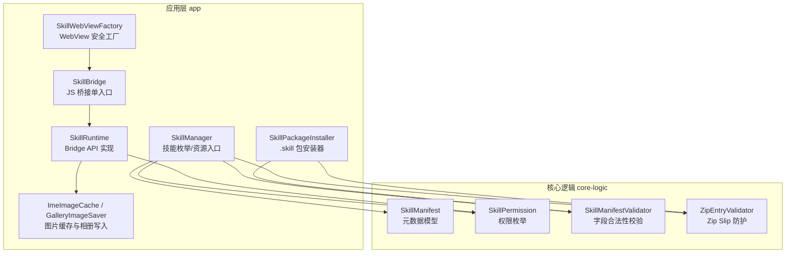
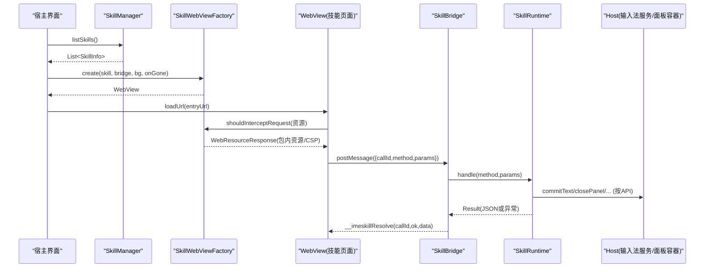
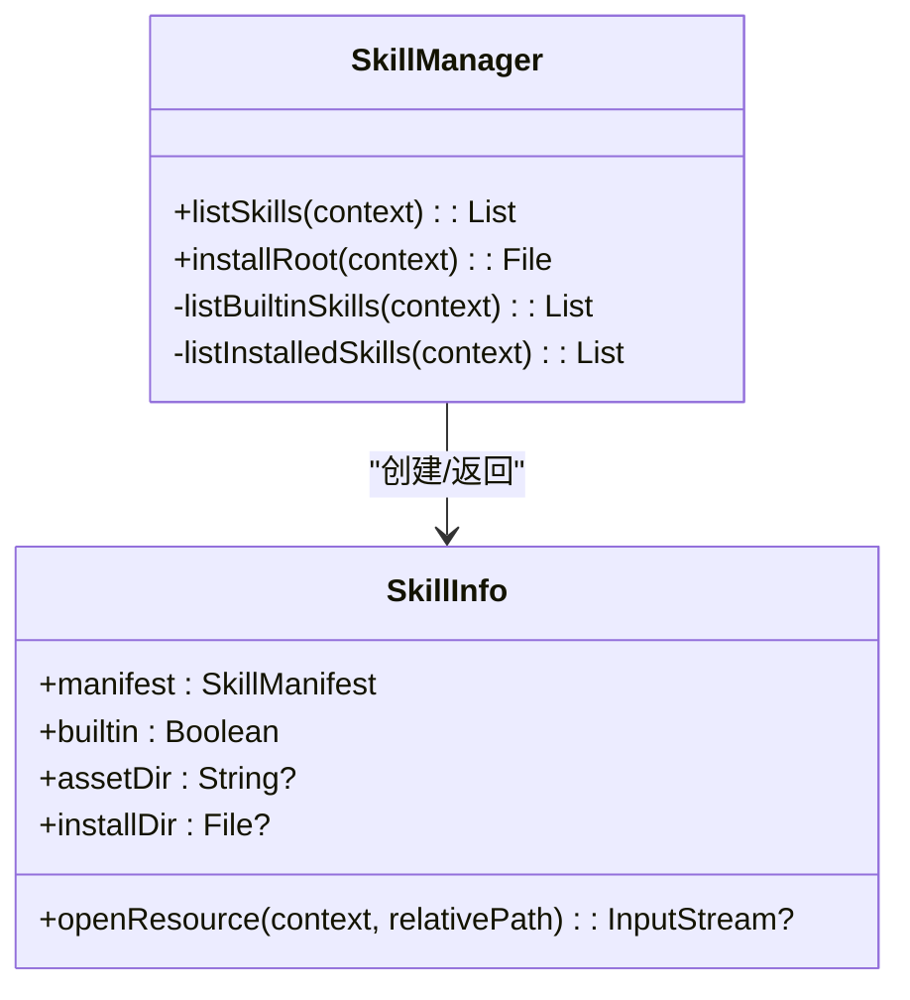
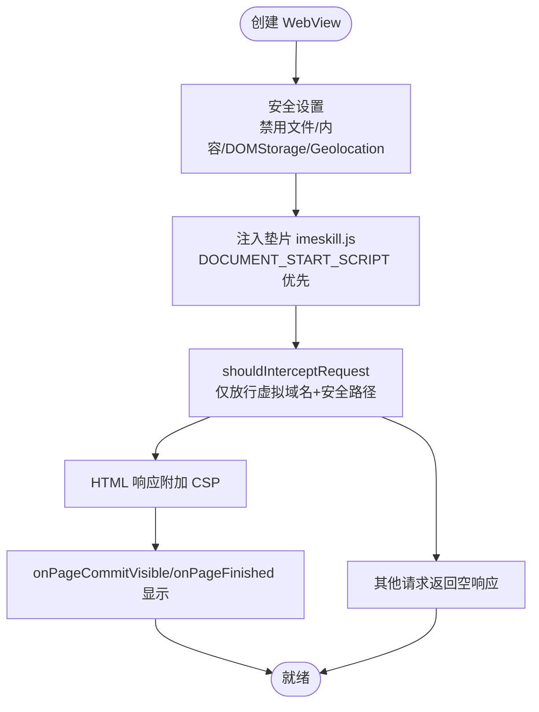
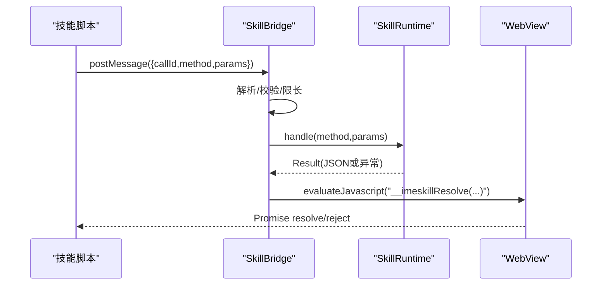
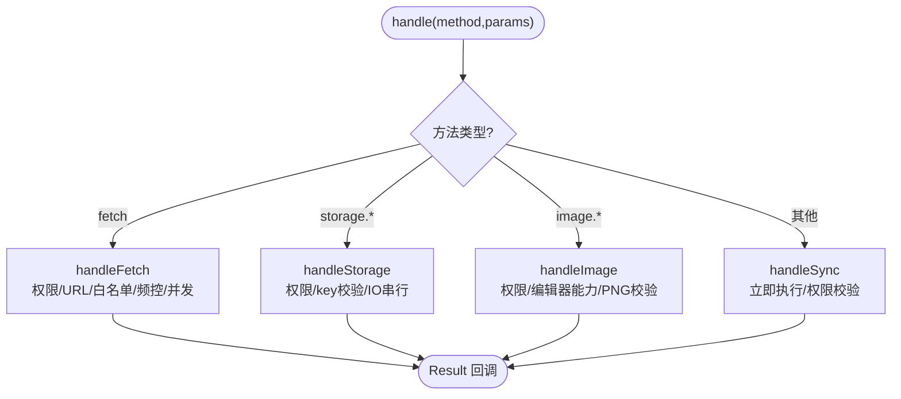
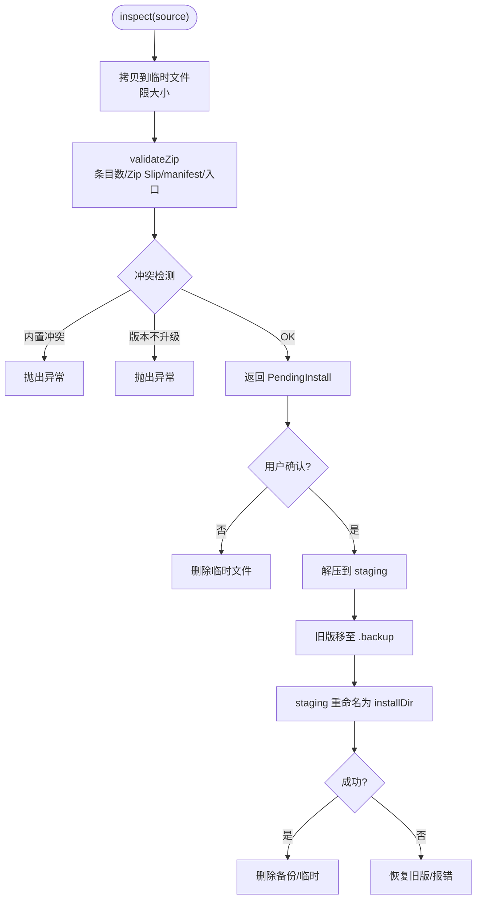
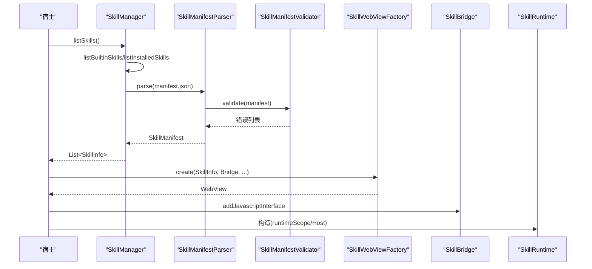
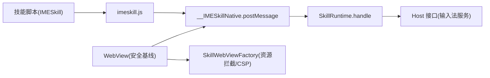
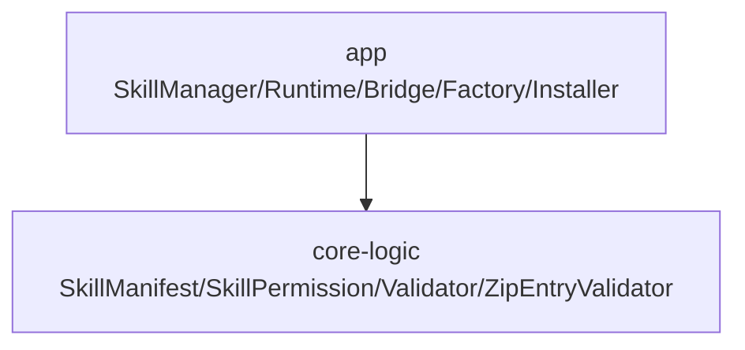

# 插件架构设计

<cite>
**本文引用的文件**   
- [SkillManager.kt](file://app/src/main/java/com/ziyou/ime/skill/SkillManager.kt)
- [SkillInfo.kt](file://app/src/main/java/com/ziyou/ime/skill/SkillManager.kt)
- [SkillManifestParser.kt](file://app/src/main/java/com/ziyou/ime/skill/SkillManifestParser.kt)
- [SkillRuntime.kt](file://app/src/main/java/com/ziyou/ime/skill/SkillRuntime.kt)
- [SkillBridge.kt](file://app/src/main/java/com/ziyou/ime/skill/SkillBridge.kt)
- [SkillWebViewFactory.kt](file://app/src/main/java/com/ziyou/ime/skill/SkillWebViewFactory.kt)
- [SkillPackageInstaller.kt](file://app/src/main/java/com/ziyou/ime/skill/SkillPackageInstaller.kt)
- [SkillManifest.kt](file://core-logic/src/main/java/com/ziyou/ime/core/skill/SkillManifest.kt)
- [SkillPermission.kt](file://core-logic/src/main/java/com/ziyou/ime/core/skill/SkillPermission.kt)
- [SkillManifestValidator.kt](file://core-logic/src/main/java/com/ziyou/ime/core/skill/SkillManifestValidator.kt)
- [ZipEntryValidator.kt](file://core-logic/src/main/java/com/ziyou/ime/core/skill/ZipEntryValidator.kt)
- [imeskill.js](file://app/src/main/assets/skill_runtime/imeskill.js)
- [calculator/index.html](file://app/src/main/assets/skills/calculator/index.html)
- [calculator/manifest.json](file://app/src/main/assets/skills/calculator/manifest.json)
</cite>

## 目录
1. [简介](#简介)
2. [项目结构](#项目结构)
3. [核心组件](#核心组件)
4. [架构总览](#架构总览)
5. [详细组件分析](#详细组件分析)
6. [依赖关系分析](#依赖关系分析)
7. [性能考量](#性能考量)
8. [故障排查指南](#故障排查指南)
9. [结论](#结论)
10. [附录](#附录)

## 简介
本文件面向技能插件系统的架构设计与实现，围绕基于 WebView 的可扩展插件体系，系统阐述 SkillInfo 数据模型、SkillManager 管理器设计、插件生命周期管理；统一内置与用户安装技能的抽象层；资源隔离机制与权限控制策略；以及宿主与应用间的通信与安全边界。文档包含架构图与数据流图，解释插件扫描、加载、初始化的完整流程，并给出可操作的最佳实践与排障建议。

## 项目结构
技能插件系统由“应用层（app）”和“核心逻辑层（core-logic）”组成：
- 应用层负责 WebView 安全配置、Bridge 注入、运行时能力实现、包安装器与技能枚举。
- 核心逻辑层提供纯数据模型与校验工具（manifest、权限、路径安全等），便于单测与跨模块复用。

图表来源
- [SkillManager.kt:1-110](file://app/src/main/java/com/ziyou/ime/skill/SkillManager.kt#L1-L110)
- [SkillRuntime.kt:1-521](file://app/src/main/java/com/ziyou/ime/skill/SkillRuntime.kt#L1-L521)
- [SkillBridge.kt:1-99](file://app/src/main/java/com/ziyou/ime/skill/SkillBridge.kt#L1-L99)
- [SkillWebViewFactory.kt:1-205](file://app/src/main/java/com/ziyou/ime/skill/SkillWebViewFactory.kt#L1-L205)
- [SkillPackageInstaller.kt:1-194](file://app/src/main/java/com/ziyou/ime/skill/SkillPackageInstaller.kt#L1-L194)
- [SkillManifest.kt:1-51](file://core-logic/src/main/java/com/ziyou/ime/core/skill/SkillManifest.kt#L1-L51)
- [SkillPermission.kt:1-27](file://core-logic/src/main/java/com/ziyou/ime/core/skill/SkillPermission.kt#L1-L27)
- [SkillManifestValidator.kt:1-78](file://core-logic/src/main/java/com/ziyou/ime/core/skill/SkillManifestValidator.kt#L1-L78)
- [ZipEntryValidator.kt:1-37](file://core-logic/src/main/java/com/ziyou/ime/core/skill/ZipEntryValidator.kt#L1-L37)

章节来源
- [SkillManager.kt:1-110](file://app/src/main/java/com/ziyou/ime/skill/SkillManager.kt#L1-L110)
- [SkillManifest.kt:1-51](file://core-logic/src/main/java/com/ziyou/ime/core/skill/SkillManifest.kt#L1-L51)

## 核心组件
- SkillInfo：描述一个已就绪的技能（manifest + 资源来源）。统一内置（assets）与用户安装（内部存储）两种来源，并提供 openResource 按相对路径读取资源，供 WebView 拦截使用。
- SkillManager：枚举全部可用技能（内置在前，按名称稳定排序），并为 Phase 2 安装能力预留 files/skills 目录扫描。
- SkillManifest 与 SkillPermission：纯数据模型与权限枚举，定义技能元数据与能力边界。
- SkillManifestValidator：对 manifest 字段进行合法性校验（版本、id、域名白名单、入口文件等）。
- ZipEntryValidator：防御 Zip Slip 的路径安全校验，用于安装包解压与 WebView 资源映射。
- SkillWebViewFactory：创建具备严格安全基线的 WebView（资源全量拦截、CSP、禁用文件访问、崩溃兜底）。
- SkillBridge：JS Bridge 单入口，统一消息格式与线程切换，避免多方法直暴与同步返回的安全风险。
- SkillRuntime：Bridge API 的能力实现层，承载权限检查、storage 限额、fetch 代理、剪贴板、输入路由、图片输出等。
- SkillPackageInstaller：两段式安装（inspect → commit/abort），保证权限确认在落盘之前，支持升级回滚与冲突检测。

章节来源
- [SkillManager.kt:1-110](file://app/src/main/java/com/ziyou/ime/skill/SkillManager.kt#L1-L110)
- [SkillManifest.kt:1-51](file://core-logic/src/main/java/com/ziyou/ime/core/skill/SkillManifest.kt#L1-L51)
- [SkillPermission.kt:1-27](file://core-logic/src/main/java/com/ziyou/ime/core/skill/SkillPermission.kt#L1-L27)
- [SkillManifestValidator.kt:1-78](file://core-logic/src/main/java/com/ziyou/ime/core/skill/SkillManifestValidator.kt#L1-L78)
- [ZipEntryValidator.kt:1-37](file://core-logic/src/main/java/com/ziyou/ime/core/skill/ZipEntryValidator.kt#L1-L37)
- [SkillWebViewFactory.kt:1-205](file://app/src/main/java/com/ziyou/ime/skill/SkillWebViewFactory.kt#L1-L205)
- [SkillBridge.kt:1-99](file://app/src/main/java/com/ziyou/ime/skill/SkillBridge.kt#L1-L99)
- [SkillRuntime.kt:1-521](file://app/src/main/java/com/ziyou/ime/skill/SkillRuntime.kt#L1-L521)
- [SkillPackageInstaller.kt:1-194](file://app/src/main/java/com/ziyou/ime/skill/SkillPackageInstaller.kt#L1-L194)

## 架构总览
技能插件采用“WebView 沙箱 + JS Bridge 单入口 + 运行时权限控制”的架构。宿主通过 SkillWebViewFactory 创建受控 WebView，仅允许虚拟域名下的技能包内资源访问；脚本经 SkillBridge 调用 SkillRuntime 暴露的 API，所有能力均受权限与参数校验保护。

图表来源
- [SkillManager.kt:62-67](file://app/src/main/java/com/ziyou/ime/skill/SkillManager.kt#L62-L67)
- [SkillWebViewFactory.kt:48-49](file://app/src/main/java/com/ziyou/ime/skill/SkillWebViewFactory.kt#L48-L49)
- [SkillWebViewFactory.kt:96-119](file://app/src/main/java/com/ziyou/ime/skill/SkillWebViewFactory.kt#L96-L119)
- [SkillBridge.kt:46-87](file://app/src/main/java/com/ziyou/ime/skill/SkillBridge.kt#L46-L87)
- [SkillRuntime.kt:142-157](file://app/src/main/java/com/ziyou/ime/skill/SkillRuntime.kt#L142-L157)

## 详细组件分析

### SkillInfo 与 SkillManager：统一抽象与资源隔离
- SkillInfo 将内置与安装技能统一为同一数据结构，openResource 根据 builtin 标志选择 assets 或内部存储路径，并对 installDir 做 canonicalPath 二次校验，防止路径穿越。
- SkillManager 提供 listSkills 统一枚举，内置技能优先并按名称稳定排序；installRoot 为 Phase 2 安装目录预留。

图表来源
- [SkillManager.kt:16-42](file://app/src/main/java/com/ziyou/ime/skill/SkillManager.kt#L16-L42)
- [SkillManager.kt:50-109](file://app/src/main/java/com/ziyou/ime/skill/SkillManager.kt#L50-L109)

章节来源
- [SkillManager.kt:16-42](file://app/src/main/java/com/ziyou/ime/skill/SkillManager.kt#L16-L42)
- [SkillManager.kt:62-109](file://app/src/main/java/com/ziyou/ime/skill/SkillManager.kt#L62-L109)

### SkillWebViewFactory：WebView 安全基线与资源拦截
- 安全基线：禁用文件/内容访问、DOM Storage、地理定位；仅启用 JavaScript；禁止自动打开窗口；生产环境关闭远程调试。
- 资源拦截：仅放行虚拟域名下以 /skill/ 开头的请求，且路径需经 ZipEntryValidator.isSafeRelativePath 校验；HTML 响应附加 CSP 头收紧连接与脚本策略。
- 垫片注入：优先 DOCUMENT_START_SCRIPT 注入 imeskill.js，不支持时回退 onPageStarted；首帧提交前隐藏 WebView 防黑屏闪烁。
- 崩溃兜底：onRenderProcessGone 回调销毁面板，确保 IME 主进程存活。

图表来源
- [SkillWebViewFactory.kt:60-88](file://app/src/main/java/com/ziyou/ime/skill/SkillWebViewFactory.kt#L60-L88)
- [SkillWebViewFactory.kt:96-119](file://app/src/main/java/com/ziyou/ime/skill/SkillWebViewFactory.kt#L96-L119)
- [SkillWebViewFactory.kt:127-142](file://app/src/main/java/com/ziyou/ime/skill/SkillWebViewFactory.kt#L127-L142)
- [SkillWebViewFactory.kt:148-155](file://app/src/main/java/com/ziyou/ime/skill/SkillWebViewFactory.kt#L148-L155)

章节来源
- [SkillWebViewFactory.kt:60-158](file://app/src/main/java/com/ziyou/ime/skill/SkillWebViewFactory.kt#L60-L158)

### SkillBridge：JS 桥接单入口与线程模型
- 单入口：__IMESkillNative.postMessage 接收 JSON 消息（callId/method/params），统一解析与分发。
- 线程模型：WebView 线程收到消息后切到主线程处理，结果异步通过 evaluateJavascript 回传 window.__imeskillResolve。
- 安全与健壮性：限制消息长度；释放后拒绝一切调用；异常兜底不波及 IME 主进程。

图表来源
- [SkillBridge.kt:46-87](file://app/src/main/java/com/ziyou/ime/skill/SkillBridge.kt#L46-L87)
- [SkillBridge.kt:90-97](file://app/src/main/java/com/ziyou/ime/skill/SkillBridge.kt#L90-L97)

章节来源
- [SkillBridge.kt:20-99](file://app/src/main/java/com/ziyou/ime/skill/SkillBridge.kt#L20-L99)

### SkillRuntime：Bridge API 实现与权限控制
- 能力分类：
  - 同步能力：sendText、getContext、getLocale、haptic、ui.*、clipboard.*、input.* 等，立即完成。
  - 异步能力：storage.*（磁盘 KV）、image.*（PNG 校验与提交）、fetch（HTTPS 白名单代理）。
- 权限控制：每个 API 调用前 requirePermission，未声明则抛出 SkillApiException。
- 资源与限额：storage 单技能 1MB 限额；fetch 超时/大小/频控/并发限制；image 仅接受 PNG 魔数。
- 输入路由：needs_input 技能可通过 input.requestFocus/releaseFocus 把键盘上屏文本注入面板输入框。

图表来源
- [SkillRuntime.kt:142-157](file://app/src/main/java/com/ziyou/ime/skill/SkillRuntime.kt#L142-L157)
- [SkillRuntime.kt:250-284](file://app/src/main/java/com/ziyou/ime/skill/SkillRuntime.kt#L250-L284)
- [SkillRuntime.kt:293-332](file://app/src/main/java/com/ziyou/ime/skill/SkillRuntime.kt#L293-L332)
- [SkillRuntime.kt:374-427](file://app/src/main/java/com/ziyou/ime/skill/SkillRuntime.kt#L374-L427)

章节来源
- [SkillRuntime.kt:142-157](file://app/src/main/java/com/ziyou/ime/skill/SkillRuntime.kt#L142-L157)
- [SkillRuntime.kt:250-284](file://app/src/main/java/com/ziyou/ime/skill/SkillRuntime.kt#L250-L284)
- [SkillRuntime.kt:293-332](file://app/src/main/java/com/ziyou/ime/skill/SkillRuntime.kt#L293-L332)
- [SkillRuntime.kt:374-427](file://app/src/main/java/com/ziyou/ime/skill/SkillRuntime.kt#L374-L427)

### SkillPackageInstaller：两段式安装与回滚
- inspect：拷贝临时文件，边拷边卡包体上限；校验 zip 条目数、Zip Slip、manifest 解析、入口存在性；冲突检测（内置不可覆盖，已安装仅允许升级）。
- commit：解压到 staging → 旧版移至 .backup → staging 重命名就位 → 成功后删备份；失败恢复旧版，避免非原子窗口导致卸载。
- abort/uninstall：清理临时文件或卸载已安装技能并删除其 storage。

图表来源
- [SkillPackageInstaller.kt:40-82](file://app/src/main/java/com/ziyou/ime/skill/SkillPackageInstaller.kt#L40-L82)
- [SkillPackageInstaller.kt:92-143](file://app/src/main/java/com/ziyou/ime/skill/SkillPackageInstaller.kt#L92-L143)
- [SkillPackageInstaller.kt:150-159](file://app/src/main/java/com/ziyou/ime/skill/SkillPackageInstaller.kt#L150-L159)

章节来源
- [SkillPackageInstaller.kt:40-143](file://app/src/main/java/com/ziyou/ime/skill/SkillPackageInstaller.kt#L40-L143)
- [SkillPackageInstaller.kt:150-159](file://app/src/main/java/com/ziyou/ime/skill/SkillPackageInstaller.kt#L150-L159)

### 插件生命周期：扫描、加载、初始化
- 扫描：SkillManager.listBuiltinSkills 遍历 assets/skills 目录，解析 manifest.json；listInstalledSkills 扫描 files/skills 目录。
- 加载：SkillManifestParser.parse 将 JSON 转为 SkillManifest，并调用 SkillManifestValidator.validate 校验。
- 初始化：SkillWebViewFactory.create 创建 WebView，注入垫片，设置资源拦截；SkillBridge 注册 JS 接口；SkillRuntime 持有 skill 上下文与 Host 能力。

图表来源
- [SkillManager.kt:72-91](file://app/src/main/java/com/ziyou/ime/skill/SkillManager.kt#L72-L91)
- [SkillManager.kt:93-108](file://app/src/main/java/com/ziyou/ime/skill/SkillManager.kt#L93-L108)
- [SkillManifestParser.kt:22-71](file://app/src/main/java/com/ziyou/ime/skill/SkillManifestParser.kt#L22-L71)
- [SkillWebViewFactory.kt:60-88](file://app/src/main/java/com/ziyou/ime/skill/SkillWebViewFactory.kt#L60-L88)

章节来源
- [SkillManager.kt:72-108](file://app/src/main/java/com/ziyou/ime/skill/SkillManager.kt#L72-L108)
- [SkillManifestParser.kt:22-71](file://app/src/main/java/com/ziyou/ime/skill/SkillManifestParser.kt#L22-L71)

### 宿主通信与安全边界
- 通信机制：脚本通过 IMESkill（由 imeskill.js 注入）调用 Bridge，Bridge 转发至 Runtime；Runtime 通过 Host 接口与输入法服务交互（commitText、closePanel、setPanelTitle、requestInputRouting、commitImage 等）。
- 安全边界：
  - WebView 资源全量拦截，仅允许虚拟域名下的技能包内资源；CSP 限制连接与脚本来源。
  - Bridge 单入口限长，释放后拒绝调用；异常兜底不波及主进程。
  - Runtime 权限校验、参数校验、网络白名单、频控/并发限制、PNG 魔数校验。
  - ZipEntryValidator 防御 Zip Slip；SkillInfo.openResource 双保险 canonicalPath。

图表来源
- [SkillBridge.kt:46-87](file://app/src/main/java/com/ziyou/ime/skill/SkillBridge.kt#L46-L87)
- [SkillRuntime.kt:80-114](file://app/src/main/java/com/ziyou/ime/skill/SkillRuntime.kt#L80-L114)
- [SkillWebViewFactory.kt:96-119](file://app/src/main/java/com/ziyou/ime/skill/SkillWebViewFactory.kt#L96-L119)
- [ZipEntryValidator.kt:29-35](file://core-logic/src/main/java/com/ziyou/ime/core/skill/ZipEntryValidator.kt#L29-L35)

章节来源
- [SkillBridge.kt:46-87](file://app/src/main/java/com/ziyou/ime/skill/SkillBridge.kt#L46-L87)
- [SkillRuntime.kt:80-114](file://app/src/main/java/com/ziyou/ime/skill/SkillRuntime.kt#L80-L114)
- [SkillWebViewFactory.kt:96-119](file://app/src/main/java/com/ziyou/ime/skill/SkillWebViewFactory.kt#L96-L119)
- [ZipEntryValidator.kt:29-35](file://core-logic/src/main/java/com/ziyou/ime/core/skill/ZipEntryValidator.kt#L29-L35)

## 依赖关系分析
- 应用层依赖核心逻辑的数据模型与校验工具，形成清晰的职责分离：app 层负责 UI/WebView/安装器，core-logic 层专注数据与规则。
- SkillRuntime 依赖 SkillPermission 与 Host 接口，屏蔽具体平台细节；SkillBridge 依赖 WebView 与 Runtime，承担消息路由。
- SkillWebViewFactory 依赖 ZipEntryValidator 与 CSP 策略，确保资源访问最小化。

图表来源
- [SkillManifest.kt:1-51](file://core-logic/src/main/java/com/ziyou/ime/core/skill/SkillManifest.kt#L1-L51)
- [SkillPermission.kt:1-27](file://core-logic/src/main/java/com/ziyou/ime/core/skill/SkillPermission.kt#L1-L27)
- [SkillManifestValidator.kt:1-78](file://core-logic/src/main/java/com/ziyou/ime/core/skill/SkillManifestValidator.kt#L1-L78)
- [ZipEntryValidator.kt:1-37](file://core-logic/src/main/java/com/ziyou/ime/core/skill/ZipEntryValidator.kt#L1-L37)

章节来源
- [SkillManifest.kt:1-51](file://core-logic/src/main/java/com/ziyou/ime/core/skill/SkillManifest.kt#L1-L51)
- [SkillPermission.kt:1-27](file://core-logic/src/main/java/com/ziyou/ime/core/skill/SkillPermission.kt#L1-L27)
- [SkillManifestValidator.kt:1-78](file://core-logic/src/main/java/com/ziyou/ime/core/skill/SkillManifestValidator.kt#L1-L78)
- [ZipEntryValidator.kt:1-37](file://core-logic/src/main/java/com/ziyou/ime/core/skill/ZipEntryValidator.kt#L1-L37)

## 性能考量
- WebView 首帧渲染：背景色与 INVISIBLE 策略避免黑屏闪烁，提升用户体验。
- 资源缓存：禁用 WebView 缓存，技能资源本地即取，避免缓存目录膨胀。
- IO 调度：storage 使用单并发 IO 调度器保证顺序；fetch 在 IO 协程执行，完成后切回主线程回调。
- 网络限制：fetch 超时、响应大小、频控与并发限制，避免滥用与阻塞。
- 内存与体积：技能包大小与条目数上限，防止恶意包拖垮系统。

[本节为通用指导，无需特定文件引用]

## 故障排查指南
- 技能无法加载：检查 manifest.json 是否合法（SkillManifestParser.parse 抛出的 IllegalArgumentException），查看 SkillManifestValidator 的错误列表。
- 资源 404/空白：确认 entry 路径存在于包内，且 openResource 能正确解析；检查 shouldInterceptRequest 是否放行虚拟域名与相对路径。
- Bridge 调用失败：查看日志中“非法 Bridge 消息”或“Bridge 调用异常”，确认 callId/method/params 格式；注意 release 后消息被丢弃。
- fetch 失败：检查 URL 协议是否为 HTTPS、域名是否在 networkDomains 白名单；关注频控与并发限制。
- 图片发送失败：确认编辑器接受 image/*；base64 必须为 PNG 魔数；commitContent 需在主线程。
- 渲染进程崩溃：onRenderProcessGone 回调触发，应销毁面板并保活 IME 主进程。

章节来源
- [SkillManifestParser.kt:22-71](file://app/src/main/java/com/ziyou/ime/skill/SkillManifestParser.kt#L22-L71)
- [SkillManifestValidator.kt:37-76](file://core-logic/src/main/java/com/ziyou/ime/core/skill/SkillManifestValidator.kt#L37-L76)
- [SkillWebViewFactory.kt:96-119](file://app/src/main/java/com/ziyou/ime/skill/SkillWebViewFactory.kt#L96-L119)
- [SkillBridge.kt:51-87](file://app/src/main/java/com/ziyou/ime/skill/SkillBridge.kt#L51-L87)
- [SkillRuntime.kt:374-427](file://app/src/main/java/com/ziyou/ime/skill/SkillRuntime.kt#L374-L427)
- [SkillRuntime.kt:293-332](file://app/src/main/java/com/ziyou/ime/skill/SkillRuntime.kt#L293-L332)
- [SkillWebViewFactory.kt:148-155](file://app/src/main/java/com/ziyou/ime/skill/SkillWebViewFactory.kt#L148-L155)

## 结论
本插件架构通过“WebView 沙箱 + JS Bridge 单入口 + 运行时权限控制”实现了高安全、可扩展的技能生态。SkillInfo/SkillManager 统一了内置与安装技能，SkillWebViewFactory 与 ZipEntryValidator 构建了强隔离的资源访问边界，SkillBridge/SkillRuntime 提供了清晰可控的宿主通信通道。两段式安装与回滚机制保障了安装过程的安全性。整体设计兼顾性能与稳定性，适合持续演进与第三方开发者接入。

[本节为总结，无需特定文件引用]

## 附录
- 示例技能：计算器（calculator）展示了基本 UI 与 sendText 上屏流程。
- 垫片脚本：imeskill.js 定义了 IMESkill 全局对象与 Promise 风格 API，支持输入路由、剪贴板、storage、fetch、image 等能力。

章节来源
- [calculator/index.html:1-202](file://app/src/main/assets/skills/calculator/index.html#L1-L202)
- [calculator/manifest.json:1-14](file://app/src/main/assets/skills/calculator/manifest.json#L1-L14)
- [imeskill.js:1-164](file://app/src/main/assets/skill_runtime/imeskill.js#L1-L164)