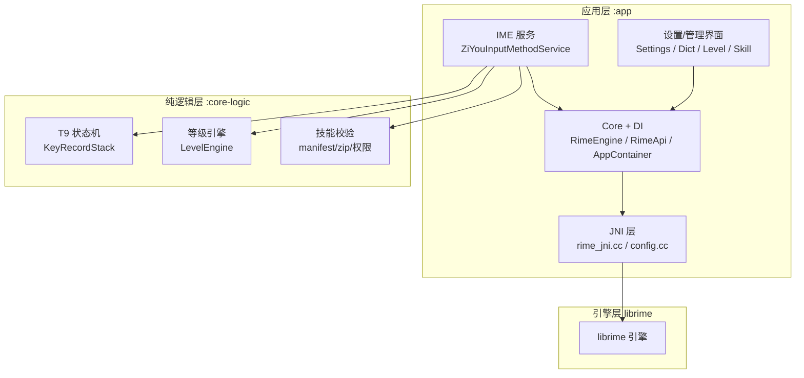
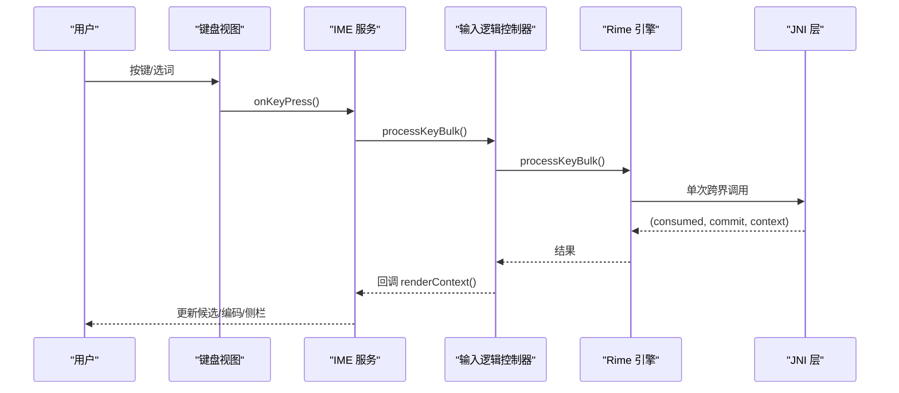
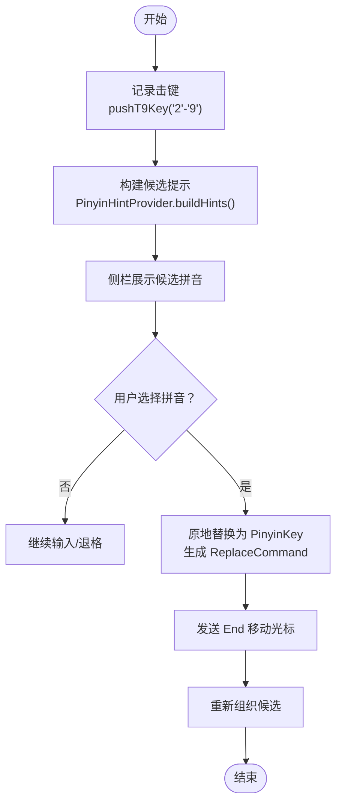
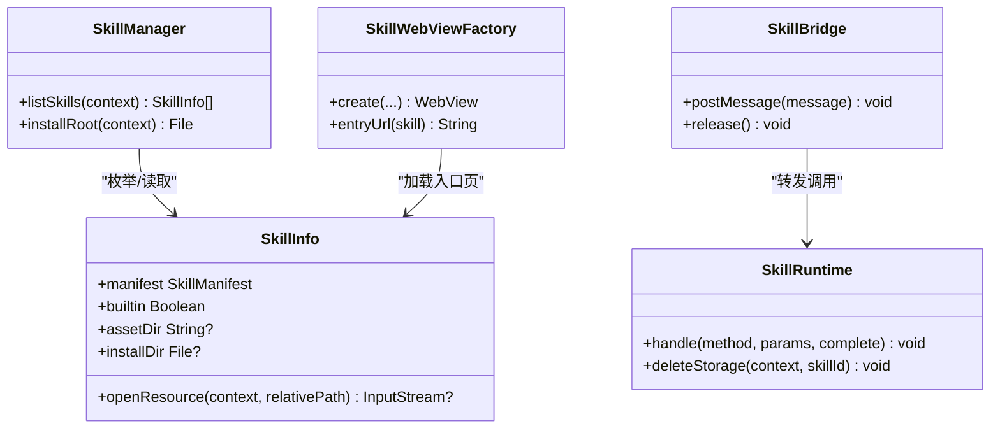
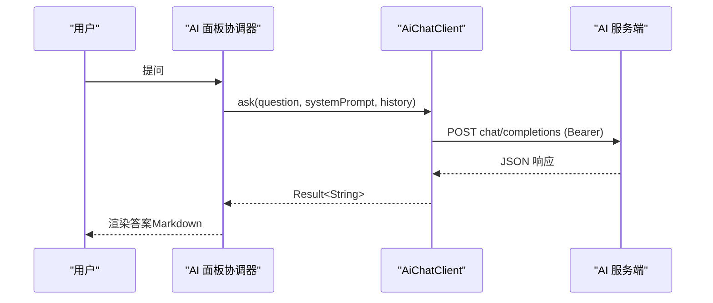
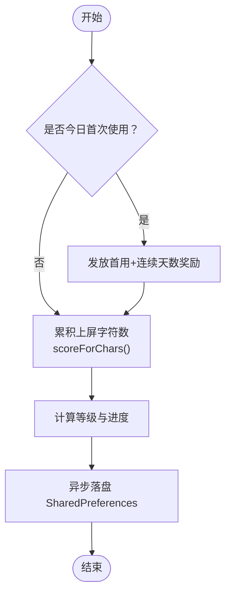
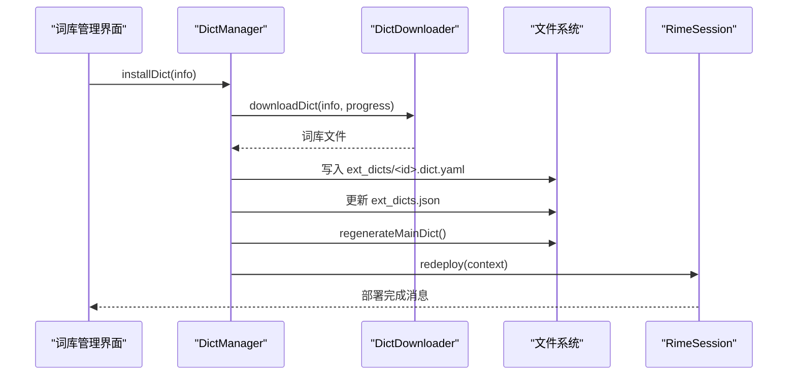
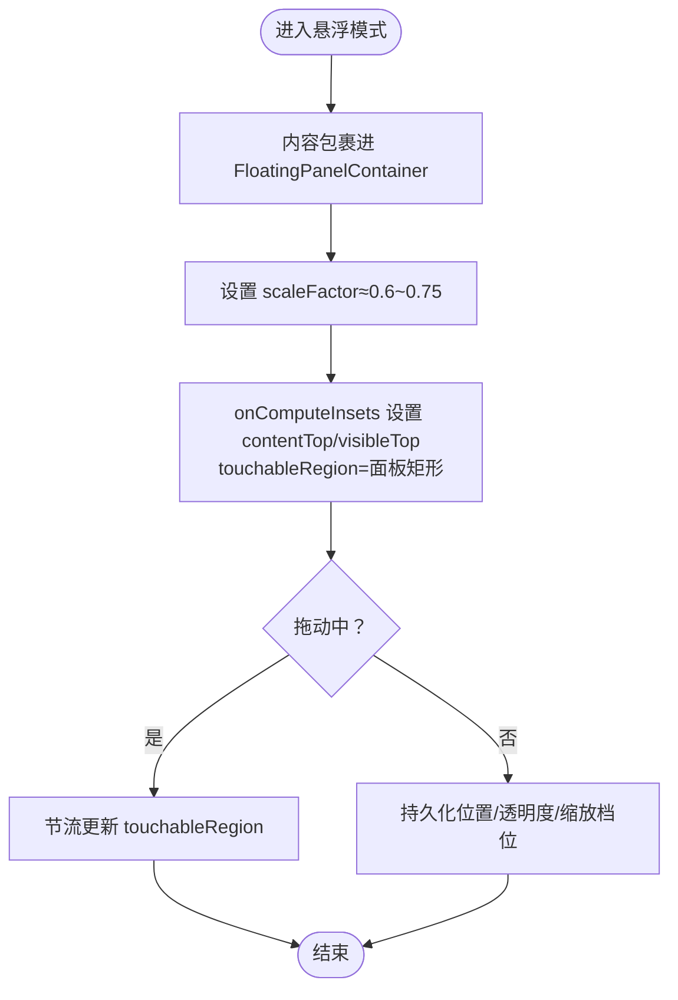
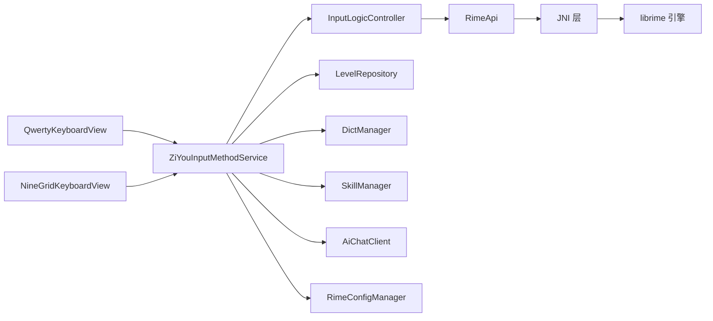

# 核心功能

<cite>
**本文引用的文件**   
- [ZiYouInputMethodService.kt](file://app/src/main/java/com/ziyou/ime/ime/ZiYouInputMethodService.kt)
- [RimeApi.kt](file://app/src/main/java/com/ziyou/ime/core/RimeApi.kt)
- [LevelEngine.kt](file://core-logic/src/main/java/com/ziyou/ime/core/level/LevelEngine.kt)
- [LevelRepository.kt](file://app/src/main/java/com/ziyou/ime/level/LevelRepository.kt)
- [SkillManager.kt](file://app/src/main/java/com/ziyou/ime/skill/SkillManager.kt)
- [AiChatClient.kt](file://app/src/main/java/com/ziyou/ime/ai/AiChatClient.kt)
- [DictManager.kt](file://app/src/main/java/com/ziyou/ime/dict/DictManager.kt)
- [KeyRecordStack.kt](file://core-logic/src/main/java/com/ziyou/ime/core/t9/KeyRecordStack.kt)
- [NineGridKeyboardView.kt](file://app/src/main/java/com/ziyou/ime/ime/NineGridKeyboardView.kt)
- [QwertyKeyboardView.kt](file://app/src/main/java/com/ziyou/ime/ime/QwertyKeyboardView.kt)
- [RimeConfigManager.kt](file://app/src/main/java/com/ziyou/ime/config/RimeConfigManager.kt)
- [ARCHITECTURE.md](file://ARCHITECTURE.md)
- [技能插件系统可行性方案.md](file://docs/技能插件系统可行性方案.md)
- [游戏悬浮输入法可行性方案.md](file://docs/游戏悬浮输入法可行性方案.md)
</cite>

## 目录
1. [简介](#简介)
2. [项目结构](#项目结构)
3. [核心组件](#核心组件)
4. [架构总览](#架构总览)
5. [详细组件分析](#详细组件分析)
6. [依赖关系分析](#依赖关系分析)
7. [性能考量](#性能考量)
8. [故障排查指南](#故障排查指南)
9. [结论](#结论)
10. [附录](#附录)

## 简介
本文件面向字由输入法项目的“核心功能概述”，聚焦六大能力：多方案中文输入（拼音、仓颉五笔、T9九宫格）、技能插件系统、AI 问答集成、游戏化等级体系、扩展词库管理、悬浮键盘形态。文档从“核心价值与使用场景”出发，解释各模块如何协同提供完整输入体验；同时为初学者提供概览，为高级开发者提供深入理解的入口点。

## 项目结构
- 应用层（:app）：Android IME 服务、UI、业务域（等级、词库、技能、AI），以及 JNI 与引擎集成。
- 纯逻辑层（:core-logic）：无 Android/JNI 依赖的算法与状态机（如 T9 状态机、等级计分引擎、技能校验等）。
- 引擎层（librime）：C/C++ 实现，通过 JNI 暴露 API。

图表来源
- [ARCHITECTURE.md](file://ARCHITECTURE.md)

章节来源
- [ARCHITECTURE.md](file://ARCHITECTURE.md)

## 核心组件
- 多方案中文输入：基于 Rime 引擎的多方案（luna_pinyin、cangjie5、t9），由 Service 根据键盘类型切换方案与中英文模式，候选区与编码区实时同步。
- 技能插件系统：WebView 沙箱 + JS Bridge，支持内置与用户安装技能，统一资源访问、权限控制、fetch 代理与存储限额。
- AI 问答集成：OpenAI 兼容接口，非流式请求，安全基线（HTTPS、超时、响应上限），Markdown 渲染约束。
- 游戏化等级体系：分段计分、连续天数奖励、等级门槛与权益解锁，热路径仅内存自增，后台异步落盘。
- 扩展词库管理：远程 catalog 下载、安装/卸载/启停、主词库动态注入、热部署生效。
- 悬浮键盘形态：IME 窗口内悬浮面板，触摸区域裁剪穿透，横屏自动悬浮，缩放与位置持久化。

章节来源
- [ZiYouInputMethodService.kt](file://app/src/main/java/com/ziyou/ime/ime/ZiYouInputMethodService.kt)
- [RimeApi.kt](file://app/src/main/java/com/ziyou/ime/core/RimeApi.kt)
- [SkillManager.kt](file://app/src/main/java/com/ziyou/ime/skill/SkillManager.kt)
- [AiChatClient.kt](file://app/src/main/java/com/ziyou/ime/ai/AiChatClient.kt)
- [DictManager.kt](file://app/src/main/java/com/ziyou/ime/dict/DictManager.kt)
- [LevelEngine.kt](file://core-logic/src/main/java/com/ziyou/ime/core/level/LevelEngine.kt)
- [LevelRepository.kt](file://app/src/main/java/com/ziyou/ime/level/LevelRepository.kt)
- [KeyRecordStack.kt](file://core-logic/src/main/java/com/ziyou/ime/core/t9/KeyRecordStack.kt)
- [NineGridKeyboardView.kt](file://app/src/main/java/com/ziyou/ime/ime/NineGridKeyboardView.kt)
- [QwertyKeyboardView.kt](file://app/src/main/java/com/ziyou/ime/ime/QwertyKeyboardView.kt)
- [RimeConfigManager.kt](file://app/src/main/java/com/ziyou/ime/config/RimeConfigManager.kt)
- [技能插件系统可行性方案.md](file://docs/技能插件系统可行性方案.md)
- [游戏悬浮输入法可行性方案.md](file://docs/游戏悬浮输入法可行性方案.md)

## 架构总览
整体采用“单线程 Dispatcher + 接口化引擎 + 视图职责分离”的设计，输入热路径零 IO，消息流 SharedFlow 驱动 UI 更新，业务域通过组合根注入监听器解耦。

图表来源
- [ZiYouInputMethodService.kt](file://app/src/main/java/com/ziyou/ime/ime/ZiYouInputMethodService.kt)
- [RimeApi.kt](file://app/src/main/java/com/ziyou/ime/core/RimeApi.kt)

章节来源
- [ZiYouInputMethodService.kt](file://app/src/main/java/com/ziyou/ime/ime/ZiYouInputMethodService.kt)
- [RimeApi.kt](file://app/src/main/java/com/ziyou/ime/core/RimeApi.kt)

## 详细组件分析

### 多方案中文输入（拼音、仓颉五笔、T9九宫格）
- 核心价值：覆盖主流输入习惯，九宫格智能消歧与全键盘灵活切换，候选与编码区精准同步。
- 使用场景：日常聊天、办公输入、游戏内打字（配合悬浮形态）。
- 关键交互：
  - 九宫格：数字键 → KeyRecordStack 追踪 → 侧栏展示候选拼音 → 选定后原地替换并移动光标组织多音节候选。
  - 全键盘：按用户偏好恢复方案，支持中英切换与数字键盘临时态。
  - 方案切换：根据当前键盘类型选择 t9/luna_pinyin/cangjie5 等方案，并保证 ascii_mode 正确。

图表来源
- [KeyRecordStack.kt](file://core-logic/src/main/java/com/ziyou/ime/core/t9/KeyRecordStack.kt)
- [NineGridKeyboardView.kt](file://app/src/main/java/com/ziyou/ime/ime/NineGridKeyboardView.kt)
- [ZiYouInputMethodService.kt](file://app/src/main/java/com/ziyou/ime/ime/ZiYouInputMethodService.kt)

章节来源
- [KeyRecordStack.kt](file://core-logic/src/main/java/com/ziyou/ime/core/t9/KeyRecordStack.kt)
- [NineGridKeyboardView.kt](file://app/src/main/java/com/ziyou/ime/ime/NineGridKeyboardView.kt)
- [QwertyKeyboardView.kt](file://app/src/main/java/com/ziyou/ime/ime/QwertyKeyboardView.kt)
- [ZiYouInputMethodService.kt](file://app/src/main/java/com/ziyou/ime/ime/ZiYouInputMethodService.kt)

### 技能插件系统
- 核心价值：以 WebView + JS Bridge 的沙箱机制扩展输入法能力，零 APK 体积增量，生态友好。
- 使用场景：计算器、天气查询、星座运势等小工具，卡片或嵌入模式，点击上屏或面板内输入。
- 关键要点：
  - 包规范：manifest.json 声明 id、版本、权限、网络域名白名单。
  - 安全基线：shouldInterceptRequest 全量拦截、CSP 注入、onRenderProcessGone 兜底、Zip Slip 防护。
  - 输入路由：CommitTarget 抽象将上屏目标切换到面板输入框，保持 Rime 链路不变。

图表来源
- [SkillManager.kt](file://app/src/main/java/com/ziyou/ime/skill/SkillManager.kt)
- [技能插件系统可行性方案.md](file://docs/技能插件系统可行性方案.md)

章节来源
- [SkillManager.kt](file://app/src/main/java/com/ziyou/ime/skill/SkillManager.kt)
- [技能插件系统可行性方案.md](file://docs/技能插件系统可行性方案.md)

### AI 问答集成
- 核心价值：在输入场景中快速获得结构化回答（Markdown），提升效率与趣味性。
- 使用场景：知识问答、文案辅助、规则查询等。
- 关键要点：
  - OpenAI 兼容协议，非流式请求，限制问题长度与响应大小。
  - 强制 HTTPS、鉴权头、超时保护，错误码友好提示。
  - Markdown 渲染约束避免不支持的表格/图片/HTML。

图表来源
- [AiChatClient.kt](file://app/src/main/java/com/ziyou/ime/ai/AiChatClient.kt)

章节来源
- [AiChatClient.kt](file://app/src/main/java/com/ziyou/ime/ai/AiChatClient.kt)

### 游戏化等级体系
- 核心价值：通过积分与等级激励持续使用，增强粘性。
- 使用场景：每日签到、累计上屏字符结算、等级进度与权益解锁（皮肤/音效）。
- 关键要点：
  - 分段计分：当日前 2000 字每字 1 分，2000–6000 字每字 0.5 分。
  - 连续天数奖励：逐日递增封顶，满 7 天额外奖励。
  - 热路径优化：仅内存自增，阈值或生命周期节点异步落盘。

图表来源
- [LevelEngine.kt](file://core-logic/src/main/java/com/ziyou/ime/core/level/LevelEngine.kt)
- [LevelRepository.kt](file://app/src/main/java/com/ziyou/ime/level/LevelRepository.kt)

章节来源
- [LevelEngine.kt](file://core-logic/src/main/java/com/ziyou/ime/core/level/LevelEngine.kt)
- [LevelRepository.kt](file://app/src/main/java/com/ziyou/ime/level/LevelRepository.kt)

### 扩展词库管理
- 核心价值：按需启用专业/方言/网络/社交等词库，提升候选命中率。
- 使用场景：领域术语、地名人名、网络热词等。
- 关键要点：
  - 远程 catalog 清单，下载带进度，本地预览词条。
  - 安装/卸载/启停后重写主词库 luna_pinyin.dict.yaml，注入已启用词库。
  - 热部署使新词库立即生效。

图表来源
- [DictManager.kt](file://app/src/main/java/com/ziyou/ime/dict/DictManager.kt)

章节来源
- [DictManager.kt](file://app/src/main/java/com/ziyou/ime/dict/DictManager.kt)

### 悬浮键盘形态
- 核心价值：横屏游戏/视频场景下不遮挡画面，可拖拽、半透明、单手输入。
- 使用场景：游戏聊天、短视频评论、横屏阅读回复。
- 关键要点：
  - 基于 IME 窗口 with onComputeInsets 裁剪触摸区域，面板外事件穿透。
  - 禁用全屏提取模式，避免横屏被全屏输入框替代。
  - 统一缩放因子，候选/编码/键盘同步缩放。

图表来源
- [游戏悬浮输入法可行性方案.md](file://docs/游戏悬浮输入法可行性方案.md)
- [ZiYouInputMethodService.kt](file://app/src/main/java/com/ziyou/ime/ime/ZiYouInputMethodService.kt)

章节来源
- [游戏悬浮输入法可行性方案.md](file://docs/游戏悬浮输入法可行性方案.md)
- [ZiYouInputMethodService.kt](file://app/src/main/java/com/ziyou/ime/ime/ZiYouInputMethodService.kt)

## 依赖关系分析
- 输入热路径：键盘视图 → IME 服务 → InputLogicController → RimeApi（processKeyBulk）→ JNI → librime。
- 业务域：等级、词库、技能、AI 均通过 IME 层与 UI 层接入，纯逻辑下沉至 :core-logic。
- 配置与主题：RimeConfigManager 封装 JNI 配置操作，SkinManager 管理皮肤快照。

图表来源
- [ZiYouInputMethodService.kt](file://app/src/main/java/com/ziyou/ime/ime/ZiYouInputMethodService.kt)
- [RimeApi.kt](file://app/src/main/java/com/ziyou/ime/core/RimeApi.kt)
- [LevelRepository.kt](file://app/src/main/java/com/ziyou/ime/level/LevelRepository.kt)
- [DictManager.kt](file://app/src/main/java/com/ziyou/ime/dict/DictManager.kt)
- [SkillManager.kt](file://app/src/main/java/com/ziyou/ime/skill/SkillManager.kt)
- [AiChatClient.kt](file://app/src/main/java/com/ziyou/ime/ai/AiChatClient.kt)
- [RimeConfigManager.kt](file://app/src/main/java/com/ziyou/ime/config/RimeConfigManager.kt)

章节来源
- [ZiYouInputMethodService.kt](file://app/src/main/java/com/ziyou/ime/ime/ZiYouInputMethodService.kt)
- [RimeApi.kt](file://app/src/main/java/com/ziyou/ime/core/RimeApi.kt)

## 性能考量
- 输入热路径：processKeyBulk 单次跨界，减少 JNI 往返；commit/context 合并获取。
- 等级计分：热路径仅内存自增，阈值/生命周期节点异步落盘。
- WebView 面板：单实例、关闭即销毁，渲染进程崩溃隔离，资源全量拦截。
- 悬浮形态：translation 位移代替频繁 layout，节流更新 touchableRegion。

[本节为通用指导，无需特定文件引用]

## 故障排查指南
- 引擎未就绪：等待初始化完成（awaitEngineReady），部署期间放弃本次同步，待部署完成消息重同步。
- 方案切换失败：检查 schema 是否编译/部署成功，必要时回退默认方案。
- 技能面板异常：onRenderProcessGone 兜底，Bridge 异常全量捕获，资源释放与面板关闭。
- AI 请求失败：检查 API Key、HTTPS、超时与响应大小限制，查看友好错误提示。
- 词库未生效：确认主词库已重写并 redeploy，查看部署消息。

章节来源
- [ZiYouInputMethodService.kt](file://app/src/main/java/com/ziyou/ime/ime/ZiYouInputMethodService.kt)
- [AiChatClient.kt](file://app/src/main/java/com/ziyou/ime/ai/AiChatClient.kt)
- [技能插件系统可行性方案.md](file://docs/技能插件系统可行性方案.md)

## 结论
字由输入法通过“多方案输入 + 技能插件 + AI 问答 + 等级体系 + 扩展词库 + 悬浮形态”的组合，构建了高效、可扩展且沉浸友好的输入体验。其架构清晰、热路径优化到位、安全边界明确，既满足普通用户的日常需求，也为开发者提供了清晰的扩展入口。

[本节为总结性内容，无需特定文件引用]

## 附录
- 多方案切换参考：applyEngineForKeyboard 中根据键盘类型选择 t9/luna_pinyin/cangjie5，并处理 ascii_mode。
- 九宫格消歧参考：KeyRecordStack 的原地替换与 ReplaceCommand 生成。
- 技能面板参考：SkillManager 枚举与 SkillWebViewFactory 安全配置。
- AI 问答参考：AiChatClient 的请求体组装与响应解析。
- 词库管理参考：DictManager 的安装/卸载/启停与主词库重写。
- 等级体系参考：LevelEngine 的分段计分与 LevelRepository 的持久化。

章节来源
- [ZiYouInputMethodService.kt](file://app/src/main/java/com/ziyou/ime/ime/ZiYouInputMethodService.kt)
- [KeyRecordStack.kt](file://core-logic/src/main/java/com/ziyou/ime/core/t9/KeyRecordStack.kt)
- [SkillManager.kt](file://app/src/main/java/com/ziyou/ime/skill/SkillManager.kt)
- [AiChatClient.kt](file://app/src/main/java/com/ziyou/ime/ai/AiChatClient.kt)
- [DictManager.kt](file://app/src/main/java/com/ziyou/ime/dict/DictManager.kt)
- [LevelEngine.kt](file://core-logic/src/main/java/com/ziyou/ime/core/level/LevelEngine.kt)
- [LevelRepository.kt](file://app/src/main/java/com/ziyou/ime/level/LevelRepository.kt)