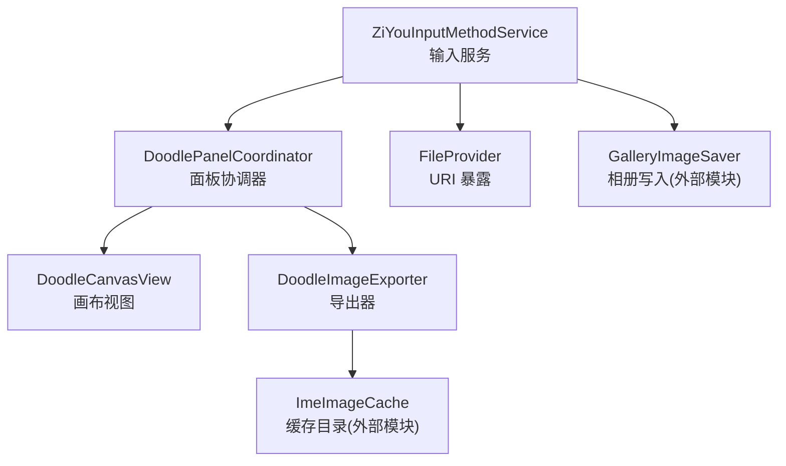
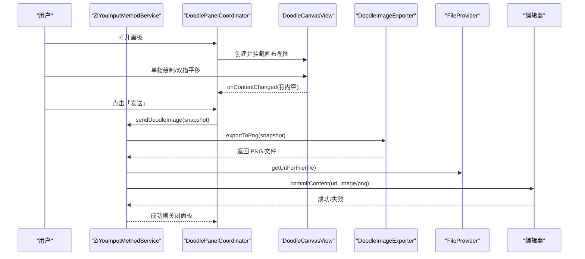
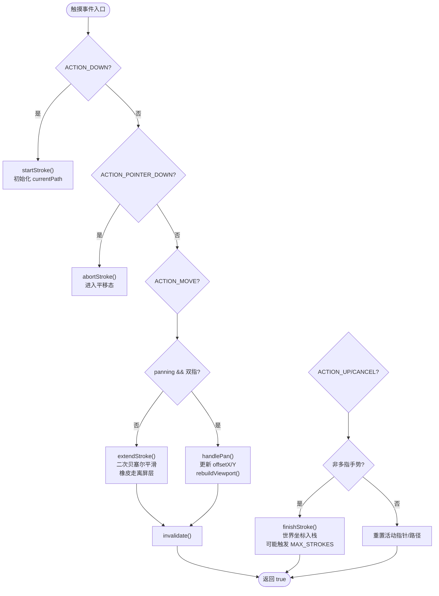
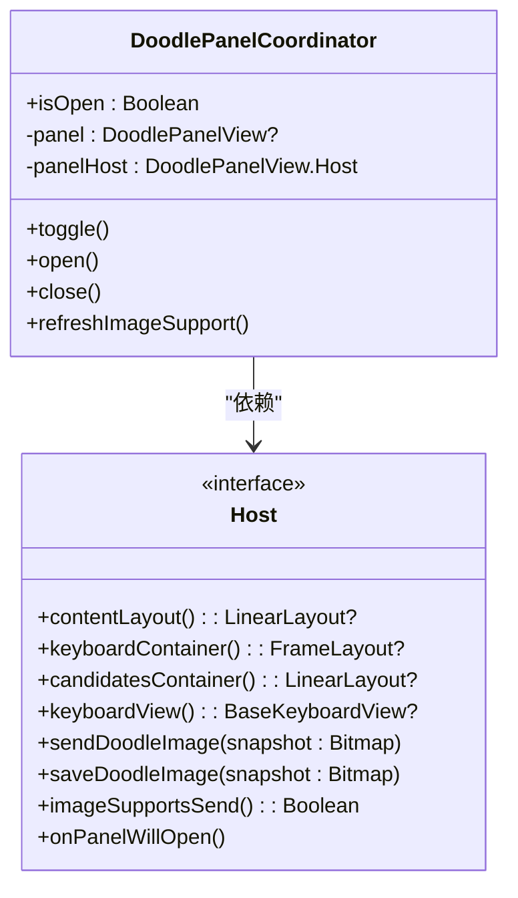
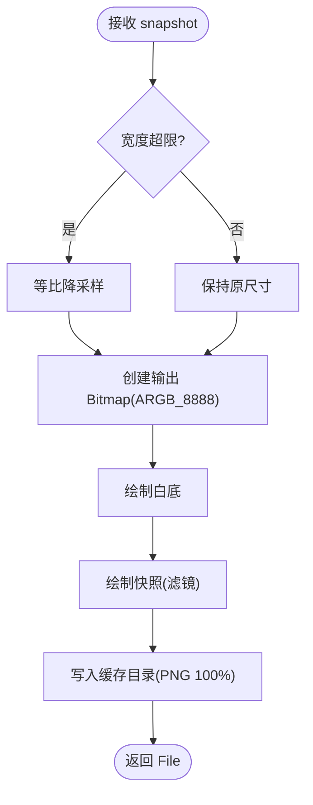
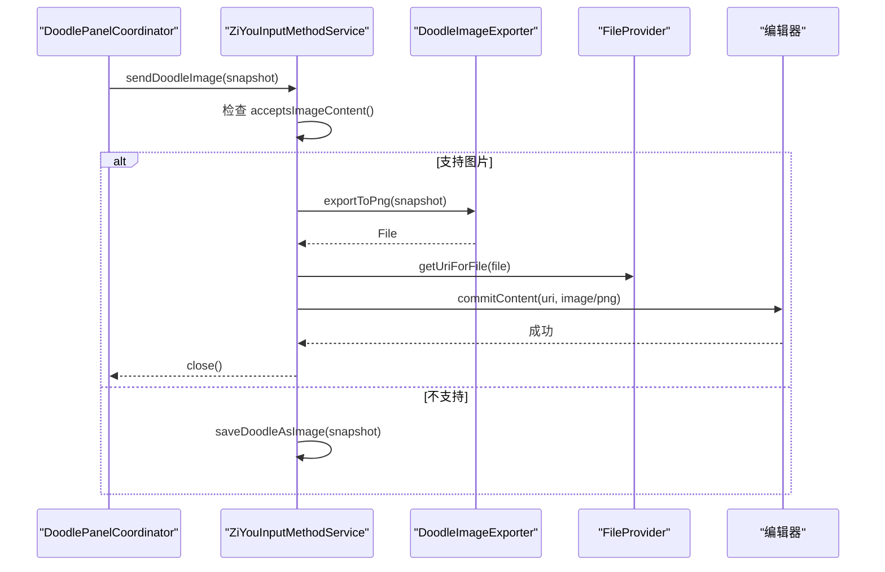
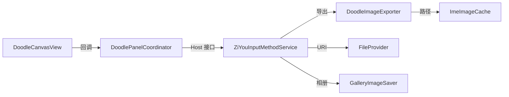

# 涂鸦画板功能

<cite>
**本文引用的文件**   
- [DoodleCanvasView.kt](file://app/src/main/java/com/ziyou/ime/ime/DoodleCanvasView.kt)
- [DoodleImageExporter.kt](file://app/src/main/java/com/ziyou/ime/ime/DoodleImageExporter.kt)
- [DoodlePanelCoordinator.kt](file://app/src/main/java/com/ziyou/ime/ime/DoodlePanelCoordinator.kt)
- [ZiYouInputMethodService.kt](file://app/src/main/java/com/ziyou/ime/ime/ZiYouInputMethodService.kt)
</cite>

## 目录
1. [简介](#简介)
2. [项目结构](#项目结构)
3. [核心组件](#核心组件)
4. [架构总览](#架构总览)
5. [详细组件分析](#详细组件分析)
6. [依赖关系分析](#依赖关系分析)
7. [性能考量](#性能考量)
8. [故障排查指南](#故障排查指南)
9. [结论](#结论)
10. [附录](#附录)

## 简介
本文件为字由输入法“涂鸦画板”功能的完整技术文档，覆盖以下关键能力：
- 画布绘制系统：触摸事件处理、画笔与橡皮、颜色与笔宽设置、网格参考线、无限画布平移。
- 图片导出：PNG 合成与压缩、分辨率限制、缓存路径管理、通过 FileProvider 提交到编辑器或保存到相册。
- 面板协调器：生命周期管理、状态同步、与键盘/候选区的布局编排、与其他面板的交互边界。
- 高级功能：手势识别（单指绘制/双指平移）、撤销重做、图层式笔画栈、内容包围盒快照。
- 扩展点：如何新增工具、自定义主题参数、接入新的导出格式或存储策略。

## 项目结构
涂鸦画板相关代码集中在 ime 包下，采用“视图 + 协调器 + 导出器”的分层组织：
- DoodleCanvasView：画布视图，负责绘制、触摸、平移、撤销/清空、快照。
- DoodlePanelCoordinator：面板协调器，负责打开/关闭、高度守恒、按钮态刷新、与宿主服务的能力桥接。
- DoodleImageExporter：纯 CPU 导出器，将透明底快照合成为白底 PNG 并写入缓存目录。
- ZiYouInputMethodService：输入服务，提供容器访问、图片发送/保存入口、线程调度与 UI 反馈。

图表来源
- [DoodlePanelCoordinator.kt:1-135](file://app/src/main/java/com/ziyou/ime/ime/DoodlePanelCoordinator.kt#L1-L135)
- [DoodleCanvasView.kt:1-475](file://app/src/main/java/com/ziyou/ime/ime/DoodleCanvasView.kt#L1-L475)
- [DoodleImageExporter.kt:1-64](file://app/src/main/java/com/ziyou/ime/ime/DoodleImageExporter.kt#L1-L64)
- [ZiYouInputMethodService.kt:1200-1400](file://app/src/main/java/com/ziyou/ime/ime/ZiYouInputMethodService.kt#L1200-L1400)

章节来源
- [DoodleCanvasView.kt:1-475](file://app/src/main/java/com/ziyou/ime/ime/DoodleCanvasView.kt#L1-L475)
- [DoodlePanelCoordinator.kt:1-135](file://app/src/main/java/com/ziyou/ime/ime/DoodlePanelCoordinator.kt#L1-L135)
- [DoodleImageExporter.kt:1-64](file://app/src/main/java/com/ziyou/ime/ime/DoodleImageExporter.kt#L1-L64)
- [ZiYouInputMethodService.kt:1200-1400](file://app/src/main/java/com/ziyou/ime/ime/ZiYouInputMethodService.kt#L1200-L1400)

## 核心组件
- 画布视图（DoodleCanvasView）
  - 世界坐标与视口偏移：笔画以世界坐标存储，屏幕坐标 = 世界坐标 − offset；拖拽即修改 offset 实现平移。
  - 双层渲染：离屏 backing Bitmap 缓存当前视口可见笔迹；顶层仅绘制实时 Path，onDraw 复杂度 O(1)。
  - 手势区分：单指绘制，第二指落下进入平移态并回滚试探笔画；避免与键盘手势冲突。
  - 编辑与导出：撤销=弹出末笔后重放；橡皮=CLEAR 混合模式增量绘入离屏位图；snapshot 渲染全部内容包围盒。
  - 内存约束：MAX_STROKES 上限控制笔画数量，超出丢弃最早一笔；导出图最大边长限制防 OOM。
- 面板协调器（DoodlePanelCoordinator）
  - 生命周期：open/close 幂等，挂载/移除面板，恢复键盘/候选区可见性。
  - 高度守恒：面板高度 = 键盘+候选区实测高度之和，IME 窗口总高不变。
  - 能力桥接：通过 Host 接口调用 send/save 图片、震动反馈、编辑器是否支持图片等。
- 导出器（DoodleImageExporter）
  - 合成白底 PNG：将透明底快照合成为不透明白底，宽度超限时等比降采样。
  - 缓存路径：写入 ImeImageCache.dir(context) 子目录，按过期策略清理，文件名带时间戳。
- 输入服务（ZiYouInputMethodService）
  - 发送/保存入口：sendDoodleAsImage/saveDoodleAsImage，后台线程合成 PNG，主线程反馈 Toast。
  - 提交方式：commitContent 经 FileProvider URI 提交到编辑器；不支持时转存相册。

章节来源
- [DoodleCanvasView.kt:1-475](file://app/src/main/java/com/ziyou/ime/ime/DoodleCanvasView.kt#L1-L475)
- [DoodlePanelCoordinator.kt:1-135](file://app/src/main/java/com/ziyou/ime/ime/DoodlePanelCoordinator.kt#L1-L135)
- [DoodleImageExporter.kt:1-64](file://app/src/main/java/com/ziyou/ime/ime/DoodleImageExporter.kt#L1-L64)
- [ZiYouInputMethodService.kt:1200-1400](file://app/src/main/java/com/ziyou/ime/ime/ZiYouInputMethodService.kt#L1200-L1400)

## 架构总览
涂鸦画板采用“视图-协调器-导出器-服务”分层协作：
- 视图层：DoodleCanvasView 专注绘制与交互，不关心上层业务。
- 协调器层：DoodlePanelCoordinator 编排面板生命周期与布局，屏蔽宿主细节。
- 导出层：DoodleImageExporter 纯函数式导出，无状态、可测试。
- 服务层：ZiYouInputMethodService 统一入口，负责线程切换、权限检查、UI 反馈与跨进程提交。

图表来源
- [DoodlePanelCoordinator.kt:1-135](file://app/src/main/java/com/ziyou/ime/ime/DoodlePanelCoordinator.kt#L1-L135)
- [DoodleCanvasView.kt:1-475](file://app/src/main/java/com/ziyou/ime/ime/DoodleCanvasView.kt#L1-L475)
- [DoodleImageExporter.kt:1-64](file://app/src/main/java/com/ziyou/ime/ime/DoodleImageExporter.kt#L1-L64)
- [ZiYouInputMethodService.kt:1200-1400](file://app/src/main/java/com/ziyou/ime/ime/ZiYouInputMethodService.kt#L1200-L1400)

## 详细组件分析

### 画布视图（DoodleCanvasView）
- 数据结构与复杂度
  - Stroke：包含 Path、颜色、笔宽、是否橡皮；撤销/重放/导出的最小单元。
  - strokes：世界坐标笔画栈，受 MAX_STROKES 约束；rebuildViewport 复杂度 O(strokes)。
  - backingBitmap/backingCanvas：离屏缓存，单次收笔烙入 O(1)，平移时整体重放。
- 触摸与手势
  - ACTION_DOWN：开始新笔画，记录活动指针。
  - ACTION_POINTER_DOWN：第二指落下，回滚试探笔画，进入平移态。
  - ACTION_MOVE：单指补历史采样点平滑绘制；双指计算中点位移更新 offset。
  - ACTION_UP/CANCEL：结束绘制或退出平移态。
- 绘制管线
  - onDraw：绘制纸面白底圆角卡片 → 裁剪区域 → 网格 → 离屏位图 → 实时 Path → 描边。
  - drawGrid：基于 offset 计算首条网格线位置，常数条数绘制，O(1)。
- 编辑操作
  - undo：移除末笔并重放，毫秒级。
  - clear：清空 strokes/currentPath/offset，重置离屏位图。
  - resetView：根据 contentBounds 居中或复位原点。
  - snapshot：计算全部笔画包围盒，按 MAX_SNAPSHOT_DIM 等比缩放，顺序重放还原合成结果。
- 资源释放
  - release：回收离屏层与 strokes，确保零驻留内存。

图表来源
- [DoodleCanvasView.kt:226-380](file://app/src/main/java/com/ziyou/ime/ime/DoodleCanvasView.kt#L226-L380)
- [DoodleCanvasView.kt:307-363](file://app/src/main/java/com/ziyou/ime/ime/DoodleCanvasView.kt#L307-L363)

章节来源
- [DoodleCanvasView.kt:1-475](file://app/src/main/java/com/ziyou/ime/ime/DoodleCanvasView.kt#L1-L475)

### 面板协调器（DoodlePanelCoordinator）
- 职责边界
  - 打开：测量键盘/候选区高度，隐藏二者，插入固定高度的画板视图。
  - 关闭：释放画板、恢复键盘/候选区可见性、从容器移除。
  - 刷新：编辑器切换时重新判断图片能力，更新按钮态。
- 宿主能力（Host）
  - 容器访问：contentLayout/keyboardContainer/candidatesContainer/keyboardView。
  - 图片出口：sendDoodleImage/saveDoodleImage。
  - 能力检测：imageSupportsSend。
  - 打开前清理：onPanelWillOpen 清除编码与候选展示。
- 与输入服务集成
  - 通过匿名对象实现 Host，委托 Service 完成实际工作。

图表来源
- [DoodlePanelCoordinator.kt:1-135](file://app/src/main/java/com/ziyou/ime/ime/DoodlePanelCoordinator.kt#L1-L135)

章节来源
- [DoodlePanelCoordinator.kt:1-135](file://app/src/main/java/com/ziyou/ime/ime/DoodlePanelCoordinator.kt#L1-L135)

### 导出器（DoodleImageExporter）
- 合成流程
  - 输入：透明底快照（仅笔画）。
  - 输出：白底 PNG，宽度超限时等比降采样至 MAX_EXPORT_WIDTH。
  - 存储：写入 ImeImageCache.dir(context) 子目录，文件名含时间戳，清理过期文件。
- 线程模型
  - 纯 CPU 绘制与压缩，须在后台线程调用；调用方负责 recycle 快照。

图表来源
- [DoodleImageExporter.kt:1-64](file://app/src/main/java/com/ziyou/ime/ime/DoodleImageExporter.kt#L1-L64)

章节来源
- [DoodleImageExporter.kt:1-64](file://app/src/main/java/com/ziyou/ime/ime/DoodleImageExporter.kt#L1-L64)

### 输入服务（ZiYouInputMethodService）
- 发送/保存入口
  - sendDoodleAsImage：检查编辑器是否支持图片，后台合成 PNG，主线程提交 commitContent，成功后关闭面板。
  - saveDoodleAsImage：不支持图片时兜底保存到相册，Android 10+ 可用，失败提示。
- 线程与反馈
  - Dispatchers.Default 执行合成，Dispatchers.IO 执行相册写入，Toast 在主线程反馈。
- 与协调器集成
  - doodlePanelHost 实现 Host 接口，转发 send/save 能力。

图表来源
- [ZiYouInputMethodService.kt:1200-1400](file://app/src/main/java/com/ziyou/ime/ime/ZiYouInputMethodService.kt#L1200-L1400)
- [DoodlePanelCoordinator.kt:1-135](file://app/src/main/java/com/ziyou/ime/ime/DoodlePanelCoordinator.kt#L1-L135)

章节来源
- [ZiYouInputMethodService.kt:1200-1400](file://app/src/main/java/com/ziyou/ime/ime/ZiYouInputMethodService.kt#L1200-L1400)

## 依赖关系分析
- 组件耦合
  - DoodlePanelCoordinator 依赖 Host 接口，解耦具体实现（Service）。
  - DoodleCanvasView 独立于上层，仅通过回调 onContentChanged 通知状态。
  - DoodleImageExporter 无状态，依赖 ImeImageCache 路径常量。
- 外部依赖
  - FileProvider：安全暴露缓存文件 URI。
  - GalleryImageSaver：系统相册写入（Android 10+）。
- 潜在循环依赖
  - 无直接循环；协调器单向依赖宿主能力，视图不感知协调器。

图表来源
- [DoodlePanelCoordinator.kt:1-135](file://app/src/main/java/com/ziyou/ime/ime/DoodlePanelCoordinator.kt#L1-L135)
- [DoodleCanvasView.kt:1-475](file://app/src/main/java/com/ziyou/ime/ime/DoodleCanvasView.kt#L1-L475)
- [DoodleImageExporter.kt:1-64](file://app/src/main/java/com/ziyou/ime/ime/DoodleImageExporter.kt#L1-L64)
- [ZiYouInputMethodService.kt:1200-1400](file://app/src/main/java/com/ziyou/ime/ime/ZiYouInputMethodService.kt#L1200-L1400)

章节来源
- [DoodlePanelCoordinator.kt:1-135](file://app/src/main/java/com/ziyou/ime/ime/DoodlePanelCoordinator.kt#L1-L135)
- [DoodleCanvasView.kt:1-475](file://app/src/main/java/com/ziyou/ime/ime/DoodleCanvasView.kt#L1-L475)
- [DoodleImageExporter.kt:1-64](file://app/src/main/java/com/ziyou/ime/ime/DoodleImageExporter.kt#L1-L64)
- [ZiYouInputMethodService.kt:1200-1400](file://app/src/main/java/com/ziyou/ime/ime/ZiYouInputMethodService.kt#L1200-L1400)

## 性能考量
- 绘制热路径
  - 单笔绘制期间 offset 恒定，收笔直接烙入离屏位图，O(1)。
  - onDraw 仅绘制纸面、网格、离屏位图与实时 Path，复杂度与笔画数无关。
- 平移重放
  - rebuildViewport 遍历 strokes，复杂度 O(strokes)，受 MAX_STROKES 约束，仅在非热路径触发。
- 内存控制
  - MAX_STROKES=500，超出丢弃最早一笔；导出图最大边长 2048px，超限时等比降采样。
  - 导出器宽度上限 1080px，避免超大 PNG。
- 线程模型
  - 导出与压缩在 Default 线程，IO 在 IO 线程，UI 反馈在主线程，避免卡顿。

[本节为通用性能建议，不直接分析具体文件]

## 故障排查指南
- 画布无响应
  - 检查 onTouchEvent 是否被拦截；确认 multiTouchGesture 与 panning 状态机正常。
  - 验证 ACTION_POINTER_DOWN 是否回滚了 currentPath。
- 平移卡顿
  - 观察 rebuildViewport 是否频繁触发；检查 strokes 数量是否接近 MAX_STROKES。
- 导出失败
  - 确认 ImeImageCache.dir(context) 可写；检查 PNG 压缩是否异常；确保 snapshot.recycle() 在 finally 中执行。
- 编辑器不接受图片
  - 检查 inputLogic.acceptsImageContent()；若不支持，自动转存相册。
- 内存溢出
  - 监控 MAX_SNAPSHOT_DIM 与 MAX_EXPORT_WIDTH；必要时降低上限或增加采样率。

章节来源
- [DoodleCanvasView.kt:226-380](file://app/src/main/java/com/ziyou/ime/ime/DoodleCanvasView.kt#L226-L380)
- [DoodleImageExporter.kt:1-64](file://app/src/main/java/com/ziyou/ime/ime/DoodleImageExporter.kt#L1-L64)
- [ZiYouInputMethodService.kt:1200-1400](file://app/src/main/java/com/ziyou/ime/ime/ZiYouInputMethodService.kt#L1200-L1400)

## 结论
涂鸦画板通过清晰的层次拆分与严格的性能约束，实现了流畅的无限画布体验与可靠的导出能力。协调器模式使面板生命周期与输入服务解耦，便于扩展与维护。开发者可基于现有扩展点快速添加新工具、新导出格式或新的存储策略。

[本节为总结性内容，不直接分析具体文件]

## 附录
- 扩展点建议
  - 新增工具：在 DoodleCanvasView 中扩展 eraserMode 类似的开关，并在面板 UI 中暴露配置。
  - 自定义主题：通过 SkinTheme 注入颜色与边框样式，网格透明度可配置。
  - 导出格式：在 DoodleImageExporter 中新增 JPEG/WebP 支持，复用合成逻辑。
  - 存储策略：替换 ImeImageCache 为自定义目录，注意权限与清理策略。
- 最佳实践
  - 始终在主线程更新 UI，后台线程执行导出与 IO。
  - 及时 recycle Bitmap，避免内存泄漏。
  - 使用 FileProvider 安全共享文件，避免明文路径泄露。

[本节为通用指导，不直接分析具体文件]