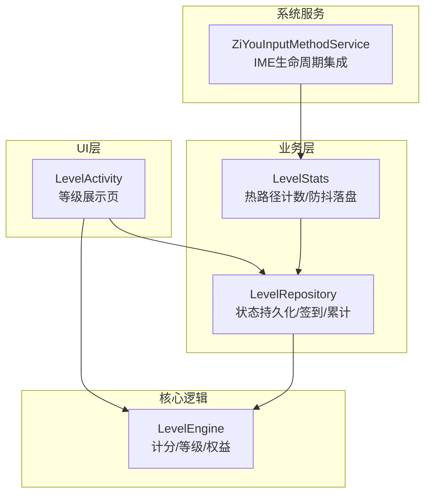
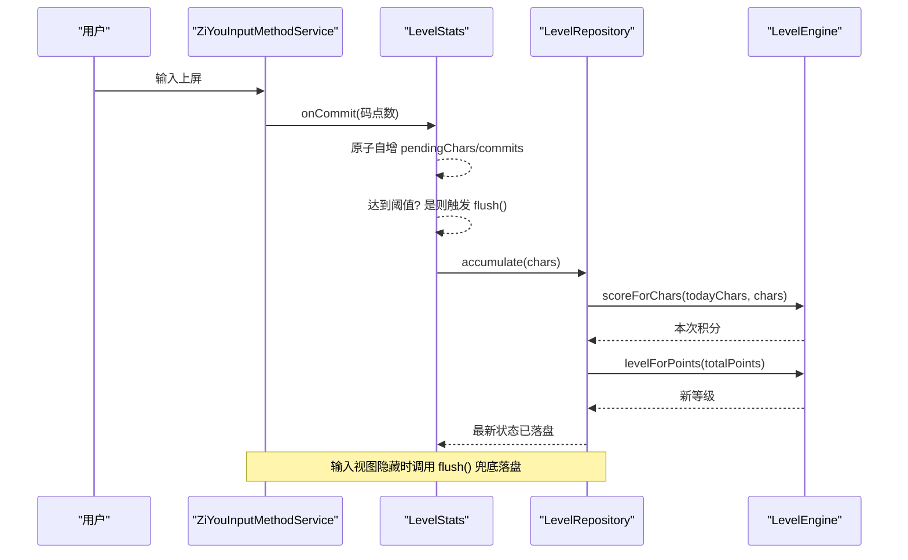
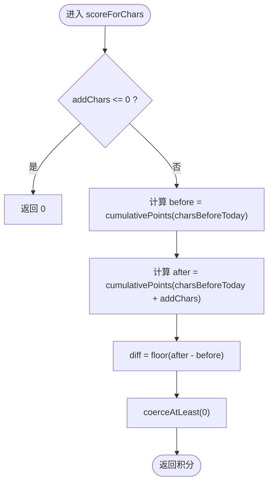
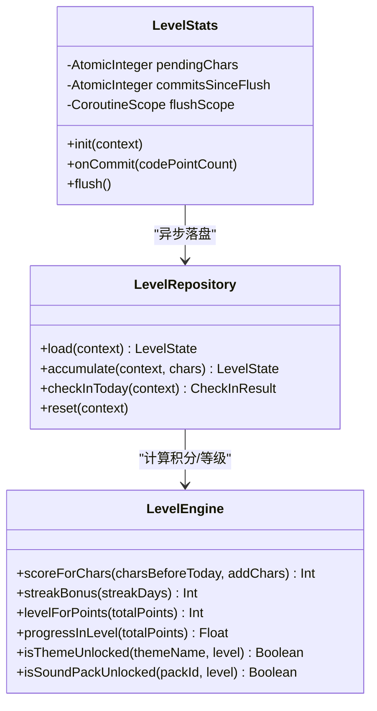
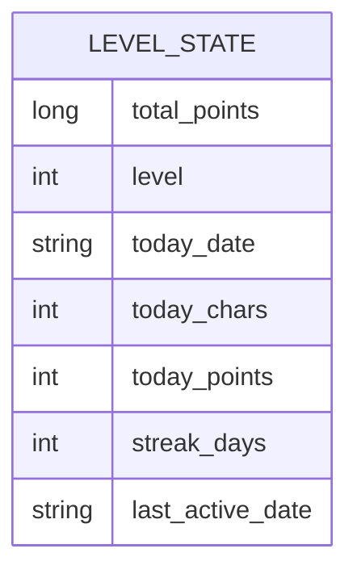
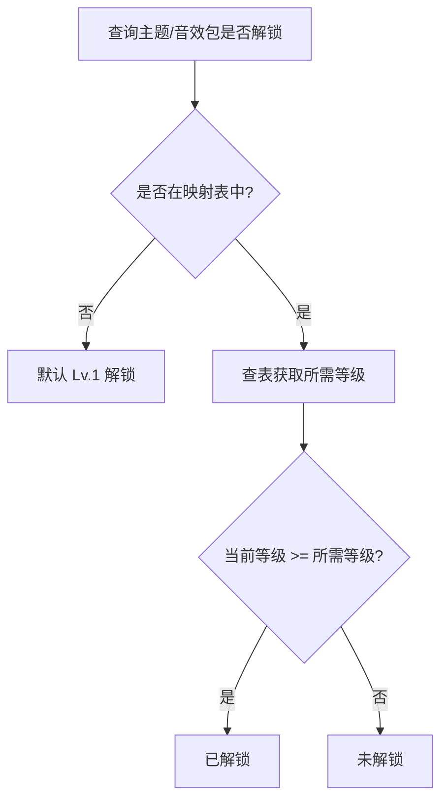
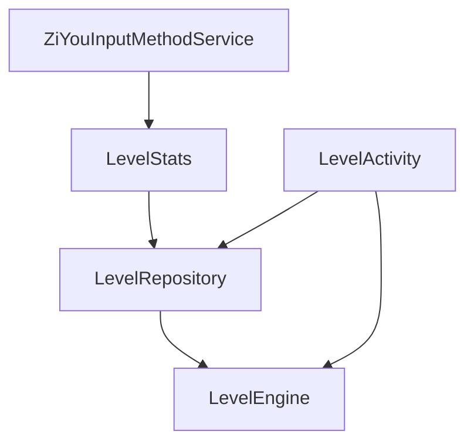

# 游戏化等级体系

<cite>
**本文引用的文件**   
- [LevelEngine.kt](file://core-logic/src/main/java/com/ziyou/ime/core/level/LevelEngine.kt)
- [LevelRepository.kt](file://app/src/main/java/com/ziyou/ime/level/LevelRepository.kt)
- [LevelStats.kt](file://app/src/main/java/com/ziyou/ime/level/LevelStats.kt)
- [LevelActivity.kt](file://app/src/main/java/com/ziyou/ime/ui/LevelActivity.kt)
- [ZiYouInputMethodService.kt](file://app/src/main/java/com/ziyou/ime/ime/ZiYouInputMethodService.kt)
- [LevelEngineTest.kt](file://core-logic/src/test/java/com/ziyou/ime/core/level/LevelEngineTest.kt)
</cite>

## 目录
1. [简介](#简介)
2. [项目结构](#项目结构)
3. [核心组件](#核心组件)
4. [架构总览](#架构总览)
5. [详细组件分析](#详细组件分析)
6. [依赖关系分析](#依赖关系分析)
7. [性能考量](#性能考量)
8. [故障排查指南](#故障排查指南)
9. [结论](#结论)
10. [附录](#附录)

## 简介
本文件为字由输入法“游戏化等级体系”的完整技术文档。内容覆盖：
- 等级计分算法、积分计算规则与等级门槛设置
- 热路径优化策略（内存自增、防抖落盘、异步处理）
- 等级与权益系统关联（主题解锁、音效解锁等）
- 数据持久化方案、统计信息收集与用户激励策略
- 等级配置定制方法与扩展点，帮助开发者理解并扩展游戏化设计

## 项目结构
等级体系由三层组成：
- 纯计算引擎：负责计分、等级判定、权益解锁规则
- 持久化仓库：负责状态读写、每日结算、签到奖励
- 热路径统计：负责输入上屏时的原子计数与批量落盘

图表来源 
- [LevelActivity.kt](file://app/src/main/java/com/ziyou/ime/ui/LevelActivity.kt)
- [LevelRepository.kt](file://app/src/main/java/com/ziyou/ime/level/LevelRepository.kt)
- [LevelStats.kt](file://app/src/main/java/com/ziyou/ime/level/LevelStats.kt)
- [LevelEngine.kt](file://core-logic/src/main/java/com/ziyou/ime/core/level/LevelEngine.kt)
- [ZiYouInputMethodService.kt](file://app/src/main/java/com/ziyou/ime/ime/ZiYouInputMethodService.kt)

章节来源
- [LevelActivity.kt](file://app/src/main/java/com/ziyou/ime/ui/LevelActivity.kt)
- [LevelRepository.kt](file://app/src/main/java/com/ziyou/ime/level/LevelRepository.kt)
- [LevelStats.kt](file://app/src/main/java/com/ziyou/ime/level/LevelStats.kt)
- [LevelEngine.kt](file://core-logic/src/main/java/com/ziyou/ime/core/level/LevelEngine.kt)
- [ZiYouInputMethodService.kt](file://app/src/main/java/com/ziyou/ime/ime/ZiYouInputMethodService.kt)

## 核心组件
- LevelEngine：无状态纯函数引擎，提供分段计分、连续天数奖励、等级判定、进度计算与权益解锁判断。
- LevelRepository：单一数据源，使用 SharedPreferences 持久化等级状态；提供累计字符结算、每日签到、跨日重置与读取。
- LevelStats：热路径入口，采用 AtomicInteger 做内存自增，达到提交次数或字符数阈值后异步落盘，避免阻塞输入。
- LevelActivity：等级详情页面，展示当前等级、进度条、统计信息与路线图。
- ZiYouInputMethodService：在 IME 生命周期中初始化统计、执行每日签到、在视图隐藏时主动落盘。

章节来源
- [LevelEngine.kt](file://core-logic/src/main/java/com/ziyou/ime/core/level/LevelEngine.kt)
- [LevelRepository.kt](file://app/src/main/java/com/ziyou/ime/level/LevelRepository.kt)
- [LevelStats.kt](file://app/src/main/java/com/ziyou/ime/level/LevelStats.kt)
- [LevelActivity.kt](file://app/src/main/java/com/ziyou/ime/ui/LevelActivity.kt)
- [ZiYouInputMethodService.kt](file://app/src/main/java/com/ziyou/ime/ime/ZiYouInputMethodService.kt)

## 架构总览
等级体系遵循“热路径零 IO + 异步落盘 + 幂等签到”的设计原则，确保输入流畅性与数据一致性。

图表来源 
- [ZiYouInputMethodService.kt](file://app/src/main/java/com/ziyou/ime/ime/ZiYouInputMethodService.kt)
- [LevelStats.kt](file://app/src/main/java/com/ziyou/ime/level/LevelStats.kt)
- [LevelRepository.kt](file://app/src/main/java/com/ziyou/ime/level/LevelRepository.kt)
- [LevelEngine.kt](file://core-logic/src/main/java/com/ziyou/ime/core/level/LevelEngine.kt)

## 详细组件分析

### 等级计分与等级门槛
- 分段计分：当日累计前 2000 字按 1 分/字，2000–6000 字按 0.5 分/字，超过 6000 字不再计分。新增积分 = cumulativePoints(before+add) - cumulativePoints(before)，向下取整且只增不减。
- 连续天数奖励：每日首次使用固定奖励；第 2 天起逐日 +5，单日封顶 +30；每满 7 天额外 +50。
- 等级门槛：1–10 级累计积分门槛指数递增，用于判定当前等级与进度。
- 进度计算：当前等级内进度 = (totalPoints - curThreshold) / (nextThreshold - curThreshold)，满级恒为 1f。

图表来源 
- [LevelEngine.kt](file://core-logic/src/main/java/com/ziyou/ime/core/level/LevelEngine.kt)

章节来源
- [LevelEngine.kt](file://core-logic/src/main/java/com/ziyou/ime/core/level/LevelEngine.kt)
- [LevelEngineTest.kt](file://core-logic/src/test/java/com/ziyou/ime/core/level/LevelEngineTest.kt)

### 热路径优化策略
- 内存自增：使用 AtomicInteger 维护 pendingChars 与 commitsSinceFlush，onCommit 仅 O(1) 操作，不写磁盘。
- 防抖落盘：当提交次数 ≥ 50 或累计字符 ≥ 200 时触发 flush()。
- 异步处理：flush() 在 IO 协程中调用 LevelRepository.accumulate，失败时将字符数回滚，避免丢分。
- 生命周期兜底：在 onFinishInputView/onDestroy 等节点主动 flush()，保证尾部数据不丢失。

图表来源 
- [LevelStats.kt](file://app/src/main/java/com/ziyou/ime/level/LevelStats.kt)
- [LevelRepository.kt](file://app/src/main/java/com/ziyou/ime/level/LevelRepository.kt)
- [LevelEngine.kt](file://core-logic/src/main/java/com/ziyou/ime/core/level/LevelEngine.kt)

章节来源
- [LevelStats.kt](file://app/src/main/java/com/ziyou/ime/level/LevelStats.kt)
- [ZiYouInputMethodService.kt](file://app/src/main/java/com/ziyou/ime/ime/ZiYouInputMethodService.kt)

### 数据持久化与状态模型
- 状态模型 LevelState：包含累计积分、当前等级、今日日期、今日字符数、今日积分、连续天数、上次活跃日期。
- 持久化键：SharedPreferences 存储 total_points、level、today_date、today_chars、today_points、streak_days、last_active_date。
- 跨日重置：rollover 将 todayDate 更新为新日期，并重置 todayChars/todayPoints，保留 totalPoints 与 level。
- 每日签到：幂等检查 lastActiveDate，若为新日则发放首用奖励与连续天数奖励，并记录昨日数据供简报展示。

图表来源 
- [LevelRepository.kt](file://app/src/main/java/com/ziyou/ime/level/LevelRepository.kt)

章节来源
- [LevelRepository.kt](file://app/src/main/java/com/ziyou/ime/level/LevelRepository.kt)

### 等级与权益系统关联
- 主题解锁：默认皮肤“悬浮立体”Lv.1 可用，“云雾拟态”Lv.2 解锁，“Material”Lv.7 解锁。未列出的主题默认 Lv.1 解锁。
- 音效包解锁：“default”始终可用，“basic”Lv.5 解锁。未列出的音效包默认 Lv.1 解锁。
- 界面展示：LevelActivity 展示路线图与解锁权益描述，结合 LevelEngine 提供的解锁判断方法。

图表来源 
- [LevelEngine.kt](file://core-logic/src/main/java/com/ziyou/ime/core/level/LevelEngine.kt)
- [LevelActivity.kt](file://app/src/main/java/com/ziyou/ime/ui/LevelActivity.kt)

章节来源
- [LevelEngine.kt](file://core-logic/src/main/java/com/ziyou/ime/core/level/LevelEngine.kt)
- [LevelActivity.kt](file://app/src/main/java/com/ziyou/ime/ui/LevelActivity.kt)

### 用户激励策略
- 每日首用奖励：固定分值，鼓励每日打开输入法。
- 连续天数奖励：阶梯式增长，7 天周期额外奖励，提升留存与活跃度。
- 进度可视化：等级卡片与路线图让用户感知成长轨迹，增强成就感。
- 隐私说明：所有统计均为本地脱敏聚合计数，不记录输入内容，保障用户信任。

章节来源
- [LevelEngine.kt](file://core-logic/src/main/java/com/ziyou/ime/core/level/LevelEngine.kt)
- [LevelActivity.kt](file://app/src/main/java/com/ziyou/ime/ui/LevelActivity.kt)

## 依赖关系分析
- LevelStats 依赖 LevelRepository 进行落盘，LevelRepository 依赖 LevelEngine 进行计算。
- ZiYouInputMethodService 在 onCreate 中初始化 LevelStats，在 onStartInputView 中执行每日签到，在 onFinishInputView 中主动 flush。
- LevelActivity 通过 LevelRepository 读取状态，并通过 LevelEngine 计算进度与解锁信息。

图表来源 
- [ZiYouInputMethodService.kt](file://app/src/main/java/com/ziyou/ime/ime/ZiYouInputMethodService.kt)
- [LevelStats.kt](file://app/src/main/java/com/ziyou/ime/level/LevelStats.kt)
- [LevelRepository.kt](file://app/src/main/java/com/ziyou/ime/level/LevelRepository.kt)
- [LevelEngine.kt](file://core-logic/src/main/java/com/ziyou/ime/core/level/LevelEngine.kt)
- [LevelActivity.kt](file://app/src/main/java/com/ziyou/ime/ui/LevelActivity.kt)

章节来源
- [ZiYouInputMethodService.kt](file://app/src/main/java/com/ziyou/ime/ime/ZiYouInputMethodService.kt)
- [LevelStats.kt](file://app/src/main/java/com/ziyou/ime/level/LevelStats.kt)
- [LevelRepository.kt](file://app/src/main/java/com/ziyou/ime/level/LevelRepository.kt)
- [LevelEngine.kt](file://core-logic/src/main/java/com/ziyou/ime/core/level/LevelEngine.kt)
- [LevelActivity.kt](file://app/src/main/java/com/ziyou/ime/ui/LevelActivity.kt)

## 性能考量
- 热路径零 IO：onCommit 仅原子自增，避免 I/O 阻塞输入。
- 批量落盘：达到提交次数或字符数阈值才落盘，降低频繁写入开销。
- 异步处理：落盘在 IO 协程中进行，异常时回滚待处理字符，保证数据不丢失。
- 生命周期兜底：在视图隐藏或销毁时主动 flush，防止尾部数据丢失。
- 低内存回收：在 onTrimMemory 中关闭面板与释放资源，降低被 LMK 猎杀风险。

章节来源
- [LevelStats.kt](file://app/src/main/java/com/ziyou/ime/level/LevelStats.kt)
- [ZiYouInputMethodService.kt](file://app/src/main/java/com/ziyou/ime/ime/ZiYouInputMethodService.kt)

## 故障排查指南
- 积分未增加：检查 onCommit 是否被调用；确认 pendingChars 与 commitsSinceFlush 是否正常自增；查看 flush 是否被触发。
- 数据丢失：确认 onFinishInputView 或 onDestroy 是否调用 flush；检查异常日志中是否有落盘失败的回滚记录。
- 签到重复：检查 lastActiveDate 是否正确更新；确认 checkInToday 的幂等逻辑。
- 权益未解锁：核对主题/音效包名称与映射表一致；确认当前等级是否满足解锁条件。

章节来源
- [LevelStats.kt](file://app/src/main/java/com/ziyou/ime/level/LevelStats.kt)
- [LevelRepository.kt](file://app/src/main/java/com/ziyou/ime/level/LevelRepository.kt)
- [LevelEngine.kt](file://core-logic/src/main/java/com/ziyou/ime/core/level/LevelEngine.kt)

## 结论
字由输入法的等级体系以纯函数引擎为核心，结合高效的热路径统计与可靠的持久化方案，实现了流畅的用户体验与稳定的数据一致性。通过清晰的计分规则、等级门槛与权益解锁机制，配合每日签到与连续天数奖励，有效提升了用户参与度与留存率。开发者可基于现有扩展点灵活定制等级曲线、权益内容与统计指标，持续优化游戏化体验。

## 附录
- 等级配置定制建议：
  - 调整 LEVEL_THRESHOLDS 以改变等级门槛曲线
  - 修改 FULL_RATE_CHARS 与 HALF_RATE_CHARS 以调节分段计分策略
  - 扩展 THEME_UNLOCK_LEVEL 与 SOUND_PACK_UNLOCK_LEVEL 以新增权益解锁
  - 在 LevelActivity 的 ROADMAP 中补充或调整权益描述
- 测试覆盖：
  - LevelEngineTest 覆盖分段计分、连续签到奖励、等级判定与进度、权益解锁门槛

章节来源
- [LevelEngine.kt](file://core-logic/src/main/java/com/ziyou/ime/core/level/LevelEngine.kt)
- [LevelEngineTest.kt](file://core-logic/src/test/java/com/ziyou/ime/core/level/LevelEngineTest.kt)
- [LevelActivity.kt](file://app/src/main/java/com/ziyou/ime/ui/LevelActivity.kt)