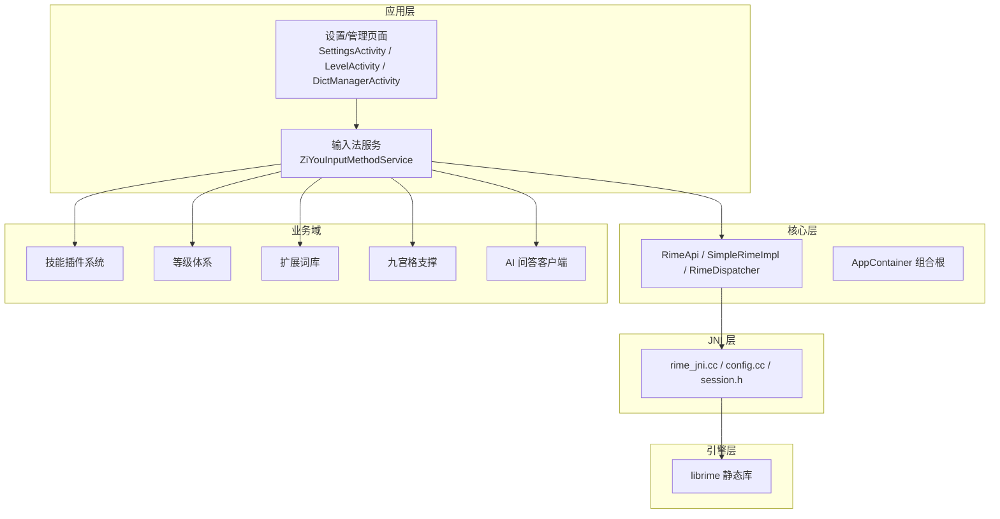
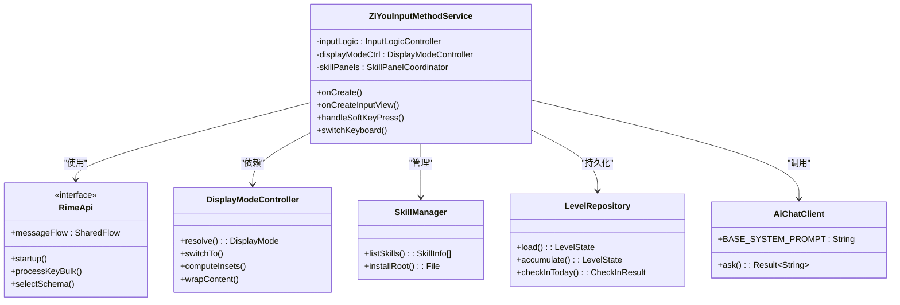
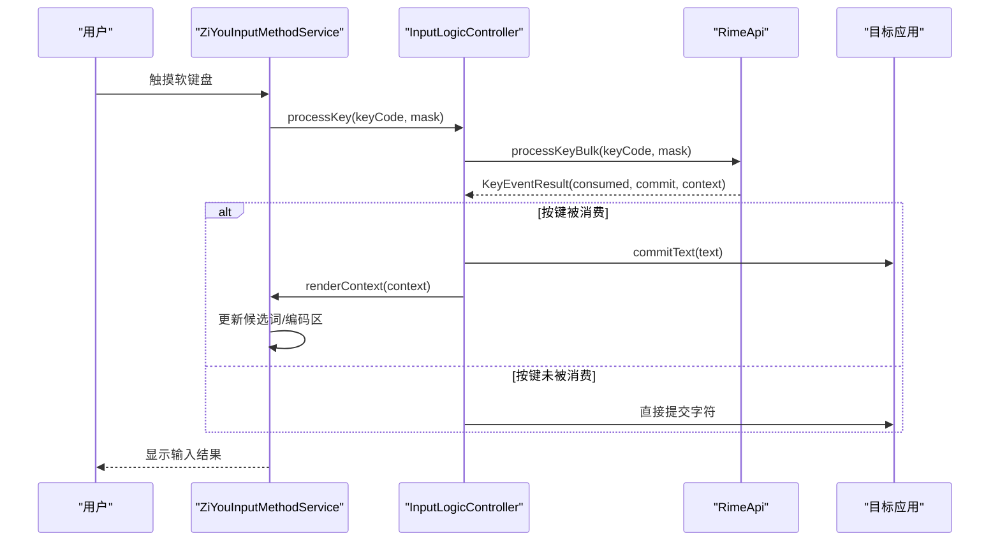
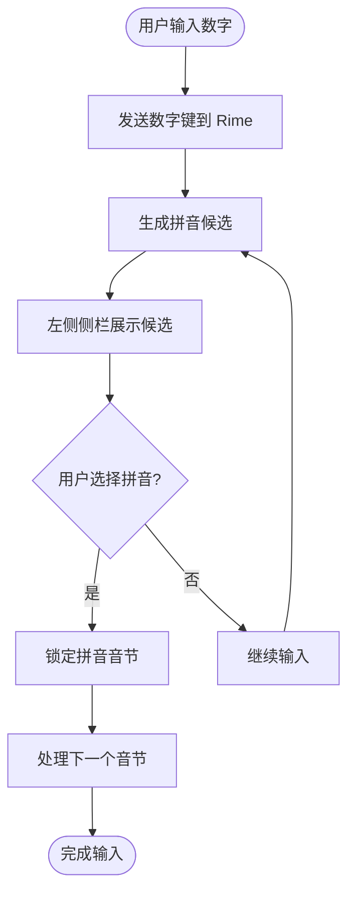
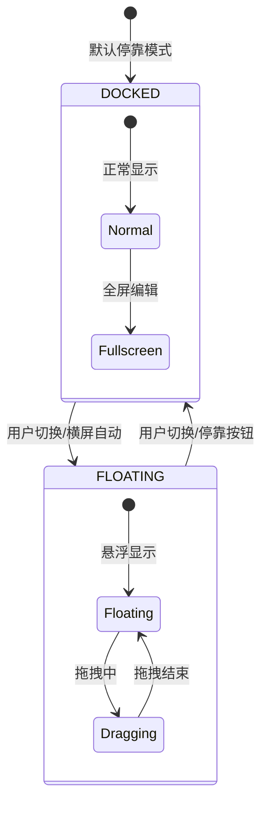
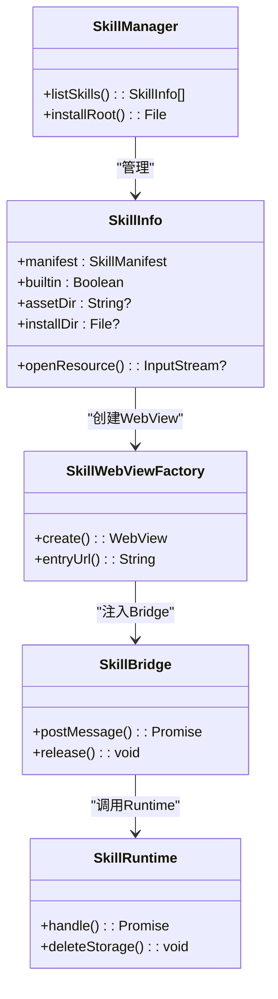
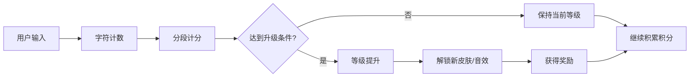
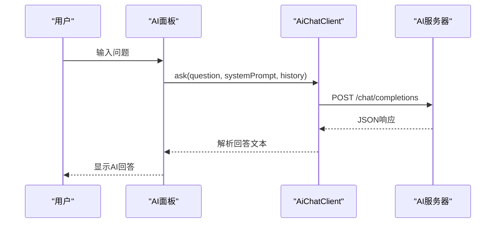
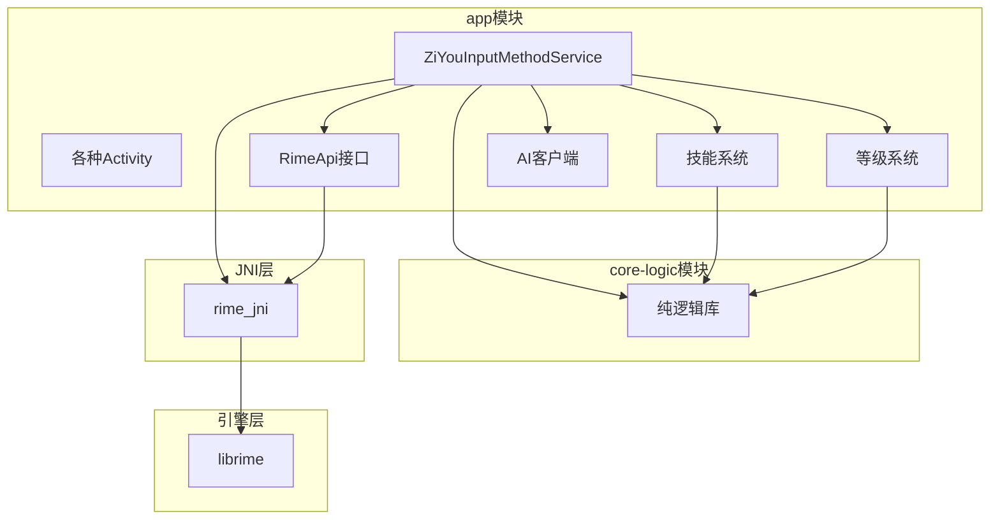

# 项目介绍

<cite>
**本文引用的文件**   
- [ZiyouApplication.kt](file://app/src/main/java/com/ziyou/ime/ZiyouApplication.kt)
- [AndroidManifest.xml](file://app/src/main/AndroidManifest.xml)
- [ARCHITECTURE.md](file://ARCHITECTURE.md)
- [ZiYouInputMethodService.kt](file://app/src/main/java/com/ziyou/ime/ime/ZiYouInputMethodService.kt)
- [RimeApi.kt](file://app/src/main/java/com/ziyou/ime/core/RimeApi.kt)
- [NineGridKeyboardView.kt](file://app/src/main/java/com/ziyou/ime/ime/NineGridKeyboardView.kt)
- [DisplayModeManager.kt](file://app/src/main/java/com/ziyou/ime/config/DisplayModeManager.kt)
- [DisplayModeController.kt](file://app/src/main/java/com/ziyou/ime/ime/DisplayModeController.kt)
- [SkillManager.kt](file://app/src/main/java/com/ziyou/ime/skill/SkillManager.kt)
- [LevelRepository.kt](file://app/src/main/java/com/ziyou/ime/level/LevelRepository.kt)
- [LevelEngine.kt](file://core-logic/src/main/java/com/ziyou/ime/core/level/LevelEngine.kt)
- [AiChatClient.kt](file://app/src/main/java/com/ziyou/ime/ai/AiChatClient.kt)
</cite>

## 目录
1. [简介](#简介)
2. [项目结构](#项目结构)
3. [核心组件](#核心组件)
4. [架构总览](#架构总览)
5. [详细组件分析](#详细组件分析)
6. [依赖关系分析](#依赖关系分析)
7. [性能与体验特性](#性能与体验特性)
8. [故障排查指南](#故障排查指南)
9. [结论](#结论)
10. [附录：关键能力速览](#附录关键能力速览)

## 简介
字由输入法是一款基于 Android InputMethodService 开发的现代化中文输入法应用，采用 Kotlin + Jetpack Compose 技术栈。项目的核心目标是提供流畅、稳定、可定制的中文输入体验，支持多方案输入（拼音、仓颉五笔、T9九宫格），并集成创新功能：技能插件系统、AI 问答、游戏化等级体系等。技术特色包括：
- 基于 Rime 输入引擎，通过 JNI 桥接层实现高性能、可扩展的输入处理
- 悬浮键盘形态，适配横屏与游戏场景
- 可扩展的技能插件架构，支持计算器、天气、星座等小工具面板
- 完善的主题皮肤系统与显示形态管理

本介绍面向用户与开发者，帮助快速了解项目的价值定位与技术优势。

## 项目结构
项目采用 Gradle 多模块组织：
- app 模块：Android 应用入口、IME 服务、UI、业务域持久化、JNI 集成
- core-logic 模块：纯 Kotlin 逻辑库（无 Android/JNI 依赖），包含 T9 映射、等级计分、技能校验等
- librime-prebuilt：预编译的 librime 静态库与 CMake 配置
- skills-dev：技能插件开发示例

**图表来源**  
- [ARCHITECTURE.md:1-632](file://ARCHITECTURE.md#L1-L632)

**章节来源**  
- [ARCHITECTURE.md:1-632](file://ARCHITECTURE.md#L1-L632)

## 核心组件
- **ZiYouInputMethodService**: 输入法主服务，负责生命周期管理、视图装配、按键处理、候选词同步
- **RimeApi**: 引擎接口抽象，所有操作均为 suspend 函数，通过单线程调度器保证线程安全
- **DisplayModeController**: 显示形态控制器，管理停靠/悬浮模式切换与窗口 insets
- **SkillManager**: 技能插件管理器，枚举内置与已安装技能，提供统一资源访问
- **LevelRepository**: 等级体系持久化仓库，使用 SharedPreferences 存储脱敏聚合数据
- **AiChatClient**: AI 问答客户端，支持 OpenAI 兼容协议的对话请求

**章节来源**  
- [ZiYouInputMethodService.kt:1-800](file://app/src/main/java/com/ziyou/ime/ime/ZiYouInputMethodService.kt#L1-L800)
- [RimeApi.kt:1-105](file://app/src/main/java/com/ziyou/ime/core/RimeApi.kt#L1-L105)
- [DisplayModeController.kt:1-153](file://app/src/main/java/com/ziyou/ime/ime/DisplayModeController.kt#L1-L153)
- [SkillManager.kt:1-110](file://app/src/main/java/com/ziyou/ime/skill/SkillManager.kt#L1-L110)
- [LevelRepository.kt:1-181](file://app/src/main/java/com/ziyou/ime/level/LevelRepository.kt#L1-L181)
- [AiChatClient.kt:1-194](file://app/src/main/java/com/ziyou/ime/ai/AiChatClient.kt#L1-L194)

## 架构总览
字由输入法采用经典的五层架构设计，确保职责分离与可测试性：

**图表来源**  
- [ZiYouInputMethodService.kt:1-800](file://app/src/main/java/com/ziyou/ime/ime/ZiYouInputMethodService.kt#L1-L800)
- [RimeApi.kt:1-105](file://app/src/main/java/com/ziyou/ime/core/RimeApi.kt#L1-L105)
- [DisplayModeController.kt:1-153](file://app/src/main/java/com/ziyou/ime/ime/DisplayModeController.kt#L1-L153)
- [SkillManager.kt:1-110](file://app/src/main/java/com/ziyou/ime/skill/SkillManager.kt#L1-L110)
- [LevelRepository.kt:1-181](file://app/src/main/java/com/ziyou/ime/level/LevelRepository.kt#L1-L181)
- [AiChatClient.kt:1-194](file://app/src/main/java/com/ziyou/ime/ai/AiChatClient.kt#L1-L194)

## 详细组件分析

### 输入法服务核心流程
ZiYouInputMethodService 作为 Android InputMethodService 的子类，承担以下核心职责：
- 管理 Rime 引擎生命周期（创建时启动，销毁时释放）
- 处理按键事件并转发给 RimeApi
- 管理输入视图的显示/隐藏
- 将 Rime 输出提交到编辑器
- 同步 Rime 上下文状态到 UI

**图表来源**  
- [ZiYouInputMethodService.kt:1-800](file://app/src/main/java/com/ziyou/ime/ime/ZiYouInputMethodService.kt#L1-L800)
- [RimeApi.kt:1-105](file://app/src/main/java/com/ziyou/ime/core/RimeApi.kt#L1-L105)

**章节来源**  
- [ZiYouInputMethodService.kt:1-800](file://app/src/main/java/com/ziyou/ime/ime/ZiYouInputMethodService.kt#L1-L800)

### 九宫格输入系统
九宫格（T9）键盘采用智能九键输入模式，每个字母键单击一次发送对应数字键给 Rime 引擎进行消歧处理：

**图表来源**  
- [NineGridKeyboardView.kt:1-288](file://app/src/main/java/com/ziyou/ime/ime/NineGridKeyboardView.kt#L1-L288)

**章节来源**  
- [NineGridKeyboardView.kt:1-288](file://app/src/main/java/com/ziyou/ime/ime/NineGridKeyboardView.kt#L1-L288)

### 悬浮键盘形态管理
显示形态控制器管理停靠/悬浮两种模式的切换，支持横屏自动悬浮和手动覆盖：

**图表来源**  
- [DisplayModeController.kt:1-153](file://app/src/main/java/com/ziyou/ime/ime/DisplayModeController.kt#L1-L153)
- [DisplayModeManager.kt:1-82](file://app/src/main/java/com/ziyou/ime/config/DisplayModeManager.kt#L1-L82)

**章节来源**  
- [DisplayModeController.kt:1-153](file://app/src/main/java/com/ziyou/ime/ime/DisplayModeController.kt#L1-L153)
- [DisplayModeManager.kt:1-82](file://app/src/main/java/com/ziyou/ime/config/DisplayModeManager.kt#L1-L82)

### 技能插件系统
技能插件系统基于 WebView 沙箱，支持计算器、天气、星座等小工具：

**图表来源**  
- [SkillManager.kt:1-110](file://app/src/main/java/com/ziyou/ime/skill/SkillManager.kt#L1-L110)

**章节来源**  
- [SkillManager.kt:1-110](file://app/src/main/java/com/ziyou/ime/skill/SkillManager.kt#L1-L110)

### 等级体系与游戏化
等级体系采用分段计分和连续签到奖励机制，提供游戏化的用户体验：

**图表来源**  
- [LevelEngine.kt:1-187](file://core-logic/src/main/java/com/ziyou/ime/core/level/LevelEngine.kt#L1-L187)
- [LevelRepository.kt:1-181](file://app/src/main/java/com/ziyou/ime/level/LevelRepository.kt#L1-L181)

**章节来源**  
- [LevelEngine.kt:1-187](file://core-logic/src/main/java/com/ziyou/ime/core/level/LevelEngine.kt#L1-L187)
- [LevelRepository.kt:1-181](file://app/src/main/java/com/ziyou/ime/level/LevelRepository.kt#L1-L181)

### AI 问答功能
AI 问答客户端支持 OpenAI 兼容协议，提供安全的网络请求处理：

**图表来源**  
- [AiChatClient.kt:1-194](file://app/src/main/java/com/ziyou/ime/ai/AiChatClient.kt#L1-L194)

**章节来源**  
- [AiChatClient.kt:1-194](file://app/src/main/java/com/ziyou/ime/ai/AiChatClient.kt#L1-L194)

## 依赖关系分析
项目采用清晰的单向依赖关系，确保模块间的解耦和可测试性：

**图表来源**  
- [ARCHITECTURE.md:1-632](file://ARCHITECTURE.md#L1-L632)

**章节来源**  
- [ARCHITECTURE.md:1-632](file://ARCHITECTURE.md#L1-L632)

## 性能与体验特性
- **热路径优化**: 输入处理采用批量 API 调用，减少 JNI 跨界次数
- **线程安全**: 单线程 Dispatcher 确保 Rime API 调用的线程安全
- **内存管理**: RAII 资源管理避免内存泄漏
- **异步处理**: 协程处理耗时操作，不阻塞主线程
- **缓存策略**: 符号分类预热、皮肤快照缓存提升响应速度
- **隐私保护**: 关闭自动备份，敏感内容过滤，脱敏数据统计

## 故障排查指南
- **引擎初始化失败**: 检查资源部署和用户目录权限
- **按键无响应**: 验证 Rime 引擎状态和按键码映射
- **候选词异常**: 检查方案配置和词库完整性
- **悬浮模式异常**: 确认 DisplayMode 配置和窗口 insets 计算
- **技能插件崩溃**: 查看 WebView 日志和 Bridge 通信记录
- **AI 请求失败**: 检查网络连接和 API Key 配置

**章节来源**  
- [ZiYouInputMethodService.kt:1-800](file://app/src/main/java/com/ziyou/ime/ime/ZiYouInputMethodService.kt#L1-L800)
- [AndroidManifest.xml:1-110](file://app/src/main/AndroidManifest.xml#L1-L110)

## 结论
字由输入法是一个技术先进、功能丰富的现代化中文输入法应用。通过基于 Rime 引擎的高性能输入处理、创新的技能插件系统、游戏化的等级体系和便捷的 AI 问答功能，为用户提供了卓越的输入体验。项目采用清晰的分层架构和模块化设计，确保了代码的可维护性和可扩展性，为后续功能迭代和技术演进奠定了坚实基础。

## 附录：关键能力速览
- **多方案输入**: 支持拼音、仓颉五笔、T9九宫格等多种输入方案
- **悬浮键盘**: 支持停靠和悬浮两种显示形态，适配横屏和游戏场景
- **技能插件**: 可扩展的小工具系统，支持计算器、天气、星座等功能
- **AI 问答**: 集成大语言模型，提供智能问答辅助
- **等级体系**: 游戏化的积分和等级系统，激励用户持续使用
- **主题皮肤**: 多种预设皮肤和自定义皮肤导入功能
- **扩展词库**: 支持在线下载和安装扩展词库
- **隐私保护**: 严格的隐私保护措施，确保用户数据安全

**章节来源**  
- [ZiyouApplication.kt:1-26](file://app/src/main/java/com/ziyou/ime/ZiyouApplication.kt#L1-L26)
- [AndroidManifest.xml:1-110](file://app/src/main/AndroidManifest.xml#L1-L110)
- [ARCHITECTURE.md:1-632](file://ARCHITECTURE.md#L1-L632)