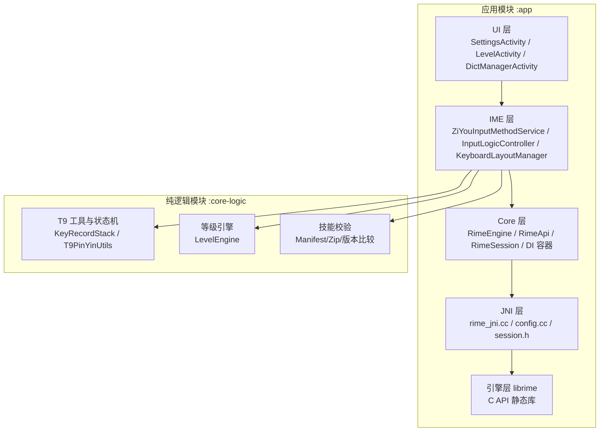
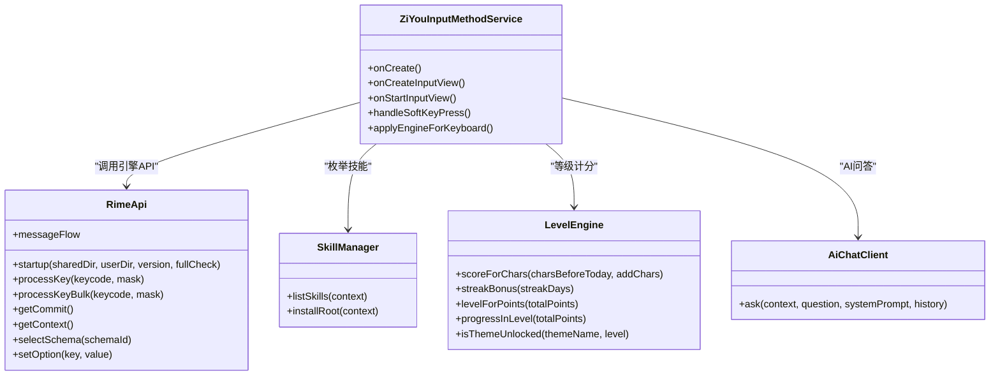
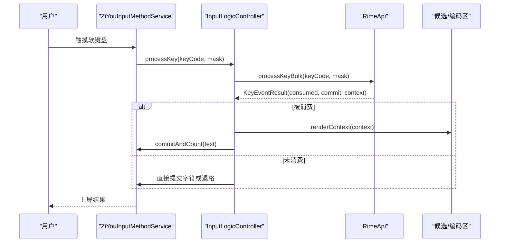
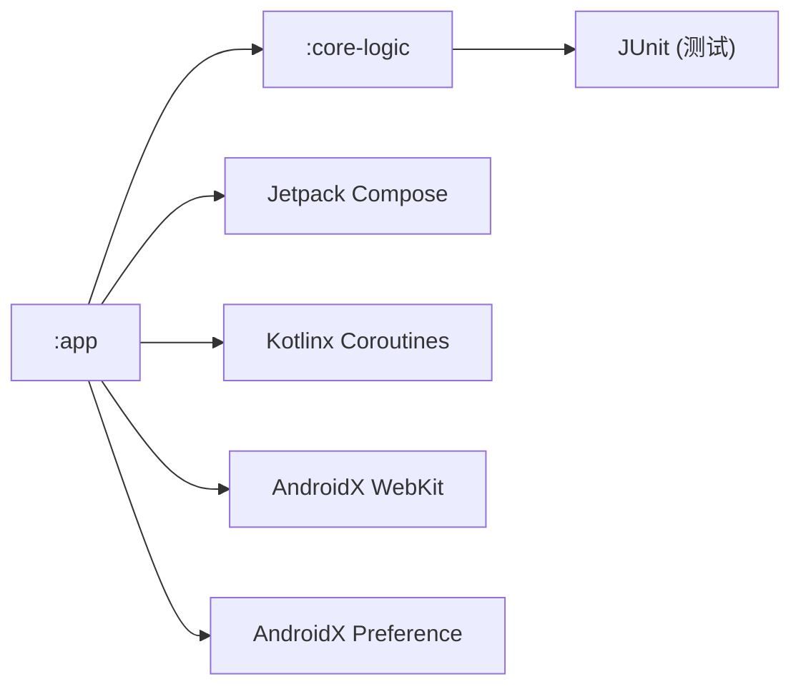

# 项目概述

<cite>
**本文引用的文件**   
- [ZiyouApplication.kt](file://app/src/main/java/com/ziyou/ime/ZiyouApplication.kt)
- [ZiYouInputMethodService.kt](file://app/src/main/java/com/ziyou/ime/ime/ZiYouInputMethodService.kt)
- [RimeApi.kt](file://app/src/main/java/com/ziyou/ime/core/RimeApi.kt)
- [SkillManager.kt](file://app/src/main/java/com/ziyou/ime/skill/SkillManager.kt)
- [LevelEngine.kt](file://core-logic/src/main/java/com/ziyou/ime/core/level/LevelEngine.kt)
- [AiChatClient.kt](file://app/src/main/java/com/ziyou/ime/ai/AiChatClient.kt)
- [ARCHITECTURE.md](file://ARCHITECTURE.md)
- [build.gradle.kts](file://app/build.gradle.kts)
- [settings.gradle.kts](file://settings.gradle.kts)
- [libs.versions.toml](file://gradle/libs.versions.toml)
</cite>

## 目录
1. [简介](#简介)
2. [项目结构](#项目结构)
3. [核心组件](#核心组件)
4. [架构总览](#架构总览)
5. [关键组件详解](#关键组件详解)
6. [依赖关系分析](#依赖关系分析)
7. [性能与线程模型](#性能与线程模型)
8. [快速开始指南](#快速开始指南)
9. [故障排查](#故障排查)
10. [结论](#结论)

## 简介
字由输入法是一个基于 Android InputMethodService 开发的现代化中文输入法应用，集成 Rime 输入引擎，支持多方案中文输入（拼音、仓颉五笔、T9九宫格），并提供技能插件系统、AI 问答集成、游戏化等级体系等创新功能。技术栈采用 Kotlin + Jetpack Compose，配合协程与单线程 Dispatcher 保证输入热路径的高吞吐与低延迟。

## 项目结构
项目采用 Gradle 多模块组织：
- :app：Android 应用层，包含 IME 服务、UI、JNI 集成与业务域实现
- :core-logic：纯逻辑库（无 Android/JNI 依赖），承载可独立单元测试的算法与状态机

图表来源
- [ARCHITECTURE.md:14-63](file://ARCHITECTURE.md#L14-L63)
- [settings.gradle.kts:25-28](file://settings.gradle.kts#L25-L28)

章节来源
- [settings.gradle.kts:1-28](file://settings.gradle.kts#L1-L28)
- [ARCHITECTURE.md:1-63](file://ARCHITECTURE.md#L1-L63)

## 核心组件
- 应用入口 ZiyouApplication：全局初始化与资源部署策略说明
- 输入法服务 ZiYouInputMethodService：生命周期管理、视图装配、按键处理、候选区与编码区渲染、面板协调器编排
- 引擎接口 RimeApi：所有操作以 suspend 函数暴露，通过 RimeDispatcher 在专属线程执行
- 技能插件 SkillManager：内置与已安装技能枚举、资源统一读取入口
- 等级引擎 LevelEngine：分段计分、连续签到奖励、等级判定与权益解锁
- AI 问答 AiChatClient：OpenAI 兼容协议的非流式请求封装与安全基线

章节来源
- [ZiyouApplication.kt:1-26](file://app/src/main/java/com/ziyou/ime/ZiyouApplication.kt#L1-L26)
- [ZiYouInputMethodService.kt:43-100](file://app/src/main/java/com/ziyou/ime/ime/ZiYouInputMethodService.kt#L43-L100)
- [RimeApi.kt:1-105](file://app/src/main/java/com/ziyou/ime/core/RimeApi.kt#L1-L105)
- [SkillManager.kt:1-110](file://app/src/main/java/com/ziyou/ime/skill/SkillManager.kt#L1-L110)
- [LevelEngine.kt:1-187](file://core-logic/src/main/java/com/ziyou/ime/core/level/LevelEngine.kt#L1-L187)
- [AiChatClient.kt:1-194](file://app/src/main/java/com/ziyou/ime/ai/AiChatClient.kt#L1-L194)

## 架构总览
字由输入法遵循“UI → IME → Core → JNI → Engine”的单向依赖链，并通过 :core-logic 下沉纯逻辑，确保编译期边界与可测试性。

图表来源
- [ZiYouInputMethodService.kt:43-100](file://app/src/main/java/com/ziyou/ime/ime/ZiYouInputMethodService.kt#L43-L100)
- [RimeApi.kt:1-105](file://app/src/main/java/com/ziyou/ime/core/RimeApi.kt#L1-L105)
- [SkillManager.kt:1-110](file://app/src/main/java/com/ziyou/ime/skill/SkillManager.kt#L1-L110)
- [LevelEngine.kt:1-187](file://core-logic/src/main/java/com/ziyou/ime/core/level/LevelEngine.kt#L1-L187)
- [AiChatClient.kt:1-194](file://app/src/main/java/com/ziyou/ime/ai/AiChatClient.kt#L1-L194)

章节来源
- [ARCHITECTURE.md:14-63](file://ARCHITECTURE.md#L14-L63)

## 关键组件详解

### 输入法服务 ZiYouInputMethodService
- 职责：IME 生命周期管理、输入视图构建、键盘布局切换、候选区与编码区渲染、面板协调器编排（技能/AI/涂鸦/粘贴板/工具）
- 关键点：
  - 显示形态控制（停靠/悬浮）与 insets 计算
  - 引擎就绪等待与状态同步（latest-wins 串行化）
  - 键盘类型与方案映射（九宫格→t9；全键盘→用户偏好）
  - 剪贴板监听与历史收录

图表来源
- [ZiYouInputMethodService.kt:582-777](file://app/src/main/java/com/ziyou/ime/ime/ZiYouInputMethodService.kt#L582-L777)
- [RimeApi.kt:26-40](file://app/src/main/java/com/ziyou/ime/core/RimeApi.kt#L26-L40)

章节来源
- [ZiYouInputMethodService.kt:354-406](file://app/src/main/java/com/ziyou/ime/ime/ZiYouInputMethodService.kt#L354-L406)
- [ZiYouInputMethodService.kt:442-556](file://app/src/main/java/com/ziyou/ime/ime/ZiYouInputMethodService.kt#L442-L556)
- [ZiYouInputMethodService.kt:658-777](file://app/src/main/java/com/ziyou/ime/ime/ZiYouInputMethodService.kt#L658-L777)

### 引擎接口 RimeApi
- 设计：所有方法为 suspend，通过 RimeDispatcher 在单一线程执行，避免多线程竞争
- 热路径优化：processKeyBulk 将 processKey + getCommit + getContext 合并为单次跨界
- 消息流：SharedFlow 传递 schema/option/deploy 事件

章节来源
- [RimeApi.kt:1-105](file://app/src/main/java/com/ziyou/ime/core/RimeApi.kt#L1-L105)
- [ARCHITECTURE.md:166-200](file://ARCHITECTURE.md#L166-L200)

### 技能插件系统 SkillManager
- 能力：枚举内置与已安装技能，提供统一资源读取入口
- 安全：manifest 校验失败即跳过；安装阶段 Zip Slip 纵深防御
- 扩展：预留 Phase 2 安装流水线（大小/条目数/manifest/冲突校验）

章节来源
- [SkillManager.kt:1-110](file://app/src/main/java/com/ziyou/ime/skill/SkillManager.kt#L1-L110)
- [ARCHITECTURE.md:365-384](file://ARCHITECTURE.md#L365-L384)

### 等级体系 LevelEngine
- 计分：当日分段递减（前2000字每字1分，2000–6000字每字0.5分）
- 等级：指数门槛（1–10级），进度计算与名称映射
- 权益：皮肤/音效包按等级解锁

章节来源
- [LevelEngine.kt:1-187](file://core-logic/src/main/java/com/ziyou/ime/core/level/LevelEngine.kt#L1-L187)
- [ARCHITECTURE.md:312-323](file://ARCHITECTURE.md#L312-L323)

### AI 问答 AiChatClient
- 协议：OpenAI 兼容 chat/completions（非流式）
- 安全：强制 HTTPS、超时限制、响应体上限、鉴权头
- 错误友好：HTTP 错误码转用户可读提示

章节来源
- [AiChatClient.kt:1-194](file://app/src/main/java/com/ziyou/ime/ai/AiChatClient.kt#L1-L194)

## 依赖关系分析
- 模块依赖：:app → :core-logic（单向，编译器强制）
- 内部依赖：UI → IME → Core → JNI → Engine（单向向下）
- 外部依赖：Kotlin、Jetpack Compose、Coroutines、WebView、Preferences、JUnit/MockK

图表来源
- [settings.gradle.kts:25-28](file://settings.gradle.kts#L25-L28)
- [build.gradle.kts:143-191](file://app/build.gradle.kts#L143-L191)
- [libs.versions.toml:1-51](file://gradle/libs.versions.toml#L1-L51)

章节来源
- [build.gradle.kts:1-192](file://app/build.gradle.kts#L1-L192)
- [libs.versions.toml:1-51](file://gradle/libs.versions.toml#L1-L51)

## 性能与线程模型
- 单线程 Dispatcher：librime 非线程安全，所有 RimeNative 调用在专属线程执行
- 批量 API：processKeyBulk 减少 JNI 跨界次数，提升热路径吞吐
- 视图职责分离：编码区/候选词/侧栏独立 View，降低重绘开销
- 热路径零磁盘 IO：等级计分仅内存自增，阈值触发异步落盘

章节来源
- [ARCHITECTURE.md:70-108](file://ARCHITECTURE.md#L70-L108)
- [ARCHITECTURE.md:431-453](file://ARCHITECTURE.md#L431-L453)

## 快速开始指南
- 环境要求
  - JDK 17、AGP 9.3.0、Kotlin 2.2.10、Compose BOM 2026.02.01
  - NDK/CMake 用于编译 librime JNI 与预编译库
- 构建步骤
  - 使用 Gradle Wrapper 构建：./gradlew assembleDebug
  - 如需发布 ABI 覆盖，传入参数 -Pziyou.abis=arm64-v8a,armeabi-v7a
- 运行与调试
  - 安装后启用输入法，进入设置页验证方案（拼音/仓颉/T9）
  - 观察候选区与编码区渲染、技能面板与 AI 问答面板

章节来源
- [build.gradle.kts:22-48](file://app/build.gradle.kts#L22-L48)
- [libs.versions.toml:1-18](file://gradle/libs.versions.toml#L1-L18)

## 故障排查
- 引擎未就绪
  - 现象：切换键盘或部署期间 rime.api 抛异常
  - 处理：awaitEngineReady 等待并超时放弃，由部署完成消息重同步
- 方案切换失败
  - 现象：selectSchema 返回 false
  - 处理：记录日志并回退默认方案，检查 assets/rime 部署与 fullCheck
- AI 请求失败
  - 现象：HTTP 错误或响应为空
  - 处理：检查 API Key、URL 是否为 HTTPS、网络连通性与额度限制

章节来源
- [ZiYouInputMethodService.kt:658-777](file://app/src/main/java/com/ziyou/ime/ime/ZiYouInputMethodService.kt#L658-L777)
- [AiChatClient.kt:116-175](file://app/src/main/java/com/ziyou/ime/ai/AiChatClient.kt#L116-L175)

## 结论
字由输入法以清晰的模块化架构与严格的依赖方向，结合 Rime 引擎与现代化 UI 技术栈，提供了稳定高效的中文输入体验。通过技能插件系统与 AI 问答集成，进一步拓展了输入法的可扩展性与智能化能力。等级体系与热路径优化确保了流畅与可玩性的平衡，适合持续演进与生态扩展。